# CI/CD Pipeline

Complete CI/CD pipeline for s3db.js with automated testing, versioning, and releases.

## 🔄 Workflows

### 1. CI - Tests (`ci-test.yml`)

**Triggers:**
- Push to `main` or `develop`
- Pull requests to `main` or `develop`
- Manual dispatch

**Jobs:**

#### `test-memory` - MemoryClient Tests
- **Matrix**: Node.js 22, 24, 25
- **Storage**: In-memory S3-compatible storage
- **Speed**: 100-1000x faster than real S3
- **Purpose**: Fast feedback for development

```bash
# Uses MemoryClient automatically when no S3 credentials
TEST_MODE=memory pnpm test
```

#### `test-minio` - MinIO S3-Compatible Tests
- **Matrix**: Node.js 22, 24, 25
- **Storage**: Real S3-compatible server (MinIO)
- **Purpose**: Production-like environment testing

```bash
# Uses MinIO container with S3 credentials
docker run -d minio/minio:latest server /data
TEST_MODE=s3 pnpm test
```

#### `coverage` - Code Coverage Report
- **Storage**: MinIO (production-like)
- **Uploads to**: Codecov
- **Reports**: Statements, Branches, Functions, Lines

### 2. Release Candidate (`release-candidate.yml`)

**Triggers:**
- Push to `main` (automatic)
- Manual dispatch with version bump type

**Process:**

1. **Check if Release Needed**
   - Analyzes commit messages
   - Checks for existing tags
   - Skips if no changes

2. **Determine Version Bump**
   - `major`: BREAKING CHANGE or `major:` prefix
   - `minor`: `feat:`, `feature:`, or `minor:` prefix
   - `patch`: `fix:`, `perf:`, `refactor:`, etc.

3. **Run Tests**
   - Executes memory tests for speed
   - Ensures quality before release

4. **Update Version & Tag**
   - Updates `package.json`
   - Creates Git tag (e.g., `v14.2.0`)
   - Pushes tag to trigger full release

5. **Create GitHub Release**
   - Generates changelog from commits
   - Creates release notes
   - Publishes to GitHub Releases

6. **Trigger Full Release**
   - Calls `release.yml` workflow
   - Builds binaries for all platforms
   - Publishes to NPM

### 3. Release (`release.yml`)

**Triggers:**
- Git tags (`v*`)
- Called by `release-candidate.yml`
- Manual dispatch

**Jobs:**

#### `build-binaries` - Multi-Platform Builds
- **Platforms**: Linux x64, macOS x64, macOS ARM64, Windows x64
- **Binaries**: Standalone executables (no Node.js required)
- **Size**: ~40-50MB each

#### `create-release` - GitHub Release
- Collects all binaries
- Creates release with assets
- Generates release notes

#### `publish-npm` - NPM Package
- Publishes to npm registry
- Only runs on tag pushes
- Requires `NPM_TOKEN` secret

## 📋 Commit Message Conventions

Use [Conventional Commits](https://www.conventionalcommits.org/) to enable automatic versioning:

### Version Bumps

| Commit Message | Version Bump | Example |
|----------------|--------------|---------|
| `feat: add new plugin` | **minor** | 14.1.0 → 14.2.0 |
| `fix: resolve memory leak` | **patch** | 14.1.0 → 14.1.1 |
| `feat!: redesign API` or `BREAKING CHANGE:` | **major** | 14.1.0 → 15.0.0 |
| `perf: optimize query speed` | **patch** | 14.1.0 → 14.1.1 |
| `refactor: restructure plugins` | **patch** | 14.1.0 → 14.1.1 |

### Prefixes

- `feat:` - New feature
- `fix:` - Bug fix
- `perf:` - Performance improvement
- `refactor:` - Code restructuring
- `docs:` - Documentation changes
- `test:` - Test updates
- `chore:` - Maintenance tasks
- `style:` - Formatting changes
- `ci:` - CI/CD changes

### Skip Release

Add `[skip release]` or `[skip ci]` to commit message:

```bash
git commit -m "docs: update README [skip release]"
```

## 🚀 Release Process

### Automatic Release (Recommended)

1. **Make Changes**
   ```bash
   git checkout -b feature/my-feature
   # Make changes
   git add .
   git commit -m "feat: add awesome feature"
   ```

2. **Merge to Main**
   ```bash
   git checkout main
   git merge feature/my-feature
   git push
   ```

3. **Automatic Flow**
   - CI tests run (memory + MinIO)
   - Release Candidate workflow analyzes commits
   - Version is bumped automatically
   - Tag is created
   - Full release is triggered
   - Binaries are built
   - NPM package is published
   - GitHub Release is created

### Manual Release

1. **Trigger Manually**
   - Go to Actions → Release Candidate
   - Click "Run workflow"
   - Select version bump type
   - Click "Run workflow"

2. **Or Create Tag**
   ```bash
   npm version patch  # or minor, major
   git push --follow-tags
   ```

## 🏗️ Test Environments

### MemoryClient (In-Memory)
- **Speed**: 100-1000x faster
- **Use Case**: Development, CI fast feedback
- **Connection**: Automatic (no credentials needed)
- **Persistence**: None (test isolation)

```javascript
// Automatic when no S3 credentials
const db = new Database({
  connectionString: 'memory://mybucket/path'
});
```

### MinIO (S3-Compatible)
- **Speed**: Production-like
- **Use Case**: Integration testing, CI validation
- **Connection**: Docker container
- **Persistence**: Optional

```javascript
// With S3 credentials
const db = new Database({
  connectionString: 's3://minioadmin:minioadmin123@s3db?endpoint=http://localhost:9000&region=us-east-1&forcePathStyle=true'
});
```

### LocalStack (AWS Emulator)
- **Speed**: Production-like
- **Use Case**: AWS service testing
- **Connection**: Docker container
- **Services**: S3, DynamoDB, Lambda, etc.

```bash
# Start LocalStack
docker run -d -p 4566:4566 localstack/localstack
```

## 🔒 Required Secrets

### GitHub Secrets

| Secret | Purpose | Required |
|--------|---------|----------|
| `GITHUB_TOKEN` | Automatic (provided by GitHub) | ✅ Yes |
| `NPM_TOKEN` | Publish to NPM | ✅ Yes |
| `CODECOV_TOKEN` | Upload coverage reports | ⚠️ Optional |

### Setup NPM_TOKEN

1. Go to [npmjs.com](https://www.npmjs.com/)
2. Account → Access Tokens → Generate New Token
3. Type: Automation
4. Copy token
5. GitHub → Repository → Settings → Secrets → Actions
6. New repository secret: `NPM_TOKEN`

## 📊 CI Status Badges

Add to README.md:

```markdown


[](https://codecov.io/gh/forattini-dev/s3db.js)
```

## 🐛 Troubleshooting

### Tests Failing

**Memory Tests:**
```bash
# Run locally
TEST_MODE=memory pnpm test
```

**MinIO Tests:**
```bash
# Start MinIO
docker run -d -p 9000:9000 \
  -e MINIO_ROOT_USER=minioadmin \
  -e MINIO_ROOT_PASSWORD=minioadmin123 \
  minio/minio server /data

# Create bucket
docker run --rm --network="host" \
  -e AWS_ACCESS_KEY_ID=minioadmin \
  -e AWS_SECRET_ACCESS_KEY=minioadmin123 \
  amazon/aws-cli \
  --endpoint-url http://localhost:9000 \
  s3 mb s3://s3db

# Run tests
export AWS_ACCESS_KEY_ID=minioadmin
export AWS_SECRET_ACCESS_KEY=minioadmin123
export AWS_ENDPOINT=http://localhost:9000
export AWS_REGION=us-east-1
export AWS_BUCKET=s3db
export AWS_FORCE_PATH_STYLE=true
TEST_MODE=s3 pnpm test
```

### Release Not Triggering

1. **Check commit message format**
   - Must follow conventional commits
   - Must contain releaseable prefix (`feat:`, `fix:`, etc.)

2. **Check for `[skip ci]` or `[skip release]`**
   - Remove from commit message

3. **Check if version already tagged**
   ```bash
   git tag -l
   ```

### NPM Publish Failing

1. **Verify NPM_TOKEN secret**
   - Check token is valid
   - Check token has publish permissions

2. **Check package.json version**
   - Must not already exist on NPM
   - Must follow semver

## 📚 Best Practices

### Commits

✅ **Good:**
```bash
git commit -m "feat: add GeoPlugin spatial queries"
git commit -m "fix: resolve memory leak in CachePlugin"
git commit -m "perf: optimize S3 batch operations"
```

❌ **Bad:**
```bash
git commit -m "updated stuff"
git commit -m "WIP"
git commit -m "fixed bug"
```

### Testing

✅ **Good:**
- Write tests for new features
- Ensure tests pass locally before pushing
- Use MemoryClient for fast iteration
- Use MinIO for integration testing

❌ **Bad:**
- Skipping tests
- Committing failing tests
- Only testing with MemoryClient

### Releases

✅ **Good:**
- Let automatic versioning handle releases
- Use conventional commits
- Review release notes before publishing
- Test release candidates

❌ **Bad:**
- Manual version bumps without commit standards
- Skipping CI checks
- Publishing without testing

## 🎯 Workflow Diagram

```mermaid
graph TD
    A[Push to main] --> B{CI Tests}
    B -->|Pass| C[Release Candidate]
    B -->|Fail| X[❌ Stop]

    C --> D{Analyze Commits}
    D -->|Releaseable| E[Bump Version]
    D -->|Skip| Y[⏭️ Skip]

    E --> F[Create Tag]
    F --> G[GitHub Release]
    G --> H[Trigger Full Release]

    H --> I[Build Binaries]
    I --> J[Publish NPM]
    J --> K[✅ Complete]
```



## 📈 Metrics

Monitor workflow performance:
- **Memory Tests**: ~2-5 minutes
- **MinIO Tests**: ~5-10 minutes
- **Coverage Report**: ~5-10 minutes
- **Binary Builds**: ~10-15 minutes
- **Total Release**: ~15-25 minutes

---

**Last Updated**: 2025-11-06
**Version**: 1.0.0
