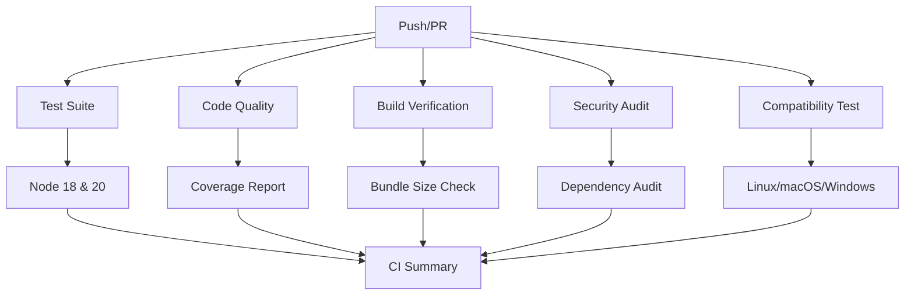
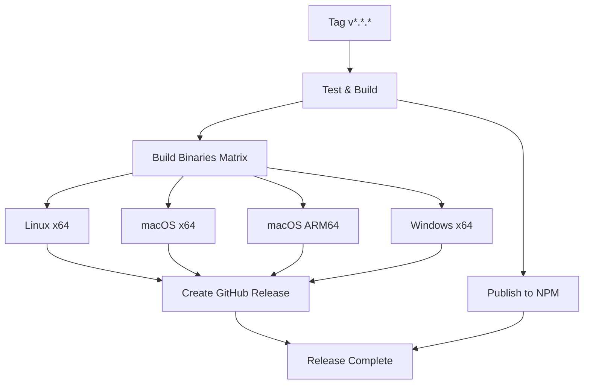

# 🚀 S3DB.js Deployment Guide

Complete guide for deploying S3DB.js with automated pipelines and releases.

## 📋 Quick Start

### 1. Pre-Release Check
```bash
pnpm run release:check
```

### 2. Create Release
```bash
pnpm run release v9.0.2
```

That's it! The pipeline handles everything else automatically.

## 🏗️ Pipeline Architecture

### CI Pipeline (`.github/workflows/ci.yml`)
Runs on every push/PR to `main` or `develop`:



### Release Pipeline (`.github/workflows/release.yml`)
Triggered by version tags (`v*.*.*`):



## 🔧 Manual Release Process

### Prerequisites
- Node.js 18+
- pnpm installed
- Git configured
- Clean working directory
- On `main` branch

### Step 1: Pre-Flight Check
```bash
./scripts/pre-release-check.sh
```

This validates:
- ✅ Git status and branch
- ✅ Dependencies and Node.js version
- ✅ package.json validity
- ✅ Build process
- ✅ TypeScript definitions
- ✅ Test suite
- ✅ Package size
- ✅ Security audit
- ✅ Binary build capability

### Step 2: Release
```bash
./scripts/release.sh v9.0.2
```

This automatically:
1. **Validates** environment and version format
2. **Updates** package.json version
3. **Generates** CHANGELOG.md entry
4. **Runs** full test suite
5. **Creates** git commit and tag
6. **Pushes** to trigger GitHub Actions

### Step 3: Monitor
GitHub Actions will:
- 🧪 Run comprehensive tests
- 🔨 Build binaries for all platforms
- 🎉 Create GitHub release
- 📦 Publish to npm (if configured)

## 📦 Distribution Strategy

### NPM Package (Lightweight ~200KB)
```bash
npm install s3db.js
```

**Includes:**
- `dist/s3db.cjs.js` - CommonJS build
- `dist/s3db.es.js` - ESM build  
- `dist/s3db.d.ts` - TypeScript definitions
- `src/` - Source code for debugging
- `bin/cli.js` - Node.js CLI script
- `mcp/server.js` - MCP server script

**Excludes:**
- Test files
- Build artifacts
- Standalone binaries
- Documentation (except README)

### GitHub Releases (Standalone Binaries ~40-55MB)
```bash
wget https://github.com/forattini-dev/s3db.js/releases/download/v9.0.2/s3db-linux-x64
chmod +x s3db-linux-x64
./s3db-linux-x64 --help
```

**Available Binaries:**
- `s3db-linux-x64` - Linux CLI
- `s3db-macos-x64` - macOS Intel CLI
- `s3db-macos-arm64` - macOS Apple Silicon CLI
- `s3db-win-x64.exe` - Windows CLI
- `s3db-mcp-linux-x64` - Linux MCP Server
- `s3db-mcp-macos-x64` - macOS Intel MCP Server
- `s3db-mcp-macos-arm64` - macOS Apple Silicon MCP Server
- `s3db-mcp-win-x64.exe` - Windows MCP Server

## 🔐 Secrets Configuration

### Required GitHub Secrets
1. **`GITHUB_TOKEN`** - Automatically provided
2. **`NPM_TOKEN`** - For npm publishing (optional)

### Setup NPM Token
```bash
# 1. Login to npmjs.com
# 2. Go to Access Tokens
# 3. Generate "Automation" token
# 4. Add to GitHub repository secrets as NPM_TOKEN
```

## 🎯 Release Types

### Patch Release (v9.0.2 → v9.0.3)
```bash
pnpm run release v9.0.3
```
- Bug fixes
- Security patches
- Minor improvements

### Minor Release (v9.0.2 → v9.1.0)
```bash
pnpm run release v9.1.0
```
- New features
- API additions
- Backward-compatible changes

### Major Release (v9.0.2 → v10.0.0)
```bash
pnpm run release v10.0.0
```
- Breaking changes
- API removals/changes
- Architecture updates

## 🔍 Quality Gates

### Automated Checks
- ✅ **Tests**: Jest test suite
- ✅ **TypeScript**: Definition validity
- ✅ **Build**: CJS/ESM generation
- ✅ **Security**: Dependency audit
- ✅ **Compatibility**: Multi-platform testing
- ✅ **Size**: Bundle size monitoring

### Manual Checks
- 📋 **Changelog**: Updated with changes
- 📚 **Documentation**: README current
- 🔖 **Version**: Semantic versioning
- 🎯 **Scope**: Feature completeness

## 🚨 Troubleshooting

### Pipeline Fails
1. **Check logs** in GitHub Actions
2. **Run locally**:
   ```bash
   pnpm run release:check
   ```
3. **Fix issues** and re-run

### Binary Build Fails
```bash
# Test binary build locally
./build-binaries.sh

# Check system requirements
node --version  # >= 18
pnpm --version  # >= 8
```

### NPM Publish Fails
1. **Check token**: Verify `NPM_TOKEN` secret
2. **Check permissions**: Token has publish rights
3. **Check version**: Not already published

### Tag Already Exists
```bash
# Delete local tag
git tag -d v9.0.2

# Delete remote tag (if needed)
git push origin :refs/tags/v9.0.2
```

## 🎉 Success Checklist

After successful release:
- ✅ **GitHub Release**: Created with binaries
- ✅ **NPM Package**: Published and installable
- ✅ **Changelog**: Updated with changes
- ✅ **Tags**: Pushed to repository
- ✅ **Tests**: All passing
- ✅ **Binaries**: Work on target platforms

## 📊 Monitoring

### Release Analytics
- **Download counts**: GitHub release metrics
- **npm usage**: npm download stats
- **Issues**: GitHub issue tracking
- **Performance**: Binary size trends

### Health Checks
```bash
# Test npm package
npm install s3db.js@latest
npx s3db --version

# Test binary
curl -L https://github.com/forattini-dev/s3db.js/releases/latest/download/s3db-linux-x64 -o s3db
chmod +x s3db
./s3db --version
```

---

## 🤖 Automation Summary

This deployment system provides:
- **Zero-downtime releases** with automated testing
- **Multi-platform binaries** built automatically
- **Professional packaging** with size optimization
- **Quality assurance** with comprehensive checks
- **Easy rollback** via GitHub releases
- **Monitoring integration** with metrics

Perfect for production deployment of S3DB.js! 🚀