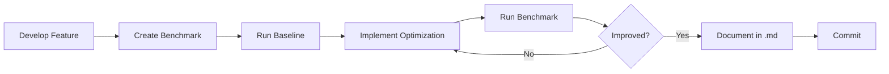

# 📊 S3DB.js Benchmarks

Centralized performance benchmarks for s3db.js.

> **⚠️ Important**: All benchmarks in this directory were executed with **Node.js v22.6.0**. Performance results may vary with different Node.js versions.

## 🎯 Objective

Measure and document the performance of critical s3db.js components to:
- ✅ Identify bottlenecks
- ✅ Validate optimizations
- ✅ Compare different approaches
- ✅ Ensure improvements don't introduce regressions

## 📁 Structure

```
docs/benchmarks/
├── README.md                           # This file
├── eventual-consistency.bench.js      # EventualConsistency plugin benchmark
├── eventual-consistency.md            # Results and analysis
├── base62.bench.js                    # Base62 encoding benchmark
├── base62.md                          # Results and analysis
├── smart-encoding.bench.js            # Smart encoding benchmark
├── smart-encoding.md                  # Results and analysis
├── ip-encoding.bench.js               # IP address binary encoding benchmark
├── ip-encoding.md                     # Results and analysis
├── partitions-matrix.js               # Partitions performance benchmark
├── partitions.md                      # Results and analysis
├── vector-clustering.bench.js         # Vector clustering with open-source embeddings
├── vector-clustering.md               # Results and analysis
└── [future benchmarks...]
```

## 🚀 How to Run

### Prerequisites

- **Node.js 22+** installed (all benchmarks tested with v22.6.0)
  ```bash
  node --version  # Should be v22.x.x or higher
  ```

### Run All Benchmarks

```bash
pnpm run benchmarks
```

### Run Specific Benchmark

```bash
# EventualConsistency Plugin
node docs/benchmarks/eventual-consistency.bench.js

# Base62 Encoding
node docs/benchmarks/base62.bench.js

# Smart Metadata Encoding
node docs/benchmarks/smart-encoding.bench.js

# IP Address Encoding
node docs/benchmarks/ip-encoding.bench.js

# Partitions Performance
node docs/benchmarks/partitions-matrix.js

# Vector Clustering (requires @xenova/transformers)
npm install @xenova/transformers
node docs/benchmarks/vector-clustering.bench.js tiny    # 100 vectors
node docs/benchmarks/vector-clustering.bench.js small   # 1,000 vectors
node docs/benchmarks/vector-clustering.bench.js large   # 10,000 vectors
```

## 📋 Available Benchmarks

| Benchmark | File | Description | Status |
|-----------|------|-------------|--------|
| **EventualConsistency Plugin** | `eventual-consistency.bench.js` | Plugin performance with analytics and consolidation | ✅ Active |
| **Base62 Encoding** | `base62.bench.js` | Base36 vs Base62 comparison | ✅ Active |
| **Smart Metadata Encoding** | `smart-encoding.bench.js` | Smart ASCII/Latin/UTF8 encoding performance | ✅ Active |
| **IP Address Encoding** | `ip-encoding.bench.js` | IPv4/IPv6 binary encoding compression & performance | ✅ Active |
| **Partitions Performance** | `partitions-matrix.js` | Partitions vs attributes performance matrix | ✅ Active |
| **Vector Clustering** | `vector-clustering.bench.js` | K-means clustering with open-source embeddings (100/1K/10K vectors) | ✅ Active |

## 📊 Benchmark Format

Each benchmark follows this pattern:

### 1. `.bench.js` File
```javascript
#!/usr/bin/env node
import { ... } from '../../src/...';

// ANSI colors for pretty output
const colors = { ... };

// Benchmark function
function bench(name, fn, iterations) {
  const runs = [];
  for (let i = 0; i < 5; i++) {
    const start = process.hrtime.bigint();
    // ... execute fn ...
    const end = process.hrtime.bigint();
    runs.push(opsPerSec);
  }

  console.table(results);
}

// Execute benchmarks
bench('Test 1', ...);
bench('Test 2', ...);
```

### 2. `.md` File
```markdown
# [Name] Benchmark Results

## Summary
- **Date**: YYYY-MM-DD
- **Node.js**: v22.6.0
- **Hardware**: [specs]
- **Conclusion**: [executive summary]

## Results

[Tables and charts]

## Analysis

[Insights and recommendations]
```

## 🎨 Standardized Output

All benchmarks should use:
- ✅ `console.table()` for tabular results
- ✅ ANSI colors to highlight important metrics
- ✅ Average of 5 runs for stability
- ✅ Fastest/Slowest/Average metrics
- ✅ Percentage comparisons when applicable

## 📈 Common Metrics

- **ops/sec**: Operations per second
- **ms/op**: Milliseconds per operation
- **throughput**: Items processed per second
- **latency**: Response time
- **compression ratio**: Compression rate (%)
- **speedup**: Relative comparison (Nx faster/slower)

## 🔍 Output Examples

### Performance Table
```
┌─────────┬──────────────┬────────────┬────────────┬──────────────────┐
│ (index) │ Operation    │ Avg ops/s  │ Fastest    │ Comparison       │
├─────────┼──────────────┼────────────┼────────────┼──────────────────┤
│ 0       │ 'encode'     │ 24607037   │ 28309788   │ '2.47x slower'   │
│ 1       │ 'decode'     │ 8598851    │ 8762183    │ '3.70x slower'   │
└─────────┴──────────────┴────────────┴────────────┴──────────────────┘
```

### Comparison with Colors
```
📊 Compression Results
  timestamps   150B → 100B (+33.3% savings) ✅
  uuids        108B → 72B  (+33.3% savings) ✅
  Total        258B → 172B (+33.3% savings) ✅
```

## 🏆 Best Practices

1. **Isolation**: Each benchmark should run independently
2. **Warmup**: Discard first iterations (JIT warmup)
3. **Repetitions**: Minimum 5 runs, use average
4. **Real Data**: Use data representative of real usage
5. **Documentation**: Always document hardware/versions
6. **Versioning**: Keep history of results in .md

## 🔄 Workflow



## 📝 Template for New Benchmarks

```javascript
#!/usr/bin/env node
/**
 * [Name] Benchmark
 * [Brief description]
 */

import { functionToTest } from '../../src/path/to/module.js';

const colors = {
  reset: '\x1b[0m',
  green: '\x1b[32m',
  yellow: '\x1b[33m',
  blue: '\x1b[36m',
  red: '\x1b[31m'
};

console.log(`\n${colors.blue}🚀 [Name] Benchmark${colors.reset}\n`);

function bench(name, fn, iterations = 1e6) {
  const runs = [];

  for (let i = 0; i < 5; i++) {
    const start = process.hrtime.bigint();
    for (let j = 0; j < iterations; j++) {
      fn(j);
    }
    const end = process.hrtime.bigint();

    const ms = Number(end - start) / 1e6;
    const opsPerSec = (iterations / ms * 1000);
    runs.push(opsPerSec);
  }

  const avg = runs.reduce((a, b) => a + b) / runs.length;
  const fastest = Math.max(...runs);
  const slowest = Math.min(...runs);

  return { name, avg, fastest, slowest };
}

// Execute benchmarks
const results = [
  bench('Test 1', () => functionToTest(data1)),
  bench('Test 2', () => functionToTest(data2))
];

console.table(results.map(r => ({
  'Test': r.name,
  'Avg ops/s': Math.round(r.avg).toLocaleString(),
  'Fastest': Math.round(r.fastest).toLocaleString(),
  'Slowest': Math.round(r.slowest).toLocaleString()
})));

console.log(`\n${colors.green}✅ Benchmark complete!${colors.reset}\n`);
```

## 🤝 Contributing

When adding a new benchmark:
1. Create `name.bench.js` in this directory
2. Create `name.md` with results
3. Update this README with link
4. Run and document results
5. Commit both files together

## 📚 References

- [Node.js Performance Hooks](https://nodejs.org/api/perf_hooks.html)
- [V8 Optimization Guide](https://v8.dev/docs/profile)
- [Benchmark.js](https://benchmarkjs.com/)
