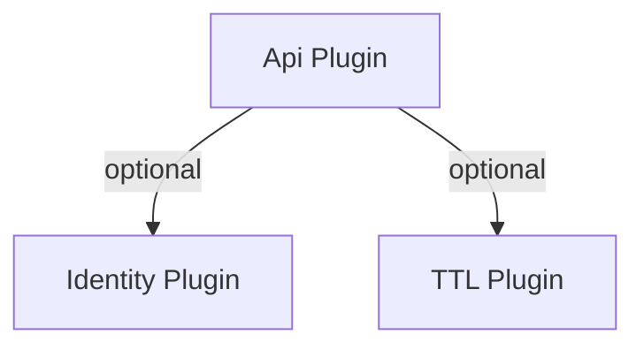

# 📋 Configuration Options

> **Navigation:** [← Back to API Plugin](../api.md) | [Authentication →](./authentication.md) | [Deployment →](./deployment.md)

---

## Complete Configuration

```javascript
new ApiPlugin({
  // Server configuration
  port: 3000,
  host: '0.0.0.0',
  verbose: false,
  maxBodySize: 10 * 1024 * 1024,         // 10MB (default)

  // Authentication (all optional)
  auth: {
    jwt: {
      enabled: true,
      secret: 'your-jwt-secret-key',
      expiresIn: '7d'                    // Token expiration
    },
    apiKey: {
      enabled: true,
      headerName: 'X-API-Key'            // Custom header name
    },
    basic: {
      enabled: true,
      realm: 'API Access',               // HTTP Basic realm
      passphrase: 'secret'               // For password decryption
    }
  },

  // Resource configuration
  resources: {
    cars: {
      auth: ['jwt', 'apiKey'],           // Required auth methods
      methods: ['GET', 'POST', 'PUT', 'DELETE'],
      customMiddleware: [                // Resource-specific middleware
        async (c, next) => {
          // Custom logic
          await next();
        }
      ]
    },
    products: {
      auth: false,                       // Public access
      methods: ['GET']                   // Read-only
    }
  },

  // CORS configuration
  cors: {
    enabled: true,
    origin: '*',                         // Allow all origins
    methods: ['GET', 'POST', 'PUT', 'PATCH', 'DELETE', 'OPTIONS'],
    allowedHeaders: ['Content-Type', 'Authorization', 'X-API-Key'],
    exposedHeaders: ['X-Total-Count', 'X-Page-Count'],
    credentials: true,
    maxAge: 86400                        // 24 hours
  },

  // Rate limiting
  rateLimit: {
    enabled: true,
    windowMs: 60000,                     // 1 minute
    maxRequests: 100,                    // 100 requests per window
    keyGenerator: (c) => {               // Custom key function
      return c.req.header('x-forwarded-for') || 'unknown';
    }
  },

  // Request logging
  logging: {
    enabled: true,
    format: ':method :path :status :response-time ms - :user',
    verbose: false
  },

  // Response compression
  compression: {
    enabled: true,
    threshold: 1024,                     // Only compress if >1KB
    level: 6                             // gzip compression level (1-9)
  },

  // Validation
  validation: {
    enabled: true,
    validateOnInsert: true,
    validateOnUpdate: true,
    returnValidationErrors: true
  },

  // Global custom middlewares
  middlewares: [
    async (c, next) => {
      c.set('requestId', crypto.randomUUID());
      await next();
    }
  ]
})
```

### RelationPlugin Integration

- Install the [RelationPlugin](../relation.md) before the API plugin to expose relational hydration automatically.
- All `GET` endpoints gain a `populate` query parameter (e.g., `?populate=customer,items.product`).
- Unknown relation paths return `400 INVALID_POPULATE` so consumers get immediate feedback.

```javascript
await db.use(new RelationPlugin({ relations: {/* ... */} }));
await db.use(new ApiPlugin({ port: 3000 }));
// GET /orders?populate=customer,items.product
```

### Dependency Graph



The API plugin does not auto-install other plugins, but it will detect an existing `IdentityPlugin` (to share the `users` resource and rate-limit defaults) and cooperates with `TTLPlugin` if it is installed to add automatic expiry to the fail-ban resources.

### Authentication Options

| Option | Type | Default | Description |
|--------|------|---------|-------------|
| `auth.driver` | string | `null` | Primary authentication driver (`'jwt'`, `'basic'`, `'apiKey'`, `'oidc'`, `'oauth2'`) for shorthand configuration. |
| `auth.drivers` | Array | `[]` | Explicit driver list when combining multiple drivers (each entry: `{ driver, config }`). First entry becomes the default. |
| `auth.resource` | string | Auto (`plg_api_users`) | Resource that stores credentials. The plugin reuses Identity's `users` resource when present. |
| `auth.createResource` | boolean | `true` | Automatically create the auth resource when missing. Set `false` to use a pre-existing resource only. |
| `auth.usernameField` | string | `'email'` | Field used as the username/identifier during login. |
| `auth.passwordField` | string | `'password'` | Field that stores hashed passwords in the auth resource. |

**Registration (`auth.registration`)**

- `enabled` (boolean, default `false`): exposes `POST /auth/register`.
- `allowedFields` (string[], default `[]`): additional fields accepted during registration (e.g., `['name', 'profile']`).
- `defaultRole` (string, default `'user'`): role assigned to new accounts when the request omits it.

**Login Throttle (`auth.loginThrottle`)**

- `enabled` (boolean, default `true`): toggles the adaptive login/IP throttling system.
- `maxAttempts` (number, default `5`): failed login attempts before an IP is temporarily blocked.
- `windowMs` (number, default `60000`): measurement window in milliseconds for the above attempts.
- `blockDurationMs` (number, default `300000`): how long an offending IP remains banned.
- `maxEntries` (number, default `10000`): cap for tracked IP entries to keep the in-memory cache bounded.

> 💡 When Identity plugin is installed under the same namespace, the API plugin automatically shares the user resource and inherits the Identity rate limit guardrails, so you only need to configure `auth.registration`/`auth.loginThrottle` when diverging from those defaults.

---

## Schema Validation

The API Plugin automatically validates requests using resource schemas:

```javascript
const cars = await db.createResource({
  name: 'cars',
  attributes: {
    brand: 'string|required|minlength:2',
    model: 'string|required',
    year: 'number|required|min:1900|max:2025',
    price: 'number|required|min:0'
  }
});
```

**Invalid Request:**
```bash
curl -X POST http://localhost:3000/cars \
  -H "Content-Type: application/json" \
  -d '{"brand":"X","year":1800}'
```

**Response:**
```json
{
  "success": false,
  "error": {
    "message": "Validation failed",
    "code": "VALIDATION_ERROR",
    "details": {
      "errors": [
        {
          "field": "brand",
          "message": "String length must be at least 2 characters",
          "expected": "minlength:2",
          "actual": "X"
        },
        {
          "field": "model",
          "message": "Field is required",
          "expected": "required"
        },
        {
          "field": "year",
          "message": "Number must be at least 1900",
          "expected": "min:1900",
          "actual": 1800
        },
        {
          "field": "price",
          "message": "Field is required",
          "expected": "required"
        }
      ]
    }
  }
}
```

Validation is automatic for:
- POST (insert) - Full validation
- PUT (update) - Full validation
- PATCH (partial update) - Partial validation

Disable validation per resource:
```javascript
resources: {
  cars: {
    validation: false  // Disable validation
  }
}
```

---

## URL Versioning Configuration

### Default Behavior (Clean URLs)

By default, resources are available **without** version prefixes:

```javascript
await db.usePlugin(new ApiPlugin({
  port: 3000
}));
```

**Generated endpoints:**
```
GET     /cars           → Clean URLs (no version prefix)
GET     /cars/:id
POST    /cars
PUT     /cars/:id
DELETE  /cars/:id
```

This is the **recommended approach** for most APIs as it follows modern REST conventions.

---

### Enabling Version Prefixes

To add version prefixes (e.g., `/v1/`, `/v2/`), enable the `versionPrefix` option:

```javascript
await db.usePlugin(new ApiPlugin({
  port: 3000,
  versionPrefix: true  // Enable version prefixes
}));
```

**Generated endpoints:**
```
GET     /v1/cars        → Versioned URLs
GET     /v1/cars/:id
POST    /v1/cars
PUT     /v1/cars/:id
DELETE  /v1/cars/:id
```

The version is extracted from the resource name:
- `users_v1` → `/v1/users`
- `products_v2` → `/v2/products`
- `orders_v10` → `/v10/orders`

---

### Version Prefix Options

**1. Boolean (recommended):**
```javascript
versionPrefix: true  // Enable version prefixes
```

**2. Custom format:**
```javascript
versionPrefix: 'api/v'  // Custom prefix → /api/v1/cars
```

**3. Disable (default):**
```javascript
versionPrefix: false  // Clean URLs (no version)
```

---

### Resource Schema Versioning

Each resource can have its own version:

```javascript
// Version 1 - Original schema
const users_v1 = await db.createResource({
  name: 'users_v1',
  attributes: {
    id: 'string|required',
    name: 'string|required',
    email: 'string|required|email'
  }
});

// Version 2 - Add new field
const users_v2 = await db.createResource({
  name: 'users_v2',
  attributes: {
    id: 'string|required',
    firstName: 'string|required',
    lastName: 'string|required',
    email: 'string|required|email',
    phone: 'string|optional'  // New field
  }
});

await db.usePlugin(new ApiPlugin({
  port: 3000,
  versionPrefix: true
}));
```

**Endpoints:**
```
GET /v1/users  → users_v1 resource
GET /v2/users  → users_v2 resource
```

---

### Complete Example

```javascript
import { Database, ApiPlugin } from 's3db.js';

const db = new Database({ connectionString: 's3://...' });
await db.connect();

// Version 1 resources
const products_v1 = await db.createResource({
  name: 'products_v1',
  attributes: {
    id: 'string|required',
    name: 'string|required',
    price: 'number|required'
  }
});

// Version 2 resources
const products_v2 = await db.createResource({
  name: 'products_v2',
  attributes: {
    id: 'string|required',
    name: 'string|required',
    price: 'number|required',
    currency: 'string|required',  // New field
    taxRate: 'number|optional'     // New field
  }
});

await db.usePlugin(new ApiPlugin({
  port: 3000,
  versionPrefix: true,
  resources: {
    products_v1: { auth: false },
    products_v2: { auth: true }
  }
}));

// GET /v1/products  → products_v1 (public)
// GET /v2/products  → products_v2 (requires auth)
```

---

## Best Practices

### 1. Use Environment Variables

```javascript
new ApiPlugin({
  port: process.env.API_PORT || 3000,
  auth: {
    jwt: {
      enabled: true,
      secret: process.env.JWT_SECRET,
      expiresIn: process.env.JWT_EXPIRES_IN || '7d'
    }
  }
})
```

### 2. Configure Resources Appropriately

```javascript
resources: {
  // Public resources
  products: {
    auth: false,
    methods: ['GET']
  },

  // Protected resources
  orders: {
    auth: true,
    methods: ['GET', 'POST', 'PUT', 'DELETE']
  },

  // Admin-only resources
  settings: {
    auth: ['admin'],
    methods: ['GET', 'PUT']
  }
}
```

### 3. Enable Production Features

```javascript
new ApiPlugin({
  cors: { enabled: true, origin: 'https://yourdomain.com' },
  rateLimit: { enabled: true, maxRequests: 100 },
  compression: { enabled: true },
  logging: { enabled: true }
})
```

### 4. Handle Errors Gracefully

```javascript
middlewares: [
  async (c, next) => {
    try {
      await next();
    } catch (err) {
      console.error('API Error:', err);
      return c.json({ error: 'Internal Server Error' }, 500);
    }
  }
]
```

---

> **Navigation:** [← Back to API Plugin](../api.md) | [Authentication →](./authentication.md) | [Deployment →](./deployment.md)
