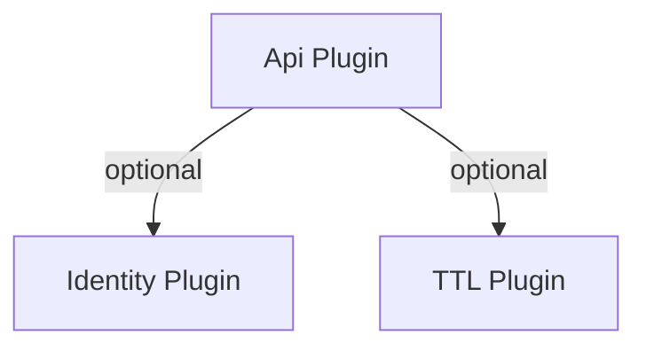

# 📋 Configuration Options (Canonical)

This section is the single source of truth for all ApiPlugin options. Other guides link here and avoid repeating config.

—

## Top‑Level

- port: number = 3000
- host: string = '0.0.0.0'
- basePath: string = '' (normalized; affects all routes, including /docs and /openapi.json)
- logLevel: string = false (controls log level output across the plugin)
- startupBanner: boolean = true
- versionPrefix: boolean | string = false
- maxBodySize: number = 10_485_760 (10MB)

## Docs

- docs.enabled: boolean = true
- docs.ui: 'redoc' | 'swagger' = 'redoc'
- docs.title: string = 's3db.js API'
- docs.version: string = '1.0.0'
- docs.description: string
- docs.csp: string | null (route‑level CSP override for /docs; defaults allow Redoc CDN and fonts)

Notes:
- When ui='redoc' and no docs.csp provided, /docs sets CSP including https://cdn.redoc.ly, https://fonts.googleapis.com, https://fonts.gstatic.com.
- When ui='swagger', a minimal CSP (self + unsafe‑inline) is set unless docs.csp overrides it.

## Auth

- auth.driver: string | null (shorthand)
- auth.drivers: Array<{ driver: 'jwt'|'basic'|'apiKey'|'oidc'|'oauth2', config: object }>
- auth.drivers[].config.provider: 'azure'|'auth0'|'keycloak'|'cognito' (preset que preenche issuer/endpoints a partir de poucos campos como tenantId, domain, realm, region/userPoolId)
- auth.resource: string (defaults to derived name; reuses Identity users when present)
- auth.createResource: boolean = true
- auth.usernameField: string = 'email'
- auth.passwordField: string = 'password'
- auth.strategy: 'any'|'priority' (for pathRules)
- auth.priorities: Record<string, number>
- auth.pathRules: Array<{ path: string; methods: string[]; required: boolean; unauthorizedBehavior?: 'auto'|object; strategy?: string; priorities?: object }>
- auth.pathAuth: legacy path‑based rules (deprecated; prefer pathRules)

Registration (auth.registration)
- enabled: boolean = false
- allowedFields: string[] = []
- defaultRole: string = 'user'

Login Throttle (auth.loginThrottle)
- enabled: boolean = true
- maxAttempts: number = 5
- windowMs: number = 60000
- blockDurationMs: number = 300000
- maxEntries: number = 10000

Driver‑specific (exemplos)
- JWT: { secret: string; expiresIn?: string }
- API Key: { headerName?: string }
- Basic: { realm?: string; passphrase?: string; adminUser?: { enabled: boolean; username: string; password: string; scopes?: string[] } }
- OAuth2 (RS): { issuer?: string; jwksUri?: string; audience?: string; algorithms?: string[]; cacheTTL?: number; clockTolerance?: number; validateScopes?: boolean; fetchUserInfo?: boolean; introspection?: { enabled?: boolean; endpoint?: string; clientId?: string; clientSecret?: string; useDiscovery?: boolean }; logLevel?: string }
- OIDC (RP): { issuer: string; clientId: string; clientSecret: string; redirectUri: string; scopes?: string[]; cookieSecret: string; cookieName?: string; cookieDomain?: string; cookieMaxAge?: number; loginPath?: string; callbackPath?: string; logoutPath?: string; postLoginRedirect?: string; postLogoutRedirect?: string; idpLogout?: boolean; autoCreateUser?: boolean; autoRefreshTokens?: boolean; refreshThreshold?: number; externalUrl?: string; cookieSecure?: boolean; cookieSameSite?: 'Strict'|'Lax'|'None'; rollingDuration?: number; absoluteDuration?: number; discovery?: { enabled?: boolean }; pkce?: { enabled?: boolean; method?: 'S256' }; logLevel?: string }

## CORS

- cors.enabled: boolean = false
- cors.origin: string|string[] = '*'
- cors.methods: string[] = ['GET','POST','PUT','PATCH','DELETE','OPTIONS']
- cors.allowedHeaders: string[] = ['Content-Type','Authorization','X-API-Key']
- cors.exposedHeaders: string[] = ['X-Total-Count','X-Page-Count']
- cors.credentials: boolean = true
- cors.maxAge: number = 86400

## Rate Limiting

- rateLimit.enabled: boolean = false
- rateLimit.windowMs: number = 60000
- rateLimit.maxRequests: number = 100
- rateLimit.keyGenerator?: (c) => string
- rateLimit.maxUniqueKeys?: number = 1000
- rateLimit.rules?: Array<{ path: string; windowMs?: number; maxRequests?: number; key?: 'ip'|'user'|'apiKey'; keyHeader?: string; keyGenerator?: (c) => string }>

Rules are evaluated by path specificity (exact > `*` > `**`). If a rule matches, it overrides the global window/maxRequests and key strategy. Example:

```js
rateLimit: {
  enabled: true,
  windowMs: 60000,
  maxRequests: 300,
  rules: [
    { path: '/v1/**', windowMs: 60000, maxRequests: 120, key: 'apiKey', keyHeader: 'x-api-key' },
    { path: '/app/**', windowMs: 60000, maxRequests: 60, key: 'user' },
    { path: '/health/**', maxRequests: 1000, key: 'ip' } // effectively public
  ]
}
```

## Logging

- logging.enabled: boolean = false
- logging.format: string = ':verb :url => :status (:elapsed ms, :res[content-length])'
- logging.colorize: boolean = true
- logging.logLevel: boolean = false
- logging.filter?: ({ context, method, path, status, duration, requestId }) => boolean
- logging.excludePaths?: string[]

Use `excludePaths` (supports globs like `/health/**`) to silence noisy endpoints, or `filter` to implement custom logic:

```js
logging: {
  enabled: true,
  excludePaths: ['/health/**', '/metrics'],
  filter: ({ duration }) => duration > 1 // log only slow requests (ms)
}
```

## Compression

- compression.enabled: boolean = false
- compression.threshold: number = 1024
- compression.level: number = 6

Behavior: honors Accept‑Encoding; gzip/deflate via CompressionStream; brotli falls back to gzip when available.

## Validation

- validation.enabled: boolean = true
- validation.validateOnInsert: boolean = true
- validation.validateOnUpdate: boolean = true
- validation.returnValidationErrors: boolean = true

## Security Headers

- security.enabled: boolean = true
- security.contentSecurityPolicy: { enabled?: boolean; directives?: Record<string,string[]>; reportOnly?: boolean; reportUri?: string } | false
- security.frameguard: { action: 'deny'|'sameorigin' } | false
- security.noSniff: boolean = true
- security.hsts: { maxAge: number; includeSubDomains?: boolean; preload?: boolean } | false
- security.referrerPolicy: { policy: string } | false
- security.dnsPrefetchControl: { allow: boolean } | false
- security.ieNoOpen: boolean = true
- security.permittedCrossDomainPolicies: { policy: string } | false
- security.xssFilter: { mode: 'block' } | false
- security.permissionsPolicy: { features: Record<string, string[]> } | false

Deprecated: csp (legacy alias) — prefer security.contentSecurityPolicy.

## Request ID

- requestId.enabled: boolean = false
- requestId.headerName?: string = 'X-Request-ID'
- requestId.generator?: () => string
- requestId.includeInResponse?: boolean = true

Note: When disabled, the plugin still works (a local fallback ID is used internally for tracking); the header is not injected.

## Session Tracking

- sessionTracking.enabled: boolean = false
- sessionTracking.resource?: string (DB‑backed)
- sessionTracking.cookieName?: string = 'session_id'
- sessionTracking.cookieMaxAge?: number = 30 days
- sessionTracking.cookieSecure?: boolean = (NODE_ENV === 'production')
- sessionTracking.cookieSameSite?: 'Strict'|'Lax'|'None' = 'Strict'
- sessionTracking.updateOnRequest?: boolean = true
- sessionTracking.passphrase: string (required when enabled)
- sessionTracking.enrichSession?: ({ session, context }) => object

## Events & Metrics

- events.enabled: boolean = false
- metrics.enabled: boolean = false
- metrics.format: 'json' | 'prometheus' = 'json'

## Failban

- failban.enabled: boolean = false
- failban.maxViolations?: number = 3
- failban.violationWindow?: number = 3600000
- failban.banDuration?: number = 86400000
- failban.whitelist?: string[]
- failban.blacklist?: string[]
- failban.persistViolations?: boolean = true
- failban.geo?: { dbPath: string; block?: string[] }
- failban.resourceNames?: { bans?: string; violations?: string }

## Static & Health

- static: Array<{ path: string; dir?: string; s3?: { bucket, prefix } }>
- health: { enabled: boolean } | boolean

## Templates (SSR)

- templates.enabled: boolean = false
- templates.engine: 'jsx'|'ejs'|'custom' = 'jsx'
- templates.templatesDir?: string = './views'
- templates.layout?: string | null
- templates.engineOptions?: object
- templates.customRenderer?: Function

## Routes & Resources

- routes: Record<'METHOD /path', (c) => any>
- resources: string[] | Record<string, object | boolean>

Notes:
- In object form, setting a resource to false disables its auto‑routes.
- Custom routes support enhanced context when handler has arity 2: (c, ctx).

—

## Deprecated/Legacy

- pathAuth (use auth.pathRules)
- csp (use security.contentSecurityPolicy)

—

For end‑to‑end examples, see the README topics and Authentication/Deployment guides. Other docs link here for configuration and avoid repeating it.

—

## Quick Recipes (Copy & Paste)

OIDC (Azure AD/Entra)
```js
new ApiPlugin({
  auth: { drivers: [{
    driver: 'oidc',
    config: {
      provider: 'azure', tenantId: 'YOUR_TENANT_ID',
      clientId: 'APP_CLIENT_ID', clientSecret: 'APP_SECRET',
      redirectUri: 'https://app.example.com/auth/callback',
      cookieSecret: process.env.COOKIE_SECRET
    }
  }]}
})
```

OIDC (Auth0, public client)
```js
new ApiPlugin({
  auth: { drivers: [{
    driver: 'oidc',
    config: {
      provider: 'auth0', domain: 'mytenant.us.auth0.com',
      clientId: 'APP_CLIENT_ID', // no clientSecret (PKCE)
      redirectUri: 'https://app.example.com/auth/callback',
      cookieSecret: process.env.COOKIE_SECRET
    }
  }]}
})
```

OAuth2 (Keycloak, JWT)
```js
new ApiPlugin({
  auth: { drivers: [{
    driver: 'oauth2',
    config: {
      provider: 'keycloak', baseUrl: 'https://kc.example.com', realm: 'myrealm',
      audience: 'my-api' // optional, if configured no client mismatch
    }
  }]}
})
```

OAuth2 (Keycloak, opaque tokens with introspection)
```js
new ApiPlugin({
  auth: { drivers: [{
    driver: 'oauth2',
    config: {
      provider: 'keycloak', baseUrl: 'https://kc.example.com', realm: 'myrealm',
      introspection: { enabled: true, clientId: 'api-client', clientSecret: process.env.KC_SECRET }
    }
  }]}
})
```

OIDC (Cognito)
```js
new ApiPlugin({
  auth: { drivers: [{
    driver: 'oidc',
    config: {
      provider: 'cognito', region: 'us-east-1', userPoolId: 'us-east-1_ABC123',
      clientId: 'APP_CLIENT_ID', clientSecret: 'APP_SECRET',
      redirectUri: 'https://app.example.com/auth/callback',
      cookieSecret: process.env.COOKIE_SECRET
    }
  }]}
})
```

—

## Troubleshooting (OAuth2/OIDC)

- iss/aud mismatch: confirm `issuer` and `audience` match the issued token; for Auth0/Azure/Keycloak set the `provider` to derive the correct issuer automatically.
- Invalid nonce (OIDC): ensure the IdP includes `nonce` in the `id_token`; PKCE/nonce are tied together by default, do not remove them.
- Introspection 401/403: verify the confidential client’s `clientId/clientSecret` and ensure it has permission to call the introspection endpoint.
- 404 on endpoints: discovery may be disabled; enable `discovery.enabled=true` or provide explicit endpoints/issuer values.

### RelationPlugin Integration

- Install the [RelationPlugin](../relation.md) before the API plugin to expose relational hydration automatically.
- All `GET` endpoints gain a `populate` query parameter (e.g., `?populate=customer,items.product`).
- Unknown relation paths return `400 INVALID_POPULATE` so consumers get immediate feedback.

```javascript
await db.usePlugin(new RelationPlugin({ relations: {/* ... */} }));
await db.usePlugin(new ApiPlugin({ port: 3000 }));
// GET /orders?populate=customer,items.product
```

### Dependency Graph



The API plugin does not auto-install other plugins, but it will detect an existing `IdentityPlugin` (to share the `users` resource and rate-limit defaults) and cooperates with `TTLPlugin` if it is installed to add automatic expiry to the fail-ban resources.

### Authentication Options

| Option | Type | Default | Description |
|--------|------|---------|-------------|
| `auth.driver` | string | `null` | Primary authentication driver (`'jwt'`, `'basic'`, `'apiKey'`, `'oidc'`, `'oauth2'`) for shorthand configuration. |
| `auth.drivers` | Array | `[]` | Explicit driver list when combining multiple drivers (each entry: `{ driver, config }`). First entry becomes the default. |
| `auth.resource` | string | Auto (`plg_api_users`) | Resource that stores credentials. The plugin reuses Identity's `users` resource when present. |
| `auth.createResource` | boolean | `true` | Automatically create the auth resource when missing. Set `false` to use a pre-existing resource only. |
| `auth.usernameField` | string | `'email'` | Field used as the username/identifier during login. |
| `auth.passwordField` | string | `'password'` | Field that stores hashed passwords in the auth resource. |

**Registration (`auth.registration`)**

- `enabled` (boolean, default `false`): exposes `POST /auth/register`.
- `allowedFields` (string[], default `[]`): additional fields accepted during registration (e.g., `['name', 'profile']`).
- `defaultRole` (string, default `'user'`): role assigned to new accounts when the request omits it.

**Login Throttle (`auth.loginThrottle`)**

- `enabled` (boolean, default `true`): toggles the adaptive login/IP throttling system.
- `maxAttempts` (number, default `5`): failed login attempts before an IP is temporarily blocked.
- `windowMs` (number, default `60000`): measurement window in milliseconds for the above attempts.
- `blockDurationMs` (number, default `300000`): how long an offending IP remains banned.
- `maxEntries` (number, default `10000`): cap for tracked IP entries to keep the in-memory cache bounded.

> 💡 When Identity plugin is installed under the same namespace, the API plugin automatically shares the user resource and inherits the Identity rate limit guardrails, so you only need to configure `auth.registration`/`auth.loginThrottle` when diverging from those defaults.

---

## Schema Validation

The API Plugin automatically validates requests using resource schemas:

```javascript
const cars = await db.createResource({
  name: 'cars',
  attributes: {
    brand: 'string|required|minlength:2',
    model: 'string|required',
    year: 'number|required|min:1900|max:2025',
    price: 'number|required|min:0'
  }
});
```

**Invalid Request:**
```bash
curl -X POST http://localhost:3000/cars \
  -H "Content-Type: application/json" \
  -d '{"brand":"X","year":1800}'
```

**Response:**
```json
{
  "success": false,
  "error": {
    "message": "Validation failed",
    "code": "VALIDATION_ERROR",
    "details": {
      "errors": [
        {
          "field": "brand",
          "message": "String length must be at least 2 characters",
          "expected": "minlength:2",
          "actual": "X"
        },
        {
          "field": "model",
          "message": "Field is required",
          "expected": "required"
        },
        {
          "field": "year",
          "message": "Number must be at least 1900",
          "expected": "min:1900",
          "actual": 1800
        },
        {
          "field": "price",
          "message": "Field is required",
          "expected": "required"
        }
      ]
    }
  }
}
```

Validation is automatic for:
- POST (insert) - Full validation
- PUT (update) - Full validation
- PATCH (partial update) - Partial validation

Disable validation per resource:
```javascript
resources: {
  cars: {
    validation: false  // Disable validation
  }
}
```

---

## URL Versioning Configuration

### Default Behavior (Clean URLs)

By default, resources are available **without** version prefixes:

```javascript
await db.usePlugin(new ApiPlugin({
  port: 3000
}));
```

**Generated endpoints:**
```
GET     /cars           → Clean URLs (no version prefix)
GET     /cars/:id
POST    /cars
PUT     /cars/:id
DELETE  /cars/:id
```

This is the **recommended approach** for most APIs as it follows modern REST conventions.

---

### Enabling Version Prefixes

To add version prefixes (e.g., `/v1/`, `/v2/`), enable the `versionPrefix` option:

```javascript
await db.usePlugin(new ApiPlugin({
  port: 3000,
  versionPrefix: true  // Enable version prefixes
}));
```

**Generated endpoints:**
```
GET     /v1/cars        → Versioned URLs
GET     /v1/cars/:id
POST    /v1/cars
PUT     /v1/cars/:id
DELETE  /v1/cars/:id
```

The version is extracted from the resource name:
- `users_v1` → `/v1/users`
- `products_v2` → `/v2/products`
- `orders_v10` → `/v10/orders`

---

### Version Prefix Options

**1. Boolean (recommended):**
```javascript
versionPrefix: true  // Enable version prefixes
```

**2. Custom format:**
```javascript
versionPrefix: 'api/v'  // Custom prefix → /api/v1/cars
```

**3. Disable (default):**
```javascript
versionPrefix: false  // Clean URLs (no version)
```

---

### Resource Schema Versioning

Each resource can have its own version:

```javascript
// Version 1 - Original schema
const users_v1 = await db.createResource({
  name: 'users_v1',
  attributes: {
    id: 'string|required',
    name: 'string|required',
    email: 'string|required|email'
  }
});

// Version 2 - Add new field
const users_v2 = await db.createResource({
  name: 'users_v2',
  attributes: {
    id: 'string|required',
    firstName: 'string|required',
    lastName: 'string|required',
    email: 'string|required|email',
    phone: 'string|optional'  // New field
  }
});

await db.usePlugin(new ApiPlugin({
  port: 3000,
  versionPrefix: true
}));
```

**Endpoints:**
```
GET /v1/users  → users_v1 resource
GET /v2/users  → users_v2 resource
```

---

## Global Base Path (API Namespace)

Use the `basePath` option to mount the whole API (resources, auth routes, metrics, docs) under a shared prefix.

```javascript
await db.usePlugin(new ApiPlugin({
  port: 3000,
  basePath: '/api'   // Normalized automatically: '/api'
}));
```

**Generated endpoints:**
```
GET /api/cars
POST /api/cars
GET /api/auth/login
```

Combine `basePath` with `versionPrefix` to produce URLs like `/api/v1/cars`:

```javascript
await db.usePlugin(new ApiPlugin({
  port: 3000,
  basePath: '/api',
  versionPrefix: true
}));
```

The OpenAPI generator and Swagger/Redoc docs automatically include the base path so the documentation matches the actual routes.

---

### Startup Banner

When the API plugin starts it prints a friendly banner (similar to Next.js) that shows the current `s3db.js` version plus Local/Network/DOCS URLs.  
The banner also enumerates every mounted resource path with the allowed HTTP methods and whether auth is enabled.

Disable it by setting `startupBanner: false`:

```javascript
await db.usePlugin(new ApiPlugin({
  port: 3000,
  startupBanner: false
}));
```

---

### Complete Example

```javascript
import { Database, ApiPlugin } from 's3db.js';

const db = new Database({ connectionString: 's3://...' });
await db.connect();

// Version 1 resources
const products_v1 = await db.createResource({
  name: 'products_v1',
  attributes: {
    id: 'string|required',
    name: 'string|required',
    price: 'number|required'
  }
});

// Version 2 resources
const products_v2 = await db.createResource({
  name: 'products_v2',
  attributes: {
    id: 'string|required',
    name: 'string|required',
    price: 'number|required',
    currency: 'string|required',  // New field
    taxRate: 'number|optional'     // New field
  }
});

await db.usePlugin(new ApiPlugin({
  port: 3000,
  versionPrefix: true,
  resources: {
    products_v1: { auth: false },
    products_v2: { auth: true }
  }
}));

// GET /v1/products  → products_v1 (public)
// GET /v2/products  → products_v2 (requires auth)
```

---

## Best Practices

### 1. Use Environment Variables

```javascript
new ApiPlugin({
  port: process.env.API_PORT || 3000,
  auth: {
    jwt: {
      enabled: true,
      secret: process.env.JWT_SECRET,
      expiresIn: process.env.JWT_EXPIRES_IN || '7d'
    }
  }
})
```

### 2. Configure Resources Appropriately

```javascript
resources: {
  // Public resources
  products: {
    auth: false,
    methods: ['GET']
  },

  // Protected resources
  orders: {
    auth: true,
    methods: ['GET', 'POST', 'PUT', 'DELETE']
  },

  // Admin-only resources
  settings: {
    auth: ['admin'],
    methods: ['GET', 'PUT']
  }
}
```

### 3. Enable Production Features

```javascript
new ApiPlugin({
  cors: { enabled: true, origin: 'https://yourdomain.com' },
  rateLimit: { enabled: true, maxRequests: 100 },
  compression: { enabled: true },
  logging: { enabled: true }
})
```

### 4. Handle Errors Gracefully

```javascript
middlewares: [
  async (c, next) => {
    try {
      await next();
    } catch (err) {
      console.error('API Error:', err);
      return c.json({ error: 'Internal Server Error' }, 500);
    }
  }
]
```

---

> **Navigation:** [← Back to API Plugin](./README.md) | [Authentication →](./authentication.md) | [Deployment →](./deployment.md)

---

## 🚀 OIDC Enhancements

The OIDC driver received significant enhancements. See **[OIDC Enhancements Guide](./oidc-enhancements.md)** for complete documentation.

### New OIDC Options

| Option | Type | Default | Description |
|--------|------|---------|-------------|
| `autoRefreshTokens` | boolean | `true` | Enable implicit token refresh before expiry |
| `refreshThreshold` | number | `300000` (5 min) | Time before expiry to trigger refresh (ms) |
| `externalUrl` | string | `undefined` | External URL for reverse proxy scenarios (e.g., `https://api.example.com`) |
| `cookieDomain` | string | `undefined` | Cookie domain for cross-subdomain auth (e.g., `.example.com`) |
| `cookieMaxAge` | number | `86400000` (24h) | Cookie max age in milliseconds |
| `rollingDuration` | number | `86400000` (24h) | Idle timeout - session expires after this period of inactivity |
| `absoluteDuration` | number | `604800000` (7d) | Maximum session duration regardless of activity |
| `logLevel` | boolean | `false` | Enable debug logging for OIDC operations |

### Quick Example

```javascript
auth: {
  driver: 'oidc',
  config: {
    issuer: 'https://accounts.google.com',
    clientId: process.env.GOOGLE_CLIENT_ID,
    clientSecret: process.env.GOOGLE_CLIENT_SECRET,
    redirectUri: 'http://localhost:3000/auth/callback',
    cookieSecret: process.env.COOKIE_SECRET,

    // 🎯 NEW: Implicit token refresh (enabled by default)
    autoRefreshTokens: true,      // Seamless sessions - no expiration for active users
    refreshThreshold: 300000,     // Refresh 5 min before expiry

    // 🎯 NEW: Continue URL with reverse proxy support
    externalUrl: 'https://api.example.com',  // Public-facing URL

    // 🎯 NEW: Cross-subdomain authentication
    cookieDomain: '.example.com',  // Works for a.example.com, b.example.com

    // Session duration
    rollingDuration: 86400000,     // 24 hours idle timeout
    absoluteDuration: 604800000,   // 7 days max session

    // Debug
    logLevel: process.env.NODE_ENV !== 'production' ? 'debug' : 'info',
  }
}
```

### Provider Quirks (Auto-Configuration)

Provider-specific parameters are added automatically based on `issuer` URL:

| Provider | Detection | Auto-Added Parameters |
|----------|-----------|----------------------|
| Google | `accounts.google.com` | `access_type=offline`, `prompt=consent` |
| Azure AD | `login.microsoftonline.com` | `prompt=select_account` |
| Auth0 | `.auth0.com` | `audience=<config.audience>` |
| GitHub | `github.com` | Removes `offline_access` scope |
| Slack | `slack.com` | `team=<config.teamId>` |
| GitLab | `gitlab.com` | Adds `read_user` scope |

No configuration needed - works automatically! See [OIDC Enhancements](./oidc-enhancements.md) for details.

---
