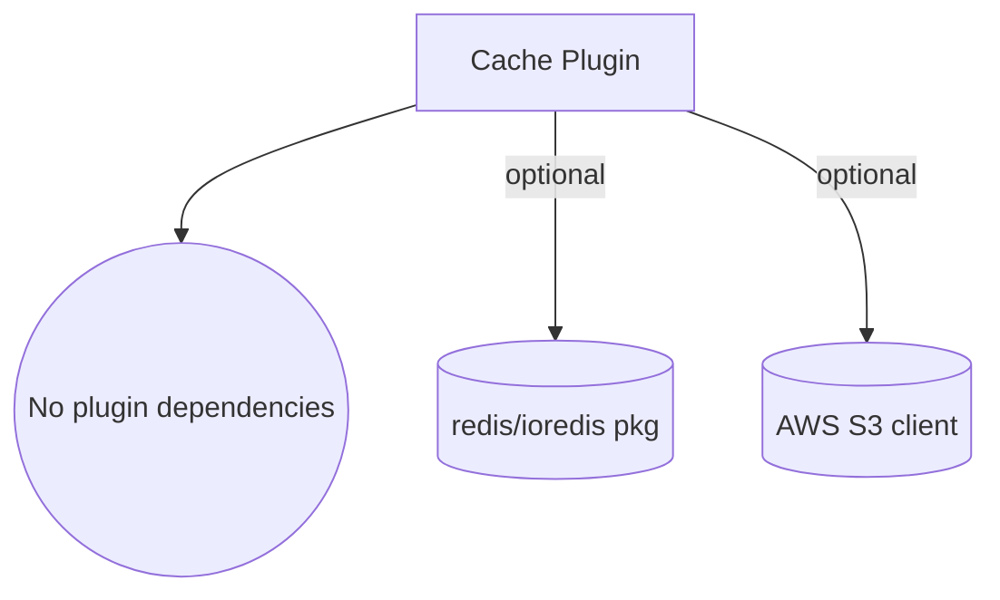

# 💾 Cache Plugin

> **Adaptive multi-tier caching for s3db.js with memory, Redis, and S3 layers.**
>
> **Navigation:** [← Plugin Index](./README.md) | [Configuration ↓](#-configuration-reference) | [FAQ ↓](#-faq)

---

## ⚡ TLDR

**Drastically** reduces S3 costs and latency with intelligent caching (memory/redis/S3).

**1 line to get started:**
```javascript
await db.usePlugin(new CachePlugin({ driver: 'memory' }));  // 90x faster!
```

**Multi-tier caching (cascade L1→L2→L3→Database):**
```javascript
await db.usePlugin(new CachePlugin({
  drivers: [
    { driver: 'memory', ttl: 300000, config: { maxMemoryPercent: 0.1 } },  // L1: ~1ms
    { driver: 'redis', ttl: 3600000, config: { host: 'localhost' } },      // L2: ~15ms
    { driver: 's3', ttl: 86400000, config: { keyPrefix: 'cache/' } }       // L3: ~120ms
  ]
}));
```

**Key features:**
- ✅ Drivers: memory (LRU/FIFO), redis, S3
- ✅ Multi-tier caching with auto-promotion (hot data moves to faster layers)
- ✅ Configurable TTL per layer + automatic invalidation
- ✅ Optional compression (gzip)
- ✅ Hit/miss/eviction statistics
- ✅ Partition-aware caching with usage insights

**Performance & Cost** (measured with Costs Plugin):
```javascript
// ❌ Without cache: Every call hits S3
for (let i = 0; i < 1000; i++) {
  await users.count(); // Each call: ~180ms + 1 GET request ($0.0004)
}
// Total: ~180 seconds, 1000 GET requests = $0.40

// ✅ With cache: First call S3, rest from memory
for (let i = 0; i < 1000; i++) {
  await users.count(); // First: 180ms + 1 GET, Rest: 2ms (cache hit)
}
// Total: ~2 seconds (90x faster), 1 GET request = $0.0004 (1000x cheaper!)
console.log(s3db.client.costs.total); // $0.0004
console.log(s3db.client.costs.requests.get); // 1 (vs 1000 without cache)
```

---

## 📑 Table of Contents

1. [⚡ TLDR](#-tldr)
2. [⚡ Quickstart](#-quickstart)
3. [Usage Journey](#usage-journey)
   - [Level 1: Basic Memory Caching](#level-1-basic-memory-caching)
   - [Level 2: Add Memory Limits](#level-2-add-memory-limits)
   - [Level 3: Enable Compression](#level-3-enable-compression)
   - [Level 4: Add Statistics & Monitoring](#level-4-add-statistics--monitoring)
   - [Level 5: Production - Persistent Cache](#level-5-production---persistent-cache)
   - [Level 6: Multi-Server - Shared S3 Cache](#level-6-multi-server---shared-s3-cache)
   - [Level 7: Production Optimization](#level-7-production-optimization)
4. [📊 Configuration Reference](#-configuration-reference)
5. [📚 Configuration Examples](#-configuration-examples)
6. [🔧 API Reference](#-api-reference)
7. [✅ Best Practices](#-best-practices)
8. [💰 Measuring Real Cost Savings with Costs Plugin](#-measuring-real-cost-savings-with-costs-plugin)
9. [🔗 See Also](#-see-also)
10. [🚨 Error Handling](#-error-handling)

---

## ⚡ Quickstart

```javascript
import { S3db, CachePlugin } from 's3db.js';

const s3db = new S3db({
  connectionString: "s3://key:secret@bucket/path",
  plugins: [new CachePlugin({ driver: 'memory' })]
});

await s3db.connect();

const users = s3db.resources.users;

// First call hits S3
console.time('First call');
const count1 = await users.count();
console.timeEnd('First call');
// First call: 180ms

// Second call uses cache
console.time('Cached call');
const count2 = await users.count();
console.timeEnd('Cached call');
// Cached call: 2ms

console.log(`Count: ${count2}, Speed improvement: ${(180/2).toFixed(0)}x faster`);
// Output: Count: 150, Speed improvement: 90x faster
```

---

## Usage Journey

### Level 1: Basic Memory Caching

Start here for immediate performance gains:

```javascript
// Step 1: Add cache plugin
plugins: [new CachePlugin({ driver: 'memory' })]

// Step 2: Use normally - caching is automatic
await users.count();  // First: 180ms (S3)
await users.count();  // Next: 2ms (cache) - 90x faster!
```

**What you get:** Up to 90x speedup on repeat calls, minimal configuration.

### Level 2: Add Memory Limits

Once caching more data, prevent memory exhaustion:

```javascript
// Option A: Fixed limit (known environment)
new CachePlugin({
  driver: 'memory',
  config: {
    maxMemoryBytes: 512 * 1024 * 1024,  // 512MB max
    evictionPolicy: 'lru'  // Remove oldest when full
  }
})

// Option B: Percentage limit (containers/cloud)
new CachePlugin({
  driver: 'memory',
  config: {
    maxMemoryPercent: 0.1,  // Use 10% of system memory
    // 16GB system = 1.6GB cache
    // 32GB system = 3.2GB cache
  }
})
```

**What you get:** Protection against OOM, automatic eviction.

### Level 3: Enable Compression

For larger cached objects, save memory:

```javascript
new CachePlugin({
  driver: 'memory',
  config: {
    maxMemoryPercent: 0.1,
    enableCompression: true,  // Compress with gzip
    compressionThreshold: 1024  // Only compress if >1KB
  }
})
```

**What you get:** 2-3x more data cached in same memory.

### Level 3.5: Custom keys & serialization

Fine-tune how keys and values are stored:

```javascript
new CachePlugin({
  driver: 'memory',
  config: {
    caseSensitive: false,        // "User:1" and "user:1" map to the same entry
    serializer: (value) => Buffer.from(JSON.stringify(value)).toString('base64'),
    deserializer: (raw) => JSON.parse(Buffer.from(raw, 'base64').toString('utf8'))
  }
});
```

**What you get:** Seamless integration with existing key conventions and custom payload formats.

### Level 4: Add Statistics & Monitoring

Track cache effectiveness:

```javascript
new CachePlugin({
  driver: 'memory',
  config: {
    enableStats: true  // Track hits/misses/evictions
  }
})

// Check performance
const stats = cachePlugin.driver.getStats();
console.log(`Hits: ${stats.hits}, Misses: ${stats.misses}`);
console.log(`Evictions: ${stats.evictions}, Memory: ${stats.memoryUsageBytes} bytes`);

if (!stats.enabled) {
  console.warn('Enable statistics with config.enableStats = true');
}
```

**What you get:** Data-driven cache tuning.

### Level 5: Production - Persistent Cache

For production, survive restarts with filesystem cache:

```javascript
new CachePlugin({
  driver: 'filesystem',
  ttl: 1800000,  // 30 minutes
  config: {
    directory: './cache',
    enableCompression: true,
    enableCleanup: true  // Auto-delete expired files
  }
})
```

**What you get:** Cache survives deployments/restarts.

### Level 6: Multi-Server - Shared S3 Cache

For distributed systems, share cache across servers:

```javascript
new CachePlugin({
  driver: 's3',
  ttl: 3600000,  // 1 hour (milliseconds)
  config: {
    keyPrefix: 'app-cache/',
    // Uses same S3 bucket as database
  }
})
```

**What you get:** All servers share cache, no cold starts.

### Level 7: Production Optimization

Combine techniques for maximum efficiency:

```javascript
// 1. Use filesystem for speed + persistence
new CachePlugin({
  driver: 'filesystem',
  ttl: 1800000,  // 30 min
  config: {
    directory: '/mnt/cache',  // Fast SSD
    enableCompression: true,
    enableCleanup: true
  }
})

// 2. Monitor cache health
setInterval(() => {
  const stats = cachePlugin.driver.getStats();
  if (!stats.enabled) return;
  const total = stats.hits + stats.misses;
  const hitRate = total > 0 ? stats.hits / total : 0;
  if (hitRate < 0.7) {
    console.warn('Low hit rate, consider increasing TTL');
  }
}, 60000);

// 3. Selective resource caching
// (Cache plugin auto-skips plugin-created resources)
```

**What you get:** Production-ready caching with monitoring.

---

## 📊 Configuration Reference

### Core Options

| Parameter | Type | Default | Description |
|-----------|------|---------|-------------|
| `driver` | string | `'memory'` | Single-tier mode: Cache storage driver (`'memory'`, `'redis'`, or `'s3'`) |
| `drivers` | array | `undefined` | Multi-tier mode: Array of driver configs `[{ driver, ttl, config }, ...]` |
| `ttl` | number | `300000` | Time-to-live in milliseconds (5 minutes default) - single-tier mode only |
| `maxSize` | number | `1000` | Maximum number of cached items - single-tier mode only |
| `config` | object | `{}` | Driver-specific configuration options - single-tier mode only |

### Dependency Graph



The cache plugin ships without hard plugin dependencies. When you enable the Redis driver make sure `ioredis` is installed; the S3 driver reuses the database S3 client but also accepts a custom client via `config.client`. Each cache instance is fully namespaced—install multiple tiers by supplying `namespace` or an alias to `db.usePlugin()`.

### Memory Driver Config

| Parameter | Type | Default | Description |
|-----------|------|---------|-------------|
| `maxMemoryBytes` | number | `0` | Maximum memory in bytes (0 = unlimited). **Cannot be used with maxMemoryPercent** |
| `maxMemoryPercent` | number | `0` | Maximum memory as fraction 0...1 (e.g., 0.1 = 10%). **Cannot be used with maxMemoryBytes** |
| `evictionPolicy` | string | `'lru'` | Eviction strategy: `'lru'` (least recently used) or `'fifo'` |
| `enableStats` | boolean | `false` | Track hits/misses/evictions (use `driver.getStats()`) |
| `caseSensitive` | boolean | `true` | Treat keys as case-sensitive (`false` normalizes to lowercase) |
| `serializer` | function | `JSON.stringify` | Serialize values before storage |
| `deserializer` | function | `JSON.parse` | Deserialize values on read |
| `enableCompression` | boolean | `false` | Compress cached values with gzip |
| `compressionThreshold` | number | `1024` | Minimum size (bytes) to trigger compression |

### Redis Driver Config

| Parameter | Type | Default | Description |
|-----------|------|---------|-------------|
| `host` | string | `'localhost'` | Redis server host |
| `port` | number | `6379` | Redis server port |
| `password` | string | `undefined` | Redis authentication password |
| `db` | number | `0` | Redis database number (0-15) |
| `keyPrefix` | string | `'cache'` | Prefix for all Redis keys |
| `enableCompression` | boolean | `true` | Compress cached values with gzip |
| `compressionThreshold` | number | `1024` | Minimum size (bytes) to trigger compression |
| `connectTimeout` | number | `5000` | Connection timeout in milliseconds |
| `commandTimeout` | number | `5000` | Command execution timeout in milliseconds |
| `retryStrategy` | function | See docs | Custom retry logic for failed connections |

### S3 Driver Config

| Parameter | Type | Default | Description |
|-----------|------|---------|-------------|
| `keyPrefix` | string | `'cache'` | S3 key prefix for cache objects |
| `client` | object | DB client | Custom S3 client (uses database client by default) |

---

## 📚 Configuration Examples

### Multi-Tier Cache Architecture

**Multi-tier caching** creates a cascade of cache layers with different speed/cost trade-offs:

```javascript
// L1 (Memory) → L2 (Redis) → L3 (S3) → Database
await db.usePlugin(new CachePlugin({
  drivers: [
    {
      driver: 'memory',
      ttl: 300000,        // 5 minutes (hot data)
      config: {
        maxMemoryPercent: 0.1,  // 10% of system memory
        evictionPolicy: 'lru',
        enableCompression: true
      }
    },
    {
      driver: 'redis',
      ttl: 3600000,       // 1 hour (warm data)
      config: {
        host: 'localhost',
        port: 6379,
        keyPrefix: 'app-cache/',
        enableCompression: true
      }
    },
    {
      driver: 's3',
      ttl: 86400000,      // 24 hours (cold data)
      config: {
        keyPrefix: 'cache/'
      }
    }
  ],
  promoteOnHit: true,    // Move data to faster layers when accessed
  strategy: 'write-through'  // Write to all layers immediately
}));

// How it works:
// 1. GET request checks L1 (memory) → ~1ms if found
// 2. If L1 miss, check L2 (Redis) → ~15ms if found, promote to L1
// 3. If L2 miss, check L3 (S3) → ~120ms if found, promote to L1+L2
// 4. If L3 miss, fetch from database → ~500ms, store in all layers
```

**Performance characteristics:**
- L1 (Memory): ~1-2ms, 10-100MB, instance-specific
- L2 (Redis): ~10-20ms, 1-10GB, shared across instances
- L3 (S3): ~100-200ms, unlimited, persistent, multi-region

**Use cases:**
- **Hot path**: Frequently accessed data lives in L1 (memory)
- **Warm data**: Less frequent but still popular data in L2 (Redis)
- **Cold data**: Rarely accessed but cacheable data in L3 (S3)
- **Auto-promotion**: Popular data automatically moves to faster layers

### Example 1: Memory Cache (Fast, Temporary)

Best for development and temporary caching:

```javascript
new CachePlugin({
  driver: 'memory',
  ttl: 600000,  // 10 minutes
  maxSize: 500,
  config: {
    evictionPolicy: 'lru',
    enableStats: true
  }
})

const users = s3db.resources.users;
await users.list();  // Cached

// Check stats
if (users.cache.stats) {
  const stats = users.cache.stats();
  console.log(`Hit rate: ${(stats.hitRate * 100).toFixed(1)}%`);
  console.log(`Hits: ${stats.hits}, Misses: ${stats.misses}`);
}
// Output: Hit rate: 85.5%, Hits: 342, Misses: 58
```

### Example 1.1: Memory Cache with Absolute Limit

Prevent memory exhaustion with hard byte limit:

```javascript
new CachePlugin({
  driver: 'memory',
  ttl: 600000,  // 10 minutes
  config: {
    maxMemoryBytes: 512 * 1024 * 1024,  // 512MB hard limit
    enableCompression: true,
    compressionThreshold: 1024
  }
})

const users = s3db.resources.users;
await users.list();  // Cached with memory protection

// Monitor memory usage
const memStats = users.cache.getMemoryStats();
console.log(`Memory: ${memStats.memoryUsage.current} / ${memStats.memoryUsage.max}`);
console.log(`Usage: ${memStats.memoryUsagePercent}%`);
console.log(`Evicted: ${memStats.evictedDueToMemory} items`);
// Output: Memory: 245.12 MB / 512.00 MB
//         Usage: 47.87%
//         Evicted: 15 items
```

### Example 1.2: Memory Cache with Percentage Limit (Cloud-Native)

Perfect for containers/Kubernetes where memory varies:

```javascript
new CachePlugin({
  driver: 'memory',
  ttl: 1800000,  // 30 minutes
  config: {
    maxMemoryPercent: 0.1,  // Use max 10% of system memory (0.1 = 10%)
    enableCompression: true
  }
})

// On 16GB system = ~1.6GB cache limit
// On 32GB system = ~3.2GB cache limit
// Automatically adapts to container memory!

const products = s3db.resources.products;
await products.list();  // Cached

// Check system memory stats
const memStats = products.cache.getMemoryStats();
console.log(`System Memory: ${memStats.systemMemory.total}`);
console.log(`Cache using: ${memStats.systemMemory.cachePercent} of system`);
console.log(`Cache limit: ${(memStats.maxMemoryPercent * 100).toFixed(1)}%`);
// Output: System Memory: 16.00 GB
//         Cache using: 0.8% of system
//         Cache limit: 10.0%
```

### Multi-instance namespaces

Need distinct cache layers for separate workloads? Install the plugin multiple times with the `namespace` option (or a custom alias in `db.usePlugin`) to isolate drivers, PluginStorage keys, and generated resource prefixes:

```javascript
await db.usePlugin(new CachePlugin({
  driver: 'memory',
  namespace: 'hot-path',
  ttl: 5_000
}), 'cacheHot');

await db.usePlugin(new CachePlugin({
  driver: 's3',
  namespace: 'analytics',
  ttl: 60_000
}), 'cacheCold');

const users = db.resources.users;
const hotDriver = users.getCacheDriver('cache--hot-path');
const coldDriver = users.getCacheDriver('cache--analytics');

const analyticsKey = await users.getCacheKeyResolver('cache--analytics')({ action: 'list' });
const cached = await coldDriver.get(analyticsKey);
```

- The **first** installed instance remains available as `resource.cache` for backwards compatibility.
- Additional drivers live in `resource.cacheInstances`. Retrieve them with `resource.getCacheDriver(<slug>)` and `resource.getCacheKeyResolver(<slug>)`.
- Namespaces slugify into resource prefixes (`plg_cache--analytics_*`) and PluginStorage keys (`plugin=cache--analytics/...`).
- Passing a second argument to `db.usePlugin(plugin, 'cacheSecondary')` auto-derives the namespace when you omit it.

### Example 2: Filesystem Cache (Persistent, Local)

Best for production with single server:

```javascript
new CachePlugin({
  driver: 'filesystem',
  ttl: 1800000,  // 30 minutes
  config: {
    directory: './cache',
    enableCompression: true,
    enableCleanup: true
  }
})

const products = s3db.resources.products;
await products.count();  // Cached to disk

// Cache persists across restarts
console.log('Cache stored in ./cache directory');
```

### Example 3: S3 Cache (Shared, Distributed)

Best for multi-server deployments:

```javascript
new CachePlugin({
  driver: 's3',
  ttl: 3600000,  // 1 hour
  config: {
    keyPrefix: 'app-cache/'
  }
})

// Cache shared across all servers
const users = s3db.resources.users;
await users.list();  // Cached in S3

console.log('Cache shared across all application instances');
```

### Example 4: Compression for Large Data

Reduce storage with compression:

```javascript
new CachePlugin({
  driver: 'memory',
  config: {
    enableCompression: true,
    compressionThreshold: 512  // Compress items > 512 bytes
  }
})

const orders = s3db.resources.orders;
await orders.list();  // Large results compressed

console.log('Large cached values are compressed automatically');
```

### Example 5: Manual Cache Control

Take control of caching behavior:

```javascript
new CachePlugin({ driver: 'memory' })

const users = s3db.resources.users;

// Manual cache operations
await users.cache.set('my-key', { data: 'value' });
const cached = await users.cache.get('my-key');

// Clear specific cache
await users.cache.delete('my-key');

// Clear all cache for resource
await users.cache.clear();

console.log('Manual cache control enabled');
```

---

## 🔧 API Reference

### Resource Cache Methods

When CachePlugin is installed, resources gain these methods:

```javascript
const resource = s3db.resources.users;

// Get cached value
const value = await resource.cache.get(key);

// Set cached value
await resource.cache.set(key, value, ttl);  // ttl optional

// Delete cached value
await resource.cache.delete(key);

// Clear all cache
await resource.cache.clear();

// Get statistics (if enabled)
const stats = resource.cache.stats();
if (stats.enabled) {
  console.log('Cache stats:', {
    hits: stats.hits,
    misses: stats.misses,
    hitRate: `${(stats.hitRate * 100).toFixed(1)}%`,
    evictions: stats.evictions,
    memoryUsageBytes: stats.memoryUsageBytes
  });
}
```

---

## ✅ Best Practices

### 1. Choose the Right Driver

```javascript
// Development: Memory cache (L1 - fastest)
{ driver: 'memory', ttl: 300000 }

// Production single-server: Redis cache (L2 - persistent, shared)
{ driver: 'redis', config: { host: 'localhost', port: 6379 } }

// Multi-server/Distributed: S3 cache (L3 - unlimited, multi-region)
{ driver: 's3' }

// Production multi-tier: Combine all 3 layers
{
  drivers: [
    { driver: 'memory', ttl: 300000, config: { maxMemoryPercent: 0.1 } },
    { driver: 'redis', ttl: 3600000, config: { host: 'localhost' } },
    { driver: 's3', ttl: 86400000 }
  ]
}
```

### 2. Tune TTL Based on Data Freshness

```javascript
// Frequently changing data: Short TTL
{ ttl: 60000 }  // 1 minute

// Rarely changing data: Long TTL
{ ttl: 3600000 }  // 1 hour
```

### 3. Monitor Cache Performance

```javascript
new CachePlugin({
  driver: 'memory',
  config: { enableStats: true }
})

// Check hit rate
const stats = resource.cache.stats();
if (stats.hitRate < 0.7) {
  console.warn(`Low cache hit rate: ${(stats.hitRate * 100).toFixed(1)}%`);
}
```

---

## 💰 Measuring Real Cost Savings with Costs Plugin

Combine `CachePlugin` with `CostsPlugin` to track actual AWS cost savings:

### Complete Example

```javascript
import { S3db, CachePlugin, CostsPlugin } from 's3db.js';

const s3db = new S3db({
  connectionString: 's3://key:secret@bucket/path',
  plugins: [
    CostsPlugin,  // Track real AWS costs
    new CachePlugin({ driver: 'memory', ttl: 300000 })  // 5min cache
  ]
});

await s3db.connect();
const users = s3db.resources.users;

// Scenario: 10,000 read operations
console.log('=== Without Cache ===');

// Reset costs
s3db.client.costs.reset();

// Simulate 10,000 calls without cache (disable temporarily)
users.cache.driver.enabled = false;
for (let i = 0; i < 10000; i++) {
  await users.count();
}

const noCacheCost = s3db.client.costs.total;
const noCacheRequests = s3db.client.costs.requests.get;
console.log(`Cost: $${noCacheCost.toFixed(4)}`);
console.log(`GET requests: ${noCacheRequests}`);
// Output: Cost: $4.0000, GET requests: 10000

console.log('\n=== With Cache ===');

// Reset and enable cache
s3db.client.costs.reset();
users.cache.driver.enabled = true;

// Same 10,000 calls with cache
for (let i = 0; i < 10000; i++) {
  await users.count();
}

const cacheCost = s3db.client.costs.total;
const cacheRequests = s3db.client.costs.requests.get;
const cacheStats = users.cache.stats();

console.log(`Cost: $${cacheCost.toFixed(4)}`);
console.log(`GET requests: ${cacheRequests}`);
console.log(`Cache hits: ${cacheStats.hits}`);
console.log(`Cache hit rate: ${(cacheStats.hitRate * 100).toFixed(1)}%`);
// Output:
// Cost: $0.0004
// GET requests: 1
// Cache hits: 9999
// Cache hit rate: 99.99%

console.log('\n=== Savings ===');
const savings = noCacheCost - cacheCost;
const savingsPercent = ((savings / noCacheCost) * 100).toFixed(1);
console.log(`Total savings: $${savings.toFixed(4)} (${savingsPercent}%)`);
console.log(`Requests saved: ${noCacheRequests - cacheRequests} (${((1 - cacheRequests/noCacheRequests) * 100).toFixed(1)}%)`);
// Output:
// Total savings: $3.9996 (99.99%)
// Requests saved: 9999 (99.99%)
```

### Monthly Projection

```javascript
// Calculate monthly costs based on current usage
const operations = {
  count: 100000,      // 100K count() calls/month
  list: 50000,        // 50K list() calls/month
  get: 200000         // 200K get() calls/month
};

// Without cache (all operations hit S3)
const monthlyWithoutCache =
  (operations.count * 0.0000004) +  // count = GET
  (operations.list * 0.000005) +     // list = LIST
  (operations.get * 0.0000004);      // get = GET

console.log(`Monthly cost without cache: $${monthlyWithoutCache.toFixed(2)}`);
// Output: Monthly cost without cache: $0.37

// With cache (assuming 95% hit rate)
const hitRate = 0.95;
const monthlyWithCache =
  ((operations.count * (1 - hitRate)) * 0.0000004) +
  ((operations.list * (1 - hitRate)) * 0.000005) +
  ((operations.get * (1 - hitRate)) * 0.0000004);

console.log(`Monthly cost with cache: $${monthlyWithCache.toFixed(2)}`);
// Output: Monthly cost with cache: $0.02

console.log(`Monthly savings: $${(monthlyWithoutCache - monthlyWithCache).toFixed(2)}`);
// Output: Monthly savings: $0.35
```

### Real-Time Monitoring

```javascript
// Monitor costs and cache performance in real-time
setInterval(() => {
  const costs = s3db.client.costs;
  const stats = users.cache.stats();

  console.log('=== Cache & Costs Report ===');
  console.log(`Total cost: $${costs.total.toFixed(4)}`);
  console.log(`Total requests: ${costs.requests.total}`);
  console.log(`Cache hit rate: ${(stats.hitRate * 100).toFixed(1)}%`);
  console.log(`Cache memory: ${stats.memoryUsagePercent}%`);

  // Alert if cache not saving money
  if (stats.hitRate < 0.8) {
    console.warn('⚠️  Low cache hit rate - consider adjusting TTL');
  }
}, 60000); // Every minute
```

### Cost Breakdown by Operation

```javascript
// After running your application
const costs = s3db.client.costs;

console.log('=== Cost Breakdown ===');
console.log(`PUT operations: ${costs.requests.put} × $${costs.prices.put} = $${(costs.requests.put * costs.prices.put).toFixed(6)}`);
console.log(`GET operations: ${costs.requests.get} × $${costs.prices.get} = $${(costs.requests.get * costs.prices.get).toFixed(6)}`);
console.log(`LIST operations: ${costs.requests.list} × $${costs.prices.list} = $${(costs.requests.list * costs.prices.list).toFixed(6)}`);
console.log(`Total: $${costs.total.toFixed(6)}`);

// Example output:
// PUT operations: 50 × $0.000005 = $0.000250
// GET operations: 10 × $0.0000004 = $0.000004
// LIST operations: 5 × $0.000005 = $0.000025
// Total: $0.000279
```

---

## 🔗 See Also

- [Metrics Plugin](./metrics.md) - Monitor cache performance
- [Costs Plugin](./costs.md) - Track caching cost savings

---

## 🚨 Error Handling

The Cache Plugin uses standardized error classes with comprehensive context and recovery guidance:

### CacheError

All cache operations throw `CacheError` instances with HTTP-style metadata:

```javascript
try {
  await resource.cache.get('invalid-key');
} catch (error) {
  console.error(error.name);        // 'CacheError'
  console.error(error.message);     // Brief error summary
  console.error(error.statusCode);  // e.g. 400, 413, 500
  console.error(error.description); // Detailed explanation with guidance
  console.error(error.context);     // Operation context
  console.error(error.retriable);   // boolean
  console.error(error.suggestion);  // Next steps in plain English
}
```

### Common Errors

#### Invalid Cache Key

**When**: Cache key is null, undefined, or invalid type
**Error**: `Invalid cache key: must be a non-empty string`
**Recovery**:
```javascript
// Bad
await resource.cache.get(null);           // Throws CacheError
await resource.cache.get('');             // Throws CacheError
await resource.cache.get(undefined);      // Throws CacheError

// Good
await resource.cache.get('valid-key');    // Works
```

#### Resource Not Found

**When**: Warming cache for non-existent resource
**Error**: `Resource not found for cache warming: {resourceName}`
**Recovery**:
```javascript
// Bad
await cachePlugin.warmCache('nonexistent-resource');  // Throws CacheError

// Good
const resourceNames = Object.keys(database.resources);
for (const name of resourceNames) {
  await cachePlugin.warmCache(name);
}
```

#### Driver-Specific Errors

**Filesystem Driver**:
```javascript
try {
  await resource.cache.get('key');
} catch (error) {
  if (error.name === 'CacheError') {
    console.error('Filesystem cache error:', error.description);
    console.error('Status:', error.statusCode, 'Retriable?', error.retriable);
    // Common fixes: check directory permissions, disk space, lockTimeout settings
  }
}
```

**S3 Driver**:
```javascript
try {
  await resource.cache.set('key', data);
} catch (error) {
  if (error.name === 'CacheError') {
    console.error('S3 cache error:', error.description);
    // Check S3 credentials, permissions, bucket access
  }
}
```

**Memory Driver**:
```javascript
try {
  await resource.cache.set('key', hugePayload);
} catch (error) {
  if (error.name === 'CacheError' && error.statusCode === 400) {
    console.warn(error.suggestion); // e.g. choose either maxMemoryBytes or maxMemoryPercent
  }
}
```

#### Memory Limit Errors

**When**: Conflicting memory configuration
**Error**: `Cannot use both maxMemoryBytes and maxMemoryPercent`
**Recovery**:
```javascript
// Bad
new CachePlugin({
  driver: 'memory',
  config: {
    maxMemoryBytes: 512 * 1024 * 1024,
    maxMemoryPercent: 0.1  // Conflict!
  }
})

// Good - Choose one
new CachePlugin({
  driver: 'memory',
  config: {
    maxMemoryPercent: 0.1  // OR maxMemoryBytes, not both
  }
})
```

### Error Recovery Patterns

#### Graceful Degradation

Skip cache on errors and fetch from S3:
```javascript
async function getWithCacheFallback(resource, id) {
  try {
    // Try cache first
    return await resource.cache.get(id);
  } catch (cacheError) {
    console.warn('Cache unavailable, fetching from S3:', cacheError.message);
    // Fall back to direct S3 read
    return await resource.get(id, { skipCache: true });
  }
}
```

#### Cache Health Monitoring

Monitor cache errors and disable if unhealthy:
```javascript
let cacheErrorCount = 0;
const MAX_ERRORS = 10;

resource.on('cache-error', (error) => {
  cacheErrorCount++;

  if (cacheErrorCount > MAX_ERRORS) {
    console.error('Cache unhealthy, disabling');
    cachePlugin.enabled = false;
  }
});
```

#### Retry with Backoff

Retry transient cache errors:
```javascript
async function cacheSetWithRetry(cache, key, value, retries = 3) {
  for (let i = 0; i < retries; i++) {
    try {
      return await cache.set(key, value);
    } catch (error) {
      if (error.name === 'CacheError' && i < retries - 1) {
        await new Promise(resolve => setTimeout(resolve, 100 * Math.pow(2, i)));
        continue;
      }
      throw error;
    }
  }
}
```

---

## 🐛 Troubleshooting

**Issue: Cache not improving performance**
- Solution: Check if TTL is too short or writes are clearing cache frequently

**Issue: Memory usage too high**
- Solution: Reduce `maxSize` or enable `enableCompression`

**Issue: Stale data in cache**
- Solution: Reduce `ttl` or manually clear cache after updates

---

## ❓ FAQ

### Basics

**Q: Which cache driver should I use?**
A: Depends on your use case:
- `memory`: Development and hot data (fastest, ~1ms)
- `redis`: Production/shared cache (persistent, ~15ms)
- `s3`: Multi-server/distributed (unlimited, ~120ms)
- Multi-tier: Combine all 3 for optimal performance

**Q: Does cache work automatically?**
A: Yes! After installing the plugin, all read operations (`fetched`, `list`, `count`, `query`) are automatically cached.

**Q: How to skip cache for a specific operation?**
A: Pass `skipCache: true` as an option:
```javascript
const user = await users.get('id123', { skipCache: true });
```

### Configuration

**Q: How to configure TTL (time-to-live)?**
A: Use the `ttl` option in milliseconds:
```javascript
new CachePlugin({
  driver: 'memory',
  ttl: 60000  // 60 seconds
})
```

**Q: Can I cache only specific resources?**
A: Yes! Use `include` or `exclude`:
```javascript
new CachePlugin({
  include: ['users', 'products'],  // Only these resources
  exclude: ['logs']                // All except logs
})
```

**Q: How to avoid caching plugin-created resources?**
A: By default, resources with `createdBy !== 'user'` are not cached. To explicitly include them, add to the `include` array.

### Operations

**Q: How to manually clear cache?**
A: Use the plugin methods:
```javascript
// Clear cache for a resource
await users.cache.clear();

// Clear all cache
await database.plugins.cache.clearAllCache();

// Partition-aware: clear specific partition
await resource.clearPartitionCache('byRegion', { region: 'US' });
```

**Q: How to warm up the cache?**
A: Use the `warmCache` method:
```javascript
await database.plugins.cache.warmCache('users', {
  includePartitions: true,
  sampleSize: 1000
});
```

### Performance

**Q: Which driver is fastest?**
A: Performance ranking (fastest to slowest):
1. `memory`: ~1-2ms (in-process)
2. `redis`: ~10-20ms (network, shared)
3. `s3`: ~100-200ms (API call, distributed)
Use multi-tier to get benefits of all layers.

**Q: How to analyze cache usage?**
A: Use `analyzeCacheUsage()` with partition-aware cache:
```javascript
const analysis = await database.plugins.cache.analyzeCacheUsage();
// Returns: most used partitions, least used, recommendations
```

**Q: How to configure maximum size?**
A: You have 3 options (choose only ONE):

1. **By item count** (simple):
```javascript
new CachePlugin({
  driver: 'memory',
  maxSize: 1000,  // Maximum 1000 items
  config: {
    evictionPolicy: 'lru'
  }
})
```

2. **By absolute bytes** (fixed environments):
```javascript
new CachePlugin({
  driver: 'memory',
  config: {
    maxMemoryBytes: 512 * 1024 * 1024,  // 512MB
    enableCompression: true
  }
})
```

3. **By percentage** (containers/cloud - RECOMMENDED):
```javascript
new CachePlugin({
  driver: 'memory',
  config: {
    maxMemoryPercent: 0.1,  // 10% of system memory
    enableCompression: true
  }
})
```

⚠️ **IMPORTANT**: Don't use `maxMemoryBytes` and `maxMemoryPercent` together - the system will throw an error!

**Q: How to monitor cache memory usage?**
A: Use the driver's `getMemoryStats()` method:
```javascript
const cache = database.plugins.cache.driver;
const stats = cache.getMemoryStats();

console.log('Memory Stats:', {
  current: stats.memoryUsage.current,
  max: stats.memoryUsage.max,
  usage: `${stats.memoryUsagePercent.toFixed(1)}%`,
  items: stats.totalItems,
  avgSize: stats.averageItemSize,
  evicted: stats.evictedDueToMemory
});

// Alert if usage is high
if (stats.memoryUsagePercent > 90) {
  console.warn('⚠️ Cache memory usage above 90%!');
}
```

**Q: What happens when memory limit is reached?**
A: Cache automatically removes oldest items (eviction) until there's enough space. You can monitor how many items were removed with `stats.evictedDueToMemory`.

### Troubleshooting

**Q: Cache is not being invalidated after updates?**
A: Check if the plugin was installed BEFORE creating the resources. The plugin installs middlewares on resources during `onInstall()`.

**Q: I'm seeing stale data?**
A: Reduce TTL or use `skipCache: true` for operations that need real-time data.

**Q: Memory usage too high / OOM errors?**
A: Configure `maxMemoryBytes` or `maxMemoryPercent`:
```javascript
new CachePlugin({
  driver: 'memory',
  config: {
    maxMemoryPercent: 0.1,  // Limit to 10% of memory
    enableCompression: true  // Reduces memory usage
  }
})
```

**Q: How to debug cache issues?**
A: Enable verbose mode and monitor statistics:
```javascript
new CachePlugin({
  verbose: true,
  config: { enableStats: true }
})

// Check statistics
const stats = resource.cache.stats();
console.log(`Hit rate: ${(stats.hitRate * 100).toFixed(1)}%`);

// Check memory
const memStats = resource.cache.getMemoryStats();
console.log(`Memory: ${memStats.memoryUsagePercent.toFixed(1)}%`);
```
