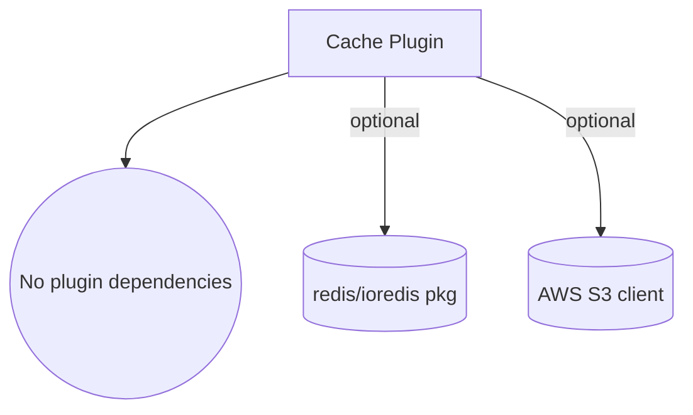

# ⚙️ Cache Configuration

> **In this guide:** Detailed configuration options for Memory, Redis, and S3 drivers.

**Navigation:** [← Back to Cache Plugin](/plugins/cache/README.md)

---

## 📊 Configuration Reference

### Core Options

| Parameter | Type | Default | Description |
|-----------|------|---------|-------------|
| `driver` | string | `'memory'` | Single-tier mode: Cache storage driver (`'memory'`, `'redis'`, or `'s3'`) |
| `drivers` | array | `undefined` | Multi-tier mode: Array of driver configs `[{ driver, ttl, config }, ...]` |
| `ttl` | number | `300000` | Time-to-live in milliseconds (5 minutes default) - single-tier mode only |
| `maxSize` | number | `1000` | Maximum number of cached items - single-tier mode only |
| `config` | object | `{}` | Driver-specific configuration options - single-tier mode only |

### Dependency Graph

The cache plugin ships without hard plugin dependencies. When you enable the Redis driver make sure `ioredis` is installed; the S3 driver reuses the database S3 client but also accepts a custom client via `config.client`. Each cache instance is fully namespaced—install multiple tiers by supplying `namespace` or an alias to `db.usePlugin()`.

---

## 🧠 Memory Driver Config

Best for development, single-process apps, and L1 caching.

| Parameter | Type | Default | Description |
|-----------|------|---------|-------------|
| `maxMemoryBytes` | number | `0` | Maximum memory in bytes (0 = unlimited). **Cannot be used with maxMemoryPercent** |
| `maxMemoryPercent` | number | `0` | Maximum memory as fraction 0...1 (e.g., 0.1 = 10%). **Cannot be used with maxMemoryBytes** |
| `evictionPolicy` | string | `'lru'` | Eviction strategy: `'lru'` (least recently used) or `'fifo'` |
| `enableStats` | boolean | `false` | Track hits/misses/evictions (use `driver.getStats()`) |
| `caseSensitive` | boolean | `true` | Treat keys as case-sensitive (`false` normalizes to lowercase) |
| `serializer` | function | `JSON.stringify` | Serialize values before storage |
| `deserializer` | function | `JSON.parse` | Deserialize values on read |
| `enableCompression` | boolean | `false` | Compress cached values with gzip |
| `compressionThreshold` | number | `1024` | Minimum size (bytes) to trigger compression |

Oversized payloads that exceed `maxMemoryBytes` are skipped, and the driver increments `evictedDueToMemory` so monitoring dashboards can spot workloads that need a larger ceiling (or compression).

---

## 🔴 Redis Driver Config

Best for production, shared caching, and L2 layers.

| Parameter | Type | Default | Description |
|-----------|------|---------|-------------|
| `host` | string | `'localhost'` | Redis server host |
| `port` | number | `6379` | Redis server port |
| `password` | string | `undefined` | Redis authentication password |
| `db` | number | `0` | Redis database number (0-15) |
| `keyPrefix` | string | `'cache'` | Prefix for all Redis keys |
| `enableCompression` | boolean | `true` | Compress cached values with gzip |
| `compressionThreshold` | number | `1024` | Minimum size (bytes) to trigger compression |
| `connectTimeout` | number | `5000` | Connection timeout in milliseconds |
| `commandTimeout` | number | `5000` | Command execution timeout in milliseconds |
| `retryStrategy` | function | See docs | Custom retry logic for failed connections |

---

## ☁️ S3 Driver Config

Best for distributed systems, serverless, and L3 layers (unlimited size).

| Parameter | Type | Default | Description |
|-----------|------|---------|-------------|
| `keyPrefix` | string | `'cache'` | S3 key prefix for cache objects |
| `client` | object | DB client | Custom S3 client (uses database client by default) |

---

## 📚 See Also

- [Usage Patterns](/plugins/cache/guides/usage-patterns.md) - Examples of how to use these drivers
- [Best Practices](/plugins/cache/guides/best-practices.md) - Recommendations for tuning
