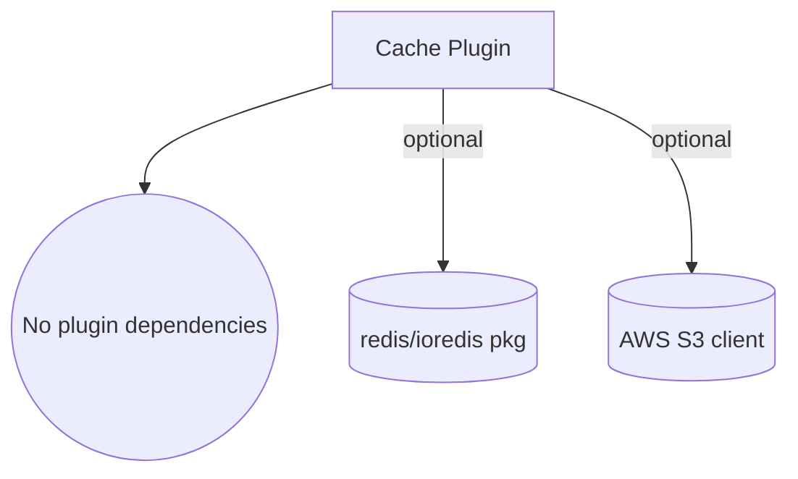

# ⚙️ Cache Configuration

> **In this guide:** Detailed configuration options for Memory, Redis, and S3 drivers.

**Navigation:** [← Back to Cache Plugin](/plugins/cache/README.md)

---

## 📊 Configuration Reference

### Core Options

| Parameter | Type | Default | Description |
|-----------|------|---------|-------------|
| `driver` | string | `'memory'` | Single-tier mode: Cache storage driver (`'memory'`, `'redis'`, or `'s3'`) |
| `drivers` | array | `undefined` | Multi-tier mode: Array of driver configs `[{ driver, ttl, config }, ...]` |
| `ttl` | number | `300000` | Time-to-live in milliseconds (5 minutes default) - single-tier mode only |
| `maxSize` | number | `1000` | Maximum number of cached items - single-tier mode only |
| `maxBytes` | number | `0` | Maximum cache size in bytes (0 = unlimited). Supported by memory and filesystem. Redis/S3 reject with error |
| `config` | object | `{}` | Driver-specific configuration options - single-tier mode only |

### Dependency Graph


```mermaid
flowchart TB
  Cache[Cache Plugin]
  Redis[(redis/ioredis pkg)]
  S3[(AWS S3 client)]
  Cache --> NoDeps((No plugin dependencies))
  Cache -- optional --> Redis
  Cache -- optional --> S3
```

The cache plugin ships without hard plugin dependencies. When you enable the Redis driver make sure `ioredis` is installed; the S3 driver reuses the database S3 client but also accepts a custom client via `config.client`. Each cache instance is fully namespaced—install multiple tiers by supplying `namespace` or an alias to `db.usePlugin()`.

---

## 🧠 Memory Driver Config

Best for development, single-process apps, and L1 caching.

| Parameter | Type | Default | Description |
|-----------|------|---------|-------------|
| `maxBytes` | number | `0` | Alias for `maxMemoryBytes`. Maximum memory in bytes (0 = unlimited) |
| `maxMemoryBytes` | number | `0` | Maximum memory in bytes (0 = unlimited). **Cannot be used with maxMemoryPercent** |
| `maxMemoryPercent` | number | `0` | Maximum memory as fraction 0...1 (e.g., 0.1 = 10%). **Cannot be used with maxMemoryBytes** |
| `evictionPolicy` | string | `'lru'` | Eviction strategy: `'lru'` (least recently used) or `'fifo'` |
| `enableStats` | boolean | `false` | Track hits/misses/evictions (use `driver.getStats()`) |
| `caseSensitive` | boolean | `true` | Treat keys as case-sensitive (`false` normalizes to lowercase) |
| `serializer` | function | `JSON.stringify` | Serialize values before storage |
| `deserializer` | function | `JSON.parse` | Deserialize values on read |
| `enableCompression` | boolean | `false` | Compress cached values with gzip |
| `compressionThreshold` | number | `1024` | Minimum size (bytes) to trigger compression |

Oversized payloads that exceed `maxMemoryBytes` are skipped, and the driver increments `evictedDueToMemory` so monitoring dashboards can spot workloads that need a larger ceiling (or compression).

---

## 📁 Filesystem Driver Config

Best for local caching, serverless, and single-server deployments.

| Parameter | Type | Default | Description |
|-----------|------|---------|-------------|
| `directory` | string | **required** | Cache directory path |
| `maxBytes` | number | `0` | Maximum total cache size in bytes (0 = unlimited). Evicts entries via LRU/FIFO when exceeded |
| `evictionPolicy` | string | `'lru'` | Eviction strategy: `'lru'` (least recently used) or `'fifo'` (first in, first out) |
| `ttl` | number | `3600000` | Time-to-live in milliseconds (1 hour default) |
| `maxFileSize` | number | `10485760` | Maximum single file size in bytes (10 MB default) |
| `enableCompression` | boolean | `true` | Compress cached values with gzip |
| `compressionThreshold` | number | `1024` | Minimum size (bytes) to trigger compression |
| `enableMetadata` | boolean | `true` | Store metadata files alongside cache entries |
| `enableStats` | boolean | `false` | Track hits/misses/evictions |

When `maxBytes` is configured, the driver maintains an in-memory size index and evicts entries when the total on-disk size exceeds the limit. The index is rebuilt from disk on initialization, so limits survive process restarts.

```javascript
new CachePlugin({
  driver: 'filesystem',
  config: {
    directory: './cache',
    maxBytes: 200 * 1024 * 1024, // 200 MB
    evictionPolicy: 'lru'
  }
})
```

---

## 🔴 Redis Driver Config

Best for production, shared caching, and L2 layers.

> **Note:** `maxBytes` is not supported for Redis. Use Redis server `maxmemory` and `maxmemory-policy` instead. Passing `maxBytes` throws an error.

| Parameter | Type | Default | Description |
|-----------|------|---------|-------------|
| `host` | string | `'localhost'` | Redis server host |
| `port` | number | `6379` | Redis server port |
| `password` | string | `undefined` | Redis authentication password |
| `db` | number | `0` | Redis database number (0-15) |
| `keyPrefix` | string | `'cache'` | Prefix for all Redis keys |
| `enableCompression` | boolean | `true` | Compress cached values with gzip |
| `compressionThreshold` | number | `1024` | Minimum size (bytes) to trigger compression |
| `connectTimeout` | number | `5000` | Connection timeout in milliseconds |
| `commandTimeout` | number | `5000` | Command execution timeout in milliseconds |
| `retryStrategy` | function | See docs | Custom retry logic for failed connections |

---

## ☁️ S3 Driver Config

Best for distributed systems, serverless, and L3 layers (unlimited size).

> **Note:** `maxBytes` is not supported for S3. Use S3 lifecycle rules for storage management. Passing `maxBytes` throws an error.

| Parameter | Type | Default | Description |
|-----------|------|---------|-------------|
| `keyPrefix` | string | `'cache'` | S3 key prefix for cache objects |
| `client` | object | DB client | Custom S3 client (uses database client by default) |

---

## Method Policies

Control caching behavior per method with `methodPolicies`. Each method can have its own TTL, payload size limit, and minimum hit count before caching.

### Configuration

```javascript
new CachePlugin({
  driver: 'memory',
  methodPolicies: {
    get: { ttlMs: 300000, maxPayloadBytes: 100000 },
    list: { ttlMs: 60000, minHitsBeforeStore: 3 },
    page: { ttlMs: 120000, maxPayloadBytes: 500000 },
    count: true,              // Use defaults (enabled)
    getAll: false,            // Disable caching for this method
    query: { enabled: true, ttlMs: 30000 }
  }
})
```

### Policy Options

| Option | Type | Default | Description |
|--------|------|---------|-------------|
| `enabled` | boolean | varies | Enable/disable caching for this method |
| `ttlMs` | number \| null | `null` | Per-method TTL override in milliseconds. `null` uses the global TTL |
| `maxPayloadBytes` | number \| null | `null` | Skip caching if serialized payload exceeds this size. `null` = no limit |
| `minHitsBeforeStore` | number | 1-2 | Minimum cache misses before storing (prevents caching one-off queries) |

### Cacheable Methods

| Method | Default Enabled | Default minHitsBeforeStore | Notes |
|--------|:-:|:-:|-------|
| `get` | yes | 2 | Single record lookup |
| `list` | yes | 1 | List with limit |
| `page` | yes | 1 | Paginated results |
| `count` | yes | 1 | Record count |
| `query` | yes | 1 | Filtered query |
| `listIds` | yes | 1 | ID-only listing |
| `getMany` | yes | 1 | Batch get |
| `getFromPartition` | yes | 1 | Partition lookup |
| `getAll` | no | 1 | Full scan (large payloads) |
| `exists` | no | 1 | Existence check |
| `content` | no | 1 | Binary content |
| `hasContent` | no | 1 | Content existence |

### Shorthand

Pass `true` or `false` instead of a policy object:

```javascript
methodPolicies: {
  count: true,    // Enable with defaults
  getAll: false   // Disable entirely
}
```

### Per-Method TTL

When `ttlMs` is set on a policy, cached values are wrapped in an envelope with a timestamp. On read, expired values are treated as cache misses even if the underlying driver hasn't evicted them yet.

```javascript
methodPolicies: {
  count: { ttlMs: 600000 },  // Cache counts for 10 minutes
  get: { ttlMs: 30000 },     // Cache individual records for 30 seconds
  page: { ttlMs: 120000 }    // Cache pages for 2 minutes
}
```

---

## See Also

- [Usage Patterns](/plugins/cache/guides/usage-patterns.md) - Examples of how to use these drivers
- [Best Practices](/plugins/cache/guides/best-practices.md) - Recommendations for tuning
