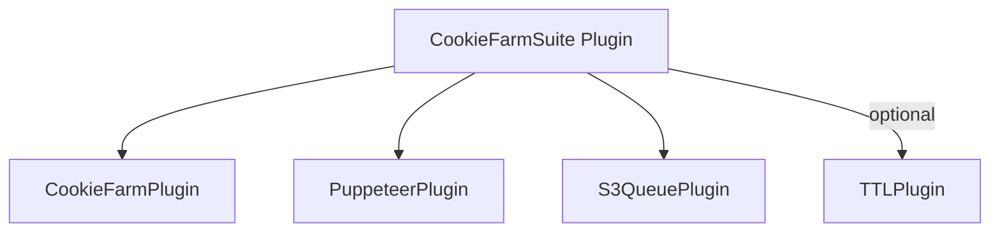

# 🍪 Cookie Farm Plugin

> **Persona farming pipeline combining Cookie Farm, Puppeteer, S3Queue, and optional TTL.**
>
> **Navigation:** [← Plugin Index](./README.md) | [Configuration ↓](#-configuration) | [FAQ ↓](#-faq)

---

Bundle that orchestrates **CookieFarmPlugin**, **PuppeteerPlugin**, **S3QueuePlugin**, and optional **TTL** under a single namespace for persona generation pipelines.

---

## ⚡ TLDR

```javascript
import { CookieFarmPlugin } from 's3db.js/plugins';
import { PluginError } from 's3db.js';

const suite = new CookieFarmPlugin({
  namespace: 'persona',
  queue: { autoStart: false },
  cookieFarm: {
    generation: { count: 0 },
    warmup: { enabled: false }
  }
});

await db.usePlugin(suite, 'persona-suite');

suite.setProcessor(async (job, context, { cookieFarm }) => {
  if (job.jobType === 'generate') {
    return { scheduled: true, count: job.payload?.count ?? 1 };
  }
  throw new PluginError('Unsupported job type for CookieFarm suite processor', {
    statusCode: 400,
    retriable: false,
    suggestion: `Accept one of: "generate", "warmup", "retire". Received "${job.jobType}".`,
    metadata: { jobType: job.jobType }
  });
});

await suite.enqueueJob({ jobType: 'generate', payload: { count: 5 } });
await suite.startProcessing();
```

**What’s bundled**

- ✅ Namespaced `PuppeteerPlugin` (pool disabled by default)
- ✅ Namespaced `CookieFarmPlugin` sharing the same namespace
- ✅ Queue resource `<namespace>_persona_jobs` with helpers (`enqueue`, `startProcessing`)
- ✅ Optional TTL wiring for the queue (`ttl.queue` settings)

---

## 🔧 Configuration

| Option | Type | Default | Description |
|--------|------|---------|-------------|
| `namespace` | string | `'persona'` | Shared namespace for all bundled plugins |
| `jobsResource` | string | `${namespace}_persona_jobs` | Source resource used by `S3QueuePlugin` |
| `queue.autoStart` | boolean | `false` | Automatically start workers when a processor exists |
| `cookieFarm` | object | `{}` | Options forwarded to `CookieFarmPlugin` |
| `puppeteer` | object | `{ pool: { enabled: false } }` | Options forwarded to `PuppeteerPlugin` |
| `ttl.queue.ttl` | number | `null` | Wires `TTLPlugin` to the queue resource when set |
| `processor(job, context, helpers)` | function | `null` | Queue handler; can be registered later via `setProcessor` |

**Helpers passed to the processor**

- `cookieFarm`: the bundled `CookieFarmPlugin`
- `puppeteer`: the namespaced `PuppeteerPlugin`
- `queue`: the `S3QueuePlugin` instance
- `enqueue(data, options)`: helper to push new jobs
- `resource`: direct handle to the jobs resource

### Dependency Graph



---

## 📬 Enqueuing Jobs

```javascript
await suite.enqueueJob({
  jobType: 'warmup',
  payload: { personaId: 'persona_123' },
  requestedBy: 'ops'
});

const stats = await suite.queuePlugin.getStats();
console.log(stats);
```

You decide how to interpret `jobType`/`payload`. A common pattern is:

- `generate` – trigger `cookieFarm.generatePersonas(count, options)`
- `warmup` – call `cookieFarm.warmupPersona(id)`
- `retire` – call `cookieFarm.retirePersona(id)`

---

## 🧩 API Helpers

| Method | Description |
|--------|-------------|
| `setProcessor(fn, { autoStart, concurrency })` | Register/replace the queue handler |
| `enqueueJob(data, options)` | Enqueue a persona job (wraps `resource.enqueue`) |
| `startProcessing(options)` | Starts bundled queue workers |
| `stopProcessing()` | Stops queue workers |

---

## 🚨 Error Handling

All bundled plugins surface `PluginError` subclasses with HTTP-style metadata. Always inspect `statusCode`, `retriable`, and `suggestion` before deciding to retry or dead-letter a job.

```javascript
try {
  await suite.enqueueJob({ jobType: 'warmup' });
} catch (error) {
  if (error.name === 'QueueError') {
    console.warn('Queue misconfiguration', {
      status: error.statusCode,
      retriable: error.retriable,
      suggestion: error.suggestion
    });
  } else if (error.name === 'CookieFarmError') {
    console.warn('Persona workflow rejected', error.toJson());
  } else if (error.name === 'BrowserPoolError') {
    console.warn('Puppeteer pool exhausted, will retry', {
      retriable: error.retriable,
      hint: error.hint
    });
  } else {
    throw error; // Bubble up unknown errors
  }
}
```

| Source | Status | Retriable? | Message | Suggestion |
|--------|--------|------------|---------|------------|
| `CookieFarmError` | 400 | `false` | `Warmup pipeline requires warmup.enabled=true` | Enable the warmup feature or change `jobType`. |
| `QueueError` | 409 | `true` | `Duplicate job detected` | Keep the default retry logic or adjust deduplication keys. |
| `QueueError` | 404 | `false` | `jobs resource persona_persona_jobs not found` | Provision the resource or adjust `jobsResource`. |
| `BrowserPoolError` | 503 | `true` | `No healthy proxies available` | Increase proxy pool size or relax proxy health thresholds. |

Call `error.toJson()` when sending telemetry—the payload already includes `suggestion`, `docs`, and `metadata` fields that operators can act on.

---

## 📚 Related Plugins

- [Cookie Farm Plugin](./cookie-farm.plugin.md) – Persona generation internals
- [Puppeteer Plugin](./puppeteer/README.md) – Browser automation utilities
- [S3 Queue Plugin](./s3-queue.md) – Queue infrastructure
- [TTL Plugin](./ttl.md) – Automatic cleanup support
