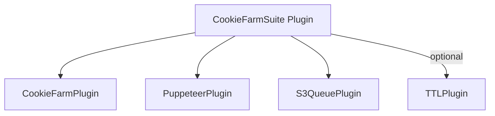

# 🍪 Cookie Farm Plugin

> **Persona farming pipeline combining Cookie Farm, Puppeteer, S3Queue, and optional TTL.**
>
> **Navigation:** [← Plugin Index](./README.md) | [Configuration ↓](#-configuration) | [FAQ ↓](#-faq)

---

Bundle that orchestrates **CookieFarmPlugin**, **PuppeteerPlugin**, **S3QueuePlugin**, and optional **TTL** under a single namespace for persona generation pipelines.

---

## 📦 Dependencies

**Required:**
```bash
pnpm install s3db.js
```

**Peer Dependencies (All Optional):**

CookieFarmSuite Plugin is a **bundle plugin** that orchestrates multiple plugins. Install peer dependencies based on what you need:

```bash
# Required for browser automation (CookieFarmPlugin + PuppeteerPlugin)
pnpm install puppeteer

# Optional: Proxy support (for distributed scraping)
pnpm install proxy-chain

# Optional: CAPTCHA solving (for automated workflows)
pnpm install 2captcha-api

# Optional: PostgreSQL replication (for backup/analytics)
pnpm install pg

# Optional: BigQuery replication (for analytics)
pnpm install @google-cloud/bigquery
```

**Why Peer Dependencies?**

- ✅ Keep core s3db.js lightweight (~500KB)
- ✅ Install only what you use (puppeteer ~300MB, captcha services optional)
- ✅ Lazy loading ensures missing dependencies don't break other features
- ✅ Flexible deployment (use proxies, CAPTCHA solvers only where needed)

**What's Included in s3db.js Core:**

The bundle plugin itself requires zero dependencies. It orchestrates these plugins:

- **CookieFarmPlugin**: Persona generation and lifecycle management (built-in)
- **PuppeteerPlugin**: Browser automation and pooling (requires `puppeteer` peer dep)
- **S3QueuePlugin**: Distributed queue with worker pool (built-in)
- **TTLPlugin**: Automatic cleanup of expired jobs (built-in)

**Architecture:**

CookieFarmSuite uses s3db.js core primitives:
- **Resources**: Queue resource (`<namespace>_persona_jobs`) auto-created
- **Plugins**: Namespaced plugin instances with shared configuration
- **Events**: Plugin events propagated for monitoring
- **Metadata**: Job status, retry count, visibility timeout stored in S3 metadata
- **Partitions**: Status-based partitions for O(1) pending job lookup

**Platform Support:**

✅ **Supported:**
- Node.js 18+ (all features)
- Docker containers (headless browser automation)
- AWS Lambda (with `/tmp` storage for browser cache)
- Kubernetes (with persistent volumes for browser cache)

❌ **NOT Supported:**
- Browser/Edge runtimes (requires Node.js APIs)
- Cloudflare Workers (no filesystem access for browser binaries)
- Vercel Edge Functions (no browser support)

**Browser Requirements:**

When using PuppeteerPlugin (default in CookieFarmSuite):
- Chromium ~500MB (downloaded automatically by puppeteer)
- Headless mode recommended for production
- Proxy support requires `proxy-chain` (~5MB)
- CAPTCHA solving requires API keys + `2captcha-api` (~1MB)

**Production Recommendations:**

```javascript
import { Database, CookieFarmPlugin, CachePlugin, AuditPlugin } from 's3db.js';

const db = new Database({
  connectionString: process.env.S3DB_CONNECTION
});

// 1. Add caching for persona lookups
await db.usePlugin(new CachePlugin({
  driver: 'memory',
  ttl: 3600000,  // 1 hour
  config: { maxMemoryPercent: 0.05 }
}));

// 2. Add audit trail for compliance
await db.usePlugin(new AuditPlugin({
  resource: 'audit_log',
  captureData: true
}));

// 3. Setup Cookie Farm Suite with monitoring
const suite = new CookieFarmPlugin({
  namespace: 'persona',
  queue: {
    autoStart: true,
    workers: 5,
    visibilityTimeout: 300000,  // 5 minutes
    deadLetterResource: 'persona_dlq'
  },
  puppeteer: {
    pool: {
      enabled: true,
      size: { min: 2, max: 10 },
      timeout: 120000
    },
    proxy: {
      enabled: true,
      rotationStrategy: 'round-robin'
    }
  },
  cookieFarm: {
    generation: {
      count: 100,
      batchSize: 10
    },
    warmup: {
      enabled: true,
      strategy: 'gradual',
      interval: 3600000  // 1 hour
    }
  },
  ttl: {
    queue: { ttl: 86400000 }  // 24 hours
  }
});

await db.usePlugin(suite);

// 4. Setup monitoring
suite.on('job.completed', ({ job, duration }) => {
  console.log(`✅ Job ${job.id} completed in ${duration}ms`);
});

suite.on('job.failed', ({ job, error }) => {
  console.error(`❌ Job ${job.id} failed:`, error.message);
});

await db.connect();
```

**Node.js Version:**

- **Minimum**: Node.js 18.x (for native fetch, AbortController)
- **Recommended**: Node.js 20.x LTS (better performance, stability)
- **Latest**: Node.js 22.x (cutting-edge features)

---

## ⚡ TLDR

**Unified persona generation pipeline** combining Cookie Farm, Puppeteer, S3Queue, and TTL plugins under a single namespace.

**1 line to get started:**
```javascript
const suite = new CookieFarmPlugin({ namespace: 'persona' });
await db.usePlugin(suite);
```

**Production-ready setup:**
```javascript
import { Database, CookieFarmPlugin } from 's3db.js';

const db = new Database({
  connectionString: 's3://key:secret@bucket/path?region=us-east-1'
});

const suite = new CookieFarmPlugin({
  namespace: 'persona',
  queue: {
    autoStart: true,           // Start workers automatically
    workers: 5,                 // 5 concurrent workers
    visibilityTimeout: 300000,  // 5 minutes
    deadLetterResource: 'persona_dlq'
  },
  cookieFarm: {
    generation: { count: 100, batchSize: 10 },
    warmup: { enabled: true, strategy: 'gradual' }
  },
  puppeteer: {
    pool: { enabled: true, size: { min: 2, max: 10 } }
  },
  ttl: {
    queue: { ttl: 86400000 }   // Auto-cleanup after 24 hours
  }
});

await db.usePlugin(suite);

// Set job processor
suite.setProcessor(async (job, context, { cookieFarm }) => {
  if (job.jobType === 'generate') {
    return await cookieFarm.generatePersonas(job.payload.count);
  }
  if (job.jobType === 'warmup') {
    return await cookieFarm.warmupPersona(job.payload.personaId);
  }
  throw new Error(`Unknown job type: ${job.jobType}`);
});

await db.connect();

// Enqueue jobs
await suite.enqueueJob({ jobType: 'generate', payload: { count: 5 } });
await suite.startProcessing();
```

**Key features:**
- ✅ **Unified Namespace** - All plugins share `<namespace>` for consistent resource naming
- ✅ **Queue Integration** - Built-in S3Queue with worker pool, DLQ, and retry logic
- ✅ **Browser Automation** - Puppeteer pool for concurrent persona generation
- ✅ **Automatic Cleanup** - TTL plugin for expired job removal
- ✅ **Event System** - Monitor job lifecycle (queued, processing, completed, failed)
- ✅ **Error Recovery** - Exponential backoff, dead letter queue, retriable errors
- ✅ **Zero Configuration** - Sensible defaults for rapid development

**What's bundled:**

| Plugin | Purpose | Configuration |
|--------|---------|---------------|
| **CookieFarmPlugin** | Persona generation and lifecycle | `options.cookieFarm` |
| **PuppeteerPlugin** | Browser automation and pooling | `options.puppeteer` |
| **S3QueuePlugin** | Distributed job queue | `options.queue` |
| **TTLPlugin** | Automatic job cleanup | `options.ttl` |

**Performance comparison:**

```javascript
// ❌ Without CookieFarmSuite (manual orchestration)
const cookieFarm = new CookieFarmPlugin({ namespace: 'cf' });
const puppeteer = new PuppeteerPlugin({ namespace: 'pup' });
const queue = new S3QueuePlugin({ resource: 'jobs' });
const ttl = new TTLPlugin({ resources: { jobs: { ttl: 86400000 } } });

await db.usePlugin(cookieFarm);
await db.usePlugin(puppeteer);
await db.usePlugin(queue);
await db.usePlugin(ttl);

// Manual job processing logic...
// 50+ lines of boilerplate

// ✅ With CookieFarmSuite (10 lines)
const suite = new CookieFarmPlugin({
  namespace: 'persona',
  queue: { autoStart: true },
  ttl: { queue: { ttl: 86400000 } }
});
await db.usePlugin(suite);
suite.setProcessor(processJob);
await suite.startProcessing();
```

---

## 📑 Table of Contents

1. [📦 Dependencies](#-dependencies)
2. [⚡ TLDR](#-tldr)
3. [⚡ Quickstart](#-quickstart)
4. [🎯 Usage Patterns](#-usage-patterns)
   - [Pattern 1: Basic Persona Generation](#pattern-1-basic-persona-generation)
   - [Pattern 2: Queue-Based Processing](#pattern-2-queue-based-processing)
   - [Pattern 3: Production Pipeline](#pattern-3-production-pipeline)
   - [Pattern 4: Multi-Stage Workflows](#pattern-4-multi-stage-workflows)
   - [Pattern 5: Error Recovery](#pattern-5-error-recovery)
5. [📊 Configuration Reference](#-configuration-reference)
6. [📚 Configuration Examples](#-configuration-examples)
7. [🔧 API Reference](#-api-reference)
8. [✅ Best Practices](#-best-practices)
9. [🚨 Error Handling](#-error-handling)
10. [🔍 Troubleshooting](#-troubleshooting)
11. [🔗 See Also](#-see-also)
12. [❓ FAQ](#-faq)

---

## ⚡ Quickstart

```javascript
import { Database, CookieFarmPlugin } from 's3db.js';

// Step 1: Create database connection
const db = new Database({
  connectionString: 's3://KEY:SECRET@bucket/path?region=us-east-1'
});

// Step 2: Create and configure suite
const suite = new CookieFarmPlugin({
  namespace: 'persona',              // All resources prefixed with 'persona_'
  queue: {
    autoStart: false,                 // Don't start workers yet
    workers: 3,                       // 3 concurrent workers
    visibilityTimeout: 300000,        // 5 minutes per job
    deadLetterResource: 'persona_dlq' // Failed job storage
  },
  cookieFarm: {
    generation: {
      count: 50,                      // Generate 50 personas per batch
      batchSize: 5                    // 5 personas per S3 operation
    },
    warmup: {
      enabled: true,                  // Enable warmup feature
      strategy: 'gradual',            // Gradual warmup strategy
      interval: 3600000               // Check every hour
    }
  },
  puppeteer: {
    pool: {
      enabled: true,                  // Enable browser pooling
      size: { min: 2, max: 5 },      // 2-5 concurrent browsers
      timeout: 120000                 // 2 minute timeout
    }
  },
  ttl: {
    queue: { ttl: 86400000 }         // Auto-cleanup jobs after 24 hours
  }
});

// Step 3: Register plugin and connect
await db.usePlugin(suite, 'persona-suite');
await db.connect();

// Step 4: Define job processor
suite.setProcessor(async (job, context, helpers) => {
  const { cookieFarm, puppeteer, enqueue } = helpers;

  console.log(`Processing job: ${job.jobType}`, job.payload);

  // Handle different job types
  if (job.jobType === 'generate') {
    const count = job.payload?.count || 1;
    const result = await cookieFarm.generatePersonas(count, {
      strategy: job.payload?.strategy || 'standard'
    });
    console.log(`✅ Generated ${result.personas.length} personas`);
    return result;
  }

  if (job.jobType === 'warmup') {
    const personaId = job.payload?.personaId;
    if (!personaId) {
      throw new Error('personaId required for warmup jobs');
    }
    const result = await cookieFarm.warmupPersona(personaId);
    console.log(`✅ Warmed up persona ${personaId}`);
    return result;
  }

  if (job.jobType === 'retire') {
    const personaId = job.payload?.personaId;
    if (!personaId) {
      throw new Error('personaId required for retire jobs');
    }
    await cookieFarm.retirePersona(personaId);
    console.log(`✅ Retired persona ${personaId}`);
    return { retired: true, personaId };
  }

  throw new Error(`Unknown job type: ${job.jobType}`);
});

// Step 5: Enqueue jobs
await suite.enqueueJob({
  jobType: 'generate',
  payload: { count: 10, strategy: 'diverse' },
  requestedBy: 'admin'
});

console.log('Job enqueued! Starting workers...');

// Step 6: Start processing
await suite.startProcessing();

// Step 7: Monitor queue stats
setInterval(async () => {
  const stats = await suite.queuePlugin.getStats();
  console.log('Queue Stats:', {
    pending: stats.pending,
    processing: stats.processing,
    completed: stats.completed,
    failed: stats.failed
  });
}, 10000); // Every 10 seconds

// Step 8: Graceful shutdown
process.on('SIGINT', async () => {
  console.log('Shutting down...');
  await suite.stopProcessing();
  await db.disconnect();
  process.exit(0);
});
```

**What just happened?**

1. **Created suite**: Bundled 4 plugins (CookieFarm, Puppeteer, S3Queue, TTL) under `persona` namespace
2. **Defined processor**: Handler for 3 job types (generate, warmup, retire)
3. **Enqueued job**: Added "generate 10 personas" job to queue
4. **Started workers**: 3 concurrent workers process jobs from queue
5. **Monitoring**: Track queue stats every 10 seconds
6. **Graceful shutdown**: Stop workers cleanly on SIGINT

---

## 🎯 Usage Patterns

### Pattern 1: Basic Persona Generation

**Use Case**: Generate personas on-demand without queue orchestration.

```javascript
import { Database, CookieFarmPlugin } from 's3db.js';

const db = new Database({
  connectionString: process.env.S3DB_CONNECTION
});

// Minimal configuration - queue disabled
const suite = new CookieFarmPlugin({
  namespace: 'persona',
  queue: { autoStart: false },  // No automatic queue processing
  cookieFarm: {
    generation: { count: 0 },    // No auto-generation
    warmup: { enabled: false }   // No warmup
  },
  puppeteer: {
    pool: { enabled: false }     // Single browser instance
  }
});

await db.usePlugin(suite);
await db.connect();

// Direct persona generation (bypass queue)
const result = await suite.cookieFarmPlugin.generatePersonas(5, {
  strategy: 'diverse',
  proxyRotation: true
});

console.log(`Generated ${result.personas.length} personas`);
console.log('Personas:', result.personas.map(p => ({ id: p.id, email: p.email })));

await db.disconnect();
```

**When to use:**
- ✅ Simple, synchronous persona generation
- ✅ Testing and development
- ✅ Small-scale operations (<100 personas)
- ❌ NOT for high-volume production (no queue, no retry, no DLQ)

---

### Pattern 2: Queue-Based Processing

**Use Case**: Asynchronous job processing with retry logic and error recovery.

```javascript
import { Database, CookieFarmPlugin } from 's3db.js';

const db = new Database({
  connectionString: process.env.S3DB_CONNECTION
});

const suite = new CookieFarmPlugin({
  namespace: 'persona',
  queue: {
    autoStart: true,                  // Start workers immediately
    workers: 5,                       // 5 concurrent workers
    visibilityTimeout: 300000,        // 5 minutes per job
    maxRetries: 3,                    // Retry failed jobs 3 times
    deadLetterResource: 'persona_dlq' // DLQ for persistent failures
  },
  cookieFarm: {
    generation: { count: 100, batchSize: 10 }
  },
  ttl: {
    queue: { ttl: 86400000 }         // Auto-cleanup after 24 hours
  }
});

await db.usePlugin(suite);
await db.connect();

// Define processor with error handling
suite.setProcessor(async (job, context, { cookieFarm }) => {
  try {
    const result = await cookieFarm.generatePersonas(job.payload.count);
    return { success: true, count: result.personas.length };
  } catch (error) {
    console.error(`Job ${job.id} failed:`, error.message);
    throw error; // Queue will retry based on maxRetries
  }
});

// Enqueue multiple jobs
for (let i = 0; i < 10; i++) {
  await suite.enqueueJob({
    jobType: 'generate',
    payload: { count: 10, batch: i + 1 }
  });
}

console.log('Enqueued 10 jobs. Workers processing...');

// Monitor progress
suite.on('job.completed', ({ job, result, duration }) => {
  console.log(`✅ Job ${job.id} completed in ${duration}ms`, result);
});

suite.on('job.failed', ({ job, error, attempts }) => {
  console.error(`❌ Job ${job.id} failed (attempt ${attempts}):`, error.message);
});

suite.on('job.dead_letter', ({ job, error }) => {
  console.error(`💀 Job ${job.id} moved to DLQ after max retries:`, error.message);
});
```

**When to use:**
- ✅ High-volume persona generation
- ✅ Production environments requiring reliability
- ✅ Workloads requiring retry logic
- ✅ Distributed systems with multiple workers

---

### Pattern 3: Production Pipeline

**Use Case**: Full-featured production pipeline with monitoring, caching, and audit trail.

```javascript
import {
  Database,
  CookieFarmPlugin,
  CachePlugin,
  AuditPlugin,
  MetricsPlugin
} from 's3db.js';

const db = new Database({
  connectionString: process.env.S3DB_CONNECTION
});

// 1. Add caching for persona lookups
await db.usePlugin(new CachePlugin({
  driver: 'memory',
  ttl: 3600000,  // 1 hour
  config: {
    maxMemoryPercent: 0.1,  // 10% of system memory
    enableCompression: true
  }
}));

// 2. Add audit trail for compliance
await db.usePlugin(new AuditPlugin({
  resource: 'audit_log',
  captureData: true,
  events: ['insert', 'update', 'delete']
}));

// 3. Add metrics for monitoring
await db.usePlugin(new MetricsPlugin({
  resource: 'metrics',
  interval: 60000,  // Collect metrics every minute
  aggregations: ['count', 'avg', 'p95', 'p99']
}));

// 4. Setup Cookie Farm Suite
const suite = new CookieFarmPlugin({
  namespace: 'persona',
  queue: {
    autoStart: true,
    workers: 10,
    visibilityTimeout: 300000,
    maxRetries: 3,
    deadLetterResource: 'persona_dlq',
    deduplicationWindow: 600000  // 10 minutes
  },
  cookieFarm: {
    generation: {
      count: 100,
      batchSize: 10,
      strategy: 'diverse'
    },
    warmup: {
      enabled: true,
      strategy: 'gradual',
      interval: 3600000,
      minAge: 86400000  // Warmup after 24 hours
    },
    retirement: {
      enabled: true,
      maxAge: 2592000000  // Retire after 30 days
    }
  },
  puppeteer: {
    pool: {
      enabled: true,
      size: { min: 5, max: 20 },
      timeout: 120000,
      warmup: true
    },
    proxy: {
      enabled: true,
      providers: ['brightdata', 'oxylabs'],
      rotationStrategy: 'round-robin',
      healthCheck: true
    },
    captcha: {
      enabled: true,
      provider: '2captcha',
      apiKey: process.env.CAPTCHA_API_KEY
    }
  },
  ttl: {
    queue: { ttl: 86400000 },        // Jobs: 24 hours
    personas: { ttl: 2592000000 }    // Personas: 30 days
  }
});

await db.usePlugin(suite);
await db.connect();

// Define processor with comprehensive error handling
suite.setProcessor(async (job, context, helpers) => {
  const { cookieFarm, puppeteer, enqueue } = helpers;
  const startTime = Date.now();

  try {
    let result;

    switch (job.jobType) {
      case 'generate':
        result = await cookieFarm.generatePersonas(job.payload.count, {
          strategy: job.payload.strategy || 'diverse',
          proxyRotation: true,
          solveCaptcha: true
        });

        // Enqueue warmup jobs for new personas
        for (const persona of result.personas) {
          await enqueue({
            jobType: 'warmup',
            payload: { personaId: persona.id },
            delayMs: 86400000  // Warmup after 24 hours
          });
        }
        break;

      case 'warmup':
        result = await cookieFarm.warmupPersona(job.payload.personaId, {
          sites: job.payload.sites || ['google', 'facebook', 'twitter'],
          interactions: job.payload.interactions || 10
        });
        break;

      case 'retire':
        result = await cookieFarm.retirePersona(job.payload.personaId);
        break;

      default:
        throw new Error(`Unknown job type: ${job.jobType}`);
    }

    const duration = Date.now() - startTime;
    console.log(`✅ Job ${job.id} completed in ${duration}ms`);

    return { success: true, duration, ...result };

  } catch (error) {
    const duration = Date.now() - startTime;
    console.error(`❌ Job ${job.id} failed after ${duration}ms:`, error.message);

    // Determine if error is retriable
    if (error.name === 'BrowserPoolError' || error.name === 'ProxyError') {
      // Retriable errors (pool exhaustion, proxy issues)
      error.retriable = true;
    } else if (error.name === 'CaptchaError') {
      // Non-retriable errors (CAPTCHA API failure)
      error.retriable = false;
    }

    throw error;
  }
});

// Advanced monitoring
suite.on('job.completed', ({ job, result, duration }) => {
  console.log(`✅ [${job.jobType}] Job ${job.id} completed`, {
    duration,
    payload: job.payload,
    result: result
  });

  // Track metrics
  db.metrics.increment('jobs.completed', 1, {
    tags: { jobType: job.jobType }
  });
  db.metrics.histogram('jobs.duration', duration, {
    tags: { jobType: job.jobType }
  });
});

suite.on('job.failed', ({ job, error, attempts }) => {
  console.error(`❌ [${job.jobType}] Job ${job.id} failed (attempt ${attempts}/${job.maxRetries})`, {
    error: error.message,
    retriable: error.retriable,
    payload: job.payload
  });

  db.metrics.increment('jobs.failed', 1, {
    tags: { jobType: job.jobType, errorType: error.name }
  });
});

suite.on('job.dead_letter', ({ job, error }) => {
  console.error(`💀 [${job.jobType}] Job ${job.id} moved to DLQ`, {
    error: error.message,
    payload: job.payload,
    attempts: job.retryCount
  });

  db.metrics.increment('jobs.dead_letter', 1, {
    tags: { jobType: job.jobType }
  });

  // Alert operations team
  sendAlert({
    level: 'error',
    message: `Job ${job.id} failed permanently`,
    job: job,
    error: error
  });
});

// Health check endpoint (for load balancers)
setInterval(async () => {
  const stats = await suite.queuePlugin.getStats();
  const health = {
    status: 'healthy',
    queue: stats,
    browserPool: await suite.puppeteerPlugin.pool.getStats(),
    timestamp: new Date().toISOString()
  };

  // Expose health via HTTP endpoint or log
  console.log('Health:', JSON.stringify(health));
}, 30000); // Every 30 seconds

// Graceful shutdown
process.on('SIGTERM', async () => {
  console.log('Received SIGTERM, shutting down gracefully...');
  await suite.stopProcessing({ timeout: 30000 });  // Wait up to 30s for jobs to finish
  await db.disconnect();
  process.exit(0);
});
```

**When to use:**
- ✅ Production environments
- ✅ High-scale operations (1000+ personas/day)
- ✅ Compliance requirements (audit trail)
- ✅ Monitoring and alerting infrastructure
- ✅ Multi-stage workflows (generate → warmup → retire)

---

### Pattern 4: Multi-Stage Workflows

**Use Case**: Complex persona lifecycle with dependencies between stages.

```javascript
import { Database, CookieFarmPlugin } from 's3db.js';

const db = new Database({
  connectionString: process.env.S3DB_CONNECTION
});

const suite = new CookieFarmPlugin({
  namespace: 'persona',
  queue: { autoStart: true, workers: 5 }
});

await db.usePlugin(suite);
await db.connect();

// Multi-stage processor with state transitions
suite.setProcessor(async (job, context, { cookieFarm, enqueue }) => {
  const stage = job.payload.stage || 'generate';

  switch (stage) {
    case 'generate':
      // Stage 1: Generate personas
      const personas = await cookieFarm.generatePersonas(job.payload.count);

      // Enqueue Stage 2 jobs for each persona
      for (const persona of personas.personas) {
        await enqueue({
          jobType: 'verify',
          payload: { stage: 'verify', personaId: persona.id }
        });
      }

      return { stage: 'generate', count: personas.personas.length };

    case 'verify':
      // Stage 2: Verify persona (email, phone, etc.)
      const personaId = job.payload.personaId;
      await cookieFarm.verifyPersona(personaId);

      // Enqueue Stage 3 job
      await enqueue({
        jobType: 'warmup',
        payload: { stage: 'warmup', personaId },
        delayMs: 3600000  // Warmup after 1 hour
      });

      return { stage: 'verify', personaId };

    case 'warmup':
      // Stage 3: Warmup persona on target sites
      await cookieFarm.warmupPersona(job.payload.personaId, {
        sites: ['google', 'facebook', 'amazon'],
        interactions: 20
      });

      // Enqueue Stage 4 job
      await enqueue({
        jobType: 'monitor',
        payload: { stage: 'monitor', personaId: job.payload.personaId },
        delayMs: 86400000  // Monitor after 24 hours
      });

      return { stage: 'warmup', personaId: job.payload.personaId };

    case 'monitor':
      // Stage 4: Monitor persona health
      const health = await cookieFarm.checkPersonaHealth(job.payload.personaId);

      if (!health.healthy) {
        // Re-warmup if unhealthy
        await enqueue({
          jobType: 'warmup',
          payload: { stage: 'warmup', personaId: job.payload.personaId }
        });
      } else {
        // Schedule next health check
        await enqueue({
          jobType: 'monitor',
          payload: { stage: 'monitor', personaId: job.payload.personaId },
          delayMs: 86400000  // Check again in 24 hours
        });
      }

      return { stage: 'monitor', personaId: job.payload.personaId, health };

    default:
      throw new Error(`Unknown stage: ${stage}`);
  }
});

// Start pipeline by generating 10 personas
await suite.enqueueJob({
  jobType: 'generate',
  payload: { stage: 'generate', count: 10 }
});

console.log('Multi-stage pipeline started!');
```

**Pipeline flow:**
```
Generate (10 personas)
  → Verify (10 jobs, parallel)
    → Warmup (10 jobs, delayed 1 hour)
      → Monitor (10 jobs, delayed 24 hours)
        → Re-warmup (if unhealthy) OR Schedule next check
```

**When to use:**
- ✅ Complex workflows with dependencies
- ✅ Delayed job execution
- ✅ Conditional branching (health checks, retries)
- ✅ Long-running processes (days/weeks)

---

### Pattern 5: Error Recovery

**Use Case**: Robust error handling with custom retry strategies and DLQ processing.

```javascript
import { Database, CookieFarmPlugin } from 's3db.js';

const db = new Database({
  connectionString: process.env.S3DB_CONNECTION
});

const suite = new CookieFarmPlugin({
  namespace: 'persona',
  queue: {
    autoStart: true,
    workers: 5,
    visibilityTimeout: 300000,
    maxRetries: 5,  // Retry up to 5 times
    deadLetterResource: 'persona_dlq',
    retryStrategy: 'exponential'  // 2s → 4s → 8s → 16s → 32s
  }
});

await db.usePlugin(suite);
await db.connect();

// Processor with granular error handling
suite.setProcessor(async (job, context, { cookieFarm }) => {
  try {
    return await cookieFarm.generatePersonas(job.payload.count);

  } catch (error) {
    // Classify error type
    if (error.name === 'RateLimitError') {
      // Retriable: wait for rate limit to reset
      console.warn(`Rate limit hit for job ${job.id}, will retry`);
      error.retriable = true;
      error.retryDelayMs = error.retryAfter || 60000;  // Custom retry delay
      throw error;

    } else if (error.name === 'ProxyError') {
      // Retriable: proxy rotation needed
      console.warn(`Proxy error for job ${job.id}, rotating proxy`);
      error.retriable = true;
      throw error;

    } else if (error.name === 'CaptchaError') {
      // Non-retriable: CAPTCHA API failure
      console.error(`CAPTCHA API failure for job ${job.id}, moving to DLQ`);
      error.retriable = false;
      throw error;

    } else if (error.name === 'ValidationError') {
      // Non-retriable: invalid job payload
      console.error(`Invalid payload for job ${job.id}:`, error.message);
      error.retriable = false;
      throw error;

    } else {
      // Unknown error: retry with caution
      console.error(`Unknown error for job ${job.id}:`, error);
      error.retriable = true;
      throw error;
    }
  }
});

// DLQ processor: handle permanently failed jobs
const dlqResource = await db.getResource('persona_dlq');

setInterval(async () => {
  const failedJobs = await dlqResource.query({ status: 'failed' }, { limit: 100 });

  for (const job of failedJobs.items) {
    console.log(`Processing DLQ job ${job.id}:`, {
      jobType: job.data.jobType,
      payload: job.data.payload,
      error: job.data.error,
      attempts: job.data.retryCount
    });

    // Analyze failure reason
    if (job.data.error?.name === 'CaptchaError') {
      // Alert: CAPTCHA API may be down
      sendAlert({
        level: 'critical',
        message: 'CAPTCHA API failures detected',
        count: failedJobs.items.filter(j => j.data.error?.name === 'CaptchaError').length
      });
    }

    // Optionally: Manual retry with modified payload
    if (shouldRetryManually(job)) {
      await suite.enqueueJob({
        ...job.data,
        payload: { ...job.data.payload, manualRetry: true }
      });
      await dlqResource.delete(job.id);
    }
  }
}, 300000); // Check DLQ every 5 minutes

// Custom retry logic
function shouldRetryManually(job) {
  // Retry if:
  // 1. Error was retriable but max retries exceeded
  // 2. Job is less than 24 hours old
  // 3. Payload is still valid
  const age = Date.now() - new Date(job.createdAt).getTime();
  return (
    job.data.error?.retriable &&
    age < 86400000 &&
    validatePayload(job.data.payload)
  );
}
```

**Error handling strategy:**

| Error Type | Retriable? | Action | Retry Delay |
|------------|-----------|--------|-------------|
| `RateLimitError` | ✅ Yes | Wait for rate limit reset | Custom (from API response) |
| `ProxyError` | ✅ Yes | Rotate proxy, retry | Exponential backoff |
| `CaptchaError` | ❌ No | Move to DLQ, alert | N/A |
| `ValidationError` | ❌ No | Move to DLQ | N/A |
| `BrowserPoolError` | ✅ Yes | Wait for browser availability | Exponential backoff |
| Unknown | ✅ Yes (cautious) | Retry with backoff | Exponential backoff |

**When to use:**
- ✅ External API dependencies (rate limits, failures)
- ✅ Resource contention (browser pool exhaustion)
- ✅ Unreliable infrastructure (proxies, network)
- ✅ Manual intervention required for some failures

---

## 📊 Configuration Reference

| Option | Type | Default | Description |
|--------|------|---------|-------------|
| `namespace` | string | `'persona'` | Shared namespace for all bundled plugins |
| `jobsResource` | string | `${namespace}_persona_jobs` | Source resource used by `S3QueuePlugin` |
| `queue.autoStart` | boolean | `false` | Automatically start workers when a processor exists |
| `cookieFarm` | object | `{}` | Options forwarded to `CookieFarmPlugin` |
| `puppeteer` | object | `{ pool: { enabled: false } }` | Options forwarded to `PuppeteerPlugin` |
| `ttl.queue.ttl` | number | `null` | Wires `TTLPlugin` to the queue resource when set |
| `processor(job, context, helpers)` | function | `null` | Queue handler; can be registered later via `setProcessor` |

**Helpers passed to the processor**

- `cookieFarm`: the bundled `CookieFarmPlugin`
- `puppeteer`: the namespaced `PuppeteerPlugin`
- `queue`: the `S3QueuePlugin` instance
- `enqueue(data, options)`: helper to push new jobs
- `resource`: direct handle to the jobs resource

### Dependency Graph



---

## 📚 Configuration Examples

### Example 1: Development Setup (Minimal)

```javascript
const suite = new CookieFarmPlugin({
  namespace: 'dev_persona',
  queue: {
    autoStart: false,        // Manual start
    workers: 1               // Single worker
  },
  cookieFarm: {
    generation: { count: 0 }, // No auto-generation
    warmup: { enabled: false }
  },
  puppeteer: {
    pool: { enabled: false }  // Single browser
  }
});
```

---

### Example 2: Testing Environment

```javascript
const suite = new CookieFarmPlugin({
  namespace: 'test_persona',
  queue: {
    autoStart: true,
    workers: 2,
    visibilityTimeout: 60000  // 1 minute
  },
  cookieFarm: {
    generation: { count: 10, batchSize: 5 }
  },
  puppeteer: {
    pool: {
      enabled: true,
      size: { min: 1, max: 3 }
    }
  },
  ttl: {
    queue: { ttl: 3600000 }  // 1 hour cleanup
  }
});
```

---

### Example 3: Staging Environment

```javascript
const suite = new CookieFarmPlugin({
  namespace: 'stg_persona',
  queue: {
    autoStart: true,
    workers: 5,
    visibilityTimeout: 180000,    // 3 minutes
    maxRetries: 2,
    deadLetterResource: 'stg_persona_dlq'
  },
  cookieFarm: {
    generation: { count: 50, batchSize: 10 },
    warmup: {
      enabled: true,
      strategy: 'gradual',
      interval: 1800000  // 30 minutes
    }
  },
  puppeteer: {
    pool: {
      enabled: true,
      size: { min: 2, max: 8 },
      timeout: 120000
    },
    proxy: {
      enabled: true,
      rotationStrategy: 'round-robin'
    }
  },
  ttl: {
    queue: { ttl: 43200000 }  // 12 hours
  }
});
```

---

### Example 4: Production Environment (High Scale)

```javascript
const suite = new CookieFarmPlugin({
  namespace: 'prod_persona',
  queue: {
    autoStart: true,
    workers: 20,                      // High concurrency
    visibilityTimeout: 300000,        // 5 minutes
    maxRetries: 5,
    deadLetterResource: 'prod_persona_dlq',
    deduplicationWindow: 600000,      // 10 minutes
    retryStrategy: 'exponential'
  },
  cookieFarm: {
    generation: {
      count: 100,
      batchSize: 10,
      strategy: 'diverse'
    },
    warmup: {
      enabled: true,
      strategy: 'gradual',
      interval: 3600000,              // 1 hour
      minAge: 86400000                // Warmup after 24 hours
    },
    retirement: {
      enabled: true,
      maxAge: 2592000000              // Retire after 30 days
    }
  },
  puppeteer: {
    pool: {
      enabled: true,
      size: { min: 10, max: 50 },
      timeout: 120000,
      warmup: true
    },
    proxy: {
      enabled: true,
      providers: ['brightdata', 'oxylabs', 'smartproxy'],
      rotationStrategy: 'least-used',
      healthCheck: true,
      healthCheckInterval: 300000     // 5 minutes
    },
    captcha: {
      enabled: true,
      provider: '2captcha',
      apiKey: process.env.CAPTCHA_API_KEY,
      timeout: 60000
    }
  },
  ttl: {
    queue: { ttl: 86400000 },         // Jobs: 24 hours
    personas: { ttl: 2592000000 }     // Personas: 30 days
  }
});
```

---

### Example 5: Multi-Region Deployment

```javascript
// Region-specific namespace
const region = process.env.AWS_REGION || 'us-east-1';
const suite = new CookieFarmPlugin({
  namespace: `${region}_persona`,
  queue: {
    autoStart: true,
    workers: 10,
    visibilityTimeout: 300000
  },
  cookieFarm: {
    generation: { count: 100, batchSize: 10 }
  },
  puppeteer: {
    pool: {
      enabled: true,
      size: { min: 5, max: 20 }
    },
    proxy: {
      enabled: true,
      region: region  // Use region-specific proxies
    }
  }
});
```

---

### Example 6: CAPTCHA-Heavy Workloads

```javascript
const suite = new CookieFarmPlugin({
  namespace: 'captcha_persona',
  queue: {
    autoStart: true,
    workers: 5,  // Lower concurrency to avoid CAPTCHA rate limits
    visibilityTimeout: 600000,  // 10 minutes (CAPTCHA solving takes time)
    maxRetries: 3
  },
  cookieFarm: {
    generation: { count: 20, batchSize: 5 }
  },
  puppeteer: {
    pool: {
      enabled: true,
      size: { min: 2, max: 10 }
    },
    captcha: {
      enabled: true,
      provider: '2captcha',
      apiKey: process.env.CAPTCHA_API_KEY,
      timeout: 120000,  // 2 minutes per CAPTCHA
      maxRetries: 2
    }
  }
});
```

---

### Example 7: Cost-Optimized Setup

```javascript
const suite = new CookieFarmPlugin({
  namespace: 'budget_persona',
  queue: {
    autoStart: true,
    workers: 2,  // Minimal workers
    visibilityTimeout: 300000
  },
  cookieFarm: {
    generation: { count: 10, batchSize: 5 }  // Small batches
  },
  puppeteer: {
    pool: {
      enabled: false  // No pooling overhead
    },
    proxy: {
      enabled: false  // No proxy costs
    },
    captcha: {
      enabled: false  // No CAPTCHA API costs
    }
  },
  ttl: {
    queue: { ttl: 3600000 },  // Aggressive cleanup (1 hour)
    personas: { ttl: 604800000 }  // 7 days retention
  }
});
```

---

### Example 8: Compliance/Audit Mode

```javascript
const suite = new CookieFarmPlugin({
  namespace: 'audit_persona',
  queue: {
    autoStart: true,
    workers: 5,
    visibilityTimeout: 300000,
    captureJobData: true  // Store full job payloads for audit
  },
  cookieFarm: {
    generation: { count: 50, batchSize: 10 },
    audit: {
      enabled: true,
      resource: 'persona_audit_log',
      captureData: true
    }
  },
  puppeteer: {
    pool: { enabled: true, size: { min: 2, max: 10 } },
    logging: {
      enabled: true,
      level: 'verbose'  // Detailed logs for compliance
    }
  },
  ttl: {
    queue: { ttl: null },  // Never auto-delete (manual cleanup)
    personas: { ttl: null }
  }
});
```

---

## 🔧 API Reference

### Plugin Methods

#### `setProcessor(processorFn, options?): void`

Register or replace the job processor function.

**Parameters:**
- `processorFn` (function, required): Async function `(job, context, helpers) => result`
  - `job`: Job object `{ id, jobType, payload, retryCount, ... }`
  - `context`: Execution context `{ db, resource, queuePlugin }`
  - `helpers`: Helper object `{ cookieFarm, puppeteer, queue, enqueue, resource }`
- `options` (object, optional):
  - `autoStart` (boolean, default: `false`): Start workers immediately after setting processor
  - `concurrency` (number, optional): Override queue workers count

**Example:**
```javascript
suite.setProcessor(async (job, context, { cookieFarm }) => {
  if (job.jobType === 'generate') {
    return await cookieFarm.generatePersonas(job.payload.count);
  }
  throw new Error(`Unknown job type: ${job.jobType}`);
}, { autoStart: true });
```

---

#### `enqueueJob(data, options?): Promise<object>`

Enqueue a new job for processing.

**Parameters:**
- `data` (object, required): Job data
  - `jobType` (string, required): Job type identifier
  - `payload` (object, optional): Job payload (custom data)
  - `requestedBy` (string, optional): Requester identifier
- `options` (object, optional):
  - `delayMs` (number, default: `0`): Delay before job becomes available
  - `priority` (number, default: `0`): Job priority (higher = processed first)
  - `deduplicationKey` (string, optional): Custom deduplication key

**Returns:** `Promise<{ id, status, enqueuedAt }>` - Job metadata

**Example:**
```javascript
const job = await suite.enqueueJob({
  jobType: 'generate',
  payload: { count: 10, strategy: 'diverse' },
  requestedBy: 'admin'
}, {
  delayMs: 60000,  // Start after 1 minute
  priority: 10
});

console.log(`Job ${job.id} enqueued`);
```

**Throws:**
- `QueueError` - Queue not initialized or resource not found
- `ValidationError` - Invalid job data

---

#### `startProcessing(options?): Promise<void>`

Start queue workers to process jobs.

**Parameters:**
- `options` (object, optional):
  - `workers` (number, optional): Override configured worker count
  - `timeout` (number, optional): Override visibility timeout

**Example:**
```javascript
await suite.startProcessing({ workers: 10 });
console.log('Workers started!');
```

**Throws:**
- `QueueError` - No processor set or workers already running

---

#### `stopProcessing(options?): Promise<void>`

Stop queue workers gracefully.

**Parameters:**
- `options` (object, optional):
  - `timeout` (number, default: `30000`): Max time to wait for jobs to complete (ms)
  - `force` (boolean, default: `false`): Force-stop workers immediately

**Example:**
```javascript
// Graceful shutdown
await suite.stopProcessing({ timeout: 60000 });

// Force stop
await suite.stopProcessing({ force: true });
```

---

### Plugin Properties

| Property | Type | Description |
|----------|------|-------------|
| `cookieFarmPlugin` | `CookieFarmPlugin` | Direct access to Cookie Farm plugin |
| `puppeteerPlugin` | `PuppeteerPlugin` | Direct access to Puppeteer plugin |
| `queuePlugin` | `S3QueuePlugin` | Direct access to S3Queue plugin |
| `ttlPlugin` | `TTLPlugin \| null` | Direct access to TTL plugin (if configured) |
| `namespace` | `string` | Configured namespace |
| `jobsResource` | `string` | Jobs resource name |

**Example:**
```javascript
// Access bundled plugins directly
const stats = await suite.queuePlugin.getStats();
console.log('Queue stats:', stats);

const personas = await suite.cookieFarmPlugin.listPersonas({ limit: 10 });
console.log('Recent personas:', personas);

const poolStats = await suite.puppeteerPlugin.pool.getStats();
console.log('Browser pool:', poolStats);
```

---

### Events

#### `job.queued`

Emitted when a job is enqueued.

**Payload:**
```javascript
{
  job: {
    id: 'job_abc123',
    jobType: 'generate',
    payload: { count: 10 },
    enqueuedAt: '2025-01-01T00:00:00.000Z'
  }
}
```

**Example:**
```javascript
suite.on('job.queued', ({ job }) => {
  console.log(`Job ${job.id} queued: ${job.jobType}`);
});
```

---

#### `job.started`

Emitted when a worker starts processing a job.

**Payload:**
```javascript
{
  job: { id, jobType, payload, ... },
  worker: 'worker-1',
  startedAt: '2025-01-01T00:00:00.000Z'
}
```

---

#### `job.completed`

Emitted when a job completes successfully.

**Payload:**
```javascript
{
  job: { id, jobType, payload, ... },
  result: { success: true, count: 10 },
  duration: 5432,  // milliseconds
  worker: 'worker-1'
}
```

**Example:**
```javascript
suite.on('job.completed', ({ job, result, duration }) => {
  console.log(`✅ Job ${job.id} completed in ${duration}ms`, result);
});
```

---

#### `job.failed`

Emitted when a job fails (will be retried if retriable).

**Payload:**
```javascript
{
  job: { id, jobType, payload, ... },
  error: Error,
  attempts: 2,
  maxRetries: 5,
  willRetry: true,
  nextRetryAt: '2025-01-01T00:01:00.000Z'
}
```

**Example:**
```javascript
suite.on('job.failed', ({ job, error, attempts, willRetry }) => {
  console.error(`❌ Job ${job.id} failed (attempt ${attempts}):`, error.message);
  if (willRetry) {
    console.log('Will retry...');
  }
});
```

---

#### `job.dead_letter`

Emitted when a job is moved to dead letter queue after max retries.

**Payload:**
```javascript
{
  job: { id, jobType, payload, ... },
  error: Error,
  attempts: 5,
  movedAt: '2025-01-01T00:00:00.000Z'
}
```

**Example:**
```javascript
suite.on('job.dead_letter', ({ job, error, attempts }) => {
  console.error(`💀 Job ${job.id} moved to DLQ after ${attempts} attempts`);
  sendAlert({ level: 'error', message: `Job ${job.id} failed permanently`, error });
});
```

---

#### `persona.generated`

Emitted when personas are generated.

**Payload:**
```javascript
{
  personas: [{ id, email, ... }],
  count: 10,
  strategy: 'diverse',
  duration: 15432
}
```

---

#### `persona.warmup`

Emitted when a persona is warmed up.

**Payload:**
```javascript
{
  personaId: 'persona_abc123',
  sites: ['google', 'facebook'],
  interactions: 20,
  success: true
}
```

---

## ✅ Best Practices

### Do's ✅

1. **Always set a processor before starting workers**
   ```javascript
   // ✅ Good
   suite.setProcessor(processJob);
   await suite.startProcessing();
   ```

2. **Use namespaces to isolate environments**
   ```javascript
   // ✅ Good
   const suite = new CookieFarmPlugin({
     namespace: `${process.env.NODE_ENV}_persona`  // dev_persona, prod_persona
   });
   ```

3. **Monitor queue stats for health checks**
   ```javascript
   // ✅ Good
   setInterval(async () => {
     const stats = await suite.queuePlugin.getStats();
     if (stats.pending > 1000) {
       console.warn('Queue backlog detected!', stats);
     }
   }, 30000);
   ```

4. **Configure TTL for automatic cleanup**
   ```javascript
   // ✅ Good
   const suite = new CookieFarmPlugin({
     ttl: {
       queue: { ttl: 86400000 },      // Clean up jobs after 24h
       personas: { ttl: 2592000000 }  // Clean up personas after 30d
     }
   });
   ```

5. **Use dead letter queues for persistent failures**
   ```javascript
   // ✅ Good
   const suite = new CookieFarmPlugin({
     queue: {
       maxRetries: 3,
       deadLetterResource: 'persona_dlq'
     }
   });
   ```

6. **Implement graceful shutdown**
   ```javascript
   // ✅ Good
   process.on('SIGTERM', async () => {
     await suite.stopProcessing({ timeout: 30000 });
     await db.disconnect();
     process.exit(0);
   });
   ```

7. **Use event listeners for monitoring**
   ```javascript
   // ✅ Good
   suite.on('job.completed', ({ job, duration }) => {
     metrics.histogram('job.duration', duration, { jobType: job.jobType });
   });

   suite.on('job.dead_letter', ({ job, error }) => {
     sendAlert({ level: 'error', message: `Job ${job.id} failed permanently` });
   });
   ```

8. **Set appropriate visibility timeout based on job complexity**
   ```javascript
   // ✅ Good
   const suite = new CookieFarmPlugin({
     queue: {
       visibilityTimeout: 300000  // 5 minutes for complex jobs
     }
   });
   ```

9. **Use browser pooling for concurrent jobs**
   ```javascript
   // ✅ Good
   const suite = new CookieFarmPlugin({
     puppeteer: {
       pool: {
         enabled: true,
         size: { min: 5, max: 20 }
       }
     }
   });
   ```

10. **Validate job payloads early**
    ```javascript
    // ✅ Good
    suite.setProcessor(async (job, context, helpers) => {
      if (!job.payload.count || job.payload.count < 1) {
        throw new ValidationError('count must be >= 1');
      }
      // Process job...
    });
    ```

---

### Don'ts ❌

1. **Don't start workers without a processor**
   ```javascript
   // ❌ Bad - will throw QueueError
   await suite.startProcessing();  // No processor set!

   // ✅ Good
   suite.setProcessor(processJob);
   await suite.startProcessing();
   ```

2. **Don't ignore error types**
   ```javascript
   // ❌ Bad - treats all errors the same
   catch (error) {
     throw error;  // All errors retried equally
   }

   // ✅ Good - classify errors
   catch (error) {
     if (error.name === 'ValidationError') {
       error.retriable = false;  // Don't retry invalid payloads
     }
     throw error;
   }
   ```

3. **Don't block the processor with synchronous operations**
   ```javascript
   // ❌ Bad - blocks worker thread
   suite.setProcessor((job) => {
     const result = syncHeavyOperation();  // Blocks!
     return result;
   });

   // ✅ Good - use async operations
   suite.setProcessor(async (job) => {
     const result = await asyncOperation();
     return result;
   });
   ```

4. **Don't use the same namespace across environments**
   ```javascript
   // ❌ Bad - collisions between dev/staging/prod
   const suite = new CookieFarmPlugin({ namespace: 'persona' });

   // ✅ Good - environment-specific namespaces
   const suite = new CookieFarmPlugin({
     namespace: `${process.env.NODE_ENV}_persona`
   });
   ```

5. **Don't forget to handle DLQ jobs**
   ```javascript
   // ❌ Bad - DLQ jobs accumulate forever
   queue: { deadLetterResource: 'persona_dlq' }  // No DLQ processor!

   // ✅ Good - monitor and process DLQ
   setInterval(async () => {
     const dlqResource = await db.getResource('persona_dlq');
     const failedJobs = await dlqResource.query({ status: 'failed' });
     // Analyze and potentially retry
   }, 300000);
   ```

6. **Don't set workers too high without monitoring**
   ```javascript
   // ❌ Bad - may exhaust resources
   queue: { workers: 100 }  // Too many without monitoring!

   // ✅ Good - start conservative, monitor, scale up
   queue: { workers: 10 }
   // Monitor CPU/memory, increase if needed
   ```

7. **Don't skip visibility timeout configuration**
   ```javascript
   // ❌ Bad - uses default (may be too short)
   queue: { workers: 5 }  // Default 60s may be too short!

   // ✅ Good - set based on job complexity
   queue: {
     workers: 5,
     visibilityTimeout: 300000  // 5 minutes
   }
   ```

8. **Don't create multiple suite instances for the same namespace**
   ```javascript
   // ❌ Bad - creates resource conflicts
   const suite1 = new CookieFarmPlugin({ namespace: 'persona' });
   const suite2 = new CookieFarmPlugin({ namespace: 'persona' });  // Conflict!

   // ✅ Good - single suite per namespace
   const suite = new CookieFarmPlugin({ namespace: 'persona' });
   ```

9. **Don't ignore retry strategy configuration**
   ```javascript
   // ❌ Bad - all retries immediate (may overwhelm system)
   queue: { maxRetries: 5 }  // No backoff!

   // ✅ Good - exponential backoff
   queue: {
     maxRetries: 5,
     retryStrategy: 'exponential'  // 2s → 4s → 8s → 16s → 32s
   }
   ```

10. **Don't forget to disconnect on shutdown**
    ```javascript
    // ❌ Bad - leaves connections open
    process.exit(0);

    // ✅ Good - clean shutdown
    await suite.stopProcessing();
    await db.disconnect();
    process.exit(0);
    ```

---

## 🚨 Error Handling

All bundled plugins surface `PluginError` subclasses with HTTP-style metadata. Always inspect `statusCode`, `retriable`, and `suggestion` before deciding to retry or dead-letter a job.

```javascript
try {
  await suite.enqueueJob({ jobType: 'warmup' });
} catch (error) {
  if (error.name === 'QueueError') {
    console.warn('Queue misconfiguration', {
      status: error.statusCode,
      retriable: error.retriable,
      suggestion: error.suggestion
    });
  } else if (error.name === 'CookieFarmError') {
    console.warn('Persona workflow rejected', error.toJson());
  } else if (error.name === 'BrowserPoolError') {
    console.warn('Puppeteer pool exhausted, will retry', {
      retriable: error.retriable,
      hint: error.hint
    });
  } else {
    throw error; // Bubble up unknown errors
  }
}
```

### Common Errors

| Source | Status | Retriable? | Message | Suggestion |
|--------|--------|------------|---------|------------|
| `CookieFarmError` | 400 | `false` | `Warmup pipeline requires warmup.enabled=true` | Enable the warmup feature or change `jobType`. |
| `QueueError` | 409 | `true` | `Duplicate job detected` | Keep the default retry logic or adjust deduplication keys. |
| `QueueError` | 404 | `false` | `jobs resource persona_persona_jobs not found` | Provision the resource or adjust `jobsResource`. |
| `BrowserPoolError` | 503 | `true` | `No healthy proxies available` | Increase proxy pool size or relax proxy health thresholds. |
| `ProxyError` | 502 | `true` | `Proxy connection timeout` | Rotate proxy or increase timeout. |
| `CaptchaError` | 503 | `false` | `CAPTCHA API rate limit exceeded` | Check API key, upgrade plan, or reduce concurrency. |
| `ValidationError` | 400 | `false` | `Invalid job payload: count must be >= 1` | Fix job payload before retrying. |

Call `error.toJson()` when sending telemetry—the payload already includes `suggestion`, `docs`, and `metadata` fields that operators can act on.

---

## 🔍 Troubleshooting

### Issue 1: Workers not processing jobs

**Symptoms:**
- Jobs enqueued but stuck in `pending` state
- Queue stats show high `pending` count
- No `job.started` events emitted

**Diagnosis:**
1. Check if processor is set:
   ```javascript
   if (!suite.processor) {
     console.error('No processor set!');
   }
   ```

2. Check if workers are running:
   ```javascript
   const stats = await suite.queuePlugin.getStats();
   console.log('Workers:', stats.workers);  // Should be > 0
   ```

3. Check queue resource exists:
   ```javascript
   const resources = await db.listResources();
   const queueResource = resources.find(r => r.name === suite.jobsResource);
   if (!queueResource) {
     console.error(`Queue resource ${suite.jobsResource} not found!`);
   }
   ```

**Fix:**
```javascript
// Set processor and start workers
suite.setProcessor(processJob, { autoStart: true });
```

---

### Issue 2: High job failure rate

**Symptoms:**
- Many jobs moving to DLQ
- `job.failed` events with same error repeatedly
- Queue stats show high `failed` count

**Diagnosis:**
1. Check error types:
   ```javascript
   suite.on('job.failed', ({ job, error }) => {
     console.error(`Job ${job.id} failed:`, {
       errorName: error.name,
       errorMessage: error.message,
       retriable: error.retriable
     });
   });
   ```

2. Analyze DLQ jobs:
   ```javascript
   const dlqResource = await db.getResource('persona_dlq');
   const failedJobs = await dlqResource.query({ status: 'failed' }, { limit: 100 });

   const errorCounts = {};
   for (const job of failedJobs.items) {
     const errorName = job.data.error?.name || 'Unknown';
     errorCounts[errorName] = (errorCounts[errorName] || 0) + 1;
   }
   console.log('Error distribution:', errorCounts);
   ```

**Fix:**
```javascript
// Adjust retry strategy or classify errors correctly
suite.setProcessor(async (job, context, helpers) => {
  try {
    return await processJob(job, context, helpers);
  } catch (error) {
    // Classify transient vs permanent errors
    if (error.name === 'RateLimitError' || error.name === 'ProxyError') {
      error.retriable = true;  // Retry transient errors
    } else if (error.name === 'ValidationError') {
      error.retriable = false;  // Don't retry invalid payloads
    }
    throw error;
  }
});
```

---

### Issue 3: Browser pool exhaustion

**Symptoms:**
- `BrowserPoolError: No available browsers` errors
- Jobs timing out waiting for browser
- High job duration variance

**Diagnosis:**
1. Check pool stats:
   ```javascript
   const poolStats = await suite.puppeteerPlugin.pool.getStats();
   console.log('Browser pool:', {
     active: poolStats.active,
     idle: poolStats.idle,
     size: poolStats.size,
     max: poolStats.maxSize
   });
   ```

2. Check if browsers are being released:
   ```javascript
   // Monitor browser acquisition/release
   suite.puppeteerPlugin.on('pool.acquire', ({ browserId }) => {
     console.log(`Browser ${browserId} acquired`);
   });

   suite.puppeteerPlugin.on('pool.release', ({ browserId }) => {
     console.log(`Browser ${browserId} released`);
   });
   ```

**Fix:**
```javascript
// Option 1: Increase pool size
const suite = new CookieFarmPlugin({
  puppeteer: {
    pool: {
      enabled: true,
      size: { min: 10, max: 30 }  // Increase max
    }
  }
});

// Option 2: Reduce worker concurrency
const suite = new CookieFarmPlugin({
  queue: {
    workers: 5  // Match pool size
  },
  puppeteer: {
    pool: {
      size: { min: 2, max: 10 }
    }
  }
});

// Option 3: Ensure browsers are released properly
suite.setProcessor(async (job, context, { puppeteer }) => {
  const browser = await puppeteer.acquire();
  try {
    // Use browser...
  } finally {
    await puppeteer.release(browser);  // Always release!
  }
});
```

---

### Issue 4: Memory leak

**Symptoms:**
- Memory usage grows over time
- Process eventually crashes with OOM
- `FATAL ERROR: Ineffective mark-compacts near heap limit`

**Diagnosis:**
1. Check for leaked event listeners:
   ```javascript
   console.log('Event listeners:', {
     jobCompleted: suite.listenerCount('job.completed'),
     jobFailed: suite.listenerCount('job.failed')
   });
   ```

2. Check browser pool size:
   ```javascript
   const poolStats = await suite.puppeteerPlugin.pool.getStats();
   console.log('Active browsers:', poolStats.active);  // Should be <= maxSize
   ```

3. Check resource cleanup:
   ```javascript
   const stats = await suite.queuePlugin.getStats();
   console.log('Queue items:', {
     pending: stats.pending,
     processing: stats.processing,
     completed: stats.completed  // Should be cleaned up by TTL
   });
   ```

**Fix:**
```javascript
// Option 1: Enable TTL for automatic cleanup
const suite = new CookieFarmPlugin({
  ttl: {
    queue: { ttl: 86400000 },     // Clean up jobs after 24h
    personas: { ttl: 2592000000 }  // Clean up personas after 30d
  }
});

// Option 2: Limit event listener accumulation
suite.removeAllListeners('job.completed');  // Remove old listeners
suite.on('job.completed', handler);

// Option 3: Manually clean up completed jobs
setInterval(async () => {
  const queueResource = await db.getResource(suite.jobsResource);
  const completed = await queueResource.query({ status: 'completed' }, { limit: 1000 });

  for (const job of completed.items) {
    await queueResource.delete(job.id);
  }
  console.log(`Cleaned up ${completed.items.length} completed jobs`);
}, 3600000);  // Every hour

// Option 4: Reduce browser pool cache
const suite = new CookieFarmPlugin({
  puppeteer: {
    pool: {
      size: { min: 2, max: 10 },  // Limit max browsers
      timeout: 300000,  // Release idle browsers after 5 minutes
      maxIdleTime: 600000  // Close idle browsers after 10 minutes
    }
  }
});
```

---

### Issue 5: Slow job processing

**Symptoms:**
- Jobs taking much longer than expected
- Queue backlog growing
- `job.completed` events show high duration

**Diagnosis:**
1. Check job duration distribution:
   ```javascript
   const durations = [];
   suite.on('job.completed', ({ duration }) => {
     durations.push(duration);
     if (durations.length === 100) {
       durations.sort((a, b) => a - b);
       console.log('Duration percentiles:', {
         p50: durations[49],
         p95: durations[94],
         p99: durations[98]
       });
       durations.length = 0;
     }
   });
   ```

2. Profile processor function:
   ```javascript
   suite.setProcessor(async (job, context, helpers) => {
     const start = Date.now();

     const step1Start = Date.now();
     await step1();
     console.log(`Step 1: ${Date.now() - step1Start}ms`);

     const step2Start = Date.now();
     await step2();
     console.log(`Step 2: ${Date.now() - step2Start}ms`);

     console.log(`Total: ${Date.now() - start}ms`);
   });
   ```

**Fix:**
```javascript
// Option 1: Increase concurrency
const suite = new CookieFarmPlugin({
  queue: { workers: 20 }  // More workers
});

// Option 2: Enable browser pooling
const suite = new CookieFarmPlugin({
  puppeteer: {
    pool: {
      enabled: true,
      size: { min: 10, max: 30 },
      warmup: true  // Pre-warm browsers
    }
  }
});

// Option 3: Optimize proxy usage
const suite = new CookieFarmPlugin({
  puppeteer: {
    proxy: {
      enabled: true,
      rotationStrategy: 'least-used',  // Use fastest proxies
      healthCheck: true
    }
  }
});

// Option 4: Batch operations
suite.setProcessor(async (job, context, { cookieFarm }) => {
  // Generate personas in batches for better throughput
  return await cookieFarm.generatePersonas(job.payload.count, {
    batchSize: 10  // Process 10 at a time
  });
});
```

---

## 🔗 See Also

- [Cookie Farm Plugin](./cookie-farm.plugin.md) – Persona generation internals, strategies, lifecycle management
- [Puppeteer Plugin](./puppeteer/README.md) – Browser automation, pooling, proxy configuration, CAPTCHA solving
- [S3 Queue Plugin](./s3-queue.md) – Queue infrastructure, worker pool, retry logic, DLQ handling
- [TTL Plugin](./ttl.md) – Automatic cleanup, expiration strategies, partition-based pruning
- [Cache Plugin](./cache.md) – Persona lookup caching, memory management
- [Audit Plugin](./audit.md) – Compliance tracking, change logging
- [Metrics Plugin](./metrics.md) – Performance monitoring, custom metrics

---

## ❓ FAQ

### General

**Q: What is CookieFarmSuite Plugin and why use it instead of individual plugins?**

A: CookieFarmSuite is a **bundle plugin** that orchestrates CookieFarmPlugin, PuppeteerPlugin, S3QueuePlugin, and TTLPlugin under a single namespace. Benefits:

- ✅ **Unified Configuration**: Single configuration object for all plugins
- ✅ **Shared Namespace**: All plugins use `<namespace>` prefix for consistent resource naming
- ✅ **Automatic Wiring**: Queue automatically uses Cookie Farm + Puppeteer
- ✅ **Helper Methods**: `enqueueJob()`, `startProcessing()`, `stopProcessing()`
- ✅ **Event Propagation**: All plugin events available via suite
- ✅ **Less Boilerplate**: ~50 lines of orchestration code → 10 lines

```javascript
// ❌ Without CookieFarmSuite (manual orchestration)
const cookieFarm = new CookieFarmPlugin({ namespace: 'cf' });
const puppeteer = new PuppeteerPlugin({ namespace: 'pup' });
const queue = new S3QueuePlugin({ resource: 'jobs' });
const ttl = new TTLPlugin({ resources: { jobs: { ttl: 86400000 } } });
await db.usePlugin(cookieFarm);
await db.usePlugin(puppeteer);
await db.usePlugin(queue);
await db.usePlugin(ttl);
// + 40 more lines of wiring...

// ✅ With CookieFarmSuite
const suite = new CookieFarmPlugin({
  namespace: 'persona',
  ttl: { queue: { ttl: 86400000 } }
});
await db.usePlugin(suite);
suite.setProcessor(processJob);
await suite.startProcessing();
```

---

**Q: Can I use Cookie Farm without the queue?**

A: Yes! Disable the queue and call Cookie Farm methods directly:

```javascript
const suite = new CookieFarmPlugin({
  namespace: 'persona',
  queue: { autoStart: false }  // Don't start queue
});

await db.usePlugin(suite);
await db.connect();

// Direct persona generation (no queue)
const result = await suite.cookieFarmPlugin.generatePersonas(10, {
  strategy: 'diverse'
});

console.log(`Generated ${result.personas.length} personas`);
```

Use this for:
- ✅ Testing and development
- ✅ Synchronous workflows
- ✅ Small-scale operations (<100 personas)
- ❌ NOT for production high-volume scenarios

---

**Q: What's the difference between `jobType` and `payload`?**

A:
- **`jobType`** (string, required): Identifies the **type** of job (e.g., `'generate'`, `'warmup'`, `'retire'`)
- **`payload`** (object, optional): Contains **data** specific to that job type

Think of `jobType` as the "command" and `payload` as the "arguments".

```javascript
await suite.enqueueJob({
  jobType: 'generate',     // Command: generate personas
  payload: {               // Arguments:
    count: 10,              //   - Generate 10 personas
    strategy: 'diverse'     //   - Use diverse strategy
  }
});

await suite.enqueueJob({
  jobType: 'warmup',       // Command: warmup persona
  payload: {               // Arguments:
    personaId: 'persona_abc123',  //   - Warmup this persona
    sites: ['google', 'facebook'] //   - On these sites
  }
});
```

You define how to interpret each `jobType` in your processor:

```javascript
suite.setProcessor(async (job, context, { cookieFarm }) => {
  if (job.jobType === 'generate') {
    return await cookieFarm.generatePersonas(job.payload.count, {
      strategy: job.payload.strategy
    });
  }
  if (job.jobType === 'warmup') {
    return await cookieFarm.warmupPersona(job.payload.personaId, {
      sites: job.payload.sites
    });
  }
  throw new Error(`Unknown job type: ${job.jobType}`);
});
```

---

**Q: How do I monitor the queue?**

A: Use `queuePlugin.getStats()` and event listeners:

```javascript
// Get stats manually
const stats = await suite.queuePlugin.getStats();
console.log('Queue stats:', {
  pending: stats.pending,        // Jobs waiting
  processing: stats.processing,  // Jobs in progress
  completed: stats.completed,    // Jobs finished
  failed: stats.failed,          // Jobs failed
  workers: stats.workers         // Active workers
});

// Or use event listeners
suite.on('job.queued', ({ job }) => {
  console.log(`Job ${job.id} queued`);
});

suite.on('job.started', ({ job, worker }) => {
  console.log(`Job ${job.id} started on ${worker}`);
});

suite.on('job.completed', ({ job, duration }) => {
  console.log(`Job ${job.id} completed in ${duration}ms`);
});

suite.on('job.failed', ({ job, error, attempts }) => {
  console.error(`Job ${job.id} failed (attempt ${attempts}):`, error.message);
});

// Periodic monitoring
setInterval(async () => {
  const stats = await suite.queuePlugin.getStats();
  if (stats.pending > 1000) {
    console.warn('Queue backlog detected!', stats);
  }
}, 30000);  // Every 30 seconds
```

---

**Q: Can I use multiple CookieFarmSuite instances in the same application?**

A: Yes, but use **different namespaces** to avoid resource conflicts:

```javascript
// Suite 1: For user-facing operations
const userSuite = new CookieFarmPlugin({
  namespace: 'user_persona',
  queue: { workers: 10 }
});

// Suite 2: For admin operations
const adminSuite = new CookieFarmPlugin({
  namespace: 'admin_persona',
  queue: { workers: 5 }
});

await db.usePlugin(userSuite, 'user-suite');
await db.usePlugin(adminSuite, 'admin-suite');

// Each suite has independent:
// - Queue resources (user_persona_persona_jobs, admin_persona_persona_jobs)
// - Workers
// - Configuration
```

---

### Configuration

**Q: What's the recommended worker count for production?**

A: It depends on your workload and infrastructure:

| Workload | Workers | Browser Pool | Rationale |
|----------|---------|--------------|-----------|
| **Light** (<100 jobs/hour) | 2-5 | `{ min: 1, max: 5 }` | Low concurrency, minimal resources |
| **Medium** (100-1000 jobs/hour) | 5-10 | `{ min: 5, max: 15 }` | Balanced throughput/cost |
| **Heavy** (1000-10000 jobs/hour) | 10-20 | `{ min: 10, max: 30 }` | High throughput |
| **Very Heavy** (>10000 jobs/hour) | 20-50 | `{ min: 20, max: 50 }` | Maximum concurrency |

**Guidelines:**
- Start conservative (5-10 workers) and monitor CPU/memory
- Match browser pool size to worker count (pool ≥ workers * 1.5)
- Increase gradually based on queue backlog
- Monitor queue stats every 30-60 seconds

```javascript
const suite = new CookieFarmPlugin({
  queue: {
    workers: 10,  // Start here
    visibilityTimeout: 300000
  },
  puppeteer: {
    pool: {
      size: { min: 5, max: 15 }  // 1.5x workers
    }
  }
});

// Monitor and adjust
setInterval(async () => {
  const stats = await suite.queuePlugin.getStats();
  if (stats.pending > 100 && stats.workers < 20) {
    console.warn('Consider increasing workers', stats);
  }
}, 60000);
```

---

**Q: How do I configure TTL for different resources?**

A: Use the `ttl` option to specify TTL per resource type:

```javascript
const suite = new CookieFarmPlugin({
  namespace: 'persona',
  ttl: {
    queue: { ttl: 86400000 },        // Queue jobs: 24 hours
    personas: { ttl: 2592000000 },    // Personas: 30 days
    sessions: { ttl: 3600000 }       // Sessions: 1 hour
  }
});
```

**TTL values** (milliseconds):
- 1 hour: `3600000`
- 12 hours: `43200000`
- 24 hours: `86400000`
- 7 days: `604800000`
- 30 days: `2592000000`
- `null`: Never expire (manual cleanup)

**Best practices:**
- Set `queue.ttl` to clean up completed jobs (24-48 hours)
- Set `personas.ttl` based on persona lifecycle (7-30 days)
- Use `null` for compliance/audit requirements
- Test TTL in staging before production

---

**Q: What visibility timeout should I use?**

A: Set visibility timeout based on your job complexity:

| Job Type | Duration | Visibility Timeout | Rationale |
|----------|----------|-------------------|-----------|
| **Fast** (<30s) | 10-30s | 60000ms (1 min) | Quick operations |
| **Medium** (30s-2min) | 30s-2min | 180000ms (3 min) | Normal workflows |
| **Slow** (2-5min) | 2-5min | 300000ms (5 min) | Complex operations |
| **Very Slow** (>5min) | >5min | 600000ms (10 min) | Browser automation, CAPTCHA |

**Formula:** `visibilityTimeout = avgJobDuration * 2 + 60000`

Example:
```javascript
// Average job duration: 90 seconds
// visibility Timeout = 90*2 + 60 = 240 seconds = 240000ms

const suite = new CookieFarmPlugin({
  queue: {
    visibilityTimeout: 240000  // 4 minutes
  }
});
```

**Warning:** If visibility timeout is too short:
- Jobs may be marked as failed prematurely
- Duplicate processing (job reappears while still running)
- Wasted resources

---

**Q: How do I enable proxy support?**

A: Configure puppeteer proxy settings:

```javascript
const suite = new CookieFarmPlugin({
  namespace: 'persona',
  puppeteer: {
    proxy: {
      enabled: true,
      providers: ['brightdata', 'oxylabs', 'smartproxy'],
      rotationStrategy: 'round-robin',  // or 'least-used', 'random'
      healthCheck: true,
      healthCheckInterval: 300000,      // 5 minutes
      config: {
        brightdata: {
          host: 'proxy.brightdata.com',
          port: 22225,
          username: process.env.BRIGHTDATA_USER,
          password: process.env.BRIGHTDATA_PASS
        },
        oxylabs: {
          host: 'proxy.oxylabs.io',
          port: 7777,
          username: process.env.OXYLABS_USER,
          password: process.env.OXYLABS_PASS
        }
      }
    }
  }
});
```

**Rotation strategies:**
- `round-robin`: Cycle through proxies sequentially (default)
- `least-used`: Use proxy with lowest usage count
- `random`: Random proxy selection
- `health-based`: Use healthiest proxies first

**Health checks:**
- Automatically detect failed proxies
- Remove unhealthy proxies from rotation
- Re-check after `healthCheckInterval`

---

**Q: How do I handle CAPTCHA challenges?**

A: Enable CAPTCHA solving via 2captcha or similar services:

```javascript
const suite = new CookieFarmPlugin({
  namespace: 'persona',
  puppeteer: {
    captcha: {
      enabled: true,
      provider: '2captcha',                   // or 'anticaptcha', 'deathbycaptcha'
      apiKey: process.env.CAPTCHA_API_KEY,
      timeout: 120000,                        // 2 minutes per CAPTCHA
      maxRetries: 2,
      types: ['recaptcha-v2', 'recaptcha-v3', 'hcaptcha']
    }
  },
  queue: {
    workers: 5,                               // Lower concurrency (CAPTCHA rate limits)
    visibilityTimeout: 600000                 // 10 minutes (CAPTCHA takes time)
  }
});
```

**CAPTCHA providers:**
- **2captcha**: Most popular, $2.99/1000 CAPTCHAs
- **AntiCaptcha**: Fast, $1-3/1000 CAPTCHAs
- **DeathByCaptcha**: Premium, $1.39/1000 CAPTCHAs

**Best practices:**
- Lower worker concurrency (5-10) to avoid rate limits
- Increase visibility timeout (10+ minutes)
- Handle `CaptchaError` (non-retriable)
- Monitor CAPTCHA API quota/costs

---

### Queue & Jobs

**Q: How do I prioritize certain jobs over others?**

A: Use the `priority` option when enqueuing:

```javascript
// High priority job (processed first)
await suite.enqueueJob({
  jobType: 'generate',
  payload: { count: 10, urgent: true }
}, {
  priority: 100  // Higher priority
});

// Normal priority job
await suite.enqueueJob({
  jobType: 'warmup',
  payload: { personaId: 'persona_abc' }
}, {
  priority: 10  // Normal priority
});

// Low priority job (processed last)
await suite.enqueueJob({
  jobType: 'cleanup',
  payload: { olderThan: 30 }
}, {
  priority: 1  // Low priority
});
```

**Priority values:**
- Higher number = higher priority
- Default: `0`
- Range: `-999` to `999`

Jobs are processed in priority order (highest first), then FIFO within same priority.

---

**Q: Can I delay job execution?**

A: Yes, use `delayMs` option:

```javascript
// Execute immediately
await suite.enqueueJob({
  jobType: 'generate',
  payload: { count: 10 }
});

// Execute after 1 hour
await suite.enqueueJob({
  jobType: 'warmup',
  payload: { personaId: 'persona_abc' }
}, {
  delayMs: 3600000  // 1 hour delay
});

// Execute after 24 hours
await suite.enqueueJob({
  jobType: 'cleanup',
  payload: { olderThan: 30 }
}, {
  delayMs: 86400000  // 24 hour delay
});
```

**Use cases:**
- Schedule warmup after persona generation
- Delayed cleanup jobs
- Retry with exponential backoff
- Rate limiting

---

**Q: How do I prevent duplicate jobs?**

A: Use `deduplicationKey`:

```javascript
// Without deduplication (creates 3 separate jobs)
for (let i = 0; i < 3; i++) {
  await suite.enqueueJob({
    jobType: 'generate',
    payload: { count: 10 }
  });
}
// Result: 3 jobs created

// With deduplication (creates 1 job)
for (let i = 0; i < 3; i++) {
  await suite.enqueueJob({
    jobType: 'generate',
    payload: { count: 10 }
  }, {
    deduplicationKey: 'generate-10'  // Same key = deduplicated
  });
}
// Result: 1 job created (duplicates ignored)
```

**Deduplication window:**
Configure how long to track duplicates:

```javascript
const suite = new CookieFarmPlugin({
  queue: {
    deduplicationWindow: 600000  // 10 minutes
  }
});
```

After 10 minutes, the same `deduplicationKey` can create a new job.

---

**Q: What happens to failed jobs?**

A: Failed jobs follow this flow:

1. **Retriable error** → Retry with exponential backoff
2. **Max retries exceeded** → Move to Dead Letter Queue (DLQ)
3. **Non-retriable error** → Move to DLQ immediately

```javascript
suite.setProcessor(async (job, context, { cookieFarm }) => {
  try {
    return await cookieFarm.generatePersonas(job.payload.count);
  } catch (error) {
    // Classify error
    if (error.name === 'RateLimitError') {
      error.retriable = true;  // Retry with backoff
      throw error;
    }
    if (error.name === 'ValidationError') {
      error.retriable = false;  // Don't retry, move to DLQ
      throw error;
    }
    throw error;  // Default: retriable
  }
});
```

**DLQ Processing:**
```javascript
// Check DLQ every 5 minutes
setInterval(async () => {
  const dlqResource = await db.getResource('persona_dlq');
  const failedJobs = await dlqResource.query({ status: 'failed' }, { limit: 100 });

  for (const job of failedJobs.items) {
    console.log('Failed job:', {
      id: job.id,
      jobType: job.data.jobType,
      error: job.data.error,
      attempts: job.data.retryCount
    });

    // Analyze and potentially retry manually
    if (shouldRetry(job)) {
      await suite.enqueueJob(job.data);
      await dlqResource.delete(job.id);
    }
  }
}, 300000);
```

---

**Q: How do I stop processing gracefully?**

A: Use `stopProcessing()` with timeout:

```javascript
// Graceful shutdown (wait for jobs to finish)
process.on('SIGTERM', async () => {
  console.log('Received SIGTERM, shutting down...');

  // Stop accepting new jobs
  await suite.stopProcessing({
    timeout: 30000  // Wait up to 30 seconds
  });

  // Disconnect database
  await db.disconnect();

  console.log('Shutdown complete');
  process.exit(0);
});

// Force shutdown (immediate)
process.on('SIGKILL', async () => {
  console.log('Received SIGKILL, force stopping...');

  await suite.stopProcessing({ force: true });
  await db.disconnect();

  process.exit(1);
});
```

**What happens during graceful shutdown:**
1. Stop dequeuing new jobs
2. Wait for in-progress jobs to complete (up to `timeout`)
3. Return unfinished jobs to queue
4. Close worker threads

---

### Performance & Scaling

**Q: How many personas can I generate per hour?**

A: Depends on your configuration and infrastructure:

| Configuration | Personas/Hour | Cost Estimate |
|---------------|---------------|---------------|
| **Minimal** (2 workers, no proxy) | 50-100 | ~$1/month (S3 only) |
| **Small** (5 workers, 1 proxy) | 200-500 | ~$20/month |
| **Medium** (10 workers, 3 proxies) | 1000-2000 | ~$100/month |
| **Large** (20 workers, 10 proxies) | 5000-10000 | ~$500/month |
| **Enterprise** (50 workers, 30 proxies) | 20000-50000 | ~$2000/month |

**Bottlenecks:**
- Worker concurrency (more workers = higher throughput)
- Browser pool size (pool exhaustion slows down)
- Proxy availability (no proxies = slow/blocked)
- CAPTCHA solving (adds 30-120s per persona)
- S3 write throughput (3500 PUT/s per prefix)

**Optimization tips:**
```javascript
// High-throughput configuration
const suite = new CookieFarmPlugin({
  queue: {
    workers: 20,                    // High concurrency
    visibilityTimeout: 300000
  },
  puppeteer: {
    pool: {
      enabled: true,
      size: { min: 10, max: 30 },  // Large pool
      warmup: true                  // Pre-warm browsers
    },
    proxy: {
      enabled: true,
      providers: ['brightdata', 'oxylabs', 'smartproxy'],
      rotationStrategy: 'least-used'
    }
  },
  cookieFarm: {
    generation: {
      batchSize: 10  // Generate 10 at a time
    }
  }
});
```

---

**Q: What's the difference between browser pool min/max sizes?**

A:
- **`min`**: Minimum browsers kept **warm** (always running)
- **`max`**: Maximum browsers allowed **total** (warm + cold)

```javascript
const suite = new CookieFarmPlugin({
  puppeteer: {
    pool: {
      size: { min: 5, max: 20 }
    }
  }
});
```

**What happens:**
1. Plugin starts: Create 5 browsers immediately (min)
2. High load: Create up to 20 browsers total (max)
3. Low load: Keep 5 browsers warm, close extras
4. Pool exhausted: Wait for available browser or throw `BrowserPoolError`

**Guidelines:**
- `min` = baseline load (e.g., 5 for 5-10 workers)
- `max` = peak load (e.g., 20 for 20 workers)
- `min` too high = wasted resources (unused browsers)
- `max` too low = pool exhaustion, slow jobs

---

**Q: How do I reduce memory usage?**

A: Several strategies:

**1. Enable TTL for automatic cleanup**
```javascript
const suite = new CookieFarmPlugin({
  ttl: {
    queue: { ttl: 86400000 },      // 24 hours
    personas: { ttl: 2592000000 }   // 30 days
  }
});
```

**2. Limit browser pool size**
```javascript
const suite = new CookieFarmPlugin({
  puppeteer: {
    pool: {
      size: { min: 2, max: 10 },   // Fewer browsers
      maxIdleTime: 600000           // Close idle after 10 min
    }
  }
});
```

**3. Reduce worker concurrency**
```javascript
const suite = new CookieFarmPlugin({
  queue: {
    workers: 5  // Fewer workers = less memory
  }
});
```

**4. Manual cleanup**
```javascript
setInterval(async () => {
  const queueResource = await db.getResource(suite.jobsResource);
  const completed = await queueResource.query(
    { status: 'completed' },
    { limit: 1000 }
  );

  for (const job of completed.items) {
    await queueResource.delete(job.id);
  }

  console.log(`Cleaned up ${completed.items.length} jobs`);
}, 3600000);  // Every hour
```

**5. Remove event listeners**
```javascript
// Remove old listeners before adding new ones
suite.removeAllListeners('job.completed');
suite.on('job.completed', newHandler);
```

---

**Q: Can I distribute workers across multiple servers?**

A: Yes! CookieFarmSuite works great in distributed environments:

```javascript
// Server 1
const suite1 = new CookieFarmPlugin({
  namespace: 'persona',
  queue: {
    autoStart: true,
    workers: 10
  }
});

// Server 2 (same namespace, different workers)
const suite2 = new CookieFarmPlugin({
  namespace: 'persona',  // Same namespace!
  queue: {
    autoStart: true,
    workers: 10
  }
});

// Both servers process from the same queue
// Total: 20 workers across 2 servers
```

**Key points:**
- ✅ Same `namespace` = shared queue
- ✅ Workers coordinate via S3 metadata (ETag locking)
- ✅ Zero-duplication guarantee (pessimistic locking)
- ✅ Automatic load balancing (workers grab available jobs)
- ⚠️ Ensure visibility timeout > network latency + job duration

---

### Troubleshooting

**Q: Why are my jobs stuck in "pending" state?**

A: Common causes:

1. **No processor set**
   ```javascript
   // Fix: Set processor
   suite.setProcessor(processJob);
   await suite.startProcessing();
   ```

2. **Workers not started**
   ```javascript
   // Fix: Start workers
   await suite.startProcessing();
   ```

3. **Queue resource not found**
   ```javascript
   // Fix: Verify resource exists
   const resources = await db.listResources();
   console.log('Resources:', resources.map(r => r.name));
   ```

4. **Visibility timeout too short**
   ```javascript
   // Fix: Increase timeout
   const suite = new CookieFarmPlugin({
     queue: {
       visibilityTimeout: 300000  // 5 minutes
     }
   });
   ```

---

**Q: Why am I seeing `BrowserPoolError: No available browsers`?**

A: Browser pool exhaustion. Solutions:

1. **Increase pool size**
   ```javascript
   const suite = new CookieFarmPlugin({
     puppeteer: {
       pool: {
         size: { min: 10, max: 30 }  // Increase max
       }
     }
   });
   ```

2. **Reduce workers**
   ```javascript
   const suite = new CookieFarmPlugin({
     queue: {
       workers: 5  // Match pool size
     }
   });
   ```

3. **Ensure browsers are released**
   ```javascript
   suite.setProcessor(async (job, context, { puppeteer }) => {
     const browser = await puppeteer.acquire();
     try {
       // Use browser...
     } finally {
       await puppeteer.release(browser);  // Always release!
     }
   });
   ```

---

**Q: How do I debug slow job processing?**

A: Profile your processor:

```javascript
suite.setProcessor(async (job, context, helpers) => {
  const startTime = Date.now();
  console.log(`[${job.id}] Started`);

  const step1Start = Date.now();
  await step1();
  console.log(`[${job.id}] Step 1: ${Date.now() - step1Start}ms`);

  const step2Start = Date.now();
  await step2();
  console.log(`[${job.id}] Step 2: ${Date.now() - step2Start}ms`);

  const step3Start = Date.now();
  await step3();
  console.log(`[${job.id}] Step 3: ${Date.now() - step3Start}ms`);

  const totalTime = Date.now() - startTime;
  console.log(`[${job.id}] Total: ${totalTime}ms`);

  return { duration: totalTime };
});
```

Common slow operations:
- Browser launch/page creation (30-60s)
- Proxy connection (5-30s)
- CAPTCHA solving (30-120s)
- Network requests (1-10s each)
- S3 writes (100-500ms each)

---

**Q: What does "Queue backlog detected" mean?**

A: Too many pending jobs relative to processing capacity.

**Diagnosis:**
```javascript
const stats = await suite.queuePlugin.getStats();
console.log('Queue health:', {
  pending: stats.pending,
  processing: stats.processing,
  workers: stats.workers,
  ratio: stats.pending / stats.processing  // > 10 = backlog
});
```

**Solutions:**

1. **Increase workers**
   ```javascript
   await suite.stopProcessing();
   await suite.startProcessing({ workers: 20 });  // Increase from 10
   ```

2. **Scale horizontally** (add more servers)
   ```javascript
   // Deploy suite on additional servers with same namespace
   ```

3. **Optimize job processing**
   ```javascript
   // Enable browser pooling, proxy rotation, batching
   ```

4. **Reduce incoming job rate**
   ```javascript
   // Rate limit job enqueueing
   ```

---

**Q: How do I test CookieFarmSuite locally?**

A: Use minimal configuration and MemoryClient:

```javascript
import { Database, CookieFarmPlugin } from 's3db.js';

// Use memory client for testing (no S3 required)
const db = new Database({
  connectionString: 'memory://test/db'
});

// Minimal suite for testing
const suite = new CookieFarmPlugin({
  namespace: 'test',
  queue: {
    autoStart: false,  // Manual start
    workers: 1         // Single worker
  },
  puppeteer: {
    pool: { enabled: false },  // No pooling
    headless: false            // See browser (useful for debugging)
  }
});

await db.usePlugin(suite);
await db.connect();

// Test job processor
suite.setProcessor(async (job, context, helpers) => {
  console.log('Processing job:', job);
  return { success: true };
});

// Enqueue test job
await suite.enqueueJob({
  jobType: 'test',
  payload: { message: 'Hello, world!' }
});

// Process manually
await suite.startProcessing();

// Wait a bit...
await new Promise(resolve => setTimeout(resolve, 5000));

// Check results
const stats = await suite.queuePlugin.getStats();
console.log('Test results:', stats);

await suite.stopProcessing();
await db.disconnect();
```

---

**Q: Can I integrate CookieFarmSuite with AWS Lambda?**

A: Yes, but with limitations:

```javascript
// Lambda handler
import { Database, CookieFarmPlugin } from 's3db.js';

// Initialize outside handler (reused across invocations)
const db = new Database({
  connectionString: process.env.S3DB_CONNECTION
});

const suite = new CookieFarmPlugin({
  namespace: 'lambda_persona',
  queue: {
    workers: 1,              // Lambda is single-threaded
    autoStart: false         // Manual trigger
  },
  puppeteer: {
    pool: { enabled: false },
    headless: true,
    launchOptions: {
      executablePath: '/opt/chrome/chrome',  // Chromium Layer
      args: ['--disable-dev-shm-usage', '--no-sandbox']
    }
  }
});

await db.usePlugin(suite);
await db.connect();

suite.setProcessor(processJob);

export const handler = async (event) => {
  // Enqueue jobs from event
  for (const item of event.Records) {
    await suite.enqueueJob(JSON.parse(item.body));
  }

  // Process one job per invocation
  await suite.queuePlugin.processNext();

  return { statusCode: 200 };
};
```

**Lambda limitations:**
- Single-threaded (workers: 1)
- No browser pooling
- 15-minute max execution time
- 10GB max memory
- Requires Chromium Layer (adds ~300MB)
