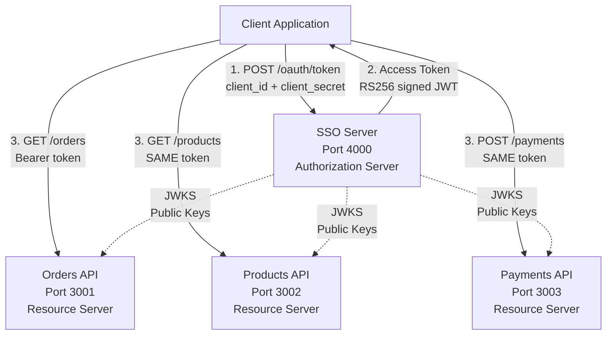
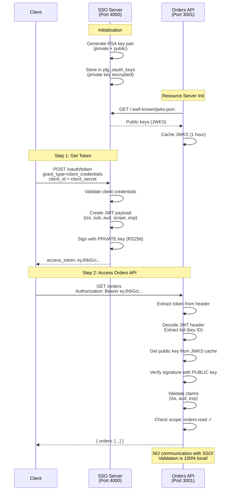
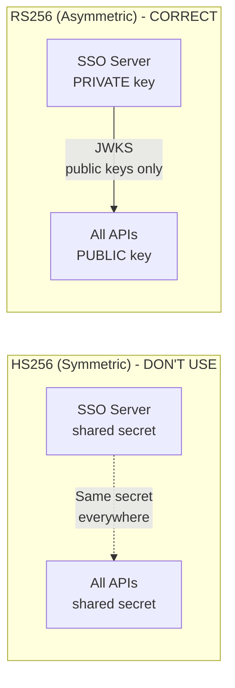

# 🏗️ Architecture & Token Flow

> **Quick Jump:** [System Arch](#system-architecture) | [SSO Flow](#complete-sso-flow) | [Grant Types](#grant-types-explained) | [Token Structure](#token-structure) | [RS256 vs HS256](#rs256-vs-hs256-security-model)

> **Navigation:** [← Back to Identity Plugin](./README.md) | [← Configuration](./configuration.md) | [API Reference →](./api-reference.md)

---

## Overview

Deep dive into Identity Plugin architecture, OAuth2/OIDC flows, and security models. Understand how tokens flow through your microservices ecosystem.

---

### System Architecture



**Key Benefits:**
- ✅ Centralized authentication (single SSO service)
- ✅ Distributed authorization (APIs validate independently)
- ✅ No shared secrets (APIs only need public keys)
- ✅ One token, multiple services

### Complete SSO Flow



### Grant Types Explained

#### 1. Client Credentials (Service-to-Service)

**Use Case:** Backend services authenticating with each other (no user involved).

**Flow:**
```
Service A → POST /oauth/token (client_id + client_secret)
         ← Access Token (no refresh token)
```

**Token Payload:**
```json
{
  "sub": "service-a",
  "aud": "http://localhost:4000",
  "iss": "http://localhost:4000",
  "scope": "read:api",
  "client_id": "service-a",
  "exp": 1705332000,
  "iat": 1705331100
}
```

#### 2. Authorization Code (Web Apps)

**Use Case:** Web applications with a backend server (user login flow).

**Flow:**
```
1. User → GET /oauth/authorize?... (browser)
2. User logs in with email/password
3. SSO → Redirect to callback?code=AUTH_CODE
4. App → POST /oauth/token (code + client_secret)
5. SSO → Access Token + ID Token + Refresh Token
```

#### 3. Refresh Token (Token Renewal)

**Use Case:** Renew expired access tokens without re-authentication.

**Flow:**
```
App → POST /oauth/token (refresh_token + client_secret)
    ← New Access Token + New Refresh Token
```

#### 4. PKCE (Proof Key for Code Exchange)

**Use Case:** Mobile apps and SPAs (public clients without client_secret).

**Flow:**
```
1. App generates code_verifier (random 43-128 chars)
2. App generates code_challenge = base64url(sha256(code_verifier))
3. App → GET /oauth/authorize?...&code_challenge=CHALLENGE&code_challenge_method=S256
4. SSO → Redirect with authorization code
5. App → POST /oauth/token (code + code_verifier)
```

**Why PKCE?**
- ✅ Prevents authorization code interception attacks
- ✅ Required for mobile and SPA applications
- ✅ Works without client secret (public clients)

### Token Structure

**Access Token (JWT Payload):**
```json
{
  "iss": "http://localhost:4000",           // Issuer (SSO server)
  "sub": "user-abc123",                     // Subject (user ID)
  "aud": "http://localhost:3001",           // Audience (target API)
  "scope": "orders:read orders:write",      // Permissions
  "exp": 1234567890,                        // Expiration (Unix timestamp)
  "iat": 1234567000,                        // Issued at
  "client_id": "mobile-app"                 // OAuth client
}
```

**ID Token (OIDC - User Identity):**
```json
{
  "iss": "http://localhost:4000",
  "sub": "user-abc123",
  "aud": "webapp",
  "exp": 1234567890,
  "iat": 1234567000,
  "name": "John Doe",
  "email": "john@example.com",
  "email_verified": true,
  "picture": "https://example.com/avatar.jpg"
}
```

### Scopes and Permissions

```javascript
// SSO Server - Define supported scopes
const identityPlugin = new IdentityPlugin({
  supportedScopes: [
    // OIDC standard scopes
    'openid',          // Required for OIDC
    'profile',         // User profile (name, picture)
    'email',           // User email
    'offline_access',  // Refresh tokens

    // Custom resource scopes
    'orders:read',
    'orders:write',
    'orders:delete',
    'products:read',
    'products:write',
    'payments:process',
    'admin:all'        // Full admin access
  ]
});

// Resource Server - Check scopes
api.addRoute({
  path: '/orders/:id',
  method: 'DELETE',
  handler: async (req, res) => {
    const scopes = req.user.scope.split(' ');

    // Require specific scope
    if (!scopes.includes('orders:delete')) {
      return res.status(403).json({
        error: 'insufficient_scope',
        error_description: 'Requires scope: orders:delete'
      });
    }

    // Check admin scope
    if (scopes.includes('admin:all')) {
      // Admin can delete any order
    } else {
      // Regular user can only delete own orders
      const order = await ordersResource.get(req.params.id);
      if (order.userId !== req.user.sub) {
        return res.status(403).json({ error: 'Forbidden' });
      }
    }

    await ordersResource.delete(req.params.id);
    res.status(204).send();
  },
  auth: 'oidc'
});
```

### RS256 vs HS256 Security Model



**Why RS256 is superior:**

| Aspect | HS256 (Symmetric) | RS256 (Asymmetric) |
|--------|-------------------|-------------------|
| **Secret Distribution** | ❌ Shared secret on ALL services | ✅ Private key ONLY on SSO |
| **Security Risk** | ❌ One leak compromises EVERYTHING | ✅ Public key leak is safe |
| **Token Creation** | ❌ Any service can create fake tokens | ✅ Only SSO can create tokens |
| **Key Rotation** | ❌ Update ALL services | ✅ Update SSO, APIs auto-fetch JWKS |
| **Use Case** | Single service | Microservices, SSO |


---

## 🎯 Summary

**Key architecture takeaways:**
- ✅ Centralized authentication with distributed authorization
- ✅ RS256 (asymmetric) is superior to HS256 for microservices
- ✅ 4 grant types cover all authentication scenarios
- ✅ JWKS enables zero-trust token validation
- ✅ Scopes provide fine-grained access control

**Next Steps:**
1. Explore all endpoints: [API Reference →](./api-reference.md)
2. Integrate with your apps: [Integration Guide →](./integration.md)
3. Solve common issues: [Troubleshooting →](./troubleshooting.md)

---

## 🔗 See Also

**Related Documentation:**
- [Configuration Reference](./configuration.md) - All configuration options
- [API Reference](./api-reference.md) - All 9 endpoints documented
- [Integration Guide](./integration.md) - Resource Server and client integration
- [Troubleshooting](./troubleshooting.md) - Common errors and solutions
- [Identity Plugin Main](./README.md) - Overview and quickstart

**Examples:**
- [e80-sso-oauth2-server.js](/examples/e80-sso-oauth2-server.js) - Complete SSO server
- [e81-oauth2-resource-server.js](/examples/e81-oauth2-resource-server.js) - Resource Server
- [e60-oauth2-microservices.js](/examples/e60-oauth2-microservices.js) - Microservices setup

---

> **Navigation:** [↑ Top](#) | [← Configuration](./configuration.md) | [API Reference →](./api-reference.md) | [← Back to Identity Plugin](./README.md)
