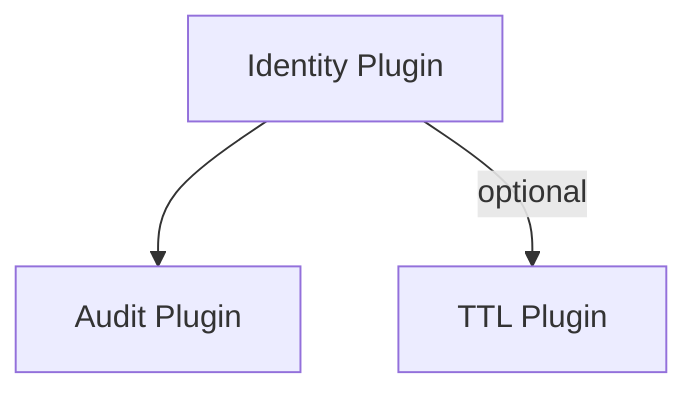

# 📊 Configuration Reference

> **Quick Jump:** [Core Options](#core-options) | [OAuth2/OIDC](#oauth2oidc-options) | [Security](#security-options) | [Features](#features-options) | [Examples](#-configuration-examples)

> **Navigation:** [← Back to Identity Plugin](./README.md) | [Architecture →](./architecture.md) | [API Reference →](./api-reference.md)

---

## Overview

Complete configuration reference for the Identity Plugin. All options with descriptions, types, defaults, and examples.

---

## Core Options

| Parameter | Type | Default | Description |
|-----------|------|---------|-------------|
| `port` | number | `4000` | Port to listen on |
| `host` | string | `'0.0.0.0'` | Host to bind to |
| `issuer` | string | **required** | Issuer URL (MUST match public URL) |
| `logLevel` | boolean | `false` | Enable debug logging |
| `userResource` | string | `'users'` | Name of users resource |
| `resourceNames` | object | auto-generated | Override internal resource names (`oauthKeys`, `authCodes`, `sessions`, `passwordResetTokens`, `mfaDevices`) |

**Example:**
```javascript
const identityPlugin = new IdentityPlugin({
  port: 4000,
  host: '0.0.0.0',
  issuer: 'http://localhost:4000',
  logLevel: 'debug',
  userResource: 'users',
  resourceNames: {
    oauthKeys: 'plg_identity_oauth_keys_primary',
    authCodes: 'plg_identity_auth_codes_primary'
  }
});
```

### Dependency Graph



Audit logging ships enabled by default, so the Identity plugin automatically installs a namespaced `AuditPlugin`. If you also install `TTLPlugin`, the built-in fail-ban manager piggybacks on it to expire IP bans without custom scripting.

---

## OAuth2/OIDC Options

| Parameter | Type | Default | Description |
|-----------|------|---------|-------------|
| `supportedScopes` | string[] | `['openid']` | Allowed scopes (must include 'openid' for OIDC) |
| `supportedGrantTypes` | string[] | `['authorization_code', 'client_credentials', 'refresh_token']` | Allowed grant types |
| `supportedResponseTypes` | string[] | `['code']` | Allowed response types |
| `accessTokenExpiry` | string | `'15m'` | Access token lifetime (e.g., '15m', '1h') |
| `idTokenExpiry` | string | `'15m'` | ID token lifetime |
| `refreshTokenExpiry` | string | `'7d'` | Refresh token lifetime |
| `authCodeExpiry` | string | `'10m'` | Authorization code lifetime |

**Example:**
```javascript
const identityPlugin = new IdentityPlugin({
  supportedScopes: ['openid', 'profile', 'email', 'read:api', 'write:api'],
  supportedGrantTypes: ['authorization_code', 'client_credentials', 'refresh_token'],
  supportedResponseTypes: ['code', 'token', 'id_token'],
  accessTokenExpiry: '15m',
  idTokenExpiry: '15m',
  refreshTokenExpiry: '7d',
  authCodeExpiry: '10m'
});
```

---

## Security Options

| Parameter | Type | Default | Description |
|-----------|------|---------|-------------|
| `security.enabled` | boolean | `true` | Enable security headers |
| `security.contentSecurityPolicy` | object | `{}` | CSP configuration |
| `security.hsts` | object | `{}` | HSTS configuration |

**Example:**
```javascript
const identityPlugin = new IdentityPlugin({
  security: {
    enabled: true,
    contentSecurityPolicy: {
      defaultSrc: ["'self'"],
      scriptSrc: ["'self'"],
      styleSrc: ["'self'"]
    },
    hsts: {
      maxAge: 31536000,
      includeSubDomains: true,
      preload: true
    }
  }
});
```

---

## CORS Options

| Parameter | Type | Default | Description |
|-----------|------|---------|-------------|
| `cors.enabled` | boolean | `true` | Enable CORS |
| `cors.origin` | string/array | `'*'` | Allowed origins (* for dev only!) |
| `cors.credentials` | boolean | `true` | Allow credentials |
| `cors.methods` | string[] | `['GET', 'POST', 'PUT', 'DELETE']` | Allowed methods |
| `cors.allowedHeaders` | string[] | `['Content-Type', 'Authorization']` | Allowed headers |

**Example:**
```javascript
const identityPlugin = new IdentityPlugin({
  cors: {
    enabled: true,
    origin: ['https://app.example.com', 'https://admin.example.com'],
    credentials: true,
    methods: ['GET', 'POST'],
    allowedHeaders: ['Content-Type', 'Authorization']
  }
});
```

---

## Rate Limiting Options

Rate limiting is applied per sensitive endpoint. Each limiter uses a sliding window. Leave a section undefined to adopt defaults.

| Parameter | Type | Default | Description |
|-----------|------|---------|-------------|
| `rateLimit.enabled` | boolean | `true` | Enable built-in rate limiting |
| `rateLimit.login.windowMs` | number | `60000` | Login window size (ms) |
| `rateLimit.login.max` | number | `10` | Max login attempts per window per IP |
| `rateLimit.token.windowMs` | number | `60000` | Token endpoint window size (ms) |
| `rateLimit.token.max` | number | `60` | Max token requests per window per IP |
| `rateLimit.authorize.windowMs` | number | `60000` | `/oauth/authorize` window size (ms) |
| `rateLimit.authorize.max` | number | `30` | Max authorize hits per window per IP |

**Example:**
```javascript
const identityPlugin = new IdentityPlugin({
  rateLimit: {
    enabled: true,
    login: { windowMs: 120000, max: 5 },    // aggressive for login
    token: { windowMs: 60000, max: 120 },   // allow burst on token endpoint
    authorize: { windowMs: 60000, max: 50 } // default for consent UI
  }
});
```

---

## Compression Options

| Parameter | Type | Default | Description |
|-----------|------|---------|-------------|
| `compression.enabled` | boolean | `false` | Enable response compression |
| `compression.threshold` | number | `1024` | Compress responses > 1KB |
| `compression.level` | number | `6` | Compression level (0-9) |
| `compression.preferBrotli` | boolean | `true` | Use Brotli over gzip |

**Example:**
```javascript
const identityPlugin = new IdentityPlugin({
  compression: {
    enabled: true,
    threshold: 1024,
    level: 6,
    preferBrotli: true
  }
});
```

---

## Logging Options

| Parameter | Type | Default | Description |
|-----------|------|---------|-------------|
| `logging.enabled` | boolean | `false` | Enable request logging |
| `logging.format` | string | `':method :path :status :response-time ms'` | Log format |
| `logging.tokens` | object | `{}` | Custom log tokens |

**Example:**
```javascript
const identityPlugin = new IdentityPlugin({
  logging: {
    enabled: true,
    format: ':method :path :status :response-time ms',
    tokens: {
      user: (c) => c.get('user')?.sub || 'anonymous',
      requestId: (c) => c.get('requestId') || 'none'
    }
  }
});
```

---

## Features Options

| Parameter | Type | Default | Description |
|-----------|------|---------|-------------|
| `features.tokenRevocation` | boolean | `true` | Enable token revocation (RFC 7009) |
| `features.dynamicClientRegistration` | boolean | `true` | Enable dynamic client registration (RFC 7591) |
| `features.pkce` | boolean | `true` | Enable PKCE support |
| `features.refreshTokenRotation` | boolean | `false` | Rotate refresh tokens on use |
| `features.multiAudience` | boolean | `false` | Support tokens for multiple audiences |

**Example:**
```javascript
const identityPlugin = new IdentityPlugin({
  features: {
    tokenRevocation: true,
    dynamicClientRegistration: true,
    pkce: true,
    refreshTokenRotation: true,
    multiAudience: true
  }
});
```

---

## Authentication Drivers

Customize how the Identity plugin authenticates users and OAuth clients. Built-in drivers can be tuned, disabled, or replaced with your own implementations.

| Parameter | Type | Default | Description |
|-----------|------|---------|-------------|
| `authDrivers.disableBuiltIns` | boolean | `false` | Disable all built-in drivers (`password`, `client_credentials`) |
| `authDrivers.password.identifierField` | string | `'email'` | User attribute used to authenticate (e.g., `username`) |
| `authDrivers.password.caseInsensitive` | boolean | `true` | Lowercase identifiers before lookup (useful for emails) |
| `authDrivers.clientCredentials` | object | `{}` | Reserved for future built-in options (still required to keep secrets hashed) |
| `authDrivers.drivers` | array | `[]` | Custom `AuthDriver` instances or `[DriverClass, options]` tuples to register |

**Example – rename identifier + custom driver:**
```javascript
import { CustomSAMLDriver } from './custom-auth/saml-driver.js';

await db.usePlugin(new IdentityPlugin({
  issuer: 'https://sso.example.com',
  authDrivers: {
    password: {
      identifierField: 'username',
      caseInsensitive: false
    },
    drivers: [
      [CustomSAMLDriver, { metadataUrl: 'https://idp.example.com/metadata' }]
    ]
  }
}));
```

Implementation notes:
- Built-in drivers automatically gain access to the S3DB resources (`users`, `clients`) and password helper used by the plugin.
- Custom drivers must extend `AuthDriver` and implement `initialize(context)` plus `authenticate(request)`. Supported grant types can be advertised via `supportsGrant(grantType)`.
- Driver instances are deduplicated by their supported types; attempting to register two drivers for the same type throws during startup.

---

## 📚 Configuration Examples

### Example 1: Minimal SSO Server

Simple SSO for development:

```javascript
const identityPlugin = new IdentityPlugin({
  port: 4000,
  issuer: 'http://localhost:4000',
  supportedScopes: ['openid', 'profile', 'email']
});
```

### Example 2: Production SSO with All Features

Enterprise-ready configuration:

```javascript
const identityPlugin = new IdentityPlugin({
  port: 443,
  issuer: 'https://sso.example.com',

  supportedScopes: [
    'openid', 'profile', 'email',
    'offline_access',
    'read:api', 'write:api', 'admin:all'
  ],
  supportedGrantTypes: [
    'authorization_code',
    'client_credentials',
    'refresh_token'
  ],

  accessTokenExpiry: '15m',
  idTokenExpiry: '15m',
  refreshTokenExpiry: '7d',

  cors: {
    enabled: true,
    origin: ['https://app.example.com', 'https://admin.example.com'],
    credentials: true
  },

  security: {
    enabled: true,
    hsts: {
      maxAge: 31536000,
      includeSubDomains: true,
      preload: true
    }
  },

  rateLimit: {
    enabled: true,
    login: { windowMs: 120000, max: 10 },
    token: { windowMs: 60000, max: 120 },
    authorize: { windowMs: 60000, max: 40 }
  },

  compression: {
    enabled: true,
    preferBrotli: true
  },

  features: {
    tokenRevocation: true,
    dynamicClientRegistration: true,
    pkce: true,
    refreshTokenRotation: true,
    multiAudience: true
  }
});
```

### Example 3: PKCE-Only (Mobile Apps)

Mobile/SPA-focused configuration:

```javascript
const identityPlugin = new IdentityPlugin({
  port: 4000,
  issuer: 'https://api.example.com',

  supportedScopes: ['openid', 'profile', 'offline_access'],
  supportedGrantTypes: ['authorization_code', 'refresh_token'],

  features: {
    pkce: true,  // Require PKCE for all authorization_code requests
    refreshTokenRotation: true
  },

  cors: {
    enabled: true,
    origin: ['myapp://', 'https://app.example.com']
  }
});
```

---

## 🎯 Summary

**Key configuration takeaways:**
- ✅ Use `issuer` matching your public URL (HTTPS in production)
- ✅ Configure appropriate token expiration times (15m access, 7d refresh)
- ✅ Enable security features (HSTS, CORS, rate limiting)
- ✅ Use PKCE for public clients (mobile, SPA)
- ✅ Rotate keys regularly (90 days recommended)

**Next Steps:**
1. Understand system design: [Architecture & Token Flow →](./architecture.md)
2. Explore all endpoints: [API Reference →](./api-reference.md)
3. Integrate with your apps: [Integration Guide →](./integration.md)
4. Solve common issues: [Troubleshooting →](./troubleshooting.md)

---

## 🔗 See Also

**Related Documentation:**
- [Architecture & Token Flow](./architecture.md) - System design and grant types
- [API Reference](./api-reference.md) - All 9 OAuth2/OIDC endpoints
- [Integration Guide](./integration.md) - Connect Resource Servers and clients
- [Troubleshooting](./troubleshooting.md) - Common errors and solutions
- [Identity Plugin Main](./README.md) - Overview and quickstart

**Examples:**
- [e80-sso-oauth2-server.js](/examples/e80-sso-oauth2-server.js) - Complete SSO server
- [e82-oidc-web-app.js](/examples/e82-oidc-web-app.js) - Web app integration
- [e60-oauth2-microservices.js](/examples/e60-oauth2-microservices.js) - Microservices setup

---

> **Navigation:** [↑ Top](#) | [← Identity Plugin](./README.md) | [Architecture →](./architecture.md) | [API Reference →](./api-reference.md)
