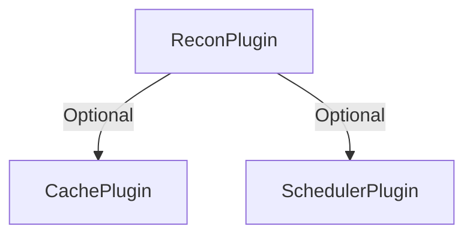

# 🛰️ Recon Plugin

> **On-demand recon toolkit for latency, routing, certificates, open ports, and CDN fingerprints.**
>
> **Navigation:** [← Plugin Index](./README.md) | [Quickstart ↓](#-quickstart) | [Config ↓](#-configuration) | [FAQ ↓](#-faq)

---

## ⚡ TL;DR

- **Behavior modes**: `passive` (OSINT only), `stealth` (rate-limited scans), `aggressive` (full arsenal) for different operational contexts. [→ Docs](./recon-behavior-modes.md)
- Run full-stack recon (DNS, latency, subdomains, ports, TLS, fingerprints) with a single call.
- Capture PTR matches, technology banners, and structured service metadata ready for dashboards.
- Persist every sweep under `plugin=recon/reports/<host>/<timestamp>.json` with automatic history pruning.
- Cron-friendly: enable scheduled sweeps (hourly/daily/etc.) with per-target feature overrides.
- Graceful fallbacks when tools are missing (e.g., `mtr` absent → `traceroute`, binaries missing → status `unavailable`).

---

## 🚀 Quickstart

### Basic Usage with Behavior Modes

```javascript
import { S3db, ReconPlugin } from 's3db.js';

// Passive mode - OSINT only (no active scanning)
const passivePlugin = new ReconPlugin({
  behavior: 'passive',
  storage: { persist: true }
});

// Stealth mode - authorized pentest with rate limiting
const stealthPlugin = new ReconPlugin({
  behavior: 'stealth',
  storage: { persist: true },
  schedule: {
    enabled: true,
    cron: '0 */6 * * *' // every 6 hours
  },
  targets: ['client.example.com']
});

// Aggressive mode - internal audit with all tools
const aggressivePlugin = new ReconPlugin({
  behavior: 'aggressive',
  storage: { persist: true },
  targets: ['intranet.corp.local']
});

const db = new S3db({
  connectionString: process.env.BUCKET_CONNECTION_STRING,
  plugins: [stealthPlugin]
});

await db.connect();

const report = await stealthPlugin.runDiagnostics('https://example.com', {
  persist: true
});

console.log(report.fingerprint);
/**
 * {
 *   target: 'example.com',
 *   primaryIp: '93.184.216.34',
 *   cdn: 'Cloudflare',
 *   subdomainCount: 42,
 *   openPorts: [{ port: '80/tcp', service: 'http', detail: 'nginx 1.18' }, ...],
 *   latencyMs: 18.5,
 *   technologies: ['nginx 1.18', 'Express', 'ssh OpenSSH 8.2']
 * }
 */
```

### Manual Configuration (Advanced)

```javascript
const reconPlugin = new ReconPlugin({
  concurrency: 4,
  storage: { persist: true, historyLimit: 20 },
  features: {
    subdomains: { amass: true, subfinder: true, assetfinder: false, crtsh: true },
    ports: { nmap: true, masscan: false },
    vulnerability: { nikto: true },
    tlsAudit: { openssl: true, sslyze: false, testssl: false }
  },
  rateLimit: { enabled: true, delayBetweenStages: 3000 },
  schedule: {
    enabled: true,
    cron: '0 */6 * * *',
    runOnStart: true
  },
  targets: [
    'example.com',
    { target: 'api.example.com', features: { vulnerability: { nikto: false } } }
  ]
});
```

---

## 📚 Table of Contents

- [Configuration](#-configuration)
- [How It Works](#-how-it-works)
- [Supported Tools](#-supported-tools)
- [Mapa de Descoberta](#-mapa-de-descoberta)
- [Comandos Práticos](#-comandos-pr%C3%A1ticos)
- [Script Starter](#-script-starter)
- [Result Anatomy](#-result-anatomy)
- [API Integration](#-api-integration)
- [Usage Patterns](#-usage-patterns)
- [FAQ](#-faq)

---

## ⚙️ Configuration

### Behavior Modes

| Mode | Use Case | Detection Risk | Speed | Tools Enabled |
|------|----------|----------------|-------|---------------|
| `passive` | OSINT, external recon | None | Fast | DNS, CT logs, theHarvester |
| `stealth` | Authorized pentest | Low | Slow (rate-limited) | DNS, cert, ping, subfinder, nmap (slow timing) |
| `aggressive` | Internal audit, red team | High | Very Fast | All tools (nmap, masscan, ffuf, nikto, sslyze, etc.) |

**Quick Start:**
```javascript
new ReconPlugin({ behavior: 'passive' })   // OSINT only
new ReconPlugin({ behavior: 'stealth' })   // Authorized with rate limiting
new ReconPlugin({ behavior: 'aggressive' }) // Full scan
```

[→ Full Behavior Modes Documentation](./recon-behavior-modes.md)

---

### Configuration Options

| Option | Type | Default | Description |
|--------|------|---------|-------------|
| `behavior` | `string` | `null` | Behavior mode: `passive`, `stealth`, or `aggressive`. Overrides features/timing. |
| `behaviorOverrides` | `object` | `{}` | Override specific settings within a behavior preset. |
| `concurrency` | `number` | `4` | Max stages executed in parallel during a run. |
| `tools` | `string[]` | `['dns','certificate','ping','traceroute','curl','ports']` | Override the stage list passed to `runDiagnostics`. |
| `features` | `object` | See below | Fine-grained toggles for each recon category (DNS, subdomains, ports, etc.). |
| `rateLimit.enabled` | `boolean` | `false` | Enable rate limiting (auto-enabled in `stealth` mode). |
| `rateLimit.requestsPerMinute` | `number` | `60` | Max requests per minute (stealth: 10). |
| `rateLimit.delayBetweenStages` | `number` | `0` | Milliseconds to pause between stages (stealth: 5000). |
| `ping.count` | `number` | `4` | Number of ICMP packets to send. |
| `ping.timeout` | `number` | `7000` | Timeout (ms) for the entire ping command. |
| `traceroute.cycles` | `number` | `4` | `mtr --report --report-cycles` before falling back to `traceroute`. |
| `traceroute.timeout` | `number` | `12000` | Timeout (ms) for `mtr`/`traceroute`. |
| `curl.timeout` | `number` | `8000` | Max time (ms) to wait for HTTP headers. |
| `curl.userAgent` | `string` | Custom UA | User agent injected into `curl` requests. |
| `nmap.topPorts` | `number` | `10` | Feed into `nmap --top-ports`. |
| `nmap.extraArgs` | `string[]` | `[]` | Append extra CLI flags (e.g., `['-sV']`). |
| `storage.persist` | `boolean` | `true` | Persist every report to PluginStorage. |
| `storage.historyLimit` | `number` | `20` | Number of historical reports kept per host. |
| `storage.persistRawOutput` | `boolean` | `true` | Keep truncated CLI stdout/stderr inside results. |
| `schedule.enabled` | `boolean` | `false` | Enable cron-driven sweeps. |
| `schedule.cron` | `string` | `null` | Cron expression (`node-cron` syntax). |
| `schedule.runOnStart` | `boolean` | `false` | Trigger an immediate sweep when the plugin boots. |
| `resources.persist` | `boolean` | `true` | Persist summaries/diffs into S3DB resources (`plg_recon_*`). |
| `resources.autoCreate` | `boolean` | `true` | Auto-create the resources during `onInstall`. |
| `targets` | `Array<string | TargetConfig>` | `[]` | Targets processed automatically during scheduled sweeps. |
| `commandRunner` | `CommandRunner` | internal | Optional injector for sandbox/testing. |

**Feature toggles**

| Category | Keys | Notes |
|----------|------|-------|
| DNS | `features.dns` | Core record/PTR enumeration (Node built-ins). |
| TLS | `features.certificate` | Base TLS handshake; enable `features.tlsAudit.*` for deep scans. |
| HTTP | `features.http.curl` | Header fingerprinting via `curl -I`. |
| Latency | `features.latency.{ping,traceroute}` | ICMP latency + route mapping. |
| Subdomains | `features.subdomains.{amass,subfinder,assetfinder,crtsh}` | Passive + active discovery. |
| Ports | `features.ports.{nmap,masscan}` | Service and port enumeration. |
| TLS Audit | `features.tlsAudit.{openssl,sslyze,testssl}` | Cipher suite / protocol checks. |
| Fingerprint | `features.fingerprint.whatweb` | Detect CMS/libs via `whatweb`. |
| Web | `features.web.{ffuf,feroxbuster,gobuster}` | Directory/endpoint brute forcing (requires wordlist). |
| Vulnerability | `features.vulnerability.{nikto,wpscan,droopescan}` | Informational scanners (authorised use only). |
| Screenshots | `features.screenshots.{aquatone,eyewitness}` | Capture site screenshots. |
| OSINT | `features.osint.{theHarvester,reconNg}` | Passive data aggregation. |

```ts
type TargetConfig = {
  target: string;
  tools?: string[];
  features?: Partial<Features>;
  persist?: boolean;
};
```



> ℹ️ The plugin integrates well with `SchedulerPlugin` (chain follow-up jobs) and `CachePlugin` (memoise expensive sweeps).
> Legacy alias: the plugin also registers as `db.plugins.network` for backward compatibility with older setups.
> **Note**: This plugin does NOT provide built-in API routes. Implement your own API layer if needed.

---

## 🛠️ How It Works

1. **Target Normalisation** – URLs, bare domains, and `ip:port` tuples are normalized into `{ host, protocol, port }`.
2. **Stage Orchestration** – Each recon stage runs inside a bounded `PromisePool` using the shared `CommandRunner`.
3. **Command Runner** – Preflight checks (`which <binary>`) prevent noisy failures and surface actionable errors.
4. **Node-native Signals** – DNS & TLS stages leverage Node built-ins (`dns/promises`, `tls`) so you still get data even without CLI tooling.
5. **Fingerprint Builder** – Aggregates IPs, latency, open ports, CDN hints, technology banners, and PTR matches into a concise summary.
6. **Structured Storage & Scheduling** – When `storage.persist` is enabled, every sweep lands under `plugin=recon/reports/<host>/<timestamp>.json`, with cron-driven sweeps (`schedule.cron`) feeding the history automatically.

All executions are read-only—the plugin never mutates resources outside of its PluginStorage namespace.

---

## 🔐 Estrutura de Armazenamento

- **PluginStorage** (sempre que `storage.persist` estiver ativo):
  - `plugin=recon/reports/<host>/<timestamp>.json` → relatório completo com fingerprint + resultados por estágio.
  - `plugin=recon/reports/<host>/latest.json` → snapshot mais recente.
  - `plugin=recon/reports/<host>/stages/<timestamp>/<stage>.json` → saída integral de cada ferramenta.
  - `plugin=recon/reports/<host>/index.json` → histórico resumido (latência, portas, subdomínios) limitado por `historyLimit`.
- **Resources S3DB** (quando `resources.persist` está `true` e o plugin foi instalado no banco):
  - `plg_recon_hosts` — resumo consolidado por host (`summary`, `fingerprint`, `lastScanAt`, `storageKey`).
  - `plg_recon_reports` — metadados por varredura (`startedAt`, `status`, mapa `stageKeys`).
  - `plg_recon_stage_results` — resultado/sumário por estágio (status + sample) com ponteiro para o output bruto.
  - `plg_recon_diffs` — alterações detectadas (subdomínios novos/removidos, portas abertas/fechadas, mudança de IP/CDN/tecnologia).
  - `plg_recon_subdomains` — lista completa de subdomínios por host (contagem + fontes por ferramenta).
  - `plg_recon_paths` — todos os paths descobertos por host (contagem + ferramentas responsáveis).
- Entradas mais antigas que `historyLimit` são podadas automaticamente (relatórios brutos, outputs por estágio e registros em `plg_recon_*`).

Esses datasets permitem montar dashboards, alertas e relatórios para clientes de monitoramento contínuo sem depender de parsing manual.

---

## 🧭 Supported Tools

| Stage | Tooling | Notes |
|-------|---------|-------|
| DNS & PTR | Node.js `dns.promises` | A/AAAA, NS, MX, TXT, reverse lookups. |
| TLS (base) | Node.js `tls` | Subject, issuer, validity, SAN. |
| Latency | `ping` | Min/avg/max, packet loss. |
| Route | `mtr` JSON → `traceroute` | Hop-by-hop latency & loss. |
| HTTP headers | `curl -I` | Server banners, CDN hints, cache headers. |
| Subdomains | `amass`, `subfinder`, `assetfinder`, Certificate Transparency | Passive + brute enumeration (enabled via feature toggles). |
| Ports & Services | `nmap`, `masscan` | Open ports, service banners, optional mass scans. |
| TLS Audit | `openssl s_client`, `sslyze`, `testssl.sh` | Cipher suites, protocol support, handshake issues. |
| Fingerprint | `whatweb` | CMS/framework/library detection. |
| Web Discovery | `ffuf`, `feroxbuster`, `gobuster` | Wordlist-based directory/endpoint brute forcing. |
| Vulnerabilities* | `nikto`, `wpscan`, `droopescan` | Informational scanners (enable only on authorised scopes). |
| Screenshots | `aquatone`, `EyeWitness` | Visual triage of reachable hosts. |
| OSINT | `theHarvester`, `recon-ng` | Passive data gathering (email, hosts). |

*These scanners can generate noisy traffic—use only with explicit permission.

Unavailable binaries return `{ status: 'unavailable', message }`, allowing you to surface actionable guidance to operators.

---

## 🗺️ Mapa de Descoberta

| Categoria | O que descobrir | Ferramentas chave |
|-----------|-----------------|-------------------|
| Infraestrutura & Rede | IPs, ASN, GeoIP, rota, peering, CDN/WAF | `dig`, `whois`, `ipinfo`, `mtr`, `traceroute`, `curl -I`, `whatweb` |
| DNS Avançado & Histórico | Registros A/AAAA/MX/TXT/CNAME, TTLs, passive DNS | `dig`, `host`, crt.sh, SecurityTrails, Censys |
| TLS & CT | Cadeia, validade, ciphers, certificados emitidos | `openssl s_client`, `sslyze`, `testssl.sh`, crt.sh |
| Fingerprinting | CMS, servidores, frameworks, libs | `whatweb`, Wappalyzer, BuiltWith |
| Conteúdo & Endpoints | Robots, sitemap, URLs históricas, endpoints JS | `curl`, `waybackurls`, `gau`, `wget`, `grep` |
| Portas & Serviços | Portas abertas, versões de serviços | `nmap`, `masscan` |
| Subdomínios | Descobrir assets, evitar takeover | `amass`, `subfinder`, `assetfinder`, `crt.sh`, `subjack` |
| Segurança / Misconfig | Headers, buckets, exposição de arquivos | `curl -I`, `securityheaders.io`, `aws s3 ls`, `cloud_enum` |
| Segredos & Histórico | Chaves em JS, histórico Git | `ripgrep`, `gitrob`, `truffleHog`, `gitleaks` |
| Serviços relacionados | MX/SPF/DKIM/DMARC, APIs externas | `dig`, `smtp-cli`, inspeção de JS |
| Reputação & Malware | Blacklists, histórico de phishing/malware | VirusTotal, PhishTank, Safe Browsing |
| Performance & SEO | TTFB, LCP, CLS, meta tags | Lighthouse, PageSpeed, `curl -w '%{time_total}'` |
| Triagem Visual | Mudanças visuais, screenshot fleet | `aquatone`, `EyeWitness` |
| Detalhes operacionais | Rate-limit, fluxos de login, OAuth | Testes controlados, análise de endpoints |

---

## 🛠️ Comandos Práticos

```bash
# DNS & MX
dig example.com ANY +short
dig example.com MX +short

# Rota e latência
mtr -rw example.com

# Certificados CT
curl -s "https://crt.sh/?q=%25.example.com&output=json" \
  | jq -r '.[].name_value' | sort -u

# Fingerprinting rápido
whatweb example.com

# Subdomínios passivos
subfinder -d example.com | sort -u

# URLs históricas / endpoints
waybackurls example.com | sort -u

# Procurar endpoints em JS
wget -qO- https://example.com/app.js \
  | grep -Eo "https?://[^\"']+" | sort -u

# Verificar headers de segurança
curl -sI https://example.com | egrep -i 'server|powered-by|security|strict|frame'

# TLS detalhado
sslyze --regular example.com
```

---

## 🧰 Script Starter

```bash
./scripts/recon-starter.sh example.com
```

Esse script (bash) realiza um sweep passivo e coleta artefatos básicos (subdomínios, resoluções, nmap, headers/robots/sitemaps). Adapte limites, wordlists e resolvers conforme sua infraestrutura.

```bash
#!/usr/bin/env bash
set -euo pipefail

if [[ $# -lt 1 ]]; then
  echo "Uso: $0 dominio.com [wordlist]" >&2
  exit 1
fi

TARGET="$1"
WORDLIST="${2:-}"
STAMP="$(date -u +%Y%m%d%H%M%S)"
OUT="recon_${TARGET}_${STAMP}"
mkdir -p "$OUT"

log() { printf '[%s] %s\n' "$(date -u +%H:%M:%S)" "$1"; }
run_if_exists() {
  if command -v "$1" >/dev/null 2>&1; then
    "$@"
  else
    log "skipping: $1 não encontrado"
    return 1
  fi
}

log "Subdomínios (subfinder)"
run_if_exists subfinder -d "$TARGET" -silent > "$OUT/subs_subfinder.txt" || true

log "Subdomínios (amass)"
run_if_exists amass enum -d "$TARGET" -o "$OUT/amass.txt" || true

cat "$OUT"/subs_subfinder.txt "$OUT"/amass.txt 2>/dev/null \
  | sort -u > "$OUT/subs_all.txt"

log "Resolvendo hosts"
while read -r host; do
  [[ -z "$host" ]] && continue
  dig +short "$host" \
    | awk -v h="$host" '{print h","$0}'
done < "$OUT/subs_all.txt" > "$OUT/resolved.csv"

awk -F, '{print $2}' "$OUT/resolved.csv" \
  | grep -E '^[0-9]+' | sort -u | head -n 40 > "$OUT/top_ips.txt"

if [[ -s "$OUT/top_ips.txt" ]]; then
  log "Nmap (top host list)"
  run_if_exists nmap -sC -sV -iL "$OUT/top_ips.txt" \
    -oA "$OUT/nmap_quick" || true
fi

log "Capturando headers/robots/sitemaps"
while read -r host; do
  [[ -z "$host" ]] && continue
  run_if_exists curl -sI "https://$host" >> "$OUT/headers.txt" || true
  run_if_exists curl -s "https://$host/robots.txt" \
    -o "$OUT/robots_${host}.txt" || true
  run_if_exists curl -s "https://$host/sitemap.xml" \
    -o "$OUT/sitemap_${host}.xml" || true
done < "$OUT/subs_all.txt"

if [[ -n "$WORDLIST" && -f "$WORDLIST" ]]; then
  log "Bruteforce HTTP (ffuf)"
  run_if_exists ffuf -u "https://$TARGET/FUZZ" \
    -w "$WORDLIST" -t 40 -of json -o "$OUT/ffuf.json" || true
fi

log "Finalizado. Resultados em $OUT/"
```

> 💡 Quer orquestrar isso via plugin? Configure `targets`, `features` e `schedule.cron` no `ReconPlugin` para rodar automaticamente direto do S3DB.

---

## 📄 Relatórios para Clientes

Gere relatórios prontos para entregar usando `generateClientReport`:

```javascript
const markdown = await reconPlugin.generateClientReport('example.com');
console.log(markdown);

const json = await reconPlugin.generateClientReport('example.com', {
  format: 'json',
  diffLimit: 5
});

// Alertas recentes (ex.: para dashboards)
const alerts = await reconPlugin.getRecentAlerts('example.com', { limit: 3 });
```

- **Markdown** traz um sumário com IPs, CDN, tecnologias, portas abertas, principais subdomínios, status dos estágios e diffs recentes.
- **JSON** retorna um objeto estruturado contendo host summary, último relatório, diffs e estágios (ideal para dashboards ou APIs).
- Se `resources.persist` estiver ativo, o método usa os recursos `plg_recon_*`; caso contrário, faz fallback direto para o PluginStorage (`latest.json`, `index.json`).
  - Para apenas obter a visão consolidada (sem relatório), use `getHostSummary('example.com', { includeDiffs: true })`.

Exemplo de saída (trecho):

```
# Recon Report – https://example.com
- **Última execução:** 2025-01-01T00:00:00.000Z
- **Status geral:** ok
- **IP primário:** 93.184.216.34
- **CDN/WAF:** Cloudflare
- **Tecnologias:** nginx 1.18, Express

## Portas abertas
| Porta | Serviço | Detalhe |
|-------|---------|---------|
| 443/tcp | https | nginx 1.18 |

## Principais subdomínios
- app.example.com
- cdn.example.com

## Mudanças recentes
- Novos subdomínios: blog.example.com, status.example.com
- Contagem de portas abertas mudou de 1 para 2
```

---

## 🧾 Result Anatomy

```jsonc
{
  "target": {
    "original": "https://example.com",
    "host": "example.com",
    "protocol": "https",
    "port": 443
  },
  "results": {
    "dns": { "records": { "a": ["93.184.216.34"], "reverse": { "93.184.216.34": ["example.com"] } } },
    "ping": { "status": "ok", "metrics": { "avg": 18.5 } },
    "traceroute": { "status": "ok", "type": "mtr", "report": { ... } },
    "curl": { "status": "ok", "headers": { "server": "nginx", "x-powered-by": "Express" } },
    "ports": {
      "status": "ok",
      "openPorts": [{ "port": "443/tcp", "service": "https", "detail": "nginx 1.18" }],
      "scanners": {
        "nmap": { "status": "ok", "summary": { ... } }
      }
    },
    "subdomains": { "status": "ok", "total": 42, "list": ["api.example.com", ...] },
    "vulnerabilityScan": { "status": "empty", "tools": { "nikto": { "status": "ok" } } },
    "fingerprintTools": { "status": "ok", "technologies": ["PHP", "Apache"] }
  },
  "fingerprint": {
    "target": "example.com",
    "primaryIp": "93.184.216.34",
    "cdn": "Cloudflare",
    "server": "nginx",
    "technologies": ["nginx", "Express", "PHP", "Apache"],
    "openPorts": [{ "port": "443/tcp", "service": "https", "detail": "nginx 1.18" }],
    "relatedHosts": ["example.com"],
    "subdomainCount": 42,
    "subdomainsSample": ["api.example.com", "cdn.example.com"],
    "latencyMs": 18.5
  },
  "toolsAttempted": ["dns","ping","traceroute","curl","ports","subdomains","vulnerabilityScan","fingerprintTools"],
  "storageKey": "plugin=recon/reports/example.com/2025-01-01T06-00-00Z.json",
  "stageStorageKeys": {
    "dns": "plugin=recon/reports/example.com/stages/2025-01-01T06-00-00Z/aggregated/dns.json",
    "ports": "plugin=recon/reports/example.com/stages/2025-01-01T06-00-00Z/aggregated/ports.json",
    "subdomains": "plugin=recon/reports/example.com/stages/2025-01-01T06-00-00Z/aggregated/subdomains.json"
  },
  "toolStorageKeys": {
    "nmap": "plugin=recon/reports/example.com/stages/2025-01-01T06-00-00Z/tools/nmap.json",
    "masscan": "plugin=recon/reports/example.com/stages/2025-01-01T06-00-00Z/tools/masscan.json",
    "amass": "plugin=recon/reports/example.com/stages/2025-01-01T06-00-00Z/tools/amass.json",
    "subfinder": "plugin=recon/reports/example.com/stages/2025-01-01T06-00-00Z/tools/subfinder.json",
    "crtsh": "plugin=recon/reports/example.com/stages/2025-01-01T06-00-00Z/tools/crtsh.json"
  }
}
```

- **results** – Structured output for each enabled stage (status, counts, raw/truncated stdout). Each stage result may contain `_individual` (per-tool artifacts) and `_aggregated` (combined view) keys.
- **fingerprint** – Curated snapshot intended for dashboards or alert payloads.
- **fingerprint.relatedHosts** – PTR results highlighting other hostnames mapped to the same IPs.
- **storageKey** – Where the complete report is stored when persistence is enabled.
- **stageStorageKeys** – Storage keys for aggregated stage artifacts (combined view of multiple tools).
- **toolStorageKeys** – Storage keys for individual tool artifacts (per-tool granular output).
- **toolsAttempted** – List of stages executed for the run.

### 🔧 Per-Tool Artifact Storage

**NEW**: Each individual tool now generates its own artifact and persists it separately!

**Benefits:**
- ✅ Granular tracking of each tool execution
- ✅ Performance analysis per tool
- ✅ Debug specific tool failures
- ✅ Compare results between similar tools (e.g., nmap vs masscan)
- ✅ Rerun only failed tools independently

**Storage Structure:**
```
plugin=recon/reports/example.com/stages/2025-01-01T06-00-00Z/
├── tools/                       # Individual tool artifacts
│   ├── nmap.json               # nmap-specific output
│   ├── masscan.json            # masscan-specific output
│   ├── amass.json              # amass-specific output
│   ├── subfinder.json          # subfinder-specific output
│   ├── crtsh.json              # crt.sh-specific output
│   ├── ffuf.json               # ffuf-specific output
│   └── nikto.json              # nikto-specific output
│
└── aggregated/                  # Combined stage views
    ├── ports.json              # Combined nmap + masscan results
    ├── subdomains.json         # Combined amass + subfinder + crtsh results
    └── webDiscovery.json       # Combined ffuf + feroxbuster + gobuster results
```

**Example: Accessing Individual Tool Artifacts**

```javascript
// Run diagnostics
const report = await plugin.runDiagnostics('example.com', { persist: true });

// Access individual tool artifacts
const storage = plugin.getStorage();

// Load nmap artifact
const nmapArtifact = await storage.get(report.toolStorageKeys.nmap);
console.log('Nmap found:', nmapArtifact.summary?.openPorts?.length, 'ports');

// Load masscan artifact
const masscanArtifact = await storage.get(report.toolStorageKeys.masscan);
console.log('Masscan found:', masscanArtifact.openPorts?.length, 'ports');

// Compare tool performance
console.log('Nmap vs Masscan port count:', nmapArtifact.summary?.openPorts?.length, 'vs', masscanArtifact.openPorts?.length);

// Load aggregated stage view
const portsStage = await storage.get(report.stageStorageKeys.ports);
console.log('Combined unique ports:', portsStage.openPorts?.length);
```

**See**: `docs/examples/e48-recon-per-tool-artifacts.js` for complete demonstration.

---

## 🧩 Usage Patterns

1. **Incident Response Dashboard**
   Cache the fingerprint in a resource or KV store, expose via your own API layer, and refresh on demand.

2. **Asset Inventory**  
   Pair with the `SchedulerPlugin` to periodically scan critical domains and raise alerts when the certificate is near expiry or a new port opens.

3. **Latency Budgeting**  
   Store `ping.metrics.avg` history per environment to spot regressions after CDN or networking changes.

4. **Tech Discovery**  
   Use the header fingerprints (`server`, `x-powered-by`, `via`) to maintain an up-to-date catalogue of third-party services in use.
5. **Dashboards / Alertas**  
   Consuma `getHostSummary('example.com', { includeDiffs: true })` nas suas jobs para montar painéis ou disparar notificações quando novos subdomínios/portas surgirem.

> 💡 Want structured storage? Call `plugin.getStorage()` and persist reports under `plugin=recon/reports/<hostname>/<timestamp>.json`.

### Scheduling & Automation

- Enable cron sweeps via `schedule.enabled: true` and `schedule.cron: '0 */4 * * *'` (every 4 hours).
- Populate `targets` with domains or `{ target, features, tools, persist }` overrides.
- Every sweep stores a report and refreshes `<host>/latest.json` + `<host>/index.json` so downstream jobs (e.g., `SchedulerPlugin`) can react to changes.
- Emit hooks:
  - `recon:completed` – per-target summary after a scheduled run.
  - `recon:target-error` – surfaced when a target fails (binary missing, timeout, etc.).
  - `recon:alert` – emitido quando uma mudança crítica (ex.: nova porta exposta) é detectada (`{ host, stage, severity, description, values, timestamp }`).
- Each persisted report lives at `plugin=recon/reports/<host>/<timestamp>.json` with a rolling index (default 20 entries).

---

## ❓ FAQ

### Does the plugin require root or CAP_NET_RAW for `ping`?
No. The plugin simply invokes the system `ping`. If ICMP privileges are restricted in your environment, you will receive `status: 'unavailable'` with the OS error message.

### How do I restrict aggressive scans?
Configure `nmap.topPorts` (e.g., `5`) or pass `nmap: { extraArgs: ['-T2'] }` for slower timing. You can also omit `nmap` from `tools`.

### What about Windows environments?
The plugin will gracefully mark tools as unavailable because the default commands (`mtr`, `traceroute`, `nmap`) are UNIX-centric. You can swap the `commandRunner` with a custom implementation that targets Windows equivalents.

### Can I extend the fingerprint?
Absolutely—subclass the plugin and override `_buildFingerprint` (or contribute upstream!) to fold in custom heuristics or store the raw reports automatically.

### Do you mutate DNS cache or write to resources?
No. All operations are passive read commands. Persistence is opt-in via `PluginStorage` should you want to archive diagnostics.

---

Need more observability? Pair the Recon Plugin with:

- **Metrics Plugin** for latency dashboards.
- **Scheduler Plugin** for scheduled health checks.
- **API Plugin** to expose `GET /recon/hosts/:hostId/summary` (diffs + alerts) for incident responders.
