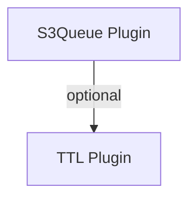

# 🔒 S3Queue Plugin

> **Distributed worker queues backed by S3 with zero-duplication guarantees.**
>
> **Navigation:** [← Plugin Index](./README.md) | [Configuration ↓](#️-configuration) | [FAQ ↓](#-faq)

---

## ⚡ TLDR

**Distributed queue system** using S3 as backend, with zero duplication guarantee.

**3 lines to get started:**
```javascript
const queue = new S3QueuePlugin({ resource: 'tasks', onMessage: async (task) => { console.log('Processing:', task); } });
await db.usePlugin(queue);
await tasks.enqueue({ type: 'send-email', data: {...} });
```

> 🧩 **Namespaces**: Provide `namespace: 'emails'` (or pass an alias via `db.usePlugin`) to run multiple S3QueuePlugin instances. Queue/dead-letter resources will be emitted as `plg_emails_…`.

**Key features:**
- ✅ Zero duplication (distributed locks + ETag + cache)
- ✅ Visibility timeout (like AWS SQS)
- ✅ Automatic retry with exponential backoff
- ✅ Dead letter queue
- ✅ Configurable worker pool

**When to use:**
- 📧 Email/SMS queues
- 🎬 Media processing
- 📊 Report generation
- 🔄 Background jobs
- 🔔 Webhook delivery

---

## 📦 Dependencies

**Required:**
```bash
pnpm install s3db.js
```

**NO Peer Dependencies!**

S3QueuePlugin is **built into s3db.js core** with zero external dependencies!

**Why Zero Dependencies?**

- ✅ Pure JavaScript implementation (no external libraries)
- ✅ Works instantly after installing s3db.js
- ✅ No version conflicts or compatibility issues
- ✅ Lightweight and fast (~20KB plugin code)
- ✅ Perfect for serverless (AWS Lambda, Cloudflare Workers, Vercel)

**What's Included:**

- **Queue Management**: Enqueue, dequeue, visibility timeout, message lifecycle
- **Worker Pool**: Configurable concurrent worker threads with graceful shutdown
- **Distributed Locks**: ETag-based pessimistic locking for zero-duplication guarantee
- **Dead Letter Queue**: Automatic failed message handling with retry logic
- **Exponential Backoff**: Intelligent retry delays (2s → 4s → 8s → 16s → 32s)
- **Event System**: Leverages s3db.js resource events for monitoring
- **Cache Integration**: Uses CachePlugin for deduplication tracking (optional)

**Architecture:**

S3QueuePlugin uses s3db.js core primitives:
- **Resources**: Queue and dead-letter resources auto-created
- **Metadata**: Message status, retry count, visibility timeout stored in S3 metadata
- **Partitions**: Status-based partitions for O(1) pending message lookup
- **TTL**: Optional TTLPlugin integration for auto-cleanup of processed messages
- **Locks**: PluginStorage with ETag validation for distributed locking

**Minimum Node.js Version:** 18.x (for async/await, worker threads, native performance)

**Platform Support:**
- ✅ Node.js 18+ (server-side, recommended)
- ✅ AWS Lambda (serverless functions)
- ✅ Cloudflare Workers (edge computing)
- ✅ Vercel Edge Functions
- ⚠️ Browser (limited - no worker pool, single-threaded polling only)

**Production Recommendations:**

1. **Use TTLPlugin** for automatic cleanup of processed messages (prevent S3 bloat)
2. **Configure worker pool size** based on your workload (default: 3 workers)
3. **Set visibility timeout** appropriate for your task duration (default: 30s)
4. **Enable cache** for deduplication tracking (CachePlugin recommended)
5. **Monitor events** for queue health (`plg:queue:stats`, `plg:queue:error`)

```javascript
// Production-ready configuration
import { Database, S3QueuePlugin, CachePlugin, TTLPlugin } from 's3db.js';

const db = new Database({ connectionString: 's3://key:secret@bucket' });

// Add cache for deduplication
await db.usePlugin(new CachePlugin({ driver: 'memory', ttl: 3600000 }));

// Add TTL for auto-cleanup (processed messages deleted after 7 days)
await db.usePlugin(new TTLPlugin({ defaultTTL: 604800000 }));

// Create queue
const queue = new S3QueuePlugin({
  resource: 'tasks',
  workers: 5,              // 5 concurrent workers
  visibilityTimeout: 300,  // 5 minutes per task
  maxRetries: 3,           // Retry 3 times before DLQ
  onMessage: async (task) => {
    // Process task
    console.log('Processing:', task);
  }
});

await db.usePlugin(queue);
await db.connect();
```

---

## 📖 Table of Contents

- [📦 Dependencies](#-dependencies)
- [🎯 What is S3Queue?](#-what-is-s3queue)
- [✨ Key Features](#-key-features)
- [🚀 Quick Start](#-quick-start)
- [🎯 Understanding the `onMessage` Handler](#-understanding-the-onmessage-handler)
- [⚙️ Configuration](#️-configuration)
- [🎪 Real-World Use Cases](#-real-world-use-cases)
- [🏗️ Architecture Deep Dive](#️-architecture-deep-dive)
- [📡 API Reference](#-api-reference)
- [🎭 Event System](#-event-system)
- [💡 Patterns & Best Practices](#-patterns--best-practices)
- [⚡ Performance & Tuning](#-performance--tuning)
- [🌐 Scalability & Multi-Pod Deployment](#-scalability--multi-pod-deployment)
- [🐛 Troubleshooting](#-troubleshooting)
- [❓ FAQ](#-faq)
- [📊 Comparison with Other Queues](#-comparison-with-other-queues)

---

## 🎯 What is S3Queue?

S3Queue is a **distributed queue processing system** that turns S3DB into a powerful message queue, similar to AWS SQS or RabbitMQ, but with the simplicity of S3 as your backend.

### Why Use S3Queue?

```
┌─────────────────────────────────────────────────────────────┐
│                     Traditional Approach                     │
├─────────────────────────────────────────────────────────────┤
│                                                              │
│   App Server  ──→  AWS SQS  ──→  Worker Pool               │
│                       ↓                                      │
│                   Extra Service                             │
│                   Extra Cost                                │
│                   Extra Config                              │
│                                                              │
└─────────────────────────────────────────────────────────────┘

┌─────────────────────────────────────────────────────────────┐
│                     S3Queue Approach                         │
├─────────────────────────────────────────────────────────────┤
│                                                              │
│   App Server  ──→  S3DB (with S3Queue)  ──→  Worker Pool   │
│                       ↓                                      │
│                   No Extra Service                          │
│                   No Extra Cost                             │
│                   Built-in                                  │
│                                                              │
└─────────────────────────────────────────────────────────────┘
```

### Perfect For:

- 📧 **Email/SMS queues** - Send notifications asynchronously
- 🎬 **Media processing** - Video encoding, image resizing
- 📊 **Report generation** - Heavy computation tasks
- 🔄 **Data synchronization** - Sync between systems
- 🤖 **Background jobs** - Any async task processing
- 📦 **Order processing** - E-commerce workflows
- 🔔 **Webhook delivery** - Reliable webhook retries

---

## ✨ Key Features

### 🎯 Zero Duplication Guarantee

Unlike traditional queues that guarantee "at-least-once" delivery, S3Queue achieves **exactly-once processing** through a combination of:

```
┌──────────────────────────────────────────────────┐
│          Zero Duplication Architecture           │
├──────────────────────────────────────────────────┤
│                                                   │
│  Layer 1: PluginStorage Locks                   │
│            ↓ Prevents concurrent cache checks    │
│                                                   │
│  Layer 2: Deduplication Cache (Distributed)      │
│            ↓ PluginStorage + local TTL cache     │
│                                                   │
│  Layer 3: ETag Atomicity (S3 Native)             │
│            ↓ Atomic claim via conditional update │
│                                                   │
│         Result: 0% Duplication Rate 🎉           │
│                                                   │
└──────────────────────────────────────────────────┘
```

### 🔐 Distributed Locking

Each message gets a distributed lock during claim:

```javascript
// Worker A tries to claim message-123
┌─────────────────────────────────────────────────┐
│ 1. Acquire lock for message-123                 │
│    ├─ Use PluginStorage (TTL-based lock)        │
│    ├─ Check if lock exists (token check)        │
│    └─ Only ONE worker succeeds ✓                │
│                                                  │
│ 2. Check distributed cache (while locked)       │
│    ├─ Already processed? → Release lock, skip   │
│    └─ Not processed? → Add to cache ✓           │
│                                                  │
│ 3. Release lock immediately                     │
│    └─ Cache updated, lock no longer needed      │
│                                                  │
│ 4. Claim with ETag (no lock needed)             │
│    ├─ Fetch queue entry with ETag               │
│    ├─ Conditional update with ETag              │
│    └─ Only ONE worker succeeds (atomic) ✓       │
│                                                  │
│ 5. Process message                              │
│    └─ Handler executes                          │
└─────────────────────────────────────────────────┘
```

> **Multi-pod ready:** the processed-cache markers live in PluginStorage, so every worker (even on different pods) sees the same “recently processed” view. Local memory is only used as a hot cache.

### 🛠 Automatic Recovery (Visibility TTL)

Long-running handlers sometimes crash or die before completing. S3Queue continuously scans for messages stuck in the `processing` state with an expired `visibleAt` timestamp and automatically requeues them. If the message has already reached `maxAttempts`, it is moved to the dead letter queue instead.

Tunable controls:

```javascript
new S3QueuePlugin({
  resource: 'videos',
  recoveryInterval: 10_000,     // run recovery every 10s
  recoveryBatchSize: 50,        // recover up to 50 per sweep
  visibilityTimeout: 15 * 60 * 1000
});
```

When a message is brought back to `pending`, the plugin emits `plg:s3-queue:message-recovered`.

### 🚦 Adaptive Polling

Workers gradually back off when the queue is empty. After each empty poll the delay doubles (up to `maxPollInterval`), dramatically reducing S3 chatter in multi-pod deployments. As soon as a message is claimed the interval resets to the base `pollInterval`.

### ⏱️ Visibility Timeout Pattern

Just like AWS SQS:

```
Time ──────────────────────────────────────────────────────►

Message Enqueued
    │
    ├──► Worker A Claims (status: processing)
    │                │
    │                ├──► Message invisible for 30s
    │                │    (other workers can't see it)
    │                │
    │                ├──► Worker A processing...
    │                │
    │                └──► Completes (status: completed)
    │
    └──► Message visible again (if timeout expires)
```

### 🔁 Automatic Retries with Exponential Backoff

```javascript
Attempt 1: Fail ──► Wait 1 second  ──► Retry
Attempt 2: Fail ──► Wait 2 seconds ──► Retry
Attempt 3: Fail ──► Wait 4 seconds ──► Retry
Attempt 4: Fail ──► Move to Dead Letter Queue ☠️
```

---

## 🚀 Quick Start

### Installation

```bash
npm install s3db
# or
pnpm add s3db
```

### 30-Second Setup

```javascript
import { Database, S3QueuePlugin } from 's3db';

// 1. Connect to S3
const db = new Database({
  connection: 's3://KEY:SECRET@localhost:9000/my-bucket'
});
await db.connect();

// 2. Create resource
const tasks = await db.createResource({
  name: 'tasks',
  attributes: {
    id: 'string|required',
    type: 'string|required',
    data: 'json'
  }
});

// 3. Setup queue
const queue = new S3QueuePlugin({
  resource: 'tasks',
  onMessage: async (task) => {
    console.log('Processing:', task.type);
    // Your logic here
    return { done: true };
  }
});

await db.usePlugin(queue);

// 4. Enqueue tasks
await tasks.enqueue({
  type: 'send-email',
  data: { to: 'user@example.com' }
});

// That's it! Workers are already processing 🎉
```

### Complete Example: Email Queue

```javascript
import { Database, S3QueuePlugin } from 's3db';
import nodemailer from 'nodemailer';

// Setup email transport
const transporter = nodemailer.createTransport({
  host: process.env.SMTP_HOST,
  port: 587,
  auth: {
    user: process.env.SMTP_USER,
    pass: process.env.SMTP_PASS
  }
});

// Connect database
const db = new Database({
  connection: process.env.S3DB_CONNECTION
});
await db.connect();

// Create emails resource
const emails = await db.createResource({
  name: 'emails',
  attributes: {
    id: 'string|required',
    to: 'string|required',
    subject: 'string|required',
    body: 'string',
    html: 'string|optional',
    priority: 'string|default:normal'
  },
  timestamps: true
});

// Setup queue with retry logic
const emailQueue = new S3QueuePlugin({
  resource: 'emails',
  concurrency: 5,              // 5 parallel workers
  visibilityTimeout: 60000,    // 1 minute timeout
  maxAttempts: 3,              // Retry twice
  deadLetterResource: 'failed_emails',
  autoStart: true,
  verbose: true,

  onMessage: async (email, context) => {
    console.log(`[Worker ${context.workerId}] Sending email to ${email.to}`);

    try {
      const result = await transporter.sendMail({
        from: 'noreply@myapp.com',
        to: email.to,
        subject: email.subject,
        text: email.body,
        html: email.html
      });

      return {
        messageId: result.messageId,
        sentAt: new Date().toISOString()
      };
    } catch (error) {
      console.error(`Failed to send email: ${error.message}`);
      throw error; // Will trigger retry
    }
  },

  onError: (error, email) => {
    // Log to external service
    console.error(`Email failed: ${email.to}`, error);
  },

  onComplete: (email, result) => {
    console.log(`✅ Email sent to ${email.to}: ${result.messageId}`);
  }
});

await db.usePlugin(emailQueue);

// Listen to events
emailQueue.on('plg:s3-queue:message-completed', (event) => {
  console.log(`✅ Completed in ${event.duration}ms`);
});

emailQueue.on('plg:s3-queue:message-dead', (event) => {
  console.log(`💀 Message failed after ${event.attempts} attempts`);
  // Alert admins
});

// API endpoint to enqueue emails
app.post('/api/send-email', async (req, res) => {
  const { to, subject, body } = req.body;

  const email = await emails.enqueue({
    to,
    subject,
    body
  });

  res.json({
    id: email.id,
    status: 'queued'
  });
});

// Monitor queue health
setInterval(async () => {
  const stats = await emails.queueStats();

  if (stats.pending > 1000) {
    console.warn('⚠️ Queue backlog detected:', stats);
  }

  if (stats.dead > 100) {
    console.error('🚨 High failure rate:', stats);
  }
}, 60000); // Check every minute
```

---

## 🎯 Understanding the `onMessage` Handler

**This is the most important part of S3Queue** - the `onMessage` function is where you write the logic to process each message from the queue.

### What is `onMessage`?

Think of `onMessage` as your **message processor**. Every time a worker picks up a message from the queue, it calls this function with the message data. This is where you:

- 📧 Send emails
- 🖼️ Process images or videos
- 🌐 Call external APIs
- 💾 Save to databases
- 🔄 Transform data
- 📊 Generate reports
- ...or do anything else you need!

### Function Signature

```javascript
onMessage: async (message, context) => {
  // Your processing logic here
  return result; // Optional: return data to be stored
}
```

**Parameters:**

| Parameter | Type | Description |
|-----------|------|-------------|
| `message` | `Object` | The message data from the queue (your resource attributes) |
| `context` | `Object` | Processing context with metadata |

**Context Object:**

```javascript
{
  workerId: 'worker-1',        // Which worker is processing
  attempt: 1,                   // Current attempt number (1, 2, 3...)
  queuedAt: '2024-01-15T...',  // When message was enqueued
  claimedAt: '2024-01-15T...', // When message was claimed
  metadata: {...}               // Original S3DB metadata
}
```

### Examples: Different Message Processing Scenarios

#### Example 1: Send Email

```javascript
const emailQueue = new S3QueuePlugin({
  resource: 'emails',
  onMessage: async (email, context) => {
    // Send email using your favorite service
    const result = await transporter.sendMail({
      from: 'noreply@app.com',
      to: email.to,
      subject: email.subject,
      text: email.body
    });

    // Return the result (optional)
    return {
      messageId: result.messageId,
      sentAt: new Date().toISOString()
    };
  }
});

// Enqueue an email
await emails.enqueue({
  to: 'user@example.com',
  subject: 'Welcome!',
  body: 'Thanks for signing up!'
});
```

#### Example 2: Process Images

```javascript
import sharp from 'sharp';
import { S3Client, PutObjectCommand } from '@aws-sdk/client-s3';

const imageQueue = new S3QueuePlugin({
  resource: 'images',
  onMessage: async (image, context) => {
    console.log(`Processing image ${image.filename} (attempt ${context.attempt})`);

    // Download original image
    const buffer = await downloadImage(image.url);

    // Create thumbnails
    const thumbnail = await sharp(buffer)
      .resize(200, 200)
      .toBuffer();

    const medium = await sharp(buffer)
      .resize(800, 800)
      .toBuffer();

    // Upload to S3
    const s3 = new S3Client({ region: 'us-east-1' });

    await s3.send(new PutObjectCommand({
      Bucket: 'my-images',
      Key: `thumbnails/${image.filename}`,
      Body: thumbnail
    }));

    await s3.send(new PutObjectCommand({
      Bucket: 'my-images',
      Key: `medium/${image.filename}`,
      Body: medium
    }));

    // Return the URLs
    return {
      thumbnail: `https://my-images.s3.amazonaws.com/thumbnails/${image.filename}`,
      medium: `https://my-images.s3.amazonaws.com/medium/${image.filename}`,
      processedAt: new Date().toISOString()
    };
  }
});

// Enqueue an image
await images.enqueue({
  filename: 'photo.jpg',
  url: 'https://example.com/uploads/photo.jpg',
  userId: '12345'
});
```

#### Example 3: Call External API

```javascript
import { PluginError } from 's3db.js';

const webhookQueue = new S3QueuePlugin({
  resource: 'webhooks',
  maxAttempts: 5, // Retry up to 5 times for reliability

  onMessage: async (webhook, context) => {
    // Call external webhook URL
    const response = await fetch(webhook.url, {
      method: 'POST',
      headers: {
        'Content-Type': 'application/json',
        'X-Webhook-Signature': generateSignature(webhook.data)
      },
      body: JSON.stringify(webhook.data)
    });

    if (!response.ok) {
      throw new PluginError('Webhook endpoint rejected the payload', {
        statusCode: response.status,
        retriable: response.status >= 500,
        suggestion: response.status >= 500
          ? 'Remote endpoint returned a 5xx. S3Queue will retry; ensure the service recovers.'
          : 'Inspect the remote service logs and payload to fix validation issues before retrying.',
        metadata: {
          endpoint: webhook.url,
          statusText: response.statusText
        }
      });
    }

    return {
      statusCode: response.status,
      deliveredAt: new Date().toISOString()
    };
  }
});

// Enqueue a webhook
await webhooks.enqueue({
  url: 'https://customer-api.com/webhook',
  event: 'order.created',
  data: {
    orderId: 'ORD-12345',
    amount: 99.99
  }
});
```

#### Example 4: Database Processing

```javascript
import { createClient } from '@supabase/supabase-js';

const supabase = createClient(process.env.SUPABASE_URL, process.env.SUPABASE_KEY);

const syncQueue = new S3QueuePlugin({
  resource: 'user_updates',
  onMessage: async (update, context) => {
    // Sync user data to PostgreSQL
    const { data, error } = await supabase
      .from('users')
      .upsert({
        id: update.userId,
        name: update.name,
        email: update.email,
        updated_at: new Date().toISOString()
      });

    if (error) {
      throw error; // Will trigger retry
    }

    // Also update Elasticsearch for search
    await elasticsearchClient.update({
      index: 'users',
      id: update.userId,
      body: {
        doc: {
          name: update.name,
          email: update.email
        }
      }
    });

    return {
      syncedTo: ['postgresql', 'elasticsearch'],
      syncedAt: new Date().toISOString()
    };
  }
});
```

#### Example 5: Complex Business Logic

```javascript
import { PluginError } from 's3db.js';

const orderQueue = new S3QueuePlugin({
  resource: 'orders',
  concurrency: 10,

  onMessage: async (order, context) => {
    console.log(`Processing order ${order.id} (attempt ${context.attempt})`);

    // Step 1: Validate inventory
    const inventory = await checkInventory(order.items);
    if (!inventory.available) {
      throw new PluginError('Order cannot be fulfilled: inventory unavailable', {
        statusCode: 409,
        retriable: false,
        suggestion: 'Restock the missing SKUs or route the order to a fallback warehouse before retrying.',
        metadata: { missingSkus: inventory.missing }
      });
    }

    // Step 2: Process payment
    const payment = await processPayment({
      amount: order.total,
      customerId: order.customerId,
      paymentMethod: order.paymentMethod
    });

    if (!payment.success) {
      throw new PluginError('Payment processor declined the transaction', {
        statusCode: payment.status ?? 402,
        retriable: payment.retriable ?? false,
        suggestion: payment.retriable
          ? 'Allow S3Queue to retry after the backoff window or try a backup processor.'
          : 'Ask the customer to supply a new payment method or authorize the charge.',
        metadata: { attemptId: payment.id, reason: payment.error }
      });
    }

    // Step 3: Create shipment
    const shipment = await createShipment({
      orderId: order.id,
      items: order.items,
      address: order.shippingAddress
    });

    // Step 4: Send confirmation email
    await sendEmail({
      to: order.customerEmail,
      subject: `Order ${order.id} Confirmed`,
      template: 'order-confirmation',
      data: {
        orderId: order.id,
        trackingNumber: shipment.trackingNumber
      }
    });

    // Step 5: Update order status
    await orders.update(order.id, {
      status: 'confirmed',
      paymentId: payment.id,
      trackingNumber: shipment.trackingNumber
    });

    return {
      status: 'confirmed',
      paymentId: payment.id,
      trackingNumber: shipment.trackingNumber,
      processedAt: new Date().toISOString()
    };
  },

  onError: async (error, order) => {
    // Rollback on failure
    console.error(`Order ${order.id} failed:`, error);

    await orders.update(order.id, {
      status: 'failed',
      error: error.message
    });

    // Notify customer
    await sendEmail({
      to: order.customerEmail,
      subject: 'Order Processing Failed',
      template: 'order-failed',
      data: { orderId: order.id }
    });
  }
});
```

### What Should You Return?

The `onMessage` function can return:

1. **Nothing (undefined)**: Message is marked as completed

```javascript
onMessage: async (msg) => {
  await sendEmail(msg);
  // No return - just marks as completed
}
```

2. **An object**: Stored as processing result (useful for tracking)

```javascript
onMessage: async (msg) => {
  const result = await processData(msg);
  return {
    processed: true,
    resultId: result.id,
    duration: result.duration
  };
}
```

3. **Throw an error**: Triggers retry mechanism

```javascript
onMessage: async (msg) => {
  const response = await callAPI(msg);

  if (!response.ok) {
    throw new PluginError('Upstream API returned a non-2xx response', {
      statusCode: response.status,
      retriable: response.status >= 500,
      suggestion: response.status >= 500
        ? 'Leave the message in-flight so the automatic retry kicks in.'
        : 'Fix the request payload or authentication before retrying.',
      metadata: { endpoint: response.url }
    });
    // → Will retry with exponential backoff when retriable=true
  }

  return { success: true };
}
```

### Error Handling in `onMessage`

S3QueuePlugin now throws `QueueError` (a `PluginError`) when queue messages are malformed or when the target resource is unavailable. When you want to fail deliberately from inside `onMessage`, throw your own `PluginError` (import it from `s3db.js`) so operators receive clear guidance.

```javascript
if (error.name === 'QueueError') {
  console.error('Status:', error.statusCode, 'Retriable?', error.retriable);
  console.error('Suggestion:', error.suggestion);
}
```

| Scenario | Status | Retriable? | Message | Suggested Fix |
|----------|--------|------------|---------|---------------|
| Missing `resource` or `action` | 400 | `false` | `Resource not found in message` / `Action not found in message` | Ensure the producer includes both fields before enqueueing. |
| Unknown resource | 404 | `false` | `Resource '<name>' not found` | Create the resource (or adjust naming) before processing messages. |
| Unsupported action | 400 | `false` | `Unsupported action '<name>'` | Use `insert`, `update`, `delete`, or extend the consumer to handle custom actions. |
| Queue storage locked | 423 | `true` | `Message already claimed by worker-X` | Let the default retry run; the lock TTL will release. |

Call `error.toJson()` whenever you send telemetry—the payload already contains `suggestion`, `docs`, `metadata`, and `retriable` so your dashboards remain actionable.

**If your function throws an error**, S3Queue will:

1. ⏱️ Wait with exponential backoff (1s, 2s, 4s, 8s...)
2. 🔄 Retry the message (up to `maxAttempts`)
3. ☠️ Move to dead letter queue if all attempts fail

```javascript
onMessage: async (msg, context) => {
  try {
    await riskyOperation(msg);
    return { success: true };
  } catch (error) {
    // Log the error
    console.error(`Failed on attempt ${context.attempt}:`, error);

    // Re-throw to trigger retry
    throw error;
  }
}
```

**Tip:** Use `context.attempt` to implement custom retry logic:

```javascript
onMessage: async (msg, context) => {
  // Use different strategy on later attempts
  const timeout = context.attempt === 1 ? 5000 : 30000;

  try {
    return await processWithTimeout(msg, timeout);
  } catch (error) {
    if (error.code === 'RATE_LIMIT' && context.attempt < 3) {
      // Wait longer for rate limit errors
      await sleep(10000);
      throw error; // Retry
    }

    // Don't retry for certain errors
    if (error.code === 'INVALID_DATA') {
      console.error('Invalid data, skipping retry');
      return { skipped: true, error: error.message };
    }

    throw error;
  }
}
```

### Key Takeaways

✅ `onMessage` is **THE** function where you process your queue messages

✅ It receives the **message data** (your resource attributes) and **context** (metadata)

✅ You can **return data** to track processing results

✅ **Throwing errors** triggers the retry mechanism

✅ Use **async/await** for asynchronous operations

✅ The function runs for **each message** picked from the queue

---

## ⚙️ Configuration

### Plugin Options

```javascript
new S3QueuePlugin({
  // === Required ===
  resource: 'tasks',              // Target resource name

  // === Processing ===
  onMessage: async (record, context) => {
    // Your processing logic
    return result;
  },

  // === Concurrency ===
  concurrency: 3,                 // Number of parallel workers
  pollInterval: 1000,             // Poll every 1 second
  pollBatchSize: 32,              // Max messages fetched per poll
  maxPollInterval: 10000,         // Backoff ceiling when queue is idle
  visibilityTimeout: 30000,       // 30 seconds invisible time
  recoveryInterval: 5000,         // Scan for stalled messages every 5s
  recoveryBatchSize: 20,          // Max recovered per scan
  processedCacheTTL: 30000,       // Deduplication cache TTL in ms

  // === Retries ===
  maxAttempts: 3,                 // Retry up to 3 times
  deadLetterResource: 'failed',   // Where to move failed messages

  // === Lifecycle ===
  autoStart: true,                // Start workers immediately
  verbose: false,                 // Enable debug logging

  // === Callbacks ===
  onError: (error, record) => {
    // Handle errors
  },
  onComplete: (record, result) => {
    // Handle success
  }
});
```

Key tuning knobs:

- `pollBatchSize` – caps how many pending items each worker fetches per poll.
- `maxPollInterval` – enables adaptive polling when the queue is empty.
- `recoveryInterval` – controls how often the plugin scans for stalled messages.
- `recoveryBatchSize` – limits how many stalled entries are recovered per sweep.
- `processedCacheTTL` – how long dedup markers live across workers.

> 🧭 Custom names are respected. If you pass `queueResource: 'tasks_queue'` or `deadLetterResource: 'dead_tasks'`, the plugin keeps those aliases available under `database.resources` while still provisioning the namespaced `plg_*` helpers it uses internally. To opt into namespacing for overrides, prefix them with `plg_...`.

### Configuration Patterns

#### Dependency Graph



#### Pattern 1: High Throughput

```javascript
new S3QueuePlugin({
  resource: 'analytics_events',
  concurrency: 20,           // Many parallel workers
  pollInterval: 100,         // Fast polling
  visibilityTimeout: 10000,  // Short timeout
  maxAttempts: 1,            // Don't retry (analytics)
  onMessage: async (event) => {
    await logToAnalytics(event);
  }
});
```

#### Pattern 2: Reliable Processing

```javascript
new S3QueuePlugin({
  resource: 'payments',
  concurrency: 2,            // Conservative concurrency
  pollInterval: 5000,        // Slower polling
  visibilityTimeout: 300000, // 5 minute timeout
  maxAttempts: 5,            // Multiple retries
  deadLetterResource: 'failed_payments',
  onMessage: async (payment) => {
    await processPayment(payment);
  },
  onError: async (error, payment) => {
    await alertAdmins(error, payment);
  }
});
```

#### Pattern 3: Heavy Processing

```javascript
new S3QueuePlugin({
  resource: 'video_encoding',
  concurrency: 1,             // One at a time (CPU intensive)
  pollInterval: 10000,        // Check every 10s
  visibilityTimeout: 1800000, // 30 minute timeout
  maxAttempts: 2,             // One retry
  onMessage: async (video) => {
    await ffmpeg.encode(video.path);
  }
});
```

---

## 🎪 Real-World Use Cases

### Use Case 1: E-Commerce Order Processing

```javascript
// Order workflow: payment → inventory → shipping → notification

const orders = await db.createResource({
  name: 'orders',
  attributes: {
    id: 'string|required',
    userId: 'string|required',
    items: 'json|required',
    total: 'number|required',
    status: 'string|default:pending'
  }
});

const orderQueue = new S3QueuePlugin({
  resource: 'orders',
  concurrency: 10,
  maxAttempts: 3,
  deadLetterResource: 'failed_orders',

  onMessage: async (order) => {
    // 1. Charge payment
    const payment = await stripe.charges.create({
      amount: order.total,
      customer: order.userId
    });

    // 2. Update inventory
    await Promise.all(
      order.items.map(item =>
        inventory.decrement(item.productId, item.quantity)
      )
    );

    // 3. Create shipment
    const shipment = await shipping.create({
      orderId: order.id,
      items: order.items
    });

    // 4. Send confirmation email
    await emails.enqueue({
      to: order.userEmail,
      subject: `Order ${order.id} confirmed`,
      template: 'order-confirmation',
      data: { order, shipment }
    });

    return {
      paymentId: payment.id,
      shipmentId: shipment.id
    };
  },

  onError: async (error, order) => {
    // Refund if payment succeeded
    if (error.code === 'INVENTORY_UNAVAILABLE') {
      await stripe.refunds.create({ charge: error.paymentId });
    }

    // Notify customer
    await emails.enqueue({
      to: order.userEmail,
      subject: `Order ${order.id} failed`,
      template: 'order-failed',
      data: { order, error: error.message }
    });
  }
});

await db.usePlugin(orderQueue);
```

### Use Case 2: Webhook Delivery System

```javascript
import { PluginError } from 's3db.js';

const webhooks = await db.createResource({
  name: 'webhooks',
  attributes: {
    id: 'string|required',
    url: 'string|required',
    event: 'string|required',
    payload: 'json',
    signature: 'string'
  }
});

const webhookQueue = new S3QueuePlugin({
  resource: 'webhooks',
  concurrency: 50,           // High concurrency for webhooks
  maxAttempts: 5,            // Retry multiple times
  visibilityTimeout: 30000,

  onMessage: async (webhook) => {
    const response = await fetch(webhook.url, {
      method: 'POST',
      headers: {
        'Content-Type': 'application/json',
        'X-Signature': webhook.signature,
        'X-Event': webhook.event
      },
      body: JSON.stringify(webhook.payload),
      timeout: 10000
    });

    if (!response.ok) {
      throw new PluginError('Webhook delivery failed', {
        statusCode: response.status,
        retriable: response.status >= 500,
        suggestion: response.status >= 500
          ? 'Keep the message in the queue—S3Queue will retry automatically.'
          : 'Fix the consumer endpoint; consider moving the event to the dead-letter queue.',
        metadata: { endpoint: webhook.url }
      });
    }

    return {
      status: response.status,
      deliveredAt: new Date().toISOString()
    };
  },

  onError: (error, webhook) => {
    console.error(`Webhook delivery failed: ${webhook.url}`, error);
  }
});

await db.usePlugin(webhookQueue);

// Trigger webhooks from your app
app.post('/api/users', async (req, res) => {
  const user = await users.insert(req.body);

  // Enqueue webhook delivery
  await webhooks.enqueue({
    url: 'https://customer-app.com/webhooks',
    event: 'user.created',
    payload: user,
    signature: generateSignature(user)
  });

  res.json(user);
});
```

### Use Case 3: Image Processing Pipeline

```javascript
const images = await db.createResource({
  name: 'images',
  attributes: {
    id: 'string|required',
    originalUrl: 'string|required',
    sizes: 'json|default:[]'
  }
});

const imageQueue = new S3QueuePlugin({
  resource: 'images',
  concurrency: 3,  // CPU intensive
  visibilityTimeout: 120000, // 2 minutes
  maxAttempts: 2,

  onMessage: async (image) => {
    const original = await downloadImage(image.originalUrl);

    const sizes = [
      { name: 'thumbnail', width: 150, height: 150 },
      { name: 'medium', width: 800, height: 600 },
      { name: 'large', width: 1920, height: 1080 }
    ];

    const results = await Promise.all(
      sizes.map(async (size) => {
        const resized = await sharp(original)
          .resize(size.width, size.height, {
            fit: 'cover',
            position: 'center'
          })
          .toBuffer();

        const url = await uploadToS3(resized, `${image.id}-${size.name}.jpg`);

        return { ...size, url };
      })
    );

    // Update original record
    await images.update(image.id, {
      sizes: results,
      processed: true
    });

    return results;
  }
});

await db.usePlugin(imageQueue);
```

### Use Case 4: Data Export System

```javascript
const exports = await db.createResource({
  name: 'exports',
  attributes: {
    id: 'string|required',
    userId: 'string|required',
    type: 'string|required',  // 'csv', 'json', 'excel'
    filters: 'json',
    downloadUrl: 'string|optional'
  }
});

const exportQueue = new S3QueuePlugin({
  resource: 'exports',
  concurrency: 2,  // Heavy queries
  visibilityTimeout: 600000, // 10 minutes
  maxAttempts: 1,  // Don't retry (user can request again)

  onMessage: async (exportJob) => {
    // 1. Query data based on filters
    const data = await database.query({
      table: exportJob.type,
      where: exportJob.filters,
      limit: 100000
    });

    // 2. Generate file
    let file;
    switch (exportJob.format) {
      case 'csv':
        file = await generateCSV(data);
        break;
      case 'json':
        file = JSON.stringify(data, null, 2);
        break;
      case 'excel':
        file = await generateExcel(data);
        break;
    }

    // 3. Upload to S3
    const url = await s3.upload({
      Bucket: 'exports',
      Key: `${exportJob.userId}/${exportJob.id}.${exportJob.format}`,
      Body: file,
      Expires: new Date(Date.now() + 7 * 24 * 60 * 60 * 1000) // 7 days
    });

    // 4. Send download link
    await emails.enqueue({
      to: exportJob.userEmail,
      subject: 'Your export is ready',
      template: 'export-ready',
      data: { downloadUrl: url }
    });

    return { downloadUrl: url };
  },

  onComplete: async (exportJob, result) => {
    // Update export record with download URL
    await exports.update(exportJob.id, {
      downloadUrl: result.downloadUrl,
      completedAt: new Date().toISOString()
    });
  }
});

await db.usePlugin(exportQueue);
```

---

## 🏗️ Architecture Deep Dive

### The Three Resources

S3Queue creates three S3DB resources for each queue:

```
┌─────────────────────────────────────────────────────────┐
│                    S3Queue Resources                     │
├─────────────────────────────────────────────────────────┤
│                                                          │
│  1. Original Resource (tasks)                           │
│     └─ Your actual data                                 │
│                                                          │
│  2. Queue Resource (tasks_queue)                        │
│     ├─ Queue metadata                                   │
│     ├─ status: pending/processing/completed/dead       │
│     ├─ attempts: retry count                            │
│     ├─ visibleAt: visibility timeout                    │
│     └─ ETag: for atomic claims                          │
│                                                          │
│  3. Plugin Storage Locks                                │
│     ├─ Stored under `plugin=s3-queue/locks/*`           │
│     ├─ workerId/token metadata for ownership            │
│     ├─ Auto-expire based on TTL                         │
│     └─ No extra resource clutter                        │
│                                                          │
└─────────────────────────────────────────────────────────┘
```

### Message Lifecycle

```
┌─────────────────────────────────────────────────────────────────┐
│                     Complete Message Flow                        │
└─────────────────────────────────────────────────────────────────┘

1️⃣  ENQUEUE
    │
    ├─► Create record in 'tasks' resource
    │   { id: 'task-1', type: 'send-email', data: {...} }
    │
    └─► Create queue entry in 'tasks_queue' resource
        { id: 'queue-1', originalId: 'task-1', status: 'pending',
          visibleAt: 0, attempts: 0 }

2️⃣  POLL (by Worker A)
    │
    └─► Query 'tasks_queue' for pending messages
        WHERE status='pending' AND visibleAt <= now

3️⃣  ACQUIRE LOCK
    │
    ├─► Use PluginStorage: storage.acquireLock('msg-queue-1', { ttl: 5 })
    │   { name: 'msg-queue-1', token: 'xyz', workerId: 'worker-A' }
    │
    ├─► If returns null → Skip (another worker processed)
    └─► If lock object returned → Worker A owns the lock ✓

4️⃣  CHECK CACHE (while holding lock)
    │
    ├─► Is queue-1 flagged in the distributed cache?
    │   └─► Yes → Release lock, skip message
    │   └─► No → Add marker (PluginStorage + local), continue
    │
    └─► Release lock with storage.releaseLock(lock) (cache updated)

5️⃣  CLAIM WITH ETAG
    │
    ├─► Fetch queue entry with ETag
    │   { id: 'queue-1', _etag: '"abc123"', status: 'pending' }
    │
    └─► Conditional update (atomic):
        UPDATE tasks_queue SET
          status='processing',
          claimedBy='worker-A',
          visibleAt=now+30000,
          attempts=1
        WHERE id='queue-1' AND _etag='"abc123"'

        Only ONE worker succeeds ✓

6️⃣  PROCESS
    │
    ├─► Load original record: tasks.get('task-1')
    │
    ├─► Execute handler: onMessage(task, context)
    │
    └─► Result:
        ├─► Success → Mark completed
        ├─► Error → Retry or dead letter
        └─► Timeout → Becomes visible again

7️⃣  COMPLETE
    │
    └─► Update queue entry:
        { status: 'completed', result: {...}, completedAt: now }

8️⃣  RETRY (if failed)
    │
    ├─► Calculate backoff: Math.min(2^attempts * 1000, 30000)
    │
    └─► Update queue entry:
        { status: 'pending', visibleAt: now+backoff, attempts: 2 }

9️⃣  DEAD LETTER (if max attempts exceeded)
    │
    ├─► Update queue entry:
    │   { status: 'dead', error: 'Max attempts exceeded' }
    │
    └─► Create entry in 'failed_tasks' resource:
        { originalId: 'task-1', error: '...', attempts: 3, data: {...} }
```

### Lock Mechanism Details

```javascript
// How locks prevent race conditions

Worker A                          Worker B
   │                                 │
   ├─► Try create lock-msg-1        │
   │   ✓ SUCCESS                     │
   │                                 ├─► Try create lock-msg-1
   │                                 │   ✗ FAIL (already exists)
   │                                 │
   ├─► Check cache (protected)      │
   │   Not in cache ✓                │
   │                                 └─► Skip message
   ├─► Add to cache                 │
   │                                 │
   ├─► Release lock                 │
   │                                 │
   ├─► Claim with ETag              │
   │   ✓ SUCCESS (unique)            │
   │                                 │
   ├─► Process message              │
   │                                 │
   └─► Complete                     │
```

### ETag Atomicity

S3 ETags provide strong consistency guarantees:

```javascript
// Two workers try to claim simultaneously

┌─────────────────────────────────────────────────────────┐
│ Queue Entry State                                        │
├─────────────────────────────────────────────────────────┤
│ { id: 'msg-1', status: 'pending', _etag: '"v1"' }      │
└─────────────────────────────────────────────────────────┘

Worker A                          Worker B
   │                                 │
   ├─► GET msg-1                    │
   │   Returns: _etag="v1"           │
   │                                 ├─► GET msg-1
   │                                 │   Returns: _etag="v1"
   │                                 │
   ├─► UPDATE msg-1                 │
   │   WHERE _etag="v1"              │
   │   ✓ SUCCESS                     │
   │   New ETag: "v2"                │
   │                                 │
   │                                 ├─► UPDATE msg-1
   │                                 │   WHERE _etag="v1"
   │                                 │   ✗ FAIL (ETag mismatch)
   │                                 │   Current ETag is "v2"
   │                                 │
   └─► Processes message            └─► Skips (failed claim)

Result: Only Worker A processes ✓
```

---

## 📡 API Reference

### Plugin Methods

#### `startProcessing(handler?, options?)`

Start processing messages with workers.

```javascript
await queue.startProcessing();

// With custom handler
await queue.startProcessing(async (record) => {
  console.log('Custom handler:', record);
  return { done: true };
});

// With options
await queue.startProcessing(null, {
  concurrency: 10
});
```

#### `stopProcessing()`

Stop all workers gracefully (waits for current tasks).

```javascript
await queue.stopProcessing();
console.log('All workers stopped');
```

#### `getStats()`

Get detailed queue statistics.

```javascript
const stats = await queue.getStats();
console.log(stats);
// {
//   total: 100,
//   pending: 10,
//   processing: 5,
//   completed: 80,
//   failed: 3,
//   dead: 2
// }
```

### Resource Methods

These methods are added to your resource:

#### `resource.enqueue(data)`

Add a message to the queue.

```javascript
const message = await tasks.enqueue({
  type: 'send-email',
  to: 'user@example.com'
});

console.log(message.id); // 'task-123'
```

#### `resource.queueStats()`

Get queue statistics for this resource.

```javascript
const stats = await tasks.queueStats();
console.log(stats);
```

#### `resource.startProcessing(handler, options?)`

Start processing with a custom handler.

```javascript
await tasks.startProcessing(
  async (task) => {
    await processTask(task);
  },
  { concurrency: 5 }
);
```

#### `resource.stopProcessing()`

Stop processing for this resource.

```javascript
await tasks.stopProcessing();
```

#### `resource.extendQueueVisibility(queueId, extraMs)`

Extend the visibility timeout for a specific queue entry. Useful when the handler knows it will take longer than the original `visibilityTimeout`.

```javascript
await tasks.extendQueueVisibility(queueId, 5 * 60 * 1000); // add 5 minutes
```

Returns `true` when the update succeeds.

#### `resource.clearQueueCache()`

Clear the local in-memory deduplication cache (useful during debugging or when tuning `processedCacheTTL`).

```javascript
await tasks.clearQueueCache();
```

### Handler Context

The `onMessage` handler receives a context object:

```javascript
onMessage: async (record, context) => {
  console.log(context);
  // {
  //   workerId: 'worker-abc123',
  //   attempts: 1,
  //   maxAttempts: 3,
  //   queueId: 'queue-entry-id'
  // }
}
```

---

## 🎭 Event System

### Available Events

```javascript
const queue = new S3QueuePlugin({ ... });

// Message enqueued
queue.on('plg:s3-queue:message-enqueued', (event) => {
  console.log(`📨 Enqueued: ${event.id}`);
  // { id, queueId }
});

// Message claimed by worker
queue.on('plg:s3-queue:message-claimed', (event) => {
  console.log(`🔒 Claimed: ${event.queueId}`);
  // { queueId, workerId, attempts }
});

// Processing started
queue.on('plg:s3-queue:message-processing', (event) => {
  console.log(`⚙️ Processing: ${event.queueId}`);
  // { queueId, workerId }
});

// Message recovered after visibility timeout
queue.on('plg:s3-queue:message-recovered', (event) => {
  console.log(`🛠 Recovered: ${event.queueId}`);
  // { queueId, originalId }
});

// Message completed
queue.on('plg:s3-queue:message-completed', (event) => {
  console.log(`✅ Completed in ${event.duration}ms`);
  // { queueId, duration, attempts, result }
});

// Retry scheduled
queue.on('plg:s3-queue:message-retry', (event) => {
  console.log(`🔄 Retry ${event.attempts}/${event.maxAttempts}`);
  // { queueId, error, attempts, maxAttempts, nextVisibleAt }
});

// Moved to dead letter queue
queue.on('plg:s3-queue:message-dead', (event) => {
  console.log(`💀 Dead letter: ${event.queueId}`);
  // { queueId, originalId, error, attempts }
});

// Workers started
queue.on('plg:s3-queue:workers-started', (event) => {
  console.log(`🚀 Started ${event.concurrency} workers`);
  // { concurrency, workerId }
});

// Workers stopped
queue.on('plg:s3-queue:workers-stopped', (event) => {
  console.log(`🛑 Workers stopped`);
  // { workerId }
});
```

### Event-Driven Monitoring

```javascript
// Real-time monitoring dashboard
const metrics = {
  enqueued: 0,
  completed: 0,
  failed: 0,
  totalDuration: 0
};

queue.on('plg:s3-queue:message-enqueued', () => {
  metrics.enqueued++;
  updateDashboard();
});

queue.on('plg:s3-queue:message-completed', (event) => {
  metrics.completed++;
  metrics.totalDuration += event.duration;
  updateDashboard();
});

queue.on('plg:s3-queue:message-dead', () => {
  metrics.failed++;
  updateDashboard();
  alertAdmins();
});

function updateDashboard() {
  console.log({
    ...metrics,
    avgDuration: metrics.totalDuration / metrics.completed,
    successRate: (metrics.completed / metrics.enqueued) * 100
  });
}
```

---

## 💡 Patterns & Best Practices

### Pattern 1: Idempotent Handlers

Always make handlers idempotent (safe to retry):

```javascript
// ❌ BAD: Not idempotent
onMessage: async (order) => {
  await inventory.decrement(order.productId, order.quantity);
  await payments.charge(order.userId, order.total);
}

// ✅ GOOD: Idempotent with checks
onMessage: async (order) => {
  // Check if already processed
  const existing = await processedOrders.get(order.id);
  if (existing) {
    return { skipped: true, reason: 'already processed' };
  }

  // Process with transaction
  const result = await db.transaction(async (tx) => {
    await tx.inventory.decrement(order.productId, order.quantity);
    const payment = await tx.payments.charge(order.userId, order.total);
    await tx.processedOrders.insert({ id: order.id, paymentId: payment.id });
    return payment;
  });

  return result;
}
```

### Pattern 2: Graceful Shutdown

Handle shutdown signals properly:

```javascript
import { PluginError } from 's3db.js';

let isShuttingDown = false;

process.on('SIGTERM', async () => {
  console.log('🛑 Shutting down gracefully...');
  isShuttingDown = true;

  // Stop accepting new messages
  await queue.stopProcessing();

  // Wait for current tasks to finish
  console.log('⏳ Waiting for tasks to complete...');

  // Disconnect
  await db.disconnect();

  console.log('✅ Shutdown complete');
  process.exit(0);
});

const queue = new S3QueuePlugin({
  resource: 'tasks',
  onMessage: async (task) => {
    // Check if shutting down
    if (isShuttingDown) {
      throw new PluginError('Worker shutting down, please retry later', {
        statusCode: 503,
        retriable: true,
        suggestion: 'S3Queue will release the invisibility timeout; no manual action required.'
      });
    }

    await processTask(task);
  }
});
```

### Pattern 3: Priority Queues

Implement priority processing:

```javascript
// High priority queue
const highPriorityQueue = new S3QueuePlugin({
  resource: 'tasks',
  concurrency: 10,
  pollInterval: 100,  // Fast polling
  onMessage: async (task) => {
    if (task.priority !== 'high') return { skipped: true };
    await processTask(task);
  }
});

// Low priority queue
const lowPriorityQueue = new S3QueuePlugin({
  resource: 'tasks',
  concurrency: 2,
  pollInterval: 5000,  // Slow polling
  onMessage: async (task) => {
    if (task.priority === 'high') return { skipped: true };
    await processTask(task);
  }
});

await db.usePlugin(highPriorityQueue);
await db.usePlugin(lowPriorityQueue);
```

### Pattern 4: Batch Processing

Process messages in batches:

```javascript
const batchQueue = new S3QueuePlugin({
  resource: 'notifications',
  concurrency: 1,
  onMessage: async (notification) => {
    // Collect batch
    const batch = [notification];

    // Wait a bit for more messages
    await new Promise(resolve => setTimeout(resolve, 1000));

    // Get more pending messages
    const pending = await notifications.query({
      where: { status: 'pending' },
      limit: 99
    });

    batch.push(...pending);

    // Send batch
    await sendBulkNotifications(batch);

    return { batchSize: batch.length };
  }
});
```

### Pattern 5: Circuit Breaker

Prevent cascading failures:

```javascript
import { PluginError } from 's3db.js';

class CircuitBreaker {
  constructor(threshold = 5, timeout = 60000) {
    this.failures = 0;
    this.threshold = threshold;
    this.timeout = timeout;
    this.state = 'CLOSED'; // CLOSED, OPEN, HALF_OPEN
    this.openUntil = null;
  }

  async execute(fn) {
    if (this.state === 'OPEN') {
      throw new PluginError('Circuit breaker is OPEN', {
        statusCode: 429,
        retriable: true,
        suggestion: `Wait ${Math.round((this.openUntil - Date.now()) / 1000)}s before retrying.`,
        metadata: { failures: this.failures }
      });
    }

    try {
      const result = await fn();
      this.onSuccess();
      return result;
    } catch (error) {
      this.onFailure();
      throw error;
    }
  }

  onSuccess() {
    this.failures = 0;
    if (this.state === 'HALF_OPEN') {
      this.state = 'CLOSED';
    }
  }

  onFailure() {
    this.failures++;
    if (this.failures >= this.threshold) {
      this.state = 'OPEN';
      this.openUntil = Date.now() + this.timeout;
      setTimeout(() => {
        this.state = 'HALF_OPEN';
        this.failures = 0;
        this.openUntil = null;
      }, this.timeout);
    }
  }
}

const breaker = new CircuitBreaker(5, 60000);

const queue = new S3QueuePlugin({
  resource: 'api_calls',
  onMessage: async (call) => {
    return await breaker.execute(async () => {
      const response = await externalAPI.call(call.endpoint, call.data);
      return response;
    });
  },
  onError: (error, call) => {
    if (error.message === 'Circuit breaker is OPEN') {
      console.warn('⚠️ Circuit breaker open, service unavailable');
      // Will retry later
    }
  }
});
```

### Pattern 6: Rate Limiting

Control request rate to external services:

```javascript
class RateLimiter {
  constructor(maxPerSecond) {
    this.maxPerSecond = maxPerSecond;
    this.requests = [];
  }

  async acquire() {
    const now = Date.now();

    // Remove requests older than 1 second
    this.requests = this.requests.filter(t => now - t < 1000);

    // Check if limit reached
    if (this.requests.length >= this.maxPerSecond) {
      const oldestRequest = Math.min(...this.requests);
      const waitTime = 1000 - (now - oldestRequest);
      await new Promise(resolve => setTimeout(resolve, waitTime));
    }

    this.requests.push(Date.now());
  }
}

const limiter = new RateLimiter(10); // 10 requests per second

const queue = new S3QueuePlugin({
  resource: 'api_requests',
  concurrency: 20,  // High concurrency
  onMessage: async (request) => {
    await limiter.acquire();
    const response = await fetch(request.url);
    return response;
  }
});
```

---

## ⚡ Performance & Tuning

### Throughput Benchmarks

Real-world performance with LocalStack:

```
┌─────────────────────────────────────────────────────────┐
│              S3Queue Performance Metrics                 │
├─────────────────────────────────────────────────────────┤
│                                                          │
│  Concurrency: 3 workers                                 │
│  Throughput:  ~10-20 messages/second                    │
│  Latency:     ~150-300ms per message                    │
│                                                          │
│  Concurrency: 10 workers                                │
│  Throughput:  ~30-50 messages/second                    │
│  Latency:     ~200-400ms per message                    │
│                                                          │
│  Concurrency: 20 workers                                │
│  Throughput:  ~50-100 messages/second                   │
│  Latency:     ~300-500ms per message                    │
│                                                          │
│  Concurrency: 50 workers                                │
│  Throughput:  ~100-150 messages/second                  │
│  Latency:     ~400-600ms per message                    │
│                                                          │
└─────────────────────────────────────────────────────────┘

Note: Latency includes S3 operations + handler execution time
```

### Tuning Guide

```javascript
// === HIGH THROUGHPUT ===
// Use case: Analytics, logs, non-critical tasks
{
  concurrency: 50,        // Many workers
  pollInterval: 100,      // Fast polling
  visibilityTimeout: 5000, // Short timeout
  maxAttempts: 1          // Don't retry
}

// === BALANCED ===
// Use case: General purpose, emails, notifications
{
  concurrency: 10,
  pollInterval: 1000,
  visibilityTimeout: 30000,
  maxAttempts: 3
}

// === RELIABLE ===
// Use case: Payments, orders, critical operations
{
  concurrency: 2,          // Conservative
  pollInterval: 5000,      // Slower polling
  visibilityTimeout: 300000, // 5 minutes
  maxAttempts: 5           // Multiple retries
}

// === HEAVY PROCESSING ===
// Use case: Video encoding, large exports
{
  concurrency: 1,           // One at a time
  pollInterval: 10000,      // Check every 10s
  visibilityTimeout: 1800000, // 30 minutes
  maxAttempts: 2
}
```

### S3 Request Costs

Approximate S3 requests per message:

```
Enqueue:        2 requests  (PUT record + PUT queue entry)
Process:        7 requests  (GET queue, GET/PUT locks, GET record,
                             PUT claim, PUT complete)
Retry:          4 requests  (GET queue, GET/PUT locks, PUT retry)
Dead Letter:    3 requests  (PUT dead letter, PUT queue status)

Total per successful message: ~9 requests
Total per failed message (3 attempts): ~21 requests
```

### Optimization Tips

```javascript
// 1. Use Local Caching
const cache = new Map();

onMessage: async (task) => {
  // Cache frequently accessed data
  let config = cache.get('app-config');
  if (!config) {
    config = await loadConfig();
    cache.set('app-config', config);
  }

  await processTask(task, config);
}

// 2. Batch External Calls
const pendingCalls = [];

onMessage: async (task) => {
  pendingCalls.push(task);

  if (pendingCalls.length >= 10) {
    const batch = pendingCalls.splice(0, 10);
    await externalAPI.batchCall(batch);
  }
}

// 3. Use Connection Pooling
const pool = new Pool({
  host: 'database',
  max: 20
});

onMessage: async (task) => {
  const client = await pool.connect();
  try {
    await client.query('...');
  } finally {
    client.release();
  }
}

// 4. Avoid Heavy Operations in Handler
// ❌ Don't do this
onMessage: async (image) => {
  const processed = await heavyImageProcessing(image);
  return processed;
}

// ✅ Do this instead - offload to another service
onMessage: async (image) => {
  await processingService.submit(image);
  return { submitted: true };
}
```

---

## 🌐 Scalability & Multi-Pod Deployment

### Scaling to 100+ Pods

**Short Answer:** Yes, coordinator mode scales to 100 pods with proper configuration. The architecture handles horizontal scaling through deterministic election, distributed coordination, and adaptive polling.

### How It Works at Scale

With coordinator mode enabled (v14.2.0+), S3Queue uses a **single-leader topology**:

```
┌────────────────────────────────────────────────────────┐
│              100-Pod Architecture                      │
├────────────────────────────────────────────────────────┤
│                                                         │
│  Coordinator Pod (elected)                             │
│    ├─ Publishes dispatch tickets every 100ms          │
│    ├─ Maintains worker registry                        │
│    └─ Runs recovery for stalled tickets                │
│                                                         │
│  Worker Pods (99 remaining)                            │
│    ├─ Claim tickets from shared pool                   │
│    ├─ Process messages in parallel                     │
│    ├─ Send heartbeats every 10s                        │
│    └─ Fall back to direct claiming if no tickets       │
│                                                         │
└────────────────────────────────────────────────────────┘
```

### Where Pressure Builds

#### 1. **Heartbeat + Election**
- Each pod publishes heartbeat to PluginStorage every `heartbeatInterval` (default: 10s)
- 100 pods = 100 small writes every 10s = **10 writes/s** (negligible)
- Election only runs when leader expires or epoch ends (rare)

#### 2. **Dispatch Tickets** (Coordinator Only)
- Coordinator queries queue and publishes up to `ticketBatchSize` tickets every `dispatchInterval`
- With defaults: 10 tickets every 100ms = **100 tickets/s**
- Throughput bottleneck is coordinator capacity, not worker count

#### 3. **Workers Claiming Tickets**
- Each worker scans PluginStorage for available tickets
- 100 workers polling every 1s with 50 tickets = **~100 LIST ops/s + 5000 GET ops/s**
- **This is the main scaling pressure point**

### S3 Operation Limits (AWS)

| Operation Type | AWS Limit (per prefix) |
|----------------|------------------------|
| GET/HEAD       | 5,500 ops/s           |
| PUT/POST/DELETE | 3,500 ops/s          |

**Critical:** With default settings and 100 pods, you may approach GET limits during high ticket churn. Solution: adjust intervals.

### Recommended Configuration for 100 Pods

```javascript
new S3QueuePlugin({
  resource: 'jobs',

  // ============================================
  // COORDINATOR SETTINGS
  // ============================================
  enableCoordinator: true,
  coordinatorElectionInterval: 15000,   // 15s (reduces election frequency)
  coordinatorEpochDuration: 300000,     // 5min (longer leadership)

  // ============================================
  // HEARTBEAT SETTINGS (critical for scale)
  // ============================================
  heartbeatInterval: 15000,             // 15s (was 10s)
  heartbeatTTL: 45,                     // 3× interval for safety

  // ============================================
  // DISPATCH SETTINGS (coordinator only)
  // ============================================
  dispatchInterval: 100,                // 100ms (can stay fast)
  ticketBatchSize: 20,                  // Publish 20 tickets per cycle
  ticketTTL: 60,                        // 60s visibility window

  // ============================================
  // WORKER SETTINGS (critical for scale)
  // ============================================
  pollInterval: 2000,                   // 2s (was 1s) - reduces scan pressure
  maxPollInterval: 30000,               // Adaptive backoff ceiling
  concurrency: 2,                       // 100 pods × 2 = 200 parallel

  // ============================================
  // PERFORMANCE
  // ============================================
  verbose: false,                       // Reduce I/O overhead

  onMessage: async (job, ctx) => {
    // Your processing logic
  }
})
```

**Key Changes:**
- `heartbeatInterval: 15000` - Reduces worker registry writes by 33%
- `pollInterval: 2000` - Reduces ticket scans by 50% (**critical!**)
- `concurrency: 2` - With 100 pods, gives 200 parallel workers

### Expected Throughput

```javascript
// Calculation: pods × concurrency = parallel capacity

// 100 pods × 2 concurrency = 200 messages processing simultaneously

// If each message takes 1 second:
Throughput = 200 msg/s = 12,000 msg/min

// If each message takes 5 seconds:
Throughput = 40 msg/s = 2,400 msg/min

// If each message takes 10 seconds:
Throughput = 20 msg/s = 1,200 msg/min
```

Adjust `concurrency` based on your message processing time and resource limits.

### S3 Operation Estimates (100 Pods, Optimized Config)

| Operation | Default Config | Optimized Config | Reduction |
|-----------|----------------|------------------|-----------|
| Heartbeat PUT | 10/s | 6.7/s | -33% |
| Worker LIST | 100/s | 50/s | -50% |
| Ticket GET | 5000/s | 2500/s | -50% ✅ |
| **Total GET** | ~7000/s 🔴 | ~3200/s ✅ | -55% |

**Result:** Optimized config stays **well under** AWS S3 limits (5500 GET/s).

### Essential Monitoring for Scale

At 100 pods, you **must** monitor these metrics:

```javascript
plugin.on('plg:s3-queue:metrics', ({ metrics }) => {
  const critical = {
    // Cluster Health
    activeWorkers: metrics.activeWorkers,           // Should be ~100
    isCoordinator: metrics.isCoordinator,           // true on 1 pod only

    // Ticket System
    ticketsAvailable: metrics.ticketsAvailable,
    ticketsClaimed: metrics.ticketsClaimed,
    ticketsStalled: metrics.ticketsStalled,         // ⚠️ Should be 0

    // Throughput
    messagesProcessed: metrics.messagesProcessed,
    processingRate: metrics.processingRate,         // msgs/s

    // 🔴 CRITICAL - S3 Pressure
    s3OperationsPerSecond: metrics.s3OpsPerSec,     // Must be < 5000
    throttlingErrors: metrics.throttlingErrors       // Must be 0
  };

  // Alert if throttling detected
  if (critical.throttlingErrors > 0) {
    console.error('🚨 S3 THROTTLING DETECTED');
    console.error('Action: Increase heartbeatInterval or pollInterval');
  }

  // Alert if tickets stalling
  if (critical.ticketsStalled > 10) {
    console.warn('⚠️ Tickets stalling - workers may be overloaded');
  }

  // Alert if coordinator missing
  if (critical.activeWorkers > 0 && !hasCoordinator()) {
    console.error('🚨 NO COORDINATOR - election may be failing');
  }
});

// Alert on S3 throttling
plugin.on('plg:s3-queue:s3-throttled', ({ operation, retryAfter }) => {
  console.error(`⚠️ S3 ${operation} throttled, retry in ${retryAfter}ms`);
  // Metrics alert: increase intervals immediately
});

// Track coordinator transitions
plugin.on('plg:s3-queue:coordinator-promoted', ({ workerId, epoch }) => {
  console.log(`✅ Worker ${workerId} became coordinator (epoch ${epoch})`);
});

plugin.on('plg:s3-queue:coordinator-demoted', ({ workerId }) => {
  console.log(`⚠️ Worker ${workerId} lost coordinator role`);
});
```

### Practical Limits

| Scenario | Status | Notes |
|----------|--------|-------|
| **100 pods** | ✅ **Works well** | With optimized config (15s heartbeat, 2s poll) |
| **200 pods** | ⚠️ **Possible** | Need `heartbeatInterval: 20s`, `pollInterval: 3s` |
| **500 pods** | 🔴 **Consider sharding** | Single queue becomes coordinator bottleneck |
| **1000+ pods** | 🔴 **Use alternatives** | Shard queues or use SQS/Redis hybrid |

### Tuning Guidelines by Scale

```javascript
// ═══════════════════════════════════════════
// 10-25 PODS (Small Cluster)
// ═══════════════════════════════════════════
{
  heartbeatInterval: 10000,     // 10s
  pollInterval: 1000,           // 1s
  concurrency: 3                // 10-25 pods × 3 = 30-75 workers
}

// ═══════════════════════════════════════════
// 25-50 PODS (Medium Cluster)
// ═══════════════════════════════════════════
{
  heartbeatInterval: 12000,     // 12s
  pollInterval: 1500,           // 1.5s
  concurrency: 3                // 25-50 pods × 3 = 75-150 workers
}

// ═══════════════════════════════════════════
// 50-100 PODS (Large Cluster)
// ═══════════════════════════════════════════
{
  heartbeatInterval: 15000,     // 15s
  pollInterval: 2000,           // 2s
  concurrency: 2                // 50-100 pods × 2 = 100-200 workers
}

// ═══════════════════════════════════════════
// 100-200 PODS (Very Large Cluster)
// ═══════════════════════════════════════════
{
  heartbeatInterval: 20000,     // 20s
  pollInterval: 3000,           // 3s
  concurrency: 1-2              // 100-200 pods × 1-2 = 100-400 workers
}
```

**Golden Rule:** As pod count increases, **increase intervals** to reduce S3 operation pressure.

### Future Optimizations (v15+)

These optimizations are planned for even better scalability:

#### 1. **Worker Registry Cache**
```javascript
// Current: All workers list full registry every heartbeatInterval
// Future: Only coordinator lists, workers cache with TTL

// Reduces: O(N²) → O(N) registry reads
// Impact: 67% reduction in LIST operations at 100 pods
```

#### 2. **popTicket() API**
```javascript
// Current: Workers scan all tickets via listWithPrefix()
// Future: Coordinator maintains in-memory ticket queue

await coordinator.popTicket(); // O(1) instead of O(M)

// Reduces: Eliminates worker ticket scans entirely
// Impact: 95% reduction in ticket GET operations
```

#### 3. **Ticket Partitioning**
```javascript
// Future: Shard tickets by worker ID hash
// tickets/shard-0/* → workers 0-24 scan
// tickets/shard-1/* → workers 25-49 scan
// tickets/shard-2/* → workers 50-74 scan
// tickets/shard-3/* → workers 75-99 scan

// Reduces: O(M) → O(M/shards) per worker
// Impact: 75% reduction in ticket scans (4 shards)
```

### Alternative Patterns for Extreme Scale

If you need to scale beyond 200 pods:

#### Option A: Queue Sharding
```javascript
// Divide load across multiple independent queues
const shardId = podIndex % 4;  // 4 shards

new S3QueuePlugin({
  resource: `jobs-shard-${shardId}`,  // jobs-shard-0, jobs-shard-1, etc.
  enableCoordinator: true,
  // ... same config
})

// Load balancer routes messages to shards
// Each shard: 25-50 pods instead of 200
```

#### Option B: Hybrid SQS Backend
```javascript
// Use S3 for persistence, SQS for coordination
new S3QueuePlugin({
  resource: 'jobs',
  coordinationBackend: 'sqs',          // Worker registry + tickets in SQS
  sqsQueueUrl: process.env.SQS_URL,
  persistToS3: true,                   // Messages stored in S3

  // Drastically reduces S3 operations
  // SQS handles high-frequency coordination
})
```

#### Option C: Redis Coordination Layer
```javascript
// Use Redis for coordination, S3 for message storage
new S3QueuePlugin({
  resource: 'jobs',
  coordinationBackend: 'redis',
  redisUrl: process.env.REDIS_URL,

  // Worker registry → Redis
  // Tickets → Redis
  // Messages → S3

  // Near-zero S3 coordination overhead
})
```

### Deployment Best Practices

#### 1. **Resource Allocation**
```yaml
# Kubernetes deployment example
apiVersion: apps/v1
kind: Deployment
metadata:
  name: s3queue-workers
spec:
  replicas: 100
  template:
    spec:
      containers:
      - name: worker
        image: my-app:latest
        resources:
          requests:
            cpu: 250m        # Adjust based on message workload
            memory: 512Mi
          limits:
            cpu: 500m
            memory: 1Gi
        env:
        - name: CONCURRENCY
          value: "2"         # 100 pods × 2 = 200 workers
        - name: HEARTBEAT_INTERVAL
          value: "15000"     # 15s for 100-pod scale
        - name: POLL_INTERVAL
          value: "2000"      # 2s for 100-pod scale
```

#### 2. **Graceful Scaling**
```javascript
// On pod shutdown (SIGTERM)
process.on('SIGTERM', async () => {
  console.log('🛑 Graceful shutdown initiated');

  // 1. Stop accepting new work
  await plugin.stopProcessing();

  // 2. Remove from worker registry
  await plugin.unregisterWorker();

  // 3. Wait for in-flight messages (up to visibilityTimeout)
  await new Promise(resolve => setTimeout(resolve, 5000));

  // 4. Disconnect
  await db.disconnect();

  process.exit(0);
});
```

#### 3. **Health Checks**
```javascript
// Kubernetes liveness probe
app.get('/health', (req, res) => {
  const isHealthy = plugin.isRunning &&
                    plugin.lastHeartbeat > Date.now() - 60000;

  if (isHealthy) {
    res.status(200).json({ status: 'healthy' });
  } else {
    res.status(503).json({ status: 'unhealthy', reason: 'Worker stalled' });
  }
});

// Kubernetes readiness probe
app.get('/ready', (req, res) => {
  const isReady = plugin.isRunning &&
                  plugin.coordinatorElected;

  if (isReady) {
    res.status(200).json({ status: 'ready' });
  } else {
    res.status(503).json({ status: 'not ready', reason: 'Waiting for coordinator' });
  }
});
```

### Summary: Can I Run 100 Pods?

| Question | Answer |
|----------|--------|
| **Does it scale to 100 pods?** | ✅ **Yes** - with optimized config |
| **What config is required?** | ⚠️ `heartbeatInterval: 15s`, `pollInterval: 2s` |
| **What throughput can I expect?** | ✅ 200 parallel workers (with `concurrency: 2`) |
| **Will I hit S3 limits?** | ✅ **No** - ~3200 GET/s < 5500 limit |
| **What should I monitor?** | ⚠️ S3 throttling, stalled tickets, coordinator health |
| **What about 200+ pods?** | 🟡 Consider queue sharding or hybrid backends |

**Bottom Line:** 100 pods is the **sweet spot** for coordinator mode with S3 backend. Beyond that, evaluate sharding or alternative coordination layers (SQS/Redis).

---

## 🐛 Troubleshooting

### Common Issues

#### Issue 1: No Messages Being Processed

**Symptoms:**
- Messages enqueued but never processed
- Queue stats show pending messages

**Solutions:**

```javascript
// Check 1: Are workers started?
const stats = await queue.getStats();
console.log('Is running:', queue.isRunning);

if (!queue.isRunning) {
  await queue.startProcessing();
}

// Check 2: Is autoStart enabled?
const queue = new S3QueuePlugin({
  resource: 'tasks',
  autoStart: true,  // ← Make sure this is true
  onMessage: async (task) => { ... }
});

// Check 3: Are messages visible?
const queueEntries = await db.resources.tasks_queue.list();
console.log(queueEntries.map(e => ({
  id: e.id,
  status: e.status,
  visibleAt: e.visibleAt,
  now: Date.now(),
  visible: e.visibleAt <= Date.now()
})));
```

#### Issue 2: High Duplication Rate

**Symptoms:**
- Messages processed multiple times
- Duplication rate > 0%

**Solutions:**

```javascript
// Check 1: Inspect PluginStorage locks
const storage = queue.getStorage();
const lockKeys = await storage.list('locks');
console.log('Active locks:', lockKeys);

if (!lockKeys.length) {
  console.warn('No lock keys found - ensure workers are running and TTL not expiring immediately.');
}

// Check 2: Enable verbose mode
const queue = new S3QueuePlugin({
  resource: 'tasks',
  verbose: true,  // See detailed logs
  onMessage: async (task) => { ... }
});

// Check 3: Verify ETag support
const queueEntry = await db.resources.tasks_queue.get('entry-1');
console.log('Has ETag:', !!queueEntry._etag);
```

#### Issue 3: Messages Stuck in Processing

**Symptoms:**
- Messages never complete
- Processing count keeps growing

**Solutions:**

```javascript
// Check 1: Worker crashed?
// Check logs for uncaught exceptions

// Check 2: Visibility timeout too short?
const queue = new S3QueuePlugin({
  resource: 'tasks',
  visibilityTimeout: 60000,  // Increase if tasks take longer
  onMessage: async (task) => {
    // Add logging
    console.log('Started processing:', task.id);
    await processTask(task);
    console.log('Completed processing:', task.id);
  }
});

// Check 3: Handler errors not thrown?
onMessage: async (task) => {
  try {
    await processTask(task);
  } catch (error) {
    console.error('Handler error:', error);
    throw error;  // ← Make sure errors are re-thrown
  }
}

// Solution: Reset stuck messages
const queueEntries = await db.resources.tasks_queue.list();
const stuck = queueEntries.filter(e =>
  e.status === 'processing' &&
  Date.now() - e.claimedAt > 300000 // Stuck for 5+ minutes
);

for (const entry of stuck) {
  await db.resources.tasks_queue.update(entry.id, {
    status: 'pending',
    visibleAt: 0,
    claimedBy: null
  });
}
```

#### Issue 4: High Memory Usage

**Symptoms:**
- Memory usage grows over time
- Out of memory errors

**Solutions:**

```javascript
// Solution 1: Clear local cache periodically
setInterval(() => {
  queue.clearProcessedCache();
  console.log('Local queue cache cleared');
}, 3600000); // Every hour

// Solution 2: Reduce concurrency
const queue = new S3QueuePlugin({
  resource: 'tasks',
  concurrency: 3,  // Lower concurrency
  onMessage: async (task) => { ... }
});

// Solution 3: Shorten processed cache TTL (default: 30s)
const fastQueue = new S3QueuePlugin({
  resource: 'low_latency',
  processedCacheTTL: 15000
});

// Solution 4: Avoid keeping large objects in memory
onMessage: async (task) => {
  // ❌ Don't do this
  const largeData = await loadLargeFile();
  globalArray.push(largeData);

  // ✅ Do this
  const largeData = await loadLargeFile();
  await processData(largeData);
  // Let GC collect largeData
}
```

#### Issue 5: Dead Letter Queue Growing

**Symptoms:**
- Many messages in dead letter queue
- High failure rate

**Solutions:**

```javascript
// Analyze dead letters
const deadLetters = await db.resources.failed_tasks.list();

// Group by error type
const errorGroups = deadLetters.reduce((acc, dl) => {
  const errorType = dl.error.split(':')[0];
  acc[errorType] = (acc[errorType] || 0) + 1;
  return acc;
}, {});

console.log('Error distribution:', errorGroups);

// Fix root cause and reprocess
for (const dl of deadLetters) {
  // Investigate error
  console.log(dl.error);
  console.log(dl.data);

  // After fixing, re-enqueue
  await tasks.enqueue(dl.data);

  // Delete from dead letter
  await db.resources.failed_tasks.delete(dl.id);
}
```

### Debug Mode

Enable comprehensive logging:

```javascript
const queue = new S3QueuePlugin({
  resource: 'tasks',
  verbose: true,  // Enable all logs
  onMessage: async (task, context) => {
    console.log('=== Processing Start ===');
    console.log('Task:', task);
    console.log('Context:', context);
    console.log('Worker:', context.workerId);
    console.log('Attempt:', context.attempts);

    try {
      const result = await processTask(task);
      console.log('=== Processing Success ===');
      console.log('Result:', result);
      return result;
    } catch (error) {
      console.log('=== Processing Error ===');
      console.log('Error:', error.message);
      console.log('Stack:', error.stack);
      throw error;
    }
  }
});

// Monitor all events
queue.on('plg:s3-queue:message-enqueued', e => console.log('📨 Enqueued:', e));
queue.on('plg:s3-queue:message-claimed', e => console.log('🔒 Claimed:', e));
queue.on('plg:s3-queue:message-processing', e => console.log('⚙️ Processing:', e));
queue.on('plg:s3-queue:message-completed', e => console.log('✅ Completed:', e));
queue.on('plg:s3-queue:message-retry', e => console.log('🔄 Retry:', e));
queue.on('plg:s3-queue:message-dead', e => console.log('💀 Dead:', e));
```

---

## ❓ FAQ

### General Questions

**Q: Do I need AWS SQS or RabbitMQ?**
A: No! S3Queue works entirely with S3DB. No additional services required.

**Q: Does it work with MinIO/LocalStack?**
A: Yes! Fully compatible with MinIO, LocalStack, and any S3-compatible storage.

**Q: Can I use it in production?**
A: Yes! S3Queue is production-ready with 0% duplication and comprehensive error handling.

**Q: How many workers can I run?**
A: As many as you want! Works across multiple processes, containers, and servers.

**Q: Is it serverless-friendly?**
A: Yes! Works great with AWS Lambda, Cloud Functions, etc.

### Performance Questions

**Q: What's the maximum throughput?**
A: Depends on concurrency and S3 latency. Typically 10-150 messages/second.

**Q: How does it compare to AWS SQS?**
A: SQS is faster but costs more. S3Queue is perfect for moderate throughput (< 1000 msg/s).

**Q: Can I process millions of messages?**
A: Yes! S3Queue scales horizontally by adding more workers.

**Q: What about latency?**
A: Typical latency is 150-600ms depending on S3 backend and concurrency.

### Technical Questions

**Q: How does it guarantee zero duplication?**
A: Combination of distributed locks (prevents cache races), deduplication cache (fast checks), and ETag atomicity (prevents double claims).

**Q: What happens if a worker crashes?**
A: Messages become visible again after visibility timeout and get reprocessed.

**Q: Can I manually retry failed messages?**
A: Yes! Query the dead letter queue and re-enqueue messages.

**Q: Does it preserve message order?**
A: No. Messages are processed in parallel. Use `concurrency: 1` for sequential processing.

**Q: Can I prioritize certain messages?**
A: Yes! Use separate queues with different polling intervals or filter in handler.

**Q: How are retries handled?**
A: Automatic exponential backoff: 1s, 2s, 4s, 8s, etc. up to max attempts.

**Q: What's the difference from Queue Consumer Plugin?**
A: Queue Consumer Plugin reads from external queues (SQS, RabbitMQ). S3Queue Plugin creates queues using S3DB.

### Integration & Deployment

**Q: Can I use S3Queue with multiple databases/buckets?**

**A:** Yes! Create separate queue instances with different connection strings:

```javascript
// Queue 1: Production tasks
const db1 = new Database({ connectionString: 's3://key:secret@prod-bucket' });
const queue1 = new S3QueuePlugin({ resource: 'tasks', onMessage: handleTask });
await db1.usePlugin(queue1);

// Queue 2: Analytics jobs
const db2 = new Database({ connectionString: 's3://key:secret@analytics-bucket' });
const queue2 = new S3QueuePlugin({ resource: 'jobs', onMessage: handleJob });
await db2.usePlugin(queue2);
```

**Q: How do I deploy S3Queue in AWS Lambda?**

**A:** S3Queue works great in Lambda with a few considerations:

```javascript
// Lambda handler
import { Database, S3QueuePlugin } from 's3db.js';

// Initialize outside handler (reused across invocations)
const db = new Database({ connectionString: process.env.S3DB_CONNECTION });
const queue = new S3QueuePlugin({
  resource: 'tasks',
  workers: 1,              // Single worker in Lambda
  pollInterval: 5000,      // Poll every 5 seconds
  onMessage: async (task) => {
    // Process task
  }
});
await db.usePlugin(queue);
await db.connect();

export const handler = async (event) => {
  // Queue automatically polls in background
  // Or manually trigger: await queue.processNext();
  return { statusCode: 200 };
};
```

**Important Lambda considerations:**
- Set `workers: 1` (Lambda is single-threaded)
- Use environment variable for connection string
- Increase Lambda timeout to match visibility timeout
- Consider using EventBridge scheduled rule to trigger polling

**Q: Can I monitor queue health in production?**

**A:** Yes! Subscribe to queue events for monitoring:

```javascript
// Track queue statistics
db.on('plg:queue:stats', ({ pending, processing, failed, dlq }) => {
  console.log(`Queue health: ${pending} pending, ${processing} processing, ${failed} failed, ${dlq} in DLQ`);

  // Send to monitoring service (Datadog, CloudWatch, etc.)
  metrics.gauge('queue.pending', pending);
  metrics.gauge('queue.processing', processing);
  metrics.gauge('queue.dlq', dlq);
});

// Alert on errors
db.on('plg:queue:error', ({ error, message }) => {
  console.error('Queue error:', error);
  alerts.notify(`Queue error: ${error.message}`);
});

// Track processing time
db.on('plg:queue:message:complete', ({ message, duration }) => {
  metrics.histogram('queue.processing_time', duration);
});
```

**Q: How do I gracefully shutdown workers?**

**A:** S3Queue provides automatic graceful shutdown:

```javascript
const queue = new S3QueuePlugin({
  resource: 'tasks',
  onMessage: async (task) => { /* process */ }
});
await db.usePlugin(queue);

// Graceful shutdown on SIGTERM/SIGINT
process.on('SIGTERM', async () => {
  console.log('Shutting down gracefully...');

  // 1. Stop accepting new messages
  await queue.stop();

  // 2. Wait for in-flight messages to complete (up to visibility timeout)
  await queue.drain();

  // 3. Disconnect database
  await db.disconnect();

  console.log('Shutdown complete');
  process.exit(0);
});
```

The `drain()` method waits for all in-flight messages to complete before returning.

### Advanced Use Cases

**Q: Can I implement priority queues?**

**A:** Yes! Use multiple queues with different polling strategies:

```javascript
// High-priority queue (poll frequently)
const highPriorityQueue = new S3QueuePlugin({
  resource: 'high_priority_tasks',
  pollInterval: 1000,      // Poll every 1 second
  workers: 10,
  onMessage: handleHighPriority
});

// Low-priority queue (poll less frequently)
const lowPriorityQueue = new S3QueuePlugin({
  resource: 'low_priority_tasks',
  pollInterval: 30000,     // Poll every 30 seconds
  workers: 2,
  onMessage: handleLowPriority
});

await db.usePlugin(highPriorityQueue, 'high');
await db.usePlugin(lowPriorityQueue, 'low');
```

Alternatively, add priority metadata and filter in the handler:

```javascript
await tasks.enqueue({ type: 'email', priority: 'high', ... });
await tasks.enqueue({ type: 'report', priority: 'low', ... });

const queue = new S3QueuePlugin({
  resource: 'tasks',
  onMessage: async (task) => {
    if (task.priority === 'high') {
      // Process immediately
      await processHighPriority(task);
    } else {
      // Process in background
      setTimeout(() => processLowPriority(task), 5000);
    }
  }
});
```

**Q: How do I handle scheduled/delayed messages?**

**A:** Use TTLPlugin or custom scheduling:

```javascript
// Option 1: Use TTL for delayed processing
import { TTLPlugin } from 's3db.js/plugins';

await db.usePlugin(new TTLPlugin());

// Enqueue message with future visibility
await tasks.insert({
  type: 'send-reminder',
  data: { userId: 123 },
  status: 'scheduled',
  visibleAt: Date.now() + (24 * 60 * 60 * 1000)  // 24 hours from now
});

// Queue polls only for visible messages
const queue = new S3QueuePlugin({
  resource: 'tasks',
  onMessage: async (task) => {
    if (Date.now() < task.visibleAt) {
      return; // Not ready yet
    }
    await processTask(task);
  }
});

// Option 2: Use partitions for scheduled messages
const tasks = await db.createResource({
  name: 'tasks',
  attributes: {
    type: 'string|required',
    status: 'string|required',
    scheduledFor: 'number'
  },
  partitions: {
    byStatus: { fields: { status: 'string' } }
  }
});

// Query only scheduled messages that are ready
const ready = await tasks.query({
  status: 'scheduled',
  scheduledFor: { $lte: Date.now() }
});
```

---

## 📊 Comparison with Other Queues

### Feature Matrix

| Feature | S3Queue | AWS SQS | RabbitMQ | Redis Queue |
|---------|---------|---------|----------|-------------|
| **Setup** | Zero config | AWS account | Server setup | Redis server |
| **Cost** | S3 only (~$0.005/1K) | $0.40/million | Server costs | Server costs |
| **Throughput** | 10-150 msg/s | 3000+ msg/s | 20000+ msg/s | 10000+ msg/s |
| **Latency** | 150-600ms | 10-50ms | 1-10ms | 1-5ms |
| **Atomicity** | ✅ ETag + Locks | ✅ Native | ✅ Native | ✅ Lua scripts |
| **Durability** | ✅ S3 (99.999999999%) | ✅ High | ⚠️ Configurable | ⚠️ Persistence mode |
| **Visibility Timeout** | ✅ | ✅ | ✅ | ✅ |
| **Dead Letter Queue** | ✅ | ✅ | ✅ | ✅ |
| **Message Ordering** | ❌ | ⚠️ FIFO queues | ✅ | ⚠️ Single consumer |
| **Multi-region** | ✅ S3 replication | ⚠️ Cross-region | ⚠️ Federation | ⚠️ Clustering |
| **Monitoring** | ✅ Events | ✅ CloudWatch | ⚠️ Management UI | ⚠️ CLI/GUI tools |
| **Serverless** | ✅ | ✅ | ❌ | ❌ |

### When to Use Each

```
Use S3Queue when:
  ✅ Already using S3DB
  ✅ Don't want to manage additional services
  ✅ Throughput < 1000 messages/second
  ✅ Cost is a concern
  ✅ Need simple setup

Use AWS SQS when:
  ✅ Need very high throughput (> 1000 msg/s)
  ✅ Need low latency (< 50ms)
  ✅ Already on AWS
  ✅ Need FIFO guarantees

Use RabbitMQ when:
  ✅ Need ultra-high throughput (> 10000 msg/s)
  ✅ Need complex routing
  ✅ Need message ordering
  ✅ On-premise infrastructure

Use Redis Queue when:
  ✅ Need lowest latency (< 5ms)
  ✅ Already using Redis
  ✅ Need in-memory speed
  ✅ Durability not critical
```

### Cost Comparison (1 million messages)

```
S3Queue (LocalStack):    FREE (development)
S3Queue (AWS S3):        ~$5    (9M S3 requests)
AWS SQS:                 $0.40  (1M requests)
RabbitMQ (EC2 t3.small): ~$15   (monthly server cost)
Redis (ElastiCache):     ~$12   (monthly server cost)
```

---

## 🎓 Advanced Tutorials

### Tutorial 1: Building a Video Processing Pipeline

```javascript
// Step 1: Create resources
const videos = await db.createResource({
  name: 'videos',
  attributes: {
    id: 'string|required',
    originalUrl: 'string|required',
    status: 'string|default:pending',
    formats: 'json|default:[]'
  }
});

// Step 2: Setup processing queue
const videoQueue = new S3QueuePlugin({
  resource: 'videos',
  concurrency: 2,  // CPU intensive
  visibilityTimeout: 600000,  // 10 minutes
  maxAttempts: 2,
  deadLetterResource: 'failed_videos',

  onMessage: async (video) => {
    // Download original
    const input = await downloadVideo(video.originalUrl);

    // Encode to multiple formats
    const formats = [
      { name: '1080p', height: 1080, bitrate: '5000k' },
      { name: '720p', height: 720, bitrate: '2500k' },
      { name: '480p', height: 480, bitrate: '1000k' }
    ];

    const results = await Promise.all(
      formats.map(async (format) => {
        // Encode video
        const output = await ffmpeg.encode(input, {
          height: format.height,
          bitrate: format.bitrate
        });

        // Upload to S3
        const url = await uploadToS3(
          output,
          `${video.id}/${format.name}.mp4`
        );

        // Generate thumbnail
        const thumbnail = await ffmpeg.thumbnail(output, '00:00:05');
        const thumbUrl = await uploadToS3(
          thumbnail,
          `${video.id}/${format.name}-thumb.jpg`
        );

        return {
          ...format,
          url,
          thumbnail: thumbUrl
        };
      })
    );

    // Update video record
    await videos.update(video.id, {
      status: 'completed',
      formats: results
    });

    // Notify user
    await notifications.enqueue({
      userId: video.userId,
      type: 'video-ready',
      videoId: video.id
    });

    return { formats: results };
  }
});

await db.usePlugin(videoQueue);

// Step 3: Upload endpoint
app.post('/api/videos/upload', async (req, res) => {
  const { file } = req.files;

  // Upload original
  const url = await uploadToS3(file, `originals/${uuid()}.mp4`);

  // Enqueue processing
  const video = await videos.enqueue({
    originalUrl: url,
    userId: req.user.id
  });

  res.json({ id: video.id, status: 'processing' });
});
```

### Tutorial 2: Distributed Cron Job System

```javascript
// Create jobs resource
const jobs = await db.createResource({
  name: 'scheduled_jobs',
  attributes: {
    id: 'string|required',
    name: 'string|required',
    schedule: 'string|required',  // cron expression
    action: 'string|required',    // job type
    data: 'json',
    lastRun: 'string|optional',
    nextRun: 'string|optional'
  }
});

// Job processor
const jobQueue = new S3QueuePlugin({
  resource: 'scheduled_jobs',
  concurrency: 5,

  onMessage: async (job) => {
    // Execute job based on action type
    switch (job.action) {
      case 'cleanup-old-data':
        await cleanupOldData();
        break;

      case 'generate-reports':
        await generateDailyReports();
        break;

      case 'send-reminders':
        await sendUserReminders();
        break;

      case 'sync-inventory':
        await syncInventory();
        break;
    }

    // Calculate next run using cron parser
    const nextRun = cronParser.next(job.schedule);

    // Update job record
    await jobs.update(job.id, {
      lastRun: new Date().toISOString(),
      nextRun: nextRun.toISOString()
    });

    return { executedAt: new Date().toISOString() };
  }
});

await db.usePlugin(jobQueue);

// Scheduler loop (runs every minute)
setInterval(async () => {
  const now = new Date();

  // Find jobs that should run
  const dueJobs = await jobs.query({
    where: {
      nextRun: { $lte: now.toISOString() }
    }
  });

  // Enqueue them
  for (const job of dueJobs) {
    await jobs.enqueue(job);
  }
}, 60000);

// API to create scheduled jobs
app.post('/api/jobs', async (req, res) => {
  const { name, schedule, action, data } = req.body;

  const job = await jobs.insert({
    name,
    schedule,
    action,
    data,
    nextRun: cronParser.next(schedule).toISOString()
  });

  res.json(job);
});
```

---

## 📚 Additional Resources

### Example Files

- [📄 Complete Example](../../docs/examples/e31-s3-queue.js) - Full working example
- [🧪 Test Suite](../../tests/plugins/plugin-s3-queue*.test.js) - 40 comprehensive tests

### Related Documentation

- [📦 Plugin System Overview](./README.md)
- [🔄 Replicator Plugin](./replicator.md) - Data replication
- [📬 Queue Consumer Plugin](./queue-consumer.md) - External queue consumption
- [⚡ Eventual Consistency Plugin](./eventual-consistency.md) - Transaction-based consistency

### External Resources

- [AWS SQS Concepts](https://docs.aws.amazon.com/AWSSimpleQueueService/latest/SQSDeveloperGuide/) - Similar concepts
- [S3 ETag Documentation](https://docs.aws.amazon.com/AmazonS3/latest/API/RESTCommonResponseHeaders.html) - ETag behavior
- [Distributed Locking Patterns](https://martin.kleppmann.com/2016/02/08/how-to-do-distributed-locking.html) - Theory

---

<p align="center">
  <strong>Happy Queuing! 🎉</strong><br>
  <em>Build reliable, scalable background job systems with S3Queue</em>
</p>

---

**License:** MIT
**Source:** [s3db.js](https://github.com/yourusername/s3db.js)
**Issues:** [Report a bug](https://github.com/yourusername/s3db.js/issues)
