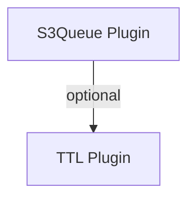

## ⚙️ Configuration

### Plugin Options

```javascript
new S3QueuePlugin({
  // === Required ===
  resource: 'tasks',              // Target resource name

  // === Processing ===
  onMessage: async (record, context) => {
    // Your processing logic
    return result;
  },

  // === Concurrency ===
  concurrency: 3,                 // Number of parallel workers
  pollInterval: 1000,             // Poll every 1 second
  pollBatchSize: 32,              // Max messages fetched per poll
  maxPollInterval: 10000,         // Backoff ceiling when queue is idle
  visibilityTimeout: 30000,       // 30 seconds invisible time
  recoveryInterval: 5000,         // Scan for stalled messages every 5s
  recoveryBatchSize: 20,          // Max recovered per scan
  processedCacheTTL: 30000,       // Deduplication cache TTL in ms

  // === Retries ===
  maxAttempts: 3,                 // Retry up to 3 times
  deadLetterResource: 'failed',   // Where to move failed messages

  // === Lifecycle ===
  autoStart: true,                // Start workers immediately
  verbose: false,                 // Enable debug logging

  // === Callbacks ===
  onError: (error, record) => {
    // Handle errors
  },
  onComplete: (record, result) => {
    // Handle success
  }
});
```

Key tuning knobs:

- `pollBatchSize` – caps how many pending items each worker fetches per poll.
- `maxPollInterval` – enables adaptive polling when the queue is empty.
- `recoveryInterval` – controls how often the plugin scans for stalled messages.
- `recoveryBatchSize` – limits how many stalled entries are recovered per sweep.
- `processedCacheTTL` – how long dedup markers live across workers.

> 🧭 Custom names are respected. If you pass `queueResource: 'tasks_queue'` or `deadLetterResource: 'dead_tasks'`, the plugin keeps those aliases available under `database.resources` while still provisioning the namespaced `plg_*` helpers it uses internally. To opt into namespacing for overrides, prefix them with `plg_...`.

### Configuration Patterns

#### Dependency Graph



#### Pattern 1: High Throughput

```javascript
new S3QueuePlugin({
  resource: 'analytics_events',
  concurrency: 20,           // Many parallel workers
  pollInterval: 100,         // Fast polling
  visibilityTimeout: 10000,  // Short timeout
  maxAttempts: 1,            // Don't retry (analytics)
  onMessage: async (event) => {
    await logToAnalytics(event);
  }
});
```

#### Pattern 2: Reliable Processing

```javascript
new S3QueuePlugin({
  resource: 'payments',
  concurrency: 2,            // Conservative concurrency
  pollInterval: 5000,        // Slower polling
  visibilityTimeout: 300000, // 5 minute timeout
  maxAttempts: 5,            // Multiple retries
  deadLetterResource: 'failed_payments',
  onMessage: async (payment) => {
    await processPayment(payment);
  },
  onError: async (error, payment) => {
    await alertAdmins(error, payment);
  }
});
```

#### Pattern 3: Heavy Processing

```javascript
new S3QueuePlugin({
  resource: 'video_encoding',
  concurrency: 1,             // One at a time (CPU intensive)
  pollInterval: 10000,        // Check every 10s
  visibilityTimeout: 1800000, // 30 minute timeout
  maxAttempts: 2,             // One retry
  onMessage: async (video) => {
    await ffmpeg.encode(video.path);
  }
});
```

---

## 🎪 Real-World Use Cases

### Use Case 1: E-Commerce Order Processing

```javascript
// Order workflow: payment → inventory → shipping → notification

const orders = await db.createResource({
  name: 'orders',
  attributes: {
    id: 'string|required',
    userId: 'string|required',
    items: 'json|required',
    total: 'number|required',
    status: 'string|default:pending'
  }
});

const orderQueue = new S3QueuePlugin({
  resource: 'orders',
  concurrency: 10,
  maxAttempts: 3,
  deadLetterResource: 'failed_orders',

  onMessage: async (order) => {
    // 1. Charge payment
    const payment = await stripe.charges.create({
      amount: order.total,
      customer: order.userId
    });

    // 2. Update inventory
    await Promise.all(
      order.items.map(item =>
        inventory.decrement(item.productId, item.quantity)
      )
    );

    // 3. Create shipment
    const shipment = await shipping.create({
      orderId: order.id,
      items: order.items
    });

    // 4. Send confirmation email
    await emails.enqueue({
      to: order.userEmail,
      subject: `Order ${order.id} confirmed`,
      template: 'order-confirmation',
      data: { order, shipment }
    });

    return {
      paymentId: payment.id,
      shipmentId: shipment.id
    };
  },

  onError: async (error, order) => {
    // Refund if payment succeeded
    if (error.code === 'INVENTORY_UNAVAILABLE') {
      await stripe.refunds.create({ charge: error.paymentId });
    }

    // Notify customer
    await emails.enqueue({
      to: order.userEmail,
      subject: `Order ${order.id} failed`,
      template: 'order-failed',
      data: { order, error: error.message }
    });
  }
});

await db.usePlugin(orderQueue);
```

### Use Case 2: Webhook Delivery System

```javascript
import { PluginError } from 's3db.js';

const webhooks = await db.createResource({
  name: 'webhooks',
  attributes: {
    id: 'string|required',
    url: 'string|required',
    event: 'string|required',
    payload: 'json',
    signature: 'string'
  }
});

const webhookQueue = new S3QueuePlugin({
  resource: 'webhooks',
  concurrency: 50,           // High concurrency for webhooks
  maxAttempts: 5,            // Retry multiple times
  visibilityTimeout: 30000,

  onMessage: async (webhook) => {
    const response = await fetch(webhook.url, {
      method: 'POST',
      headers: {
        'Content-Type': 'application/json',
        'X-Signature': webhook.signature,
        'X-Event': webhook.event
      },
      body: JSON.stringify(webhook.payload),
      timeout: 10000
    });

    if (!response.ok) {
      throw new PluginError('Webhook delivery failed', {
        statusCode: response.status,
        retriable: response.status >= 500,
        suggestion: response.status >= 500
          ? 'Keep the message in the queue—S3Queue will retry automatically.'
          : 'Fix the consumer endpoint; consider moving the event to the dead-letter queue.',
        metadata: { endpoint: webhook.url }
      });
    }

    return {
      status: response.status,
      deliveredAt: new Date().toISOString()
    };
  },

  onError: (error, webhook) => {
    console.error(`Webhook delivery failed: ${webhook.url}`, error);
  }
});

await db.usePlugin(webhookQueue);

// Trigger webhooks from your app
app.post('/api/users', async (req, res) => {
  const user = await users.insert(req.body);

  // Enqueue webhook delivery
  await webhooks.enqueue({
    url: 'https://customer-app.com/webhooks',
    event: 'user.created',
    payload: user,
    signature: generateSignature(user)
  });

  res.json(user);
});
```

### Use Case 3: Image Processing Pipeline

```javascript
const images = await db.createResource({
  name: 'images',
  attributes: {
    id: 'string|required',
    originalUrl: 'string|required',
    sizes: 'json|default:[]'
  }
});

const imageQueue = new S3QueuePlugin({
  resource: 'images',
  concurrency: 3,  // CPU intensive
  visibilityTimeout: 120000, // 2 minutes
  maxAttempts: 2,

  onMessage: async (image) => {
    const original = await downloadImage(image.originalUrl);

    const sizes = [
      { name: 'thumbnail', width: 150, height: 150 },
      { name: 'medium', width: 800, height: 600 },
      { name: 'large', width: 1920, height: 1080 }
    ];

    const results = await Promise.all(
      sizes.map(async (size) => {
        const resized = await sharp(original)
          .resize(size.width, size.height, {
            fit: 'cover',
            position: 'center'
          })
          .toBuffer();

        const url = await uploadToS3(resized, `${image.id}-${size.name}.jpg`);

        return { ...size, url };
      })
    );

    // Update original record
    await images.update(image.id, {
      sizes: results,
      processed: true
    });

    return results;
  }
});

await db.usePlugin(imageQueue);
```

### Use Case 4: Data Export System

```javascript
const exports = await db.createResource({
  name: 'exports',
  attributes: {
    id: 'string|required',
    userId: 'string|required',
    type: 'string|required',  // 'csv', 'json', 'excel'
    filters: 'json',
    downloadUrl: 'string|optional'
  }
});

const exportQueue = new S3QueuePlugin({
  resource: 'exports',
  concurrency: 2,  // Heavy queries
  visibilityTimeout: 600000, // 10 minutes
  maxAttempts: 1,  // Don't retry (user can request again)

  onMessage: async (exportJob) => {
    // 1. Query data based on filters
    const data = await database.query({
      table: exportJob.type,
      where: exportJob.filters,
      limit: 100000
    });

    // 2. Generate file
    let file;
    switch (exportJob.format) {
      case 'csv':
        file = await generateCSV(data);
        break;
      case 'json':
        file = JSON.stringify(data, null, 2);
        break;
      case 'excel':
        file = await generateExcel(data);
        break;
    }

    // 3. Upload to S3
    const url = await s3.upload({
      Bucket: 'exports',
      Key: `${exportJob.userId}/${exportJob.id}.${exportJob.format}`,
      Body: file,
      Expires: new Date(Date.now() + 7 * 24 * 60 * 60 * 1000) // 7 days
    });

    // 4. Send download link
    await emails.enqueue({
      to: exportJob.userEmail,
      subject: 'Your export is ready',
      template: 'export-ready',
      data: { downloadUrl: url }
    });

    return { downloadUrl: url };
  },

  onComplete: async (exportJob, result) => {
    // Update export record with download URL
    await exports.update(exportJob.id, {
      downloadUrl: result.downloadUrl,
      completedAt: new Date().toISOString()
    });
  }
});

await db.usePlugin(exportQueue);
```

