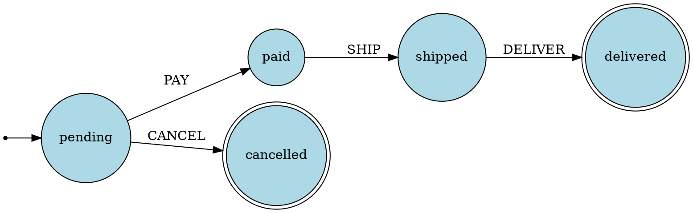

# StateMachinePlugin

Persistent, event-driven finite state machines with guards, hooks, triggers, retry, concurrency control, and full transition history -- built on top of s3db.js resources.

## Quick Start

```javascript
import { Database, StateMachinePlugin } from 's3db.js'

const db = new Database({ connectionString: 'memory://fsm' })

const sm = new StateMachinePlugin({
  stateMachines: {
    order: {
      initialState: 'pending',
      states: {
        pending:    { on: { PAY: 'paid', CANCEL: 'cancelled' } },
        paid:       { on: { SHIP: 'shipped' } },
        shipped:    { on: { DELIVER: 'delivered' } },
        delivered:  { type: 'final' },
        cancelled:  { type: 'final' }
      }
    }
  }
})

await db.usePlugin(sm)

const result = await sm.send('order', 'order-1', 'PAY')
// { ok: true, from: 'pending', to: 'paid', stateVersion: 1, ... }

const state = await sm.getState('order', 'order-1')
// 'paid'
```

## Feature Overview

| Feature | Description | Section |
|---------|-------------|---------|
| States & Events | Define states, events, and transitions declaratively | [Core Concepts](#core-concepts) |
| Guards | Async functions that block transitions when they return `false` | [Guards](#guards) |
| Lifecycle Hooks | 12 hook points across the transition pipeline | [Lifecycle Hooks](#lifecycle-hooks) |
| Machine Context | Accumulated key-value store persisted across transitions | [Accumulated Context](#accumulated-context) |
| Wildcards | `*` state handles events from any non-final state | [Wildcard Transitions](#wildcard-transitions) |
| Conditional Targets | Route to different states based on guard evaluation | [Conditional Transitions](#conditional-transitions) |
| State TTL | Auto-fire events after a duration (e.g. `"30m"`, `"2h"`) | [State TTL](#state-ttl) |
| Triggers | Cron, date, function, and event-based automatic transitions | [Triggers](#triggers) |
| Resource Binding | `resource.state.send()` proxy with auto-cleanup | [Resource Attachment](#resource-attachment) |
| Concurrency | Serial (locked) or parallel mode with conflict policies | [Concurrency](#concurrency) |
| Retry | Exponential/linear/fixed backoff with error classification | [Retry & Error Handling](#retry--error-handling) |
| Diagnostics | Validate definitions, detect dead/orphan states | [Diagnostics & Visualization](#diagnostics--visualization) |
| Visualization | Generate Graphviz DOT output from any machine | [Diagnostics & Visualization](#diagnostics--visualization) |
| Transition History | Query, filter, paginate, and count past transitions | [Transition History](#transition-history) |
| Snapshots | Full entity state snapshot including context and trigger counts | [Transition History](#transition-history) |
| Testing Helpers | `assertTransition()` and `assertReject()` for test assertions | [Testing Helpers](#testing-helpers) |

---

## Core Concepts

### States

A state is a named node in the machine. Every machine must have an `initialState` and at least one state definition. Mark terminal states with `type: 'final'`.

```javascript
states: {
  draft:     { on: { SUBMIT: 'review' } },
  review:    { on: { APPROVE: 'published', REJECT: 'draft' } },
  published: { type: 'final' }
}
```

### Events

Events are strings that trigger transitions. You send them with `send()`.

```javascript
await sm.send('article', 'art-42', 'SUBMIT')
await sm.send('article', 'art-42', 'APPROVE')
```

### Transitions

A transition is the movement from one state to another in response to an event. The simplest form maps an event name to a target state string.

```javascript
// String shorthand
pending: { on: { PAY: 'paid' } }

// Object form (needed for guards/hooks)
pending: {
  on: {
    PAY: { target: 'paid', guard: 'hasBalance' }
  }
}
```

### Guards

Guards are async functions that receive the event context and return `true` to allow or `false` to block the transition. Register them by name.

```javascript
const sm = new StateMachinePlugin({
  guards: {
    hasBalance: async (ctx, event, { entity }) => {
      return entity.balance >= ctx.amount
    },
    isAdmin: async (ctx, event, { entity }) => {
      return entity.role === 'admin'
    }
  },
  stateMachines: {
    payment: {
      initialState: 'pending',
      states: {
        pending: {
          on: {
            PAY: { target: 'paid', guard: 'hasBalance' }
          }
        },
        paid: { type: 'final' }
      }
    }
  }
})
```

When a guard returns `false`, the result is `{ ok: false, code: 'GUARD_REJECTED' }`.

Guards can also be defined at the state level using the `guards` map. This is an alternative syntax that associates guards with events.

```javascript
pending: {
  on: { PAY: 'paid' },
  guards: { PAY: 'hasBalance' }
}
```

### Actions

Actions are async functions that execute side effects during transitions. They receive the same context as guards plus an `assign()` function for updating machine context.

```javascript
const sm = new StateMachinePlugin({
  actions: {
    sendReceipt: async (ctx, event, { entity, database }) => {
      await database.resources.emails.insert({
        to: entity.email,
        subject: 'Payment received',
        body: `Order ${entity.id} confirmed.`
      })
    },
    recordTimestamp: async (ctx, event, { assign }) => {
      assign({ paidAt: new Date().toISOString() })
    }
  }
})
```

### The ActionContext Object

Every guard, action, and hook receives an `ActionContext` as the third argument.

| Field | Type | Description |
|-------|------|-------------|
| `database` | `Database` | The s3db database instance |
| `machineId` | `string` | Current machine identifier |
| `entityId` | `string` | Current entity identifier |
| `resource` | `Resource \| null` | The attached resource (if bound) |
| `entity` | `Record \| null` | The entity record from the resource |
| `machineContext` | `Record` | Accumulated machine context |
| `assign` | `(partial) => void` | Merge values into machine context |

---

## Lifecycle Hooks

Every transition passes through a deterministic pipeline. Hooks marked *cancellable* can reject the transition by returning `false` or throwing an error. Hooks that run after persistence cannot cancel -- the state has already changed.

### The 11-Step Pipeline

```
1.  machine.hooks.beforeTransition     (cancellable)
2.  fromState.beforeLeave              (cancellable)
3.  targetState.beforeEnter            (cancellable)
4.  edge.beforeTransition              (cancellable)
5.  machine.hooks.beforeFinalize       (cancellable, only if target is final)
6.  ─── PERSIST STATE CHANGE ───
7.  fromState.afterLeave
8.  targetState.afterEnter
9.  edge.afterTransition
10. machine.hooks.afterFinalize        (only if target is final)
11. machine.hooks.afterTransition
```

If any cancellable hook rejects, `machine.hooks.afterReject` fires.
If any post-persist hook throws, `machine.hooks.afterError` fires.

### State-Level Hooks

Defined on individual state configurations. `beforeLeave` and `beforeEnter` are cancellable. `afterLeave` and `afterEnter` are not.

```javascript
states: {
  review: {
    beforeEnter: 'validateSubmission',
    afterEnter: 'notifyReviewers',
    beforeLeave: 'checkReviewComplete',
    afterLeave: 'archiveReview',
    on: { APPROVE: 'published', REJECT: 'draft' }
  }
}
```

Multiple actions run in sequence.

```javascript
review: {
  afterEnter: ['notifyReviewers', 'startSLA'],
  on: { APPROVE: 'published' }
}
```

### Legacy Aliases

`entry` is an alias for `afterEnter`. `exit` is an alias for `beforeLeave`. Both are supported but the explicit names are preferred.

```javascript
// These are equivalent
review: { entry: 'notifyReviewers' }
review: { afterEnter: 'notifyReviewers' }
```

If both `entry` and `afterEnter` are set, actions are merged (deduplicated). The diagnostics engine warns about duplicates.

### Machine-Level Hooks

Defined in `machine.hooks`. These fire for every transition in the machine.

```javascript
stateMachines: {
  order: {
    initialState: 'pending',
    hooks: {
      beforeTransition: 'logTransitionStart',
      afterTransition: 'logTransitionEnd',
      beforeFinalize: 'validateFinalState',
      afterFinalize: 'cleanupResources',
      afterReject: 'logRejection',
      afterError: 'alertOps',
      afterInitialize: 'welcomeEntity',
      afterDelete: 'cleanupExternal'
    },
    states: { /* ... */ }
  }
}
```

| Hook | Fires when | Cancellable |
|------|------------|-------------|
| `beforeTransition` | Before any transition starts | Yes |
| `afterTransition` | After any transition completes | No |
| `beforeFinalize` | Before entering a final state | Yes |
| `afterFinalize` | After entering a final state | No |
| `afterReject` | After a transition is rejected (guard, hook, conflict) | No |
| `afterError` | After a post-persist hook throws | No |
| `afterInitialize` | After `initializeEntity()` completes | No |
| `afterDelete` | After `deleteEntity()` completes | No |

### Edge-Level Hooks

Defined on individual transition edges. These run only for that specific transition.

```javascript
pending: {
  on: {
    ESCALATE: {
      target: 'urgent',
      beforeTransition: 'checkEscalationPolicy',
      afterTransition: ['notifyManager', 'createIncident']
    }
  }
}
```

### Cancellation from a Hook

Any cancellable hook can block the transition by returning `false`.

```javascript
actions: {
  checkBusinessHours: async (ctx, event, { assign }) => {
    const hour = new Date().getHours()
    if (hour < 9 || hour > 17) return false  // rejects the transition
  }
}
```

The result is `{ ok: false, code: 'HOOK_REJECTED', details: { hook: 'beforeLeave', action: 'checkBusinessHours' } }`.

---

## Accumulated Context

Each entity has a **machine context** -- a persistent key-value store that survives across transitions. Use `assign()` inside any action or hook to update it.

```javascript
actions: {
  trackApproval: async (ctx, event, { assign, machineContext }) => {
    const approvals = machineContext.approvals || []
    assign({
      approvals: [...approvals, { by: ctx.approvedBy, at: new Date().toISOString() }]
    })
  }
}
```

Machine context is persisted to the state resource after each transition. Read it back via snapshot.

```javascript
const snapshot = await sm.getSnapshot('order', 'order-1')
console.log(snapshot.context)
// { approvals: [{ by: 'alice', at: '2026-03-30T...' }] }
```

**Machine context vs. event context.** The event context (`ctx` first argument) is ephemeral -- it contains the data passed in the `send()` call. Machine context (`machineContext`) accumulates across the entity's lifetime.

---

## Wildcard Transitions

The `*` state defines transitions that apply from **any** non-final state. This is useful for global events like `CANCEL` or `RESET`.

```javascript
states: {
  pending:   { on: { PAY: 'paid' } },
  paid:      { on: { SHIP: 'shipped' } },
  shipped:   { on: { DELIVER: 'delivered' } },
  delivered: { type: 'final' },
  cancelled: { type: 'final' },
  '*': {
    on: { CANCEL: 'cancelled' }
  }
}
```

Now `CANCEL` works from `pending`, `paid`, and `shipped` -- but not from `delivered` or `cancelled` (final states are excluded).

State-specific events take priority over wildcard events. If `paid` defines its own `CANCEL` handler, the wildcard version is ignored for that state.

---

## Conditional Transitions

When an event can lead to different states depending on context, use an array of `ConditionalTarget` objects. The first target whose guard returns `true` wins. A target without a guard acts as the default fallback.

```javascript
stateMachines: {
  invoice: {
    initialState: 'pending',
    states: {
      pending: {
        on: {
          PROCESS: [
            { target: 'flagged', guard: 'isSuspicious' },
            { target: 'approved', guard: 'isAutoApprovable' },
            { target: 'review' }  // default fallback (no guard)
          ]
        }
      },
      flagged:  { on: { REVIEW: 'review' } },
      approved: { type: 'final' },
      review:   { on: { APPROVE: 'approved', REJECT: 'rejected' } },
      rejected: { type: 'final' }
    }
  }
},
guards: {
  isSuspicious: async (ctx) => ctx.amount > 10000,
  isAutoApprovable: async (ctx) => ctx.amount < 100
}
```

If no target matches, the result is `{ ok: false, code: 'NO_MATCHING_TARGET' }`.

---

## State TTL

States can auto-expire after a duration. When the TTL elapses, the plugin sends the specified event automatically.

```javascript
states: {
  pending: {
    ttl: { after: '30m', send: 'TIMEOUT' },
    on: {
      PAY: 'paid',
      TIMEOUT: 'expired'
    }
  },
  paid:    { type: 'final' },
  expired: { type: 'final' }
}
```

Supported duration formats: `"100ms"`, `"30s"`, `"5m"`, `"2h"`, `"1d"`, or raw milliseconds as a number.

If the entity leaves the state before the TTL fires, the timer is cancelled automatically.

### Persistent TTL

When `persistTransitions: true`, TTL data is embedded in the state record (`_ttlExpiresAt`, `_ttlEvent`) at zero extra S3 cost. A periodic poller checks for expired entries instead of using `setTimeout`. This means TTL timers **survive process restarts**.

```javascript
new StateMachinePlugin({
  persistTransitions: true,
  ttlCheckInterval: 600000,  // poll every 10 minutes (default)
  stateMachines: { /* ... */ }
});
```

On startup, the plugin recovers pending TTLs by querying entities in TTL-enabled states.

| Mode | Mechanism | Survives restart | Precision |
|------|-----------|-----------------|-----------|
| `persistTransitions: false` | `setTimeout` (in-memory) | No | Exact (ms) |
| `persistTransitions: true` | Polling + state record | Yes | Up to `ttlCheckInterval` delay |

For TTLs shorter than `ttlCheckInterval`, reduce the interval accordingly. TTL is ignored on `final` states.

---

## Triggers

Triggers execute actions or transitions automatically based on external conditions. There are four types.

### Cron Trigger

Runs on a cron schedule. Requires `enableScheduler: true`.

```javascript
const sm = new StateMachinePlugin({
  enableScheduler: true,
  actions: {
    sendReminder: async (ctx, event, { entity, database }) => {
      await database.resources.notifications.insert({
        to: entity.email,
        message: 'Your trial expires soon!'
      })
    }
  },
  stateMachines: {
    subscription: {
      initialState: 'trial',
      states: {
        trial: {
          triggers: [{
            type: 'cron',
            schedule: '0 9 * * *',  // daily at 9am
            action: 'sendReminder'
          }],
          on: { CONVERT: 'active', EXPIRE: 'expired' }
        },
        active:  { type: 'final' },
        expired: { type: 'final' }
      }
    }
  }
})
```

### Date Trigger

Fires when a date field in the entity context reaches the current time. Checked on an interval (default: 60 seconds).

```javascript
trial: {
  triggers: [{
    type: 'date',
    field: 'expiresAt',         // read from entity context
    action: 'notifyExpiry',
    sendEvent: 'EXPIRE'         // send this event after action
  }],
  on: { EXPIRE: 'expired' }
}
```

### Function Trigger

Runs a condition function on an interval. If the condition returns `true`, the action executes.

```javascript
processing: {
  triggers: [{
    type: 'function',
    interval: 5000,  // check every 5s
    condition: async (ctx, entityId) => {
      const job = await checkExternalJob(entityId)
      return job.status === 'complete'
    },
    targetState: 'complete'  // transition directly
  }],
  on: { COMPLETE: 'complete' }
}
```

### Event Trigger

Reacts to s3db resource events or database events.

```javascript
// Listen to a resource's events
awaiting_payment: {
  triggers: [{
    type: 'event',
    eventSource: paymentsResource,     // a s3db Resource
    eventName: 'inserted',             // resource event
    condition: async (ctx, entityId, eventData) => {
      return eventData?.orderId === entityId
    },
    sendEvent: 'PAYMENT_RECEIVED'
  }],
  on: { PAYMENT_RECEIVED: 'paid' }
}
```

Listen to database-level events by prefixing with `db:`.

```javascript
triggers: [{
  type: 'event',
  eventName: 'db:resource:created',
  action: 'handleNewResource'
}]
```

### Trigger Options

All trigger types share these options.

| Option | Type | Description |
|--------|------|-------------|
| `action` | `string` | Action to execute when triggered |
| `targetState` | `string` | Transition directly to this state (alternative to action) |
| `sendEvent` | `string` | Send this event after the action completes |
| `eventOnSuccess` | `string` | Alias for `sendEvent` |
| `condition` | `(ctx, entityId, eventData?) => boolean` | Only execute if condition returns `true` |
| `maxTriggers` | `number` | Maximum number of times this trigger can fire per entity |
| `onMaxTriggersReached` | `string` | Event to send when the max trigger count is hit |

---

## Resource Attachment

Bind a state machine to a s3db resource. This gives you a `resource.state` proxy for ergonomic access, auto-syncs a state field, and optionally cleans up state data when entities are deleted.

### Via Machine Config

```javascript
const sm = new StateMachinePlugin({
  stateMachines: {
    ticket: {
      initialState: 'open',
      resource: 'tickets',      // resource name
      stateField: 'status',     // sync state to this field
      autoCleanup: true,        // delete state on resource.delete()
      states: {
        open:     { on: { CLOSE: 'closed', ESCALATE: 'escalated' } },
        escalated: { on: { CLOSE: 'closed' } },
        closed:   { type: 'final' }
      }
    }
  }
})
```

### Via Resource Schema

You can also bind from the resource side using `$schema.stateMachine`.

```javascript
const tickets = await db.createResource({
  name: 'tickets',
  attributes: { title: 'string', status: 'string' },
  $schema: {
    stateMachine: {
      machine: 'ticket',
      stateField: 'status',
      autoCleanup: true
    }
  }
})
```

Or as a simple string (uses defaults).

```javascript
$schema: { stateMachine: 'ticket' }
```

If the resource has a `status` attribute, the plugin auto-detects it as the state field.

### The resource.state Proxy

Once bound, the resource gains a `.state` property.

```javascript
// Send event
await tickets.state.send('ticket-1', 'CLOSE')

// Read current state
const state = await tickets.state.get('ticket-1')

// Check if an event is valid
const canClose = await tickets.state.canTransition('ticket-1', 'CLOSE')

// Valid events for current state
const events = await tickets.state.getValidEvents('ticket-1')

// Initialize entity state
await tickets.state.initialize('ticket-1', { priority: 'high' })

// Transition history
const history = await tickets.state.history('ticket-1', { limit: 10 })

// Advanced queries
const transitions = await tickets.state.transitions('ticket-1', {
  fromState: 'open',
  sort: 'asc'
})

// Single transition by ID
const t = await tickets.state.transition('ticket-1', 'txn-id')

// Count transitions
const count = await tickets.state.transitionCount('ticket-1', { event: 'CLOSE' })

// Last N transitions
const recent = await tickets.state.getLastTransitions('ticket-1', 5)

// Full snapshot
const snap = await tickets.state.snapshot('ticket-1')

// Delete entity state + history
await tickets.state.delete('ticket-1')
```

---

## Concurrency

Control how the plugin handles simultaneous transitions on the same entity.

### Serial Mode (default)

Transitions acquire a lock. If another transition is in progress, the request waits up to `lockTimeout` ms, then fails with `TRANSITION_LOCK_TIMEOUT`.

```javascript
const sm = new StateMachinePlugin({
  concurrency: { mode: 'serial', conflict: 'reject' },
  lockTimeout: 2000,  // wait up to 2s for lock
  lockTTL: 5,         // lock expires after 5s
  workerId: 'worker-1',
  // ...
})
```

### Parallel Mode

No locking. Transitions execute immediately. Use `conflict: 'drop'` to silently discard conflicts or `conflict: 'reject'` to get an error.

```javascript
concurrency: { mode: 'parallel', conflict: 'drop' }
```

### Per-Machine Override

Each machine can override the global concurrency setting.

```javascript
stateMachines: {
  order: {
    initialState: 'pending',
    concurrency: { mode: 'serial', conflict: 'reject' },
    states: { /* ... */ }
  },
  analytics: {
    initialState: 'idle',
    concurrency: { mode: 'parallel', conflict: 'drop' },
    states: { /* ... */ }
  }
}
```

### State Versioning

Every transition increments a `stateVersion` counter. You can require a specific version to prevent lost updates (optimistic concurrency).

```javascript
const result = await sm.send('order', 'order-1', 'PAY', {
  stateVersion: 3  // only proceed if current version is 3
})
// If version is 4, result is { ok: false, code: 'STATE_VERSION_MISMATCH' }
```

---

## Retry & Error Handling

### RetryConfig

When an action throws, the plugin can retry it automatically using configurable backoff.

```javascript
const sm = new StateMachinePlugin({
  retryConfig: {
    maxAttempts: 3,
    backoffStrategy: 'exponential',  // or 'linear', 'fixed'
    baseDelay: 1000,
    maxDelay: 30000,
    retryableErrors: ['ECONNREFUSED', 'ETIMEDOUT'],
    nonRetriableErrors: ['ValidationError'],
    onRetry: async (attempt, error, ctx) => {
      console.log(`Retry ${attempt}: ${error.message}`)
    }
  },
  // ...
})
```

| Option | Type | Default | Description |
|--------|------|---------|-------------|
| `maxAttempts` | `number` | `0` (disabled) | Maximum retry attempts |
| `backoffStrategy` | `string` | `'exponential'` | `'exponential'`, `'linear'`, or `'fixed'` |
| `baseDelay` | `number` | `1000` | Base delay in ms |
| `maxDelay` | `number` | `30000` | Maximum delay cap in ms |
| `retryableErrors` | `string[]` | `[]` | Error codes/names to always retry |
| `nonRetriableErrors` | `string[]` | `[]` | Error codes/names to never retry |
| `onRetry` | `function` | `undefined` | Callback before each retry attempt |

### Retry Hierarchy

Retry config can be set at three levels. More specific levels override less specific ones.

```javascript
// 1. Plugin level (global default)
new StateMachinePlugin({ retryConfig: { maxAttempts: 2 } })

// 2. Machine level
stateMachines: {
  order: {
    retryConfig: { maxAttempts: 5 },
    states: { /* ... */ }
  }
}

// 3. State level (most specific)
states: {
  processing: {
    retryConfig: {
      maxAttempts: 10,
      backoffStrategy: 'linear',
      baseDelay: 500
    },
    on: { COMPLETE: 'done' }
  }
}
```

### ErrorClassifier

The plugin uses an `ErrorClassifier` to automatically categorize errors.

**Auto-retriable:** Network errors (`ECONNREFUSED`, `ETIMEDOUT`, `ECONNRESET`), AWS throttling (`ThrottlingException`, `SlowDown`), HTTP status codes `429`, `500`, `502`, `503`, `504`.

**Auto-non-retriable:** `ValidationError`, `SchemaError`, `AuthenticationError`, `PermissionError`, HTTP status codes `400`, `401`, `403`, `404`.

### Events Emitted During Retry

| Event | Payload | When |
|-------|---------|------|
| `plg:state-machine:action-retry-attempt` | `{ machineId, entityId, action, attempt, delay, error }` | Before each retry |
| `plg:state-machine:action-retry-success` | `{ machineId, entityId, action, attempts }` | After a retry succeeds |
| `plg:state-machine:action-retry-exhausted` | `{ machineId, entityId, action, attempts, error }` | After all retries fail |
| `plg:state-machine:action-error-non-retriable` | `{ machineId, entityId, action, error }` | When a non-retriable error hits |

---

## Diagnostics & Visualization

### getMachineDefinitionDiagnostics()

Validates a machine definition and reports errors and warnings without attempting a transition.

```javascript
const diag = sm.getMachineDefinitionDiagnostics('order')
console.log(diag)
// {
//   machineId: 'order',
//   errors: [],
//   warnings: [
//     { code: 'UNREACHABLE_STATE', message: "State 'archived' is unreachable...", state: 'archived' }
//   ],
//   stats: { states: 5, transitions: 6, deadStates: [], unreachableStates: ['archived'] }
// }
```

Get diagnostics for all machines at once.

```javascript
const all = sm.getDefinitionDiagnostics()
// { order: { ... }, invoice: { ... } }
```

### Diagnostic Issue Codes

| Code | Severity | Meaning |
|------|----------|---------|
| `MISSING_TARGET_STATE` | Error | Transition points to an undefined state |
| `MISSING_GUARD` | Error | Guard referenced but not registered |
| `MISSING_ACTION` | Error | Entry/exit action not registered |
| `MISSING_HOOK_ACTION` | Error | Hook action not registered |
| `DUPLICATE_HOOK_ACTION` | Warning | Same action in both legacy and modern hook |
| `STATE_WITHOUT_TRANSITIONS` | Warning | Non-final state has no outgoing events |
| `UNREACHABLE_STATE` | Warning | State cannot be reached from initial state |
| `ORPHAN_STATE` | Warning | State has no incoming transitions |

Errors are fatal -- the plugin refuses to initialize if any exist. Warnings are logged but allowed.

### visualize()

Generates a [Graphviz DOT](https://graphviz.org/) string for any machine.

```javascript
const dot = sm.visualize('order')
console.log(dot)
```

Output:



Final states render as double circles. Use `meta.color` to customize fill colors.

```javascript
delivered: { type: 'final', meta: { color: 'green' } }
```

Render the DOT string with any Graphviz tool, online at [dreampuf.github.io/GraphvizOnline](https://dreampuf.github.io/GraphvizOnline/), or programmatically via `@hpcc-js/wasm`.

---

## Transition History

Every transition is logged to a dedicated s3db resource (partitioned by machine, entity, and date) when `persistTransitions` is `true` (the default).

### Query Transitions

```javascript
// All transitions (descending by default)
const all = await sm.getTransitions('order', 'order-1')

// With filters
const filtered = await sm.getTransitions('order', 'order-1', {
  event: 'PAY',                // filter by event name
  fromState: 'pending',        // filter by source state
  toState: 'paid',             // filter by target state
  from: '2026-01-01T00:00:00Z', // timestamp range start
  to: '2026-12-31T23:59:59Z',  // timestamp range end
  sort: 'asc',                 // 'asc' or 'desc'
  limit: 10,
  offset: 0
})
```

### Convenience Methods

```javascript
// Last N transitions
const last5 = await sm.getLastTransitions('order', 'order-1', 5)

// Legacy-compatible (defaults: limit 50, desc)
const history = await sm.getTransitionHistory('order', 'order-1', {
  limit: 20,
  offset: 0
})

// Count (with optional filters)
const count = await sm.getTransitionCount('order', 'order-1', {
  event: 'PAY'
})

// Single transition by ID
const t = await sm.getTransition('order', 'order-1', 'txn-id')
```

### TransitionHistoryEntry Shape

```javascript
{
  id: 'order_order-1_2026-03-30T12:00:00.000Z_a1b2c3',
  machineId: 'order',
  entityId: 'order-1',
  from: 'pending',
  to: 'paid',
  event: 'PAY',
  context: { amount: 99.99 },
  timestamp: '2026-03-30T12:00:00.000Z'
}
```

### Snapshots

A snapshot captures the full current state of an entity including accumulated context, trigger counts, and the last transition ID.

```javascript
const snap = await sm.getSnapshot('order', 'order-1')
// {
//   machineId: 'order',
//   entityId: 'order-1',
//   state: 'paid',
//   stateVersion: 3,
//   context: { paidAt: '2026-03-30T...' },
//   lastTransition: 'order_order-1_2026-03-30T...',
//   triggerCounts: { sendReminder_0: 2 },
//   updatedAt: '2026-03-30T12:00:00.000Z',
//   persisted: true
// }
```

---

## Testing Helpers

### assertTransition()

Sends an event and throws if the transition does not succeed or does not land in the expected state.

```javascript
const result = await sm.assertTransition({
  machineId: 'order',
  entityId: 'order-1',
  event: 'PAY',
  from: 'pending',       // optional: assert source state
  to: 'paid',            // required: assert target state
  stateVersion: 1,       // optional: assert version
  context: { amount: 50 }
})
// Throws with detailed diff if any assertion fails
```

### assertReject()

Sends an event and throws if the transition does not reject, or if the rejection code/reason does not match.

```javascript
const result = await sm.assertReject({
  machineId: 'order',
  entityId: 'order-1',
  event: 'PAY',
  code: 'GUARD_REJECTED',   // optional: assert rejection code
  reason: 'MISSING_REQUIRED_FIELD', // optional: assert reason
  from: 'pending',          // optional: assert source state
  context: { amount: 0 }
})
// Throws if transition succeeds or rejects with a different code
```

Both methods throw a `[state-machine contract]` error with a `details` object containing the full mismatch information -- useful for test runner output.

---

## Configuration Reference

### StateMachinePluginOptions

| Option | Type | Default | Description |
|--------|------|---------|-------------|
| `stateMachines` | `Record<string, MachineConfig>` | `{}` | Machine definitions keyed by ID |
| `actions` | `Record<string, ActionHandler>` | `{}` | Named action functions |
| `guards` | `Record<string, GuardHandler>` | `{}` | Named guard functions |
| `persistTransitions` | `boolean` | `true` | Persist state and transitions to s3db resources |
| `concurrency` | `{ mode, conflict }` | `serial/reject` | Global concurrency settings |
| `retryConfig` | `RetryConfig \| null` | `null` | Global retry configuration |
| `retryAttempts` | `number` | `3` | Persistence retry attempts (for S3 writes) |
| `retryDelay` | `number` | `100` | Persistence retry base delay in ms |
| `workerId` | `string` | `'default'` | Worker ID for lock ownership |
| `lockTimeout` | `number` | `1000` | Max wait time for lock acquisition (ms) |
| `lockTTL` | `number` | `5` | Lock time-to-live (seconds) |
| `enableScheduler` | `boolean` | `false` | Enable cron triggers (installs SchedulerPlugin) |
| `schedulerConfig` | `object` | `{}` | Forwarded to SchedulerPlugin |
| `enableDateTriggers` | `boolean` | `true` | Enable date-based triggers |
| `enableFunctionTriggers` | `boolean` | `true` | Enable function-based triggers |
| `enableEventTriggers` | `boolean` | `true` | Enable event-based triggers |
| `triggerCheckInterval` | `number` | `60000` | Polling interval for date/function triggers (ms) |
| `ttlCheckInterval` | `number` | `600000` | Polling interval for persistent TTL checks (ms, default 10min) |
| `resourceNames` | `{ transitionLog?, states? }` | auto | Override internal resource names |
| `logLevel` | `string` | `undefined` | Plugin log level |

### MachineConfig

| Option | Type | Default | Description |
|--------|------|---------|-------------|
| `initialState` | `string` | *required* | Starting state for new entities |
| `states` | `Record<string, StateConfig>` | *required* | State definitions |
| `hooks` | `MachineHooks` | `undefined` | Machine-level lifecycle hooks |
| `resource` | `string \| Resource` | `undefined` | Bind to a s3db resource |
| `stateField` | `string` | auto-detected | Resource field to sync state into |
| `autoCleanup` | `boolean` | `true` | Delete state data when resource entity is deleted |
| `concurrency` | `{ mode?, conflict? }` | inherits global | Per-machine concurrency override |
| `retryConfig` | `RetryConfig` | inherits global | Per-machine retry override |

### StateConfig

| Option | Type | Description |
|--------|------|-------------|
| `on` | `Record<string, target>` | Event-to-target transition map |
| `type` | `'final'` | Marks state as terminal (no outgoing transitions) |
| `guards` | `Record<string, string>` | Event-to-guard name mapping |
| `beforeLeave` | `string \| string[]` | Actions before leaving this state (cancellable) |
| `beforeEnter` | `string \| string[]` | Actions before entering this state (cancellable) |
| `afterLeave` | `string \| string[]` | Actions after leaving this state |
| `afterEnter` | `string \| string[]` | Actions after entering this state |
| `entry` | `string \| string[]` | Alias for `afterEnter` (deprecated) |
| `exit` | `string \| string[]` | Alias for `beforeLeave` (deprecated) |
| `triggers` | `TriggerConfig[]` | Automatic trigger definitions |
| `ttl` | `{ after, send }` | Auto-expire after duration |
| `retryConfig` | `RetryConfig` | State-level retry override |
| `meta` | `Record<string, unknown>` | Arbitrary metadata (used by `visualize()`) |

### TransitionEdge

| Option | Type | Description |
|--------|------|-------------|
| `target` | `string` | Target state name |
| `guard` | `string` | Guard name (must be registered) |
| `beforeTransition` | `string \| string[]` | Edge-level before hooks (cancellable) |
| `afterTransition` | `string \| string[]` | Edge-level after hooks |

---

## Rejection Codes

Every rejected transition returns `{ ok: false, code, reason }`. Here are all possible codes.

| Code | When |
|------|------|
| `MACHINE_NOT_FOUND` | The `machineId` does not match any registered machine |
| `INVALID_EVENT` | The event is not defined for the current state (or wildcard) |
| `GUARD_NOT_FOUND` | A guard is referenced but not registered in the `guards` map |
| `GUARD_REJECTED` | A guard returned `false` |
| `GUARD_ERROR` | A guard threw an exception |
| `ACTION_NOT_FOUND` | An action is referenced but not registered in the `actions` map |
| `HOOK_NOT_FOUND` | A hook action is referenced but not registered |
| `HOOK_REJECTED` | A cancellable hook returned `false` |
| `HOOK_ERROR` | A cancellable hook threw an error |
| `NO_MATCHING_TARGET` | No conditional target's guard returned `true` |
| `TRANSITION_LOCK_TIMEOUT` | Could not acquire lock within `lockTimeout` (serial mode) |
| `CONCURRENCY_CONFLICT` | Concurrent transition conflict (parallel mode) |
| `STATE_VERSION_MISMATCH` | Provided `stateVersion` does not match current version |
| `INTERNAL_ERROR` | Unexpected error during transition |

### TransitionResult Shape

**Success (`ok: true`)**

```javascript
{
  ok: true,
  machineId: 'order',
  entityId: 'order-1',
  event: 'PAY',
  from: 'pending',
  to: 'paid',
  state: 'paid',
  stateVersion: 1,
  context: { amount: 99 },
  correlationId: 'order:order-1:PAY:1711792800000:a1b2c3d4',
  startedAt: '2026-03-30T12:00:00.000Z',
  endedAt: '2026-03-30T12:00:00.050Z',
  elapsedMs: 50,
  timestamp: '2026-03-30T12:00:00.050Z',
  afterHookErrors: []  // present only if post-persist hooks failed
}
```

**Rejection (`ok: false`)**

```javascript
{
  ok: false,
  code: 'GUARD_REJECTED',
  reason: 'MISSING_REQUIRED_FIELD',
  message: "Transition blocked by guard 'hasBalance'",
  details: { currentState: 'pending', guardName: 'hasBalance', guardResult: false },
  state: 'pending',
  from: 'pending',
  to: 'paid',
  guard: 'hasBalance',
  machineId: 'order',
  entityId: 'order-1',
  event: 'PAY',
  correlationId: '...',
  startedAt: '...',
  endedAt: '...',
  elapsedMs: 2
}
```

---

## Events Emitted

The plugin emits events you can listen to on the plugin instance or the database.

| Event | Payload |
|-------|---------|
| `plg:state-machine:transition` | Full transition context (machineId, entityId, from, to, event, stateVersion, correlationId, timing) |
| `plg:state-machine:transition-rejected` | Full context + code, reason, message, details |
| `plg:state-machine:before-transition` | Pre-transition context |
| `plg:state-machine:after-transition` | Post-transition context |
| `plg:state-machine:entity-initialized` | `{ machineId, entityId, initialState }` |
| `plg:state-machine:entity-deleted` | `{ machineId, entityId }` |
| `plg:state-machine:trigger-executed` | `{ machineId, entityId, state, trigger, type }` |
| `plg:state-machine:hook-rejected` | `{ machineId, entityId, hook, action, from, to, reason }` |
| `plg:state-machine:action-error` | `{ actionName, error, machineId, entityId, event, ... }` |
| `plg:state-machine:action-retry-attempt` | `{ machineId, entityId, action, attempt, delay, error }` |
| `plg:state-machine:action-retry-success` | `{ machineId, entityId, action, attempts }` |
| `plg:state-machine:action-retry-exhausted` | `{ machineId, entityId, action, attempts, error }` |
| `plg:state-machine:action-error-non-retriable` | `{ machineId, entityId, action, error }` |

---

## Introspection API

```javascript
// List all registered machines
sm.getMachines()
// ['order', 'invoice', 'ticket']

// Get raw machine definition
sm.getMachineDefinition('order')
// { initialState: 'pending', states: { ... }, hooks: { ... } }

// Get valid events for an entity (considers current state + wildcards)
await sm.getValidEvents('order', 'order-1')
// ['PAY', 'CANCEL']

// Get valid events for a state name directly
await sm.getValidEvents('order', 'pending')
// ['PAY', 'CANCEL']

// Initialize entity with starting context
await sm.initializeEntity('order', 'order-1', { customer: 'acme' })
// 'pending'

// Delete entity state and all transition history
await sm.deleteEntity('order', 'order-1')
```

---

## Full Example: Order Processing

```javascript
import { Database, StateMachinePlugin } from 's3db.js'

const db = new Database({ connectionString: 'memory://orders' })

const orders = await db.createResource({
  name: 'orders',
  attributes: {
    customer: 'string|required',
    total: 'number|required',
    status: 'string|default:pending'
  }
})

const sm = new StateMachinePlugin({
  actions: {
    chargeCard: async (ctx, event, { entity, assign }) => {
      // const charge = await stripe.charges.create(...)
      assign({ chargedAt: new Date().toISOString(), chargeId: 'ch_mock' })
    },
    notifyWarehouse: async (ctx, event, { entity, database }) => {
      console.log(`Ship order ${entity.id} to warehouse`)
    },
    sendDeliveryEmail: async (ctx, event, { entity }) => {
      console.log(`Delivery confirmation for ${entity.customer}`)
    },
    logRejection: async (ctx, event, { machineId, entityId }) => {
      console.log(`Transition rejected: ${machineId}/${entityId}`)
    }
  },
  guards: {
    hasValidPayment: async (ctx) => !!ctx.paymentMethod,
    isHighValue: async (ctx, event, { entity }) => entity.total > 1000
  },
  stateMachines: {
    order: {
      initialState: 'pending',
      resource: 'orders',
      stateField: 'status',
      hooks: {
        afterReject: 'logRejection'
      },
      states: {
        pending: {
          ttl: { after: '24h', send: 'TIMEOUT' },
          on: {
            PAY: { target: 'paid', guard: 'hasValidPayment' },
            CANCEL: 'cancelled',
            TIMEOUT: 'expired'
          }
        },
        paid: {
          afterEnter: 'chargeCard',
          on: {
            SHIP: [
              { target: 'priority_shipping', guard: 'isHighValue' },
              { target: 'standard_shipping' }
            ]
          }
        },
        priority_shipping: {
          afterEnter: 'notifyWarehouse',
          on: { DELIVER: 'delivered' }
        },
        standard_shipping: {
          afterEnter: 'notifyWarehouse',
          on: { DELIVER: 'delivered' }
        },
        delivered: {
          type: 'final',
          afterEnter: 'sendDeliveryEmail'
        },
        cancelled: { type: 'final' },
        expired:   { type: 'final' },
        '*': {
          on: { CANCEL: 'cancelled' }
        }
      }
    }
  }
})

await db.usePlugin(sm)

// Create an order
await orders.insert({ id: 'ord-1', customer: 'acme', total: 2500 })

// Process it
await sm.send('order', 'ord-1', 'PAY', { paymentMethod: 'card_visa' })
await sm.send('order', 'ord-1', 'SHIP')   // routes to priority_shipping (total > 1000)
await sm.send('order', 'ord-1', 'DELIVER')

// Check final state
const snap = await sm.getSnapshot('order', 'ord-1')
console.log(snap.state)    // 'delivered'
console.log(snap.context)  // { chargedAt: '...', chargeId: 'ch_mock' }

// Visualize
console.log(sm.visualize('order'))
```
