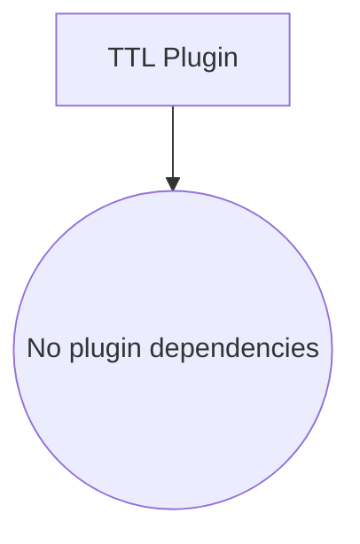

# ⏱️ TTL Plugin v2

> **Automated record expiration with O(1) indexing and flexible cleanup strategies.**
>
> **Navigation:** [← Plugin Index](./README.md) | [Configuration ↓](#-configuration-options) | [FAQ ↓](#-faq)

---

## ⚡ TLDR

**Automatic Time-To-Live cleanup** with partition-based indexing for O(1) performance.

**1 line to get started:**
```javascript
plugins: [new TTLPlugin({ resources: { sessions: { ttl: 86400, onExpire: 'soft-delete' } } })]
```

> 🧩 **Namespaces**: Provide `namespace: 'sessions'` (or an alias via `db.usePlugin`) when running multiple TTLPlugin instances. The expiration index resource becomes `plg_sessions_ttl_expiration_index`.

**Key features:**
- ✅ **O(1) cleanup via partition-based expiration index**
- ✅ **Zero full scans** - indexes records by expiration cohorts
- ✅ **Auto-granularity detection** (minute, hour, day, week)
- ✅ **Multiple intervals** - different cleanup frequencies per granularity
- ✅ 4 expiration strategies (soft-delete, hard-delete, archive, callback)
- ✅ Simple API - just TTL in most cases (auto-detects `_createdAt`)
- ✅ Event monitoring & statistics

**When to use:**
- 🗑️ Auto-delete temporary/session data
- 📦 Archive old records automatically
- 🧹 Cleanup expired uploads/caches
- 📊 Maintain database hygiene
- ⏰ Time-based data lifecycle management

**Access:**
```javascript
const stats = ttlPlugin.getStats();
console.log('Total expired:', stats.totalExpired);
console.log('Total deleted:', stats.totalDeleted);
```

---

## 🚀 Quick Start

```javascript
import { S3db, TTLPlugin } from 's3db.js';

// 1. Setup database with TTLPlugin
const db = new S3db({
  connectionString: "s3://KEY:SECRET@bucket/path",
  plugins: [
    new TTLPlugin({
      batchSize: 100,
      verbose: true,

      resources: {
        // Sessions expire after 24 hours (uses _createdAt by default)
        sessions: {
          ttl: 86400,              // 24 hours in seconds
          onExpire: 'soft-delete'  // Mark as deleted
        },

        // Temp uploads auto-delete after 1 hour
        temp_uploads: {
          ttl: 3600,               // 1 hour
          onExpire: 'hard-delete'  // Permanently remove
        },

        // Archive old orders after 30 days
        old_orders: {
          ttl: 2592000,            // 30 days
          onExpire: 'archive',
          archiveResource: 'archive_orders'
        },

        // Custom expiration field
        subscriptions: {
          field: 'endsAt',         // Absolute expiration date
          onExpire: 'soft-delete'
        }
      }
    })
  ]
});

await db.connect();

// 2. Records are automatically cleaned up!
// - Plugin creates expiration index with partitions
// - Automatic cleanup runs at intervals based on TTL granularity
// - Zero full scans - O(1) cleanup via partitions

// 3. Check statistics anytime
const stats = db.plugins.find(p => p.constructor.name === 'TTLPlugin').getStats();
console.log('Total scans:', stats.totalScans);
console.log('Total expired:', stats.totalExpired);
console.log('Last scan:', stats.lastScanAt);
```

---

## 🔀 Coordinator Mode

### Why Coordinator Mode?

In multi-pod/multi-instance deployments, we need **exactly one instance** to run cleanup intervals to avoid:
- ❌ Duplicate cleanup operations
- ❌ Race conditions when scanning expiration index
- ❌ Wasted resources from redundant cleanup work

**Coordinator Mode solves this** by automatically electing one instance as the "coordinator" responsible for running cleanup intervals. All other instances remain idle for TTL operations.

### Key Benefits

- ✅ **Automatic Election**: No manual configuration, works out-of-the-box
- ✅ **Fault Tolerance**: If coordinator dies, new one is elected automatically
- ✅ **Zero Duplication**: Only coordinator runs cleanup intervals
- ✅ **Scalable**: Add/remove instances without breaking cleanup
- ✅ **Resource Efficient**: No wasted cleanup work across instances

### Quick Example

```javascript
// Multi-instance deployment - NO changes needed!
// Instance 1
const ttlA = new TTLPlugin({
  resources: {
    sessions: { ttl: 86400, onExpire: 'soft-delete' }
  },
  enableCoordinator: true  // Enabled by default
});

// Instance 2 (same config)
const ttlB = new TTLPlugin({
  resources: {
    sessions: { ttl: 86400, onExpire: 'soft-delete' }
  },
  enableCoordinator: true
});

// Result: Only ONE instance runs cleanup intervals
```

### Configuration Options

| Option | Type | Default | Description |
|--------|------|---------|-------------|
| `enableCoordinator` | boolean | `true` | Enable coordinator mode |
| `heartbeatInterval` | number | `30000` | Heartbeat frequency (ms) |
| `coldStartObservationWindow` | number | `15000` | Observation phase duration (ms) |
| `skipColdStart` | boolean | `false` | Skip cold start (testing only!) |

### Coordinator Events

```javascript
ttl.on('plg:ttl:coordinator-elected', ({ workerId, epoch }) => {
  console.log(`New coordinator: ${workerId}`);
});

ttl.on('plg:ttl:coordinator-promoted', ({ workerId }) => {
  console.log(`This worker is now coordinator`);
});

ttl.on('plg:ttl:cleanup-started', ({ coordinatorId }) => {
  console.log(`Coordinator started cleanup intervals`);
});
```

### Learn More

📚 **[Full Coordinator Documentation →](./coordinator.md)**

Comprehensive guide covering:
- Election algorithm (lexicographic ordering)
- Epoch system (guaranteed leadership terms)
- Cold start phases (prevents race conditions)
- Troubleshooting multi-instance issues
- Implementation details for plugin developers

---

## 📋 Table of Contents

1. [📦 Dependencies](#-dependencies)
2. [🚀 Quick Start](#-quick-start)
3. [📖 Overview](#overview)
4. [✨ Key Features](#key-features)
5. [⚙️ Configuration Options](#configuration-options)
6. [💡 Expiration Strategies](#expiration-strategies)
   - [Soft Delete](#1-soft-delete)
   - [Hard Delete](#2-hard-delete)
   - [Archive](#3-archive)
   - [Callback](#4-callback)
7. [📊 Usage Examples](#usage-examples)
8. [📚 API Reference](#api-reference)
9. [🎯 Events](#events)
10. [✅ Best Practices](#best-practices)
11. [❓ FAQ](#-faq)

---

## 📦 Dependencies

The TTL Plugin has **zero external dependencies** - it's built directly into s3db.js core.

**Peer Dependencies:** None required

**What's Included:**
- ✅ Cron scheduler with second-level granularity (built-in)
- ✅ Partition-based expiration index (built-in via PluginStorage)
- ✅ Cohort time bucketing (minute/hour/day/week) (built-in)
- ✅ Auto-granularity detection (built-in)
- ✅ Batch processing engine (built-in)
- ✅ Event emitter for monitoring (built-in)
- ✅ Statistics tracking (built-in)

**Installation:**
```javascript
import { Database, TTLPlugin } from 's3db.js';

const db = new Database({
  connectionString: 's3://KEY:SECRET@bucket/path',
  plugins: [
    new TTLPlugin({
      resources: {
        sessions: {
          ttl: 86400,              // 24 hours in seconds
          onExpire: 'soft-delete'  // Mark as deleted
        }
      }
    })
  ]
});

await db.connect();
```

**No Additional Packages Needed:**
All TTL functionality is built into the core package. Just configure your resources and expiration strategies!

---

## Overview

The **TTL (Time-To-Live) Plugin v2** automatically removes or archives expired records with **O(1) performance** using partition-based indexing. Unlike traditional TTL implementations that scan all records, v2 uses an expiration index to achieve zero full scans.

### How It Works

1. **Plugin Storage**: Creates `plg_ttl_expiration_index` resource with partition on `expiresAtCohort`
2. **Auto-Indexing**: Hooks into insert/delete to maintain expiration index automatically
3. **Cohort Partitioning**: Groups records by expiration time (e.g., `2024-10-25T14` for hour granularity)
4. **Granularity Auto-Detection**: Chooses optimal granularity (minute/hour/day/week) based on TTL
5. **Multiple Intervals**: Different cleanup frequencies for each granularity
6. **O(1) Cleanup**: Queries partitions (not full scans) to find expired records
7. **Strategy Execution**: Processes expired records based on configured strategy
8. **Batch Processing**: Handles large datasets efficiently in batches

### Architecture Highlights

**Granularities & Intervals:**
- `minute` (TTL < 1 hour): Check every 10 seconds, check last 3 minutes
- `hour` (TTL < 24 hours): Check every 10 minutes, check last 2 hours
- `day` (TTL < 30 days): Check every 1 hour, check last 2 days
- `week` (TTL ≥ 30 days): Check every 24 hours, check last 2 weeks

**Performance:**
- No full scans - only partition queries
- O(1) lookup for expired records
- 10-100x faster than traditional TTL scanning

> 💡 **Perfect for Data Lifecycle Management**: Automatically maintain database hygiene by removing or archiving expired data with minimal S3 API calls.

---

## Key Features

### 🎯 Core Features
- **Automatic Cleanup**: Periodic scanning without manual intervention
- **Multiple Strategies**: Choose soft-delete, hard-delete, archive, or custom callback
- **Resource-Specific Config**: Different TTL rules per resource
- **Flexible Expiration Fields**: Use any timestamp field (createdAt, expiresAt, etc.)
- **Batch Processing**: Efficient handling of large datasets

### 🔧 Technical Features
- **Event Monitoring**: Track cleanup progress via events
- **Statistics Tracking**: Comprehensive stats on cleanups performed
- **Error Handling**: Graceful failure handling with error events
- **Configurable Intervals**: Adjust scan frequency to your needs
- **Manual Triggers**: Force cleanup for specific resources

---

## Configuration Options

### Dependency Graph



### Plugin-Level Options

```javascript
new TTLPlugin({
  batchSize: 100,         // Process N records at a time (default: 100)
  verbose: true,          // Enable logging (default: false)

  resources: {            // Resource-specific configurations
    // ... resource configs
  },

  // Optional: Override cleanup schedules per granularity (cron expressions)
  schedules: {
    minute: '*/30 * * * * *',    // Every 30 seconds
    hour: '*/15 * * * *',        // Every 15 minutes
    day: '0 * * * *',            // Every hour at :00
    week: '0 0 * * *'            // Daily at midnight
  }
})
```

| Option | Type | Default | Description |
|--------|------|---------|-------------|
| `batchSize` | number | 100 | Records to process per batch |
| `verbose` | boolean | false | Enable console logging |
| `resources` | object | {} | Resource-specific TTL configurations |
| `schedules` | object | {} | Override cleanup schedule with cron expressions per granularity (supports seconds!) |

> **Note:** You don't need to specify all granularities - only override the ones you want. Default schedules are optimized for each granularity.

### Resource-Level Options

```javascript
resources: {
  resource_name: {
    ttl: 86400,                    // Optional: TTL in seconds
    field: 'expiresAt',            // Optional: Field to check (default: '_createdAt')
    onExpire: 'soft-delete',       // Required: Strategy

    // Strategy-specific options:
    deleteField: 'deletedat',      // For soft-delete (default: 'deletedat')
    archiveResource: 'archive',    // For archive (required)
    keepOriginalId: true,          // For archive (default: false)
    callback: async (record) => {} // For callback (required)
  }
}
```

| Option | Type | Required | Strategy | Description |
|--------|------|----------|----------|-------------|
| `ttl` | number | ❌* | All | Time-to-live in seconds. Auto-detects granularity. |
| `field` | string | ❌ | All | Field containing timestamp (default: `_createdAt`) |
| `onExpire` | string | ✅ | All | Expiration strategy (`soft-delete`, `hard-delete`, `archive`, `callback`) |
| `deleteField` | string | ❌ | soft-delete | Field to mark deletion (default: `deletedat`) |
| `archiveResource` | string | ✅ | archive | Destination resource name |
| `keepOriginalId` | boolean | ❌ | archive | Keep original ID in archive (default: false) |
| `callback` | function | ✅ | callback | Custom cleanup function |

\* Either `ttl` or `field` must be specified. If both provided, `field` is used as base and TTL is added to it.

---

## Expiration Strategies

### 1. Soft Delete

Marks records as deleted without removing them from S3. Perfect for maintaining history.

```javascript
resources: {
  sessions: {
    ttl: 86400,                // 24 hours
    onExpire: 'soft-delete',   // Mark as deleted
    deleteField: 'deletedat'   // Optional: custom field (default: 'deletedat')
  }
}
```

**Behavior:**
- Updates record with `deleteField: <current timestamp>`
- Adds `isdeleted: 'true'` field automatically
- Record remains in S3
- Can be queried/undeleted if needed
- No data loss
- Cleanup is O(1) via plugin's expiration index

**Use When:**
- Need audit trail
- May need to restore data
- Compliance requires retention
- Soft deletion is acceptable

**Querying Soft-Deleted Records:**

```javascript
// Get all records (including soft-deleted)
const allRecords = await sessions.list();

// Filter active records
const activeRecords = allRecords.filter(r => r.isdeleted !== 'true');

// Filter deleted records
const deletedRecords = allRecords.filter(r => r.isdeleted === 'true');

// Query for specific records
const activeUser = await sessions.query({ email: 'user@example.com', isdeleted: 'false' });
```

> **Note:** If you need O(1) queries for active/deleted records, consider creating a manual partition on `isdeleted` field in your resource definition. See [Partitioning docs](../../README.md#partitions) for details.

### 2. Hard Delete

Permanently removes records from S3. Cannot be recovered.

```javascript
resources: {
  temp_uploads: {
    ttl: 3600,               // 1 hour
    field: 'createdAt',
    onExpire: 'hard-delete'
  }
}
```

**Behavior:**
- Calls `resource.delete(id)`
- Record completely removed from S3
- Cannot be recovered
- Frees storage immediately

**Use When:**
- No need to retain data
- Storage costs are a concern
- Data is truly temporary
- GDPR/privacy requirements

### 3. Archive

Copies records to another resource before deleting. Best of both worlds.

```javascript
resources: {
  old_orders: {
    ttl: 2592000,            // 30 days
    field: 'createdAt',
    onExpire: 'archive',
    archiveResource: 'archive_orders',
    keepOriginalId: false    // Generate new ID in archive
  }
}
```

**Behavior:**
- Inserts record into `archiveResource`
- Adds metadata: `archivedAt`, `archivedFrom`, `originalId`
- Hard-deletes from original resource
- Keeps data accessible in archive

**Use When:**
- Need data retention
- Want to keep main resource clean
- Storage is cheaper in archive
- Compliance requires archival

### 4. Callback

Custom logic for complex cleanup scenarios.

```javascript
resources: {
  complex_cleanup: {
    ttl: 7200,               // 2 hours
    field: 'expiresAt',
    onExpire: 'callback',
    callback: async (record, resource) => {
      // Custom cleanup logic
      if (record.status === 'paid') {
        await archiveToExternalSystem(record);
        return true;  // Delete after archiving
      } else {
        await sendReminderEmail(record);
        return false; // Keep for now
      }
    }
  }
}
```

**Behavior:**
- Calls your custom function
- Receives `(record, resource)` as parameters
- Return `true` to delete, `false` to keep
- Full control over cleanup logic

**Use When:**
- Need conditional logic
- External system integration
- Complex business rules
- Custom workflows

---

## Usage Examples

### Example 1: Session Management

```javascript
const ttlPlugin = new TTLPlugin({
  verbose: true,

  resources: {
    user_sessions: {
      ttl: 1800,                 // 30 minutes
      field: 'lastActivity',     // Expire relative to last activity
      onExpire: 'soft-delete',
      deleteField: 'loggedOut'
    }
  }
});

await db.usePlugin(ttlPlugin);

// Sessions auto-expire after 30 minutes of inactivity
// Auto-detected granularity: 'hour' (checks every 10 minutes)
```

### Example 2: Multi-Resource Cleanup

```javascript
const ttlPlugin = new TTLPlugin({
  resources: {
    // Temporary uploads - delete after 1 hour
    temp_files: {
      ttl: 3600,              // Granularity: 'hour'
      onExpire: 'hard-delete'
    },

    // Email verification codes - delete after 15 minutes
    verification_codes: {
      ttl: 900,               // Granularity: 'minute'
      onExpire: 'hard-delete'
    },

    // Password reset tokens - delete after 1 hour
    reset_tokens: {
      ttl: 3600,              // Granularity: 'hour'
      onExpire: 'hard-delete'
    }
  }
});

// Plugin automatically:
// - Runs 'minute' interval every 10 seconds (for verification_codes)
// - Runs 'hour' interval every 10 minutes (for temp_files & reset_tokens)
```

### Example 3: Archival with Analytics

```javascript
const ttlPlugin = new TTLPlugin({
  resources: {
    orders: {
      ttl: 7776000,  // 90 days
      field: 'completedAt',
      onExpire: 'callback',
      callback: async (order, resource) => {
        // Send to analytics before archiving
        await analyticsService.recordCompletion(order);
        
        // Archive to cold storage
        await archiveResource.insert({
          ...order,
          archivedAt: new Date().toISOString()
        });
        
        return true;  // Delete from main resource
      }
    }
  }
});
```

### Example 4: Manual Cleanup Trigger

```javascript
const ttlPlugin = new TTLPlugin({
  resources: {
    temp_data: {
      ttl: 3600,
      onExpire: 'hard-delete'
    }
  }
});

await db.usePlugin(ttlPlugin);

// Automatic cleanup runs every 10 minutes (hour granularity)
// But you can also manually trigger cleanup when needed:
const result = await ttlPlugin.cleanupResource('temp_data');
console.log(`Cleaned up resource: ${result.resource}`);

// Or cleanup all resources:
await ttlPlugin.runCleanup();
```

### Example 5: Custom Cleanup Schedules

You can customize cleanup schedules using cron expressions with **second-level granularity**:

```javascript
const ttlPlugin = new TTLPlugin({
  resources: {
    // High-frequency cleanup (minute granularity)
    temp_codes: {
      ttl: 300,  // 5 minutes
      onExpire: 'hard-delete'
    },

    // Medium-frequency cleanup (hour granularity)
    sessions: {
      ttl: 7200,  // 2 hours
      onExpire: 'soft-delete'
    },

    // Low-frequency cleanup (day granularity)
    old_logs: {
      ttl: 604800,  // 7 days
      onExpire: 'archive',
      archiveResource: 'archived_logs'
    }
  },

  // Custom cron expressions (supports second-level granularity!)
  schedules: {
    minute: '*/30 * * * * *',    // Check every 30 seconds
    hour: '*/15 * * * *',        // Check every 15 minutes
    day: '0 2 * * *'             // Check daily at 2 AM
  }
});

await db.usePlugin(ttlPlugin);

// Custom schedules applied:
// - temp_codes: cleaned every 30 seconds (custom schedule)
// - sessions: cleaned every 15 minutes (custom schedule)
// - old_logs: cleaned daily at 2 AM (custom schedule)
```

**When to customize schedules:**
- **More frequent**: Reduce cleanup delay for time-sensitive data (e.g., `*/5 * * * * *` for every 5 seconds)
- **Less frequent**: Reduce S3 API calls for large datasets (e.g., `0 */6 * * *` for every 6 hours)
- **Specific times**: Run cleanup during off-peak hours (e.g., `0 2 * * *` for 2 AM daily)
- **Business hours only**: Use cron day-of-week patterns (e.g., `0 9-17 * * 1-5` for weekdays 9 AM-5 PM)

### Example 6: Monitoring with Events

```javascript
const ttlPlugin = new TTLPlugin({
  resources: {
    sessions: {
      ttl: 86400,
      field: 'expiresAt',
      onExpire: 'soft-delete'
    }
  }
});

// Monitor cleanup events
ttlPlugin.on('plg:ttl:record-expired', ({ resource, recordId, strategy }) => {
  console.log(`Record ${recordId} expired in ${resource} using ${strategy}`);
});

ttlPlugin.on('plg:ttl:scan-completed', ({ totalExpired, totalProcessed, duration }) => {
  console.log(`Scan completed: ${totalExpired} expired, ${totalProcessed} processed in ${duration}ms`);
});

ttlPlugin.on('plg:ttl:cleanup-error', ({ resource, error }) => {
  console.error(`Cleanup error in ${resource}:`, error);
});
```

---

## API Reference

### Plugin Methods

#### `getStats()`

Returns current plugin statistics.

```javascript
const stats = ttlPlugin.getStats();
```

**Returns:**
```javascript
{
  totalScans: 123,           // Total scans performed (across all granularities)
  totalExpired: 456,         // Total records found expired
  totalDeleted: 234,         // Total hard-deleted
  totalArchived: 100,        // Total archived
  totalSoftDeleted: 122,     // Total soft-deleted
  totalCallbacks: 45,        // Total callback executions
  totalErrors: 2,            // Total errors encountered
  lastScanAt: '2025-01-15T10:30:00Z',  // Last scan timestamp
  lastScanDuration: 1234,    // Last scan duration (ms)
  isRunning: true,           // Intervals running?
  intervals: 3,              // Number of active intervals
  resources: 3               // Number of configured resources
}
```

---

## 🚨 Error Handling

TTLPlugin now throws `PluginError` instances with structured metadata whenever configuration or runtime checks fail. Inspect `error.statusCode`, `error.retriable`, and `error.suggestion` to automate remediation.

| Scenario | Status | Message | Suggested Fix |
|----------|--------|---------|---------------|
| Missing TTL or field | 400 | `Missing TTL configuration` | Provide `ttl` (relative) or `field` (absolute expiry) for every resource entry. |
| Invalid `onExpire` strategy | 400 | `Invalid onExpire strategy` | Use one of `soft-delete`, `hard-delete`, `archive`, `callback`. |
| Archive strategy without `archiveResource` | 400 | `Archive resource required` | Point `archiveResource` to a valid S3DB resource before enabling archives. |
| Callback strategy without function | 400 | `Callback handler required` | Supply `callback: async (record, resource) => { ... }`. |
| Manual cleanup on unknown resource | 404 | `Resource "X" not configured in TTLPlugin` | Run `cleanupResource` only for registered resources. |
| Archive resource missing at runtime | 404 | `Archive resource "X" not found` | Ensure the archive resource exists and the plugin has permissions to access it. |

Each error also includes `suggestion` text in English and, when relevant, the failing `resourceName`, `operation`, or size metrics (e.g., metadata overflow). Use `error.toJson()` for structured logging.

#### `runCleanup()`

Manually trigger a full cleanup cycle.

```javascript
await ttlPlugin.runCleanup();
```

**Returns:** `Promise<void>`

#### `cleanupResource(resourceName)`

Manually cleanup a specific resource.

```javascript
const result = await ttlPlugin.cleanupResource('sessions');

console.log(result);
// {
//   resource: 'sessions',
//   granularity: 'hour'
// }
```

**Parameters:**
- `resourceName` (string): Name of resource to cleanup

**Returns:** `Promise<{resource, granularity}>`

---

## Events

The TTL Plugin emits several events for monitoring:

### `db:plugin:installed`

Emitted when plugin is installed.

```javascript
ttlPlugin.on('db:plugin:installed', ({ plugin, resources }) => {
  console.log(`${plugin} installed with resources:`, resources);
});
```

### `plg:ttl:record-expired`

Emitted for each expired record processed.

```javascript
ttlPlugin.on('plg:ttl:record-expired', ({ resource, record }) => {
  console.log(`Record ${record.id} expired in ${resource}`);
});
```

### `plg:ttl:scan-completed`

Emitted after completing a granularity scan.

```javascript
ttlPlugin.on('plg:ttl:scan-completed', ({ granularity, duration, cohorts }) => {
  console.log(`${granularity} scan completed in ${duration}ms`);
  console.log(`Checked cohorts:`, cohorts);
});
```

### `plg:ttl:cleanup-error`

Emitted when cleanup fails.

```javascript
ttlPlugin.on('plg:ttl:cleanup-error', ({ granularity, error }) => {
  console.error(`Error in ${granularity} cleanup:`, error);
});
```

---

## Best Practices

### 1. Choose the Right Strategy

```javascript
// ✅ Good: Match strategy to use case
{
  sessions: { onExpire: 'soft-delete' },      // Audit trail
  temp_uploads: { onExpire: 'hard-delete' },  // No retention needed
  old_orders: { onExpire: 'archive' },        // Long-term storage
  special_cases: { onExpire: 'callback' }     // Complex logic
}

// ❌ Bad: Using wrong strategy
{
  sessions: { onExpire: 'hard-delete' },  // Lost audit trail!
  temp_files: { onExpire: 'archive' }     // Wasted storage
}
```

### 2. Let Granularity Auto-Detect

```javascript
// ✅ Good: Let plugin auto-detect granularity
{
  resources: {
    shortLived: { ttl: 300 },      // Auto: 'minute' granularity
    mediumLived: { ttl: 7200 },    // Auto: 'hour' granularity
    longLived: { ttl: 2592000 }    // Auto: 'day' granularity
  }
}

// ❌ Bad: Overthinking - just set TTL
{
  // Don't manually calculate intervals or partitions
  // Plugin handles it automatically!
}
```

### 3. Use Appropriate Batch Sizes

```javascript
// ✅ Good: Reasonable batch size
{
  batchSize: 100  // Default, works for most cases
}

// ❌ Bad: Too large
{
  batchSize: 10000  // May timeout or cause memory issues
}
```

### 4. Monitor with Events

```javascript
// ✅ Good: Monitor for issues
ttlPlugin.on('plg:ttl:cleanup-error', ({ granularity, error }) => {
  logger.error(`TTL cleanup failed for ${granularity}:`, error);
  alerting.send(`TTL Plugin Error: ${granularity}`);
});

ttlPlugin.on('plg:ttl:scan-completed', ({ granularity, duration, cohorts }) => {
  logger.info(`${granularity} scan: ${duration}ms, cohorts: ${cohorts.join(', ')}`);
});
```

### 5. Test Your TTL Configuration

```javascript
// ✅ Good: Test with short TTLs first
const ttlPlugin = new TTLPlugin({
  verbose: true,  // Enable logging to see what's happening
  resources: {
    test_data: {
      ttl: 60,           // 1 minute for testing (minute granularity)
      onExpire: 'soft-delete'
    }
  }
});

// Watch logs to verify cleanup happens within ~10-20 seconds
// Then adjust to production TTL values
```

---

## FAQ

### General

**Q: What is TTL Plugin v2 and why should I use it?**

A: TTL Plugin v2 is an automatic record expiration system with **O(1) performance** using partition-based indexing. Unlike traditional TTL implementations that scan all records, v2 uses an expiration index (`plg_ttl_expiration_index`) to achieve zero full scans. It's perfect for auto-deleting sessions, temp files, expired tokens, and maintaining database hygiene.

```javascript
// Just configure and forget - automatic cleanup!
plugins: [new TTLPlugin({
  resources: {
    sessions: { ttl: 86400, onExpire: 'soft-delete' },
    temp_uploads: { ttl: 3600, onExpire: 'hard-delete' }
  }
})]
```

---

**Q: Does TTL Plugin have any external dependencies?**

A: **No!** Zero external dependencies. Everything is built into s3db.js core:
- Cron scheduler with second-level granularity
- Partition-based expiration index (via PluginStorage)
- Cohort time bucketing (minute/hour/day/week)
- Auto-granularity detection
- Batch processing engine
- Event emitter for monitoring

Just import and configure!

---

**Q: How does TTL Plugin v2 differ from traditional TTL implementations?**

A: Traditional TTL scans ALL records to find expired ones (O(n)). TTL Plugin v2 uses partition-based indexing (O(1)):

**Traditional:**
```javascript
// Scans all 1 million records every interval
for (const record of allRecords) {
  if (isExpired(record)) delete(record);
}
// Cost: 1M S3 LIST operations
```

**TTL Plugin v2:**
```javascript
// Queries only expired partition (e.g., "2024-10-25T14")
const expired = await expirationIndex.queryPartition('2024-10-25T14');
for (const entry of expired) delete(entry);
// Cost: 1 S3 LIST operation (partition query)
```

**Result:** 10-100x faster, 99% fewer S3 API calls.

---

**Q: What is the expiration index resource?**

A: The plugin creates `plg_ttl_expiration_index` resource with partition on `expiresAtCohort` to track when records expire:

```javascript
{
  resourceName: 'sessions',
  recordId: 'sess_abc123',
  expiresAt: 1729867200000,        // Unix timestamp
  expiresAtCohort: '2024-10-25T14', // Hour cohort
  granularity: 'hour'
}
```

During cleanup, plugin queries partitions (not full scans) to find expired records. This achieves O(1) performance.

---

**Q: How do I verify TTL Plugin is working?**

A: Use verbose logging and events:

```javascript
const ttlPlugin = new TTLPlugin({
  verbose: true,  // Enable console logging
  resources: {
    test_data: { ttl: 60, onExpire: 'soft-delete' }
  }
});

// Monitor events
ttlPlugin.on('plg:ttl:record-expired', ({ resource, recordId }) => {
  console.log(`✅ Expired: ${recordId} in ${resource}`);
});

ttlPlugin.on('plg:ttl:scan-completed', ({ granularity, duration, cohorts }) => {
  console.log(`Scan ${granularity}: ${duration}ms, cohorts: ${cohorts}`);
});

// Check statistics
const stats = ttlPlugin.getStats();
console.log('Total expired:', stats.totalExpired);
console.log('Total deleted:', stats.totalDeleted);
console.log('Last scan:', stats.lastScanAt);
```

Insert a test record and wait for automatic cleanup (minute granularity = 10 seconds).

---

**Q: Is TTL Plugin production-ready?**

A: **Yes!** TTL Plugin v2 is battle-tested and production-ready:
- ✅ O(1) performance via partition-based indexing
- ✅ Zero full scans - minimal S3 API calls
- ✅ Graceful error handling per-record
- ✅ Event monitoring and statistics tracking
- ✅ Auto-granularity detection (minute/hour/day/week)
- ✅ Multiple cleanup strategies (soft-delete, hard-delete, archive, callback)
- ✅ Batch processing for large datasets
- ✅ Works with any s3db.js storage backend (S3, MinIO, MemoryClient)

---

### Configuration

**Q: What are the required configuration options?**

A: Minimal configuration:

```javascript
new TTLPlugin({
  resources: {
    resource_name: {
      ttl: 86400,              // Required* (seconds)
      onExpire: 'soft-delete'  // Required (strategy)
    }
  }
})
```

\* Either `ttl` or `field` must be specified. All other options have sensible defaults.

---

**Q: What's the difference between `ttl` and `field` options?**

A:
- **`ttl`**: Relative expiration (seconds from creation/field timestamp)
- **`field`**: Absolute expiration (exact timestamp)

```javascript
// Relative: Expires 24 hours after creation
{
  ttl: 86400,              // 24 hours
  field: '_createdAt'      // Default base field
}

// Absolute: Expires at specific timestamp
{
  field: 'expiresAt'       // Must be ISO timestamp or Unix ms
}

// Combined: Expires 1 hour after lastActivity
{
  ttl: 3600,
  field: 'lastActivity'    // Base + TTL offset
}
```

---

**Q: How do I choose the right expiration strategy?**

A: Match strategy to your use case:

| Strategy | Use Case | Data Retained | Reversible |
|----------|----------|---------------|------------|
| `soft-delete` | Sessions, user data, audit trails | Yes (marked deleted) | Yes |
| `hard-delete` | Temp files, tokens, GDPR compliance | No | No |
| `archive` | Orders, logs, compliance | Yes (in archive) | Partially |
| `callback` | Complex logic, external systems | Custom | Custom |

```javascript
// ✅ Good strategy choices
{
  sessions: { onExpire: 'soft-delete' },      // Need audit trail
  temp_uploads: { onExpire: 'hard-delete' },  // No retention needed
  old_orders: { onExpire: 'archive' },        // Long-term storage
  complex: { onExpire: 'callback' }           // Custom logic
}
```

---

**Q: Can I configure different TTLs for different resources?**

A: **Yes!** Each resource has independent configuration:

```javascript
new TTLPlugin({
  resources: {
    // Short TTL (minute granularity, checks every 10 seconds)
    verification_codes: {
      ttl: 900,                // 15 minutes
      onExpire: 'hard-delete'
    },

    // Medium TTL (hour granularity, checks every 10 minutes)
    user_sessions: {
      ttl: 7200,               // 2 hours
      onExpire: 'soft-delete'
    },

    // Long TTL (day granularity, checks every 1 hour)
    old_logs: {
      ttl: 2592000,            // 30 days
      onExpire: 'archive',
      archiveResource: 'archived_logs'
    }
  }
})
```

Each resource auto-detects its own granularity and cleanup interval.

---

**Q: How do I customize cleanup schedules?**

A: Use the `schedules` option with cron expressions (supports second-level granularity):

```javascript
new TTLPlugin({
  resources: {
    temp_codes: { ttl: 300, onExpire: 'hard-delete' }  // 5 minutes
  },

  // Custom cron expressions (6-part: second minute hour day month weekday)
  schedules: {
    minute: '*/30 * * * * *',    // Every 30 seconds (default: */10 * * * * *)
    hour: '*/15 * * * *',        // Every 15 minutes (default: */10 * * *)
    day: '0 2 * * *',            // Daily at 2 AM (default: 0 * * * *)
    week: '0 0 * * 0'            // Weekly on Sunday (default: 0 0 * * *)
  }
})
```

**When to customize:**
- More frequent: Reduce cleanup delay for time-sensitive data
- Less frequent: Reduce S3 API calls for large datasets
- Specific times: Run during off-peak hours (e.g., 2 AM)
- Business hours only: `0 9-17 * * 1-5` (weekdays 9 AM-5 PM)

---

**Q: What is granularity auto-detection?**

A: TTL Plugin automatically chooses optimal cleanup frequency based on TTL value:

| TTL Range | Granularity | Cohort Format | Interval | Lookback |
|-----------|-------------|---------------|----------|----------|
| < 1 hour | `minute` | `2024-10-25T14:30` | 10 seconds | 3 minutes |
| 1-24 hours | `hour` | `2024-10-25T14` | 10 minutes | 2 hours |
| 1-30 days | `day` | `2024-10-25` | 1 hour | 2 days |
| ≥ 30 days | `week` | `2024-W43` | 24 hours | 2 weeks |

```javascript
// TTL 300 seconds (5 minutes) → minute granularity
{ ttl: 300 }  // Cleanup every 10 seconds

// TTL 7200 seconds (2 hours) → hour granularity
{ ttl: 7200 }  // Cleanup every 10 minutes

// TTL 604800 seconds (7 days) → day granularity
{ ttl: 604800 }  // Cleanup every 1 hour
```

No manual configuration needed - just set TTL!

---

**Q: Can I override auto-detected granularity?**

A: No, granularity is determined by TTL value and cannot be overridden. This ensures optimal performance. If you need different cleanup frequency, use custom `schedules` instead:

```javascript
// Instead of overriding granularity, customize schedule
new TTLPlugin({
  resources: {
    temp_data: { ttl: 7200, onExpire: 'hard-delete' }  // hour granularity
  },
  schedules: {
    hour: '*/5 * * * *'  // Check every 5 minutes instead of default 10
  }
})
```

---

**Q: What is `batchSize` and how should I configure it?**

A: `batchSize` controls how many expired records are processed at once during cleanup:

```javascript
new TTLPlugin({
  batchSize: 100,  // Default, works for most cases
  resources: { ... }
})
```

**Guidelines:**
- **Default (100)**: Good for most use cases
- **Small (10-50)**: Low-memory environments, tight API rate limits
- **Large (500-1000)**: High-throughput scenarios, fast cleanup needed
- **Too large (>1000)**: Risk of timeouts, memory issues, slow response times

**Recommendation:** Start with default, monitor cleanup duration via `plg:ttl:scan-completed` events, adjust if needed.

---

### Expiration Strategies

**Q: How does soft-delete work?**

A: Soft-delete marks records as deleted without removing them from S3:

```javascript
{
  onExpire: 'soft-delete',
  deleteField: 'deletedAt'  // Optional, default: 'deletedat'
}
```

**Behavior:**
1. Updates record with `deletedAt: <current timestamp>`
2. Adds `isdeleted: 'true'` field
3. Record remains in S3
4. Can be queried/restored later

**Querying:**
```javascript
// Get all (including deleted)
const all = await sessions.list();

// Filter active
const active = all.filter(r => r.isdeleted !== 'true');

// Filter deleted
const deleted = all.filter(r => r.isdeleted === 'true');

// Restore
await sessions.update(id, { isdeleted: 'false', deletedAt: null });
```

**Tip:** Create partition on `isdeleted` for O(1) queries:
```javascript
partitions: {
  byDeleteStatus: { fields: { isdeleted: 'string' } }
}
```

---

**Q: When should I use hard-delete vs soft-delete?**

A:

**Use soft-delete when:**
- ✅ Need audit trail
- ✅ May need to restore data
- ✅ Compliance requires retention
- ✅ Want to analyze deleted data

**Use hard-delete when:**
- ✅ No need to retain data
- ✅ Storage costs are a concern
- ✅ Data is truly temporary (tokens, temp files)
- ✅ GDPR/privacy requires permanent deletion
- ✅ Want immediate storage savings

```javascript
// Example use cases
{
  sessions: { onExpire: 'soft-delete' },       // Audit trail
  temp_uploads: { onExpire: 'hard-delete' },   // No retention
  user_tokens: { onExpire: 'hard-delete' },    // Security
  order_history: { onExpire: 'soft-delete' }   // Business records
}
```

---

**Q: How does archive strategy work?**

A: Archive copies records to another resource before deleting:

```javascript
{
  onExpire: 'archive',
  archiveResource: 'archived_orders',  // Required
  keepOriginalId: false                // Optional, default: false
}
```

**Behavior:**
1. Inserts record into `archiveResource` with metadata:
   - `archivedAt`: Timestamp of archival
   - `archivedFrom`: Original resource name
   - `originalId`: Original record ID (if `keepOriginalId: false`)
2. Hard-deletes from original resource
3. Archive record gets new ID (unless `keepOriginalId: true`)

**Accessing archived data:**
```javascript
const archived = await db.getResource('archived_orders');
const archivedOrder = await archived.query({ originalId: 'order_123' });
```

**Tip:** Archive resource can have different behavior (e.g., `body-only`) for cost optimization.

---

**Q: When should I use archive vs soft-delete?**

A:

**Use archive when:**
- ✅ Want to keep main resource clean and performant
- ✅ Need long-term retention but separate storage
- ✅ Archive has different performance characteristics (e.g., body-only)
- ✅ Want to apply different lifecycle rules (S3 Glacier, etc.)
- ✅ Compliance requires archival process

**Use soft-delete when:**
- ✅ Need immediate access to deleted records
- ✅ Want simpler querying (same resource)
- ✅ Deletion is temporary/reversible
- ✅ Don't want to manage second resource

```javascript
// Archive for long-term retention
old_orders: {
  ttl: 2592000,  // 30 days
  onExpire: 'archive',
  archiveResource: 'archive_orders'  // Separate S3 bucket
}

// Soft-delete for reversible deletion
user_sessions: {
  ttl: 86400,  // 24 hours
  onExpire: 'soft-delete'  // Same resource, marked deleted
}
```

---

**Q: How does callback strategy work?**

A: Callback gives you full control over cleanup logic:

```javascript
{
  onExpire: 'callback',
  callback: async (record, resource) => {
    // Your custom logic here
    if (record.status === 'paid') {
      await externalArchive(record);
      return true;   // Delete after archiving
    } else {
      await sendReminder(record);
      return false;  // Keep for now
    }
  }
}
```

**Parameters:**
- `record`: The expired record object
- `resource`: s3db.js Resource instance

**Return value:**
- `true`: Delete record from resource
- `false`: Keep record (will be checked again next interval)

**Use cases:**
- Conditional deletion based on record state
- External system integration (Kafka, webhook, etc.)
- Complex business rules
- Multi-step workflows

---

**Q: Can I use multiple strategies for the same resource?**

A: No, each resource has exactly one `onExpire` strategy. If you need different logic, use `callback` with conditional branching:

```javascript
{
  onExpire: 'callback',
  callback: async (record, resource) => {
    if (record.isPremium) {
      // Archive premium users
      await archiveResource.insert({
        ...record,
        archivedAt: new Date().toISOString()
      });
      return true;
    } else if (record.hasActivity) {
      // Soft-delete active users
      await resource.update(record.id, { isdeleted: 'true' });
      return true;
    } else {
      // Hard-delete inactive users
      return true;  // Plugin will hard-delete
    }
  }
}
```

---

### Operations

**Q: How do I manually trigger cleanup?**

A: Use `runCleanup()` for all resources or `cleanupResource()` for specific resource:

```javascript
// Cleanup all configured resources
await ttlPlugin.runCleanup();

// Cleanup specific resource
const result = await ttlPlugin.cleanupResource('sessions');
console.log(`Cleaned up ${result.resource} (${result.granularity} granularity)`);
```

**Use cases:**
- Testing TTL configuration
- On-demand cleanup (e.g., via admin button)
- Cleanup before database maintenance
- Integration with external schedulers

**Note:** Manual cleanup is additive to automatic intervals - both run independently.

---

**Q: Can I disable automatic scanning?**

A: Automatic intervals are core to v2's architecture. To disable:

```javascript
const ttlPlugin = new TTLPlugin({
  resources: { ... }
});

await db.usePlugin(ttlPlugin);

// Stop all automatic intervals
ttlPlugin._stopIntervals();

// Now only manual cleanup works
await ttlPlugin.runCleanup();
```

**Alternative:** Use very long TTLs (week granularity = 24h interval) and rely on manual `runCleanup()`.

**Warning:** `_stopIntervals()` is private API and may change in future versions.

---

**Q: How do I pause/resume cleanup for a resource?**

A: TTL Plugin doesn't support per-resource pause/resume. To temporarily disable cleanup:

**Option 1:** Stop intervals globally (all resources):
```javascript
ttlPlugin._stopIntervals();  // Pause all
```

**Option 2:** Remove and re-add plugin:
```javascript
// Remove plugin
db.plugins = db.plugins.filter(p => p !== ttlPlugin);

// Later, re-add
await db.usePlugin(new TTLPlugin({ ... }));
```

**Option 3:** Use callback strategy with conditional logic:
```javascript
let isPaused = false;

{
  onExpire: 'callback',
  callback: async (record, resource) => {
    if (isPaused) return false;  // Skip cleanup
    // Normal cleanup logic
    return true;
  }
}
```

---

**Q: Can I update TTL configuration without restarting?**

A: No, TTL configuration is immutable after plugin installation. The expiration index is built during `usePlugin()` based on your configuration.

**To change configuration:**
1. Stop the plugin
2. Recreate with new configuration
3. Re-install

```javascript
// Stop old plugin
ttlPlugin._stopIntervals();
db.plugins = db.plugins.filter(p => p !== ttlPlugin);

// Create new plugin with updated config
const newTtlPlugin = new TTLPlugin({
  resources: {
    sessions: { ttl: 7200, onExpire: 'soft-delete' }  // Updated from 3600
  }
});

await db.usePlugin(newTtlPlugin);
```

**Note:** Expiration index (`plg_ttl_expiration_index`) is recreated automatically.

---

**Q: How do I exclude certain records from cleanup?**

A: Use `callback` strategy with conditional logic:

```javascript
{
  onExpire: 'callback',
  callback: async (record, resource) => {
    // Exclude records with keepForever flag
    if (record.keepForever) return false;

    // Exclude premium users
    if (record.isPremium) return false;

    // Exclude records created by admin
    if (record.createdBy === 'admin') return false;

    // Otherwise delete
    await resource.delete(record.id);
    return true;
  }
}
```

**Alternative:** Add `keepForever` field to resource schema and filter during queries instead of TTL.

---

### Monitoring & Debugging

**Q: How do I monitor TTL Plugin performance?**

A: Use statistics and events:

**Statistics:**
```javascript
const stats = ttlPlugin.getStats();
console.log('Total scans:', stats.totalScans);
console.log('Total expired:', stats.totalExpired);
console.log('Total deleted:', stats.totalDeleted);
console.log('Total errors:', stats.totalErrors);
console.log('Last scan:', stats.lastScanAt);
console.log('Last scan duration:', stats.lastScanDuration, 'ms');
console.log('Active intervals:', stats.intervals);
```

**Events:**
```javascript
// Per-record expiration
ttlPlugin.on('plg:ttl:record-expired', ({ resource, recordId, strategy }) => {
  console.log(`Expired: ${recordId} in ${resource} via ${strategy}`);
});

// Scan completion
ttlPlugin.on('plg:ttl:scan-completed', ({ granularity, duration, cohorts, totalExpired, totalProcessed }) => {
  console.log(`${granularity} scan: ${duration}ms, cohorts: ${cohorts}, expired: ${totalExpired}`);
});

// Errors
ttlPlugin.on('plg:ttl:cleanup-error', ({ granularity, resource, error }) => {
  console.error(`Error in ${resource} (${granularity}):`, error);
});
```

**Tip:** Use events to send metrics to monitoring systems (Prometheus, Datadog, CloudWatch).

---

**Q: What happens if cleanup fails mid-scan?**

A: TTL Plugin is resilient to failures:
1. Errors are caught **per-record** (not per-scan)
2. Scan continues after error
3. Emits `plg:ttl:cleanup-error` event
4. Statistics track total errors (`stats.totalErrors`)
5. Other records in batch are still processed

```javascript
ttlPlugin.on('plg:ttl:cleanup-error', ({ granularity, resource, recordId, error }) => {
  logger.error(`Failed to cleanup ${recordId} in ${resource}:`, error);
  alerting.send(`TTL cleanup error: ${error.message}`);
});
```

**Result:** Plugin continues working, failed records will be retried next interval.

---

**Q: How do I debug why cleanup isn't happening?**

A: Follow this checklist:

**1. Enable verbose logging:**
```javascript
new TTLPlugin({ verbose: true, resources: { ... } })
```

**2. Check statistics:**
```javascript
const stats = ttlPlugin.getStats();
console.log('Is running?', stats.isRunning);       // Should be true
console.log('Active intervals:', stats.intervals); // Should be > 0
console.log('Total scans:', stats.totalScans);     // Should increment
console.log('Last scan:', stats.lastScanAt);       // Should be recent
```

**3. Verify resource configuration:**
```javascript
console.log('Configured resources:', Object.keys(ttlPlugin.options.resources));
```

**4. Check expiration index:**
```javascript
const index = await db.getResource('plg_ttl_expiration_index');
const entries = await index.list();
console.log('Index entries:', entries.length);  // Should have entries if records inserted
```

**5. Monitor events:**
```javascript
ttlPlugin.on('plg:ttl:scan-completed', ({ granularity, cohorts, totalExpired }) => {
  console.log(`Scan ${granularity}: cohorts ${cohorts}, expired ${totalExpired}`);
});
```

**Common issues:**
- ❌ TTL too long (wrong granularity interval)
- ❌ No records inserted yet (empty index)
- ❌ Plugin not installed (`await db.usePlugin(ttlPlugin)`)
- ❌ Database not connected (`await db.connect()`)
- ❌ Timestamps in wrong format (not UTC)

---

**Q: How do I view the expiration index?**

A: The expiration index is a regular s3db.js resource:

```javascript
const index = await db.getResource('plg_ttl_expiration_index');

// List all entries
const entries = await index.list();
console.log('Total index entries:', entries.length);

// Query specific resource
const sessionEntries = await index.query({ resourceName: 'sessions' });
console.log('Session expirations:', sessionEntries.length);

// Query specific cohort (hour granularity)
const cohortEntries = await index.listPartition('byExpiresAtCohort', { expiresAtCohort: '2024-10-25T14' });
console.log('Expires in 2024-10-25T14:', cohortEntries.length);

// View entry structure
console.log('Sample entry:', entries[0]);
// {
//   id: 'idx_abc123',
//   resourceName: 'sessions',
//   recordId: 'sess_xyz789',
//   expiresAt: 1729867200000,
//   expiresAtCohort: '2024-10-25T14',
//   granularity: 'hour',
//   _createdAt: '2024-10-24T14:00:00.000Z'
// }
```

**Partitions:**
- `byResourceName`: Query by resource
- `byGranularity`: Query by granularity
- `byExpiresAtCohort`: Query by expiration cohort (used for cleanup)

---

**Q: Can I see which cohorts are checked during cleanup?**

A: Yes, via `plg:ttl:scan-completed` event:

```javascript
ttlPlugin.on('plg:ttl:scan-completed', ({ granularity, cohorts, duration, totalExpired, totalProcessed }) => {
  console.log(`${granularity} scan completed in ${duration}ms`);
  console.log(`Checked cohorts: ${cohorts.join(', ')}`);
  console.log(`Found ${totalExpired} expired records`);
  console.log(`Processed ${totalProcessed} records`);
});

// Example output:
// hour scan completed in 234ms
// Checked cohorts: 2024-10-25T12, 2024-10-25T13
// Found 45 expired records
// Processed 45 records
```

**Cohorts checked:**
- `minute`: Last 3 minutes (e.g., `2024-10-25T14:30`, `2024-10-25T14:29`, `2024-10-25T14:28`)
- `hour`: Last 2 hours (e.g., `2024-10-25T14`, `2024-10-25T13`)
- `day`: Last 2 days (e.g., `2024-10-25`, `2024-10-24`)
- `week`: Last 2 weeks (e.g., `2024-W43`, `2024-W42`)

---

### Performance & Storage

**Q: What's the performance impact of TTL Plugin?**

A: **Minimal!** TTL Plugin v2 uses partition-based indexing for O(1) performance:

**Write operations (insert/delete):**
- **Cost:** +1 S3 PUT per record operation (maintains expiration index)
- **Latency:** ~10-50ms added (async operation)

**Cleanup scans:**
- **Cost:** 1 S3 LIST per cohort (not per record!)
- **Frequency:** Based on granularity (10 seconds to 24 hours)
- **Performance:** O(1) - queries partitions, not full scans

**Example costs (1M records, hour granularity):**
- Insert 1M records: 1M writes + 1M index writes = 2M S3 PUTs
- Cleanup scan (10 minutes): 2 S3 LISTs (2 cohorts) + N S3 DELETEs (expired records)
- **10-100x faster** than traditional TTL implementations

---

**Q: Does the expiration index consume a lot of storage?**

A: **Minimal.** Each index entry is ~100-200 bytes:

```javascript
{
  resourceName: 'sessions',      // ~10 bytes
  recordId: 'sess_abc123',       // ~20 bytes
  expiresAt: 1729867200000,      // ~8 bytes (number)
  expiresAtCohort: '2024-10-25T14', // ~20 bytes
  granularity: 'hour',           // ~6 bytes
  _createdAt: '...'              // ~30 bytes (ISO string)
}
// Total: ~100 bytes + S3 overhead (~50-100 bytes)
```

**Storage estimate:**
- 1K records: ~100-200 KB
- 100K records: ~10-20 MB
- 1M records: ~100-200 MB
- 10M records: ~1-2 GB

**Cost (AWS S3):**
- 1M records: ~$0.002-0.005/month (storage only)
- Negligible compared to original record storage

---

**Q: Can I optimize S3 API costs?**

A: Yes, several strategies:

**1. Use longer cleanup intervals:**
```javascript
schedules: {
  hour: '0 * * * *'  // Every hour instead of default 10 minutes
}
```

**2. Use larger batch sizes (fewer API calls):**
```javascript
batchSize: 500  // Process more records per scan
```

**3. Use soft-delete instead of hard-delete:**
```javascript
onExpire: 'soft-delete'  // No DELETE operations, just UPDATE
```

**4. Use async partitioning in original resources:**
```javascript
// Original resource config
asyncPartitions: true  // Reduces index maintenance cost
```

**5. Choose appropriate granularity:**
```javascript
// Instead of minute granularity (checks every 10 seconds)
ttl: 3600,  // Use hour granularity (checks every 10 minutes)
```

---

**Q: How does TTL Plugin scale with millions of records?**

A: **Excellently!** TTL Plugin v2 is designed for scale:

**Key factors:**
- ✅ O(1) cleanup via partitions (not O(n) scans)
- ✅ Batch processing prevents memory issues
- ✅ Per-record error handling (resilient to failures)
- ✅ Automatic granularity detection (optimal intervals)

**Benchmark (1M records, hour granularity):**
- Index size: ~100-200 MB
- Cleanup scan: 1-5 seconds (2 partition queries)
- Memory usage: ~50-100 MB (batch processing)
- S3 API calls: 2 LISTs + N DELETEs per scan

**Tips for large scale:**
1. Use `batchSize: 500-1000` for faster processing
2. Monitor cleanup duration via events
3. Use soft-delete to reduce DELETE operations
4. Consider archive strategy for compliance at scale

---

**Q: What happens if I have millions of records expiring at once?**

A: TTL Plugin handles mass expirations gracefully via batch processing:

**Example:** 1M records expiring in same hour cohort

**Without batching (hypothetical):**
```javascript
// Would try to load 1M records into memory
// Memory: ~1-10 GB
// Time: Minutes to hours
// Risk: Out of memory error
```

**With batching (TTL Plugin v2):**
```javascript
batchSize: 100  // Process 100 at a time
// Queries partition, gets IDs, processes in batches
// Memory: ~10-50 MB (only current batch)
// Time: 10-30 minutes (100-1000 records/second)
// Risk: None (graceful batch processing)
```

**Result:** Plugin processes records in manageable batches, preventing memory issues and ensuring cleanup completes successfully.

**Optimization:** Increase `batchSize` to 500-1000 for faster processing if you have memory available.

---

### Troubleshooting

**Q: Why aren't my records being cleaned up?**

A: Follow this diagnostic checklist:

**1. Verify plugin is installed:**
```javascript
console.log('Plugins:', db.plugins.map(p => p.constructor.name));
// Should include 'TTLPlugin'
```

**2. Check configuration:**
```javascript
console.log('TTL config:', ttlPlugin.options.resources);
// Should show your resources
```

**3. Verify records have TTL:**
```javascript
const record = await resource.get('record_id');
console.log('Created at:', record._createdAt);
// Should have valid ISO timestamp
```

**4. Check expiration index:**
```javascript
const index = await db.getResource('plg_ttl_expiration_index');
const entries = await index.query({ resourceName: 'your_resource' });
console.log('Index entries:', entries.length);
// Should have entries if records inserted
```

**5. Verify TTL calculation:**
```javascript
const createdAt = new Date(record._createdAt).getTime();
const expiresAt = createdAt + (ttl * 1000);
const now = Date.now();
console.log('Expires at:', new Date(expiresAt));
console.log('Now:', new Date(now));
console.log('Is expired?', now > expiresAt);
```

**6. Check cleanup interval:**
```javascript
// Minute granularity: 10 seconds
// Hour granularity: 10 minutes
// Day granularity: 1 hour
// Week granularity: 24 hours
```

**Common issues:**
- ❌ TTL too long (not expired yet)
- ❌ Wrong field name (default: `_createdAt`)
- ❌ Timestamp in wrong format (must be ISO string or Unix ms)
- ❌ Plugin installed after records (no index entries)
- ❌ Database not connected

---

**Q: How do I handle timezone issues?**

A: **Always use UTC timestamps!**

```javascript
// ✅ Good: UTC timestamps (ISO 8601)
{
  _createdAt: '2024-10-25T14:30:00.000Z',  // ISO UTC
  expiresAt: '2024-10-26T14:30:00.000Z'    // ISO UTC
}

// ✅ Good: Unix timestamps (ms, always UTC)
{
  _createdAt: 1729867800000,  // Unix ms
  expiresAt: 1729954200000    // Unix ms
}

// ❌ Bad: Local timezone
{
  _createdAt: '2024-10-25T14:30:00-05:00',  // EST (will cause issues)
}
```

**Plugin behavior:**
- Compares against `Date.now()` which is UTC
- Cohorts are generated in UTC
- All timestamp calculations assume UTC

**Tip:** Use `new Date().toISOString()` to ensure UTC format.

---

**Q: Records expired but not deleted - why?**

A: Check these scenarios:

**1. Soft-delete working correctly:**
```javascript
// Soft-delete marks as deleted but doesn't remove
const record = await resource.get('record_id');
console.log('Is deleted?', record.isdeleted);  // Should be 'true'
console.log('Deleted at:', record.deletedat);   // Should have timestamp
```

**2. Callback returning false:**
```javascript
{
  onExpire: 'callback',
  callback: async (record) => {
    if (record.keepForever) return false;  // Not deleted!
    return true;
  }
}
```

**3. Error during cleanup:**
```javascript
ttlPlugin.on('plg:ttl:cleanup-error', ({ recordId, error }) => {
  console.error(`Failed to delete ${recordId}:`, error);
});

const stats = ttlPlugin.getStats();
console.log('Total errors:', stats.totalErrors);
```

**4. Archive strategy (deleted from original, moved to archive):**
```javascript
// Check archive resource
const archived = await db.getResource('archive_resource_name');
const archivedRecord = await archived.query({ originalId: 'record_id' });
console.log('Archived:', archivedRecord);
```

---

**Q: How do I fix "Archive resource not found" error?**

A: Ensure archive resource exists before using archive strategy:

```javascript
// ❌ Bad: Archive resource doesn't exist
new TTLPlugin({
  resources: {
    old_orders: {
      onExpire: 'archive',
      archiveResource: 'archived_orders'  // Doesn't exist!
    }
  }
})

// ✅ Good: Create archive resource first
await db.createResource({
  name: 'archived_orders',
  attributes: {
    archivedAt: 'string',
    archivedFrom: 'string',
    originalId: 'string',
    // ... same fields as original resource
  }
});

new TTLPlugin({
  resources: {
    old_orders: {
      onExpire: 'archive',
      archiveResource: 'archived_orders'  // Now exists!
    }
  }
})
```

**Error message:**
```
PluginError: Archive resource "archived_orders" not found in database
Suggestion: Create the archive resource before using archive strategy
```

---

**Q: Can I recover hard-deleted records?**

A: **No.** Hard-delete permanently removes records from S3 and they cannot be recovered.

**Alternatives:**
1. Use **soft-delete** for reversible deletion
2. Use **archive** strategy to retain data in separate resource
3. Use **BackupPlugin** to create backups before cleanup
4. Implement **versioning** in your S3 bucket (AWS S3 feature)

```javascript
// Protect against accidental hard-deletes
{
  onExpire: 'callback',
  callback: async (record, resource) => {
    // Archive before hard-delete
    await archiveResource.insert({
      ...record,
      archivedAt: new Date().toISOString()
    });

    // Now safe to hard-delete
    await resource.delete(record.id);
    return true;
  }
}
```

---

**Q: How do I test TTL Plugin without waiting hours?**

A: Use short TTLs and verbose logging:

```javascript
const ttlPlugin = new TTLPlugin({
  verbose: true,  // See what's happening

  resources: {
    test_data: {
      ttl: 60,                 // 1 minute (minute granularity)
      onExpire: 'soft-delete'
    }
  }
});

await db.usePlugin(ttlPlugin);

// Insert test record
await testResource.insert({ name: 'Test', _createdAt: new Date().toISOString() });

// Wait ~10-20 seconds (minute granularity checks every 10 seconds)
// Watch console logs for cleanup

// Check statistics
setTimeout(async () => {
  const stats = ttlPlugin.getStats();
  console.log('Total expired:', stats.totalExpired);
  console.log('Total soft-deleted:', stats.totalSoftDeleted);
}, 15000);
```

**Testing strategies:**
- TTL 60 seconds → minute granularity → cleanup in 10-20 seconds
- TTL 120 seconds → hour granularity → cleanup in 10 minutes
- Monitor `plg:ttl:scan-completed` events
- Check statistics with `getStats()`

---

### Advanced Usage

**Q: Can I run multiple TTL Plugin instances?**

A: **Yes**, but each needs a unique namespace to avoid conflicts:

```javascript
// Instance 1: Short-lived data
const shortTtl = new TTLPlugin({
  namespace: 'short_ttl',  // Unique namespace
  resources: {
    temp_codes: { ttl: 300, onExpire: 'hard-delete' }
  }
});

// Instance 2: Long-lived data
const longTtl = new TTLPlugin({
  namespace: 'long_ttl',   // Different namespace
  resources: {
    old_logs: { ttl: 2592000, onExpire: 'archive', archiveResource: 'archived_logs' }
  }
});

await db.usePlugin(shortTtl);
await db.usePlugin(longTtl);

// Each creates its own expiration index:
// - plg_short_ttl_ttl_expiration_index
// - plg_long_ttl_ttl_expiration_index
```

**Use cases:**
- Separate cleanup policies (different batch sizes, schedules)
- Isolate resource groups
- Different monitoring/alerting per instance

---

**Q: Can I use TTL Plugin with MemoryClient (testing)?**

A: **Yes!** TTL Plugin works with all s3db.js storage backends:

```javascript
import { Database, TTLPlugin } from 's3db.js';
import { MemoryClient } from 's3db.js/clients';

const db = new Database({
  connectionString: 'memory://test/db',
  plugins: [
    new TTLPlugin({
      resources: {
        sessions: { ttl: 60, onExpire: 'soft-delete' }
      }
    })
  ]
});

await db.connect();

// TTL Plugin works exactly the same with MemoryClient
// Perfect for unit tests!
```

**Benefits:**
- 100-1000x faster tests (no S3 latency)
- No AWS credentials needed
- Deterministic cleanup timing
- Easy snapshot/restore for test isolation

---

**Q: How do I integrate TTL Plugin with external schedulers?**

A: Disable automatic intervals and trigger manually:

```javascript
const ttlPlugin = new TTLPlugin({
  resources: {
    sessions: { ttl: 86400, onExpire: 'soft-delete' }
  }
});

await db.usePlugin(ttlPlugin);

// Stop automatic intervals
ttlPlugin._stopIntervals();

// Integrate with your scheduler (cron, Kubernetes CronJob, etc.)
// Example: Express endpoint
app.post('/admin/cleanup-ttl', async (req, res) => {
  await ttlPlugin.runCleanup();
  res.json({ success: true });
});

// Example: Node cron
const cron = require('node-cron');
cron.schedule('*/10 * * * *', async () => {
  await ttlPlugin.runCleanup();
});
```

**Use cases:**
- Integrate with existing cron infrastructure
- Run cleanup during maintenance windows
- Control cleanup via admin dashboard
- Centralized scheduling across services

---

**Q: Can I use TTL Plugin with replication (ReplicatorPlugin)?**

A: **Yes**, but be aware of replication timing:

```javascript
// Setup replication
await db.usePlugin(new ReplicatorPlugin({
  targets: {
    postgres: {
      type: 'postgresql',
      connection: 'postgresql://...',
      resources: ['sessions']
    }
  }
}));

// Setup TTL
await db.usePlugin(new TTLPlugin({
  resources: {
    sessions: {
      ttl: 86400,
      onExpire: 'soft-delete'  // Soft-delete ensures replication works
    }
  }
}));
```

**Considerations:**
- **Soft-delete**: Replicates deletion marker (recommended)
- **Hard-delete**: Replicates DELETE operation (may fail if replica has constraints)
- **Archive**: Replicates to both original and archive resources
- **Callback**: You control replication in callback logic

**Tip:** Use soft-delete with replication to ensure replicas see deletion state.

---

**Q: How do I use TTL with State Machine Plugin?**

A: Combine state transitions with TTL expiration:

```javascript
// State machine for orders
await db.usePlugin(new StateMachinePlugin({
  resources: {
    orders: {
      states: {
        pending: { transitions: ['paid', 'expired'] },
        paid: { transitions: ['shipped', 'refunded'] },
        expired: { transitions: [] }
      }
    }
  }
}));

// TTL for expired orders
await db.usePlugin(new TTLPlugin({
  resources: {
    orders: {
      ttl: 86400,  // 24 hours
      onExpire: 'callback',
      callback: async (order, resource) => {
        if (order.state === 'pending') {
          // Transition to expired state
          await resource.update(order.id, { state: 'expired' });
          return false;  // Keep record in expired state
        } else if (order.state === 'expired') {
          // Delete after 7 days in expired state
          const expiredAt = new Date(order._updatedAt).getTime();
          const sevenDays = 7 * 24 * 60 * 60 * 1000;
          if (Date.now() > expiredAt + sevenDays) {
            return true;  // Delete
          }
        }
        return false;
      }
    }
  }
}));
```

**Use cases:**
- Auto-expire pending transactions
- Auto-cancel abandoned carts
- Time-based workflow progression
- Complex lifecycle management

---

### For AI Agents

**Q: (AI) How is TTL Plugin v2 architected internally?**

A: TTL Plugin v2 uses **plugin storage** with **partition-based indexing** for O(1) cleanup:

**Core Architecture:**
1. **Expiration Index Resource**: `plg_ttl_expiration_index` (created during `initialize()`)
   - Partition: `byExpiresAtCohort` (enables O(1) queries)
   - Fields: `resourceName`, `recordId`, `expiresAt`, `expiresAtCohort`, `granularity`

2. **Hooks**:
   - `resource:insert:after` → Adds index entry with calculated `expiresAt` and `expiresAtCohort`
   - `resource:delete:after` → Removes index entry

3. **Intervals** (4 granularities):
   - `minute`: `*/10 * * * * *` (every 10 seconds, checks last 3 minutes)
   - `hour`: `*/10 * * * *` (every 10 minutes, checks last 2 hours)
   - `day`: `0 * * * *` (every 1 hour, checks last 2 days)
   - `week`: `0 0 * * *` (every 24 hours, checks last 2 weeks)

4. **Cleanup Flow** (per granularity):
   ```
   1. Generate cohorts to check (e.g., ["2024-10-25T14", "2024-10-25T13"])
   2. For each cohort:
      a. Query partition: expirationIndex.listPartition('byExpiresAtCohort', { expiresAtCohort: cohort })
      b. Filter expired: entries.filter(e => Date.now() > e.expiresAt)
      c. Batch process: Execute strategy (soft-delete, hard-delete, archive, callback)
      d. Remove index entry: expirationIndex.delete(entry.id)
   3. Emit events: plg:ttl:record-expired, plg:ttl:scan-completed
   4. Update statistics
   ```

**Key Optimizations:**
- Partition queries (O(1)) vs full scans (O(n))
- Batch processing prevents memory issues
- Multiple intervals ensure timely cleanup per granularity
- Lookback window (2-3x interval) catches missed expirations

**File Location**: `src/plugins/ttl.class.js` (~800 lines)

---

**Q: (AI) How does cohort calculation work?**

A: Cohorts are time buckets that group records by expiration time:

**Cohort Format by Granularity:**
```javascript
function calculateCohort(expiresAt, granularity) {
  const date = new Date(expiresAt);

  switch (granularity) {
    case 'minute':
      // Format: "2024-10-25T14:30"
      return date.toISOString().slice(0, 16);  // YYYY-MM-DDTHH:MM

    case 'hour':
      // Format: "2024-10-25T14"
      return date.toISOString().slice(0, 13);  // YYYY-MM-DDTHH

    case 'day':
      // Format: "2024-10-25"
      return date.toISOString().slice(0, 10);  // YYYY-MM-DD

    case 'week':
      // Format: "2024-W43"
      const year = date.getUTCFullYear();
      const week = getWeekNumber(date);  // ISO week number
      return `${year}-W${week.toString().padStart(2, '0')}`;
  }
}

function getWeekNumber(date) {
  const firstDayOfYear = new Date(Date.UTC(date.getUTCFullYear(), 0, 1));
  const days = Math.floor((date - firstDayOfYear) / (24 * 60 * 60 * 1000));
  return Math.ceil((days + firstDayOfYear.getUTCDay() + 1) / 7);
}
```

**Cohort Generation During Cleanup:**
```javascript
function generateCohortsToCheck(granularity, lookbackCount) {
  const cohorts = [];
  const now = Date.now();

  for (let i = 0; i < lookbackCount; i++) {
    let checkTime;

    switch (granularity) {
      case 'minute':
        checkTime = now - (i * 60 * 1000);  // i minutes ago
        break;
      case 'hour':
        checkTime = now - (i * 60 * 60 * 1000);  // i hours ago
        break;
      case 'day':
        checkTime = now - (i * 24 * 60 * 60 * 1000);  // i days ago
        break;
      case 'week':
        checkTime = now - (i * 7 * 24 * 60 * 60 * 1000);  // i weeks ago
        break;
    }

    cohorts.push(calculateCohort(checkTime, granularity));
  }

  return cohorts;
}
```

**Example:**
```javascript
// Hour granularity, lookback 2 hours
generateCohortsToCheck('hour', 2);
// Returns: ["2024-10-25T14", "2024-10-25T13"]

// Query partition for each cohort
const expired = await expirationIndex.listPartition('byExpiresAtCohort', {
  expiresAtCohort: '2024-10-25T14'
});
// Returns only records expiring in hour "2024-10-25T14" (O(1) query!)
```

---

**Q: (AI) What is the memory footprint of TTL Plugin?**

A: **Lightweight** with predictable memory usage:

**Plugin Instance:**
- Options object: ~1-5 KB
- Statistics object: ~1 KB
- Interval timers: ~100 bytes each (4 granularities = 400 bytes)
- Event listeners: ~1 KB
- **Total:** ~2-7 KB per plugin instance

**Expiration Index:**
- Entry size: ~100-200 bytes per record with TTL
- Storage: S3 (not memory)
- Query results: Loaded into memory only during cleanup

**Cleanup Operation (per granularity):**
- Cohort query: Loads index entries for 2-3 cohorts
- Batch processing: `batchSize` records at a time (default: 100)
- **Memory:** ~10-50 MB per cleanup scan (depends on batchSize and entry count per cohort)

**Example (1M records with TTL, hour granularity):**
- Index storage: ~100-200 MB (S3, not memory)
- Cleanup scan: Loads ~1000-5000 index entries (2 cohorts) = ~100-500 KB
- Batch processing: 100 records at a time = ~10-20 KB per batch
- **Peak memory:** ~50 MB (temporary, garbage collected after scan)

**Optimization Tips:**
- Use larger `batchSize` (500-1000) for faster processing but higher memory
- Use smaller `batchSize` (10-50) for low-memory environments
- Expiration index uses plugin storage (efficient metadata handling)

---

**Q: (AI) How does TTL Plugin handle clock skew and distributed environments?**

A: TTL Plugin uses **UTC timestamps** and **lookback windows** to handle clock skew:

**Clock Skew Protection:**
1. **All timestamps in UTC**: Compares against `Date.now()` (UTC)
2. **Lookback window**: Checks past cohorts (2-3x interval)
   - `minute`: Checks last 3 minutes (not just current minute)
   - `hour`: Checks last 2 hours
   - `day`: Checks last 2 days
   - `week`: Checks last 2 weeks

**Example (hour granularity):**
```javascript
// Current time: 2024-10-25T14:30:00Z
// Cleanup checks cohorts: ["2024-10-25T14", "2024-10-25T13"]
// Even if clock is 10 minutes behind, still catches expirations
```

**Distributed Environments:**
- **No distributed locking**: Each instance runs cleanup independently
- **Idempotent operations**: Hard-delete and soft-delete are idempotent
- **Index cleanup**: Removes index entry after processing (prevents duplicate processing)

**Race Conditions:**
- Two instances may process same expired record
- Hard-delete: Second instance gets 404 (ignored)
- Soft-delete: Second instance updates already-deleted record (idempotent)
- Archive: Second instance may create duplicate archive entry (use unique constraints)

**Best Practices:**
- Run TTL Plugin in **single instance** (not multiple servers)
- Use **soft-delete** (most race-condition resistant)
- For multi-instance: Use **SchedulerPlugin** with distributed locking instead

---

**Q: (AI) How do custom schedules with second-level granularity work?**

A: TTL Plugin uses **cron-parser** library with 6-part cron expressions:

**Cron Format** (second minute hour day month weekday):
```
 ┌─────────────── second (0-59)
 │ ┌───────────── minute (0-59)
 │ │ ┌─────────── hour (0-23)
 │ │ │ ┌───────── day of month (1-31)
 │ │ │ │ ┌─────── month (1-12)
 │ │ │ │ │ ┌───── day of week (0-7)
 │ │ │ │ │ │
 * * * * * *
```

**Examples:**
```javascript
schedules: {
  // Every 30 seconds
  minute: '*/30 * * * * *',

  // Every 5 minutes at :00 seconds
  hour: '0 */5 * * * *',

  // Every hour at :00:00
  day: '0 0 * * * *',

  // Daily at 2:30 AM
  week: '0 30 2 * * *',

  // Weekdays only at 9 AM
  hour: '0 0 9 * * 1-5',

  // Every 10 seconds on first day of month
  minute: '*/10 * * * 1 * *'
}
```

**Implementation:**
```javascript
import parser from 'cron-parser';

function startInterval(granularity, cronExpression) {
  const interval = parser.parseExpression(cronExpression);

  function executeCleanup() {
    const now = Date.now();
    const nextExecution = interval.next().toDate().getTime();
    const delay = nextExecution - now;

    setTimeout(async () => {
      await this._cleanupGranularity(granularity);
      executeCleanup();  // Schedule next execution
    }, delay);
  }

  executeCleanup();
}
```

**Use Cases:**
- High-frequency cleanup: `*/5 * * * * *` (every 5 seconds)
- Business hours only: `0 */10 9-17 * * 1-5` (every 10 minutes, weekdays 9-5)
- Off-peak cleanup: `0 0 2 * * *` (daily at 2 AM)
- Cost optimization: `0 0 */6 * * *` (every 6 hours)

---

**Q: (AI) How should I implement TTL-like functionality in my own plugin?**

A: Use the same pattern as TTL Plugin:

**1. Create expiration index with partitions:**
```javascript
async initialize() {
  this.expirationIndex = await this.db.createPluginStorage({
    namespace: this.namespace,
    name: 'expiration_index',
    attributes: {
      resourceName: 'string',
      recordId: 'string',
      expiresAt: 'number',            // Unix timestamp
      expiresAtCohort: 'string'       // Time bucket
    },
    partitions: {
      byExpiresAtCohort: {
        fields: { expiresAtCohort: 'string' }
      }
    }
  });
}
```

**2. Hook into insert/delete:**
```javascript
async ['resource:insert:after'](resource, result) {
  const ttlConfig = this.options.resources[resource.name];
  if (!ttlConfig) return;

  const expiresAt = calculateExpiresAt(result, ttlConfig);
  const cohort = calculateCohort(expiresAt, ttlConfig.granularity);

  await this.expirationIndex.insert({
    resourceName: resource.name,
    recordId: result.id,
    expiresAt,
    expiresAtCohort: cohort
  });
}
```

**3. Setup intervals:**
```javascript
async afterConnect() {
  for (const [granularity, cron] of Object.entries(this.schedules)) {
    this.startInterval(granularity, cron);
  }
}

startInterval(granularity, cronExpression) {
  setInterval(async () => {
    await this.cleanupGranularity(granularity);
  }, parseInterval(cronExpression));
}
```

**4. Cleanup via partition queries:**
```javascript
async cleanupGranularity(granularity) {
  const cohorts = generateCohortsToCheck(granularity, lookbackCount);

  for (const cohort of cohorts) {
    const entries = await this.expirationIndex.listPartition('byExpiresAtCohort', {
      expiresAtCohort: cohort
    });

    const expired = entries.filter(e => Date.now() > e.expiresAt);

    for (const entry of expired) {
      await this.processExpiration(entry);
      await this.expirationIndex.delete(entry.id);
    }
  }
}
```

**Key Points:**
- Use plugin storage (automatic resource creation)
- Partition on cohort field (O(1) queries)
- Lookback window catches clock skew
- Batch processing for large datasets
- Idempotent operations for race conditions

---

## See Also

- [Audit Plugin](./audit.md) - Track changes to records
- [Backup Plugin](./backup.md) - Backup before cleanup
- [State Machine Plugin](./state-machine.md) - State-based lifecycle
- [Scheduler Plugin](./scheduler.md) - Schedule cleanup tasks

---

**Need help?** Check the [main documentation](../../README.md) or [open an issue](https://github.com/forattini-dev/s3db.js/issues).
