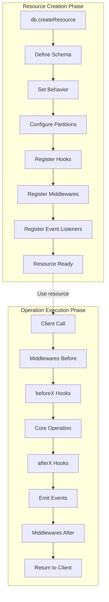
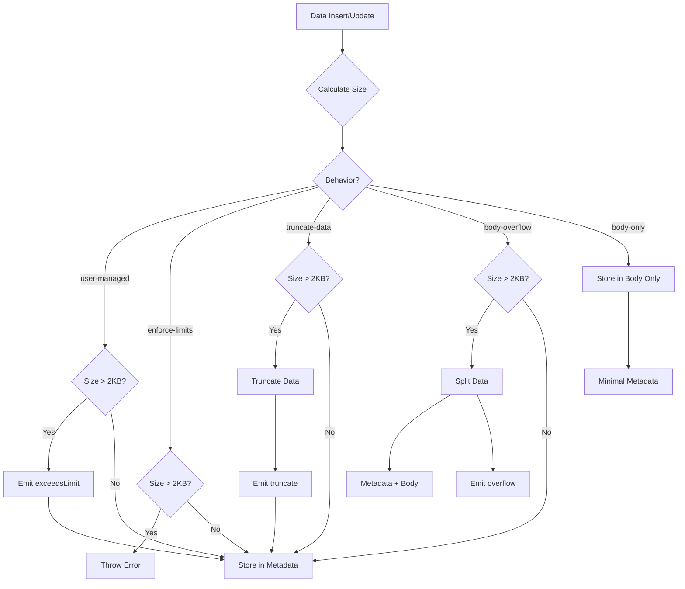
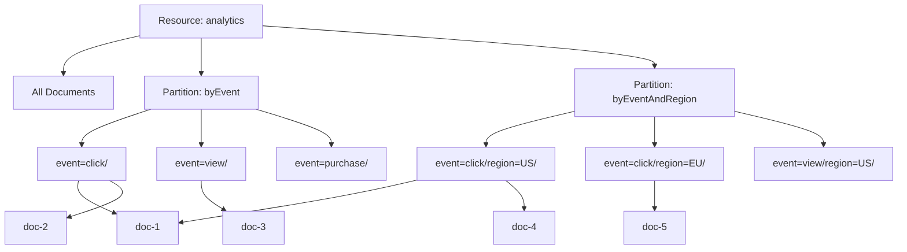
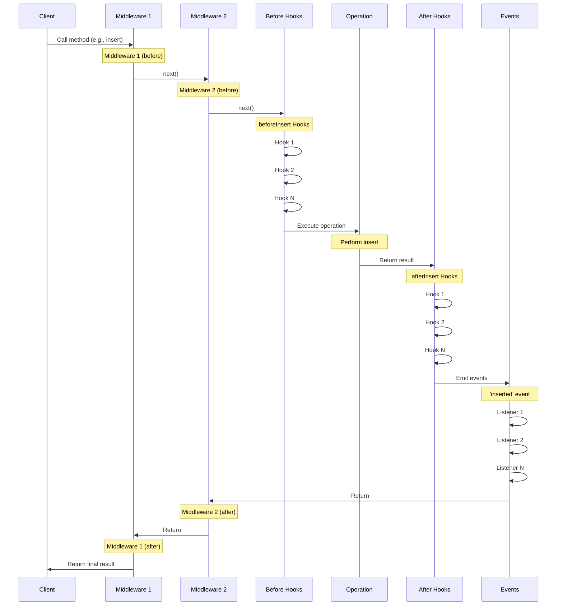
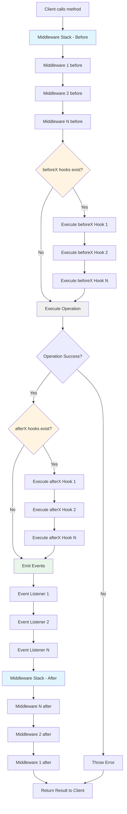
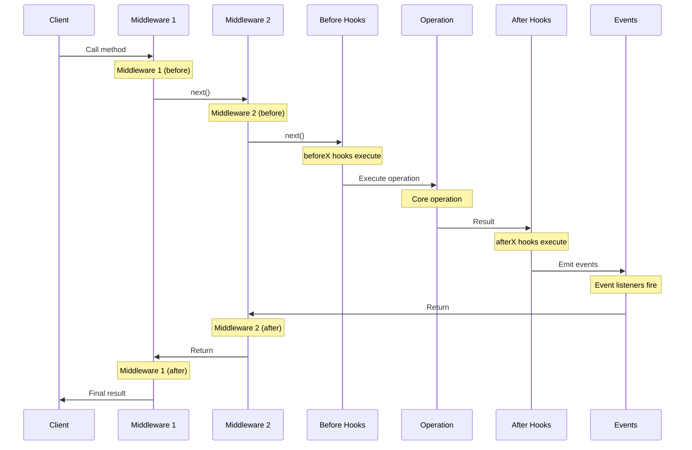
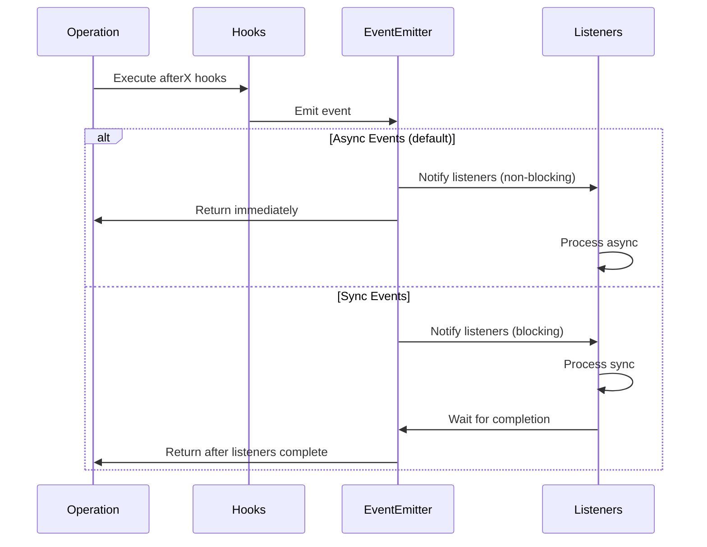

# Resources - Complete Guide

> **Resources** are the core abstraction in s3db.js. They define data structures, validation rules, behaviors, partitions, hooks, middlewares, and events. This guide covers every aspect of working with resources in depth.

## Table of Contents

- [Overview](#overview)
- [Creating Resources](#creating-resources)
- [Schema System](#schema-system)
- [Behaviors](#behaviors)
- [Resource Methods](#resource-methods)
- [Partitioning](#partitioning)
- [Hooks System](#hooks-system)
- [Middlewares](#middlewares)
- [Events System](#events-system)
- [Streaming API](#streaming-api)
- [Binary Content](#binary-content)
- [Advanced Topics](#advanced-topics)

---

## Overview

### What is a Resource?

A **Resource** is a collection of documents with a defined schema. Think of it as a table in traditional databases, but with:

- **Dynamic schemas** with full validation
- **Flexible storage behaviors** to handle S3's 2KB metadata limit
- **Partition support** for O(1) queries
- **Hook system** for custom business logic
- **Middleware support** for cross-cutting concerns
- **Event emission** for real-time notifications
- **Versioning** for schema evolution

### Resource Lifecycle



**Complete Execution Order for Any Operation:**

1. **Client** calls method (e.g., `users.insert(data)`)
2. **Middlewares (before)** - All registered middlewares execute in order
3. **beforeX Hooks** - All before hooks execute (e.g., beforeInsert)
4. **Core Operation** - Database operation executes (e.g., INSERT)
5. **afterX Hooks** - All after hooks execute (e.g., afterInsert)
6. **Events** - Event listeners fire (e.g., 'inserted' event)
7. **Middlewares (after)** - All middlewares unwind in reverse order
8. **Return to Client** - Final result

**Key Points:**
- ✅ Middlewares wrap the entire flow (before → after in reverse order)
- ✅ Before hooks can modify data and block operation
- ✅ After hooks receive result but cannot block operation
- ✅ Events are emitted last (async by default)
- ✅ Multiple hooks/middlewares execute in registration order

### Key Concepts

| Concept | Description | Use Case |
|---------|-------------|----------|
| **Schema** | Data structure definition with validation | Ensure data integrity |
| **Behavior** | Strategy for handling 2KB S3 metadata limit | Control data storage |
| **Partition** | Data organization by field values | Fast O(1) queries |
| **Hook** | Lifecycle function (before/after operations) | Custom business logic |
| **Middleware** | Method wrapper (intercept/transform) | Cross-cutting concerns |
| **Event** | Real-time notification on operations | Monitoring, logging |

---

## Creating Resources

### Basic Resource Creation

```javascript
import { S3db } from 's3db.js';

const db = new S3db({
  connectionString: 's3://bucket/databases/myapp'
});

await db.connect();

const users = await db.createResource({
  name: 'users',
  attributes: {
    email: 'email|required|unique',
    name: 'string|required|min:2|max:100',
    age: 'number|min:0|max:150'
  }
});
```

### Complete Resource Configuration

```javascript
const orders = await db.createResource({
  // Basic configuration
  name: 'orders',
  version: 'v2',

  // Schema definition
  attributes: {
    orderId: 'string|required|unique',
    userId: 'string|required',
    status: 'string|required|enum:pending,processing,completed,cancelled',
    total: 'number|required|min:0',
    items: 'array|items:object|min:1',
    paymentToken: 'secret|required'
  },

  // Behavior strategy
  behavior: 'body-overflow',

  // Automatic timestamps
  timestamps: true,

  // Versioning
  versioningEnabled: true,

  // Custom ID generation
  idGenerator: () => `ORD-${Date.now()}`,
  // OR
  idSize: 16,  // Generate 16-character IDs

  // Partitions for fast queries
  partitions: {
    byStatus: { fields: { status: 'string' } },
    byUser: { fields: { userId: 'string' } }
  },

  // Async partitions for faster writes
  asyncPartitions: true,

  // Encryption passphrase
  passphrase: 'my-secret-key',

  // Auto-decrypt secret fields
  autoDecrypt: true,

  // Paranoid mode (prevent dangerous operations)
  paranoid: true,

  // Parallelism for bulk operations
  parallelism: 20,

  // Strict validation
  strictValidation: true,

  // Hooks
  hooks: {
    beforeInsert: [async (data) => {
      data.createdAt = new Date().toISOString();
      return data;
    }],
    afterInsert: [async (data) => {
      console.log('Order created:', data.orderId);
    }]
  },

  // Event listeners
  events: {
    inserted: (event) => console.log('INSERT:', event.id),
    updated: (event) => console.log('UPDATE:', event.id)
  },

  // Async events (default: true)
  asyncEvents: true
});
```

### Configuration Reference

| Parameter | Type | Default | Description |
|-----------|------|---------|-------------|
| `name` | `string` | **required** | Resource name (unique within database) |
| `version` | `string` | `'v1'` | Resource version |
| `attributes` | `object` | `{}` | Schema definition with validation rules ([fastest-validator](https://github.com/icebob/fastest-validator) syntax) |
| `behavior` | `string` | `'user-managed'` | Behavior strategy (see [Behaviors](#behaviors)) |
| `timestamps` | `boolean` | `false` | Auto-add createdAt/updatedAt fields |
| `versioningEnabled` | `boolean` | `false` | Enable resource versioning |
| `idGenerator` | `function` | nanoid(22) | Custom ID generation function |
| `idSize` | `number` | `22` | Size for auto-generated IDs |
| `partitions` | `object` | `{}` | Partition definitions |
| `asyncPartitions` | `boolean` | `false` | Enable async partition indexing (70-100% faster writes) |
| `passphrase` | `string` | `'secret'` | Encryption passphrase for secret fields |
| `autoDecrypt` | `boolean` | `true` | Auto-decrypt secret fields on retrieval |
| `paranoid` | `boolean` | `true` | Prevent dangerous operations (deleteAll, etc.) |
| `parallelism` | `number` | `10` | Concurrent operations for bulk ops |
| `strictValidation` | `boolean` | `true` | Strict schema validation |
| `hooks` | `object` | `{}` | Lifecycle hooks |
| `events` | `object` | `{}` | Event listeners |
| `asyncEvents` | `boolean` | `true` | Emit events asynchronously |

---

## Schema System

> **⚡ Powered by [fastest-validator](https://github.com/icebob/fastest-validator)**
>
> All schema definitions use fastest-validator's powerful and performant validation engine.
> Supports both **explicit format** (`{ type: 'object', props: {...} }`) and **shorthand format** (`{ $$type: 'object', ...fields }`).

### Field Types

#### Basic Types

```javascript
{
  // String
  name: 'string|required|min:2|max:100',
  slug: 'string|pattern:^[a-z0-9-]+$',
  status: 'string|enum:active,inactive,deleted',

  // Number
  age: 'number|integer|min:0|max:150',
  price: 'number|min:0.01|max:999999.99',
  quantity: 'number|positive|integer',

  // Boolean
  isActive: 'boolean',
  isVerified: 'boolean|default:false',

  // Email
  email: 'email|required|unique',
  contactEmail: 'email|optional',

  // URL
  website: 'url|optional',
  avatar: 'url|required',

  // Date
  createdAt: 'date|required',
  expiresAt: 'date|optional',

  // UUID
  id: 'uuid|required',
  userId: 'uuid|required',

  // Array
  tags: 'array|items:string|min:1|max:10|unique',
  scores: 'array|items:number|min:0|max:100',

  // Object
  metadata: 'object|optional'
}
```

#### Advanced Types

```javascript
{
  // Secret (AES-256-GCM encrypted)
  password: 'secret|required',
  apiKey: 'secret|required',

  // IP Addresses (Binary Base64 - 44-47% savings)
  ipv4: 'ip4',
  ipv6: 'ip6',

  // Vector Embeddings (Fixed-point Base62 - 77% savings)
  embedding: 'embedding:1536',  // OpenAI ada-002
  embedding: 'embedding:384',   // Sentence transformers

  // Custom validation
  customField: {
    type: 'string',
    custom: (value) => {
      if (!value.startsWith('PREFIX-')) {
        return { valid: false, message: 'Must start with PREFIX-' };
      }
      return { valid: true };
    }
  }
}
```

#### Nested Objects

> **💡 Just Write It - s3db Auto-Detects!**
>
> In 99% of cases, simply write your object structure and s3db will detect it automatically.
> No need for `$$type` or `type/props` unless you need validation control!

```javascript
// MAGIC FORMAT ✨ (recommended - 99% of cases)
// Just write your object naturally!
{
  name: 'string|required',

  // Simple nested object - auto-detected!
  profile: {
    bio: 'string|max:500',
    avatar: 'url|optional',
    location: 'string|optional'
  },

  // Deeply nested - also auto-detected!
  address: {
    street: 'string|required',
    city: 'string|required',
    country: 'string|required|length:2',
    coordinates: {
      lat: 'number|min:-90|max:90',
      lng: 'number|min:-180|max:180'
    }
  }
}
```

**Advanced Options** (use only when needed):

```javascript
// WITH $$type - when you need validation control
{
  profile: {
    $$type: 'object|required',  // ← Explicit required/optional
    bio: 'string|max:500',
    avatar: 'url|optional'
  }
}

// EXPLICIT FORMAT - full control (strict mode, etc.)
{
  profile: {
    type: 'object',
    optional: false,
    strict: true,      // ← Enable strict validation
    props: {
      bio: 'string|max:500',
      avatar: 'url|optional'
    }
  }
}
```

#### Arrays of Objects

```javascript
{
  name: 'string|required',

  // Array of objects
  items: {
    type: 'array',
    items: {
      type: 'object',
      props: {
        productId: 'string|required',
        quantity: 'number|required|positive|integer',
        price: 'number|required|min:0'
      }
    },
    min: 1,
    max: 100
  },

  // Array with validation
  attachments: {
    type: 'array',
    items: {
      type: 'object',
      props: {
        filename: 'string|required',
        size: 'number|required|min:0',
        contentType: 'string|required'
      }
    },
    optional: true
  }
}
```

### Validation Rules

#### String Rules

| Rule | Example | Description |
|------|---------|-------------|
| `min` | `'string\|min:2'` | Minimum length |
| `max` | `'string\|max:100'` | Maximum length |
| `length` | `'string\|length:2'` | Exact length (e.g., country code) |
| `pattern` | `'string\|pattern:^[a-z]+$'` | Regex pattern |
| `enum` | `'string\|enum:a,b,c'` | Allowed values |
| `alpha` | `'string\|alpha'` | Only alphabetic characters |
| `alphanumeric` | `'string\|alphanumeric'` | Only alphanumeric characters |
| `numeric` | `'string\|numeric'` | Only numeric characters |
| `lowercase` | `'string\|lowercase'` | Only lowercase |
| `uppercase` | `'string\|uppercase'` | Only uppercase |
| `trim` | `'string\|trim'` | Trim whitespace |

#### Number Rules

| Rule | Example | Description |
|------|---------|-------------|
| `min` | `'number\|min:0'` | Minimum value |
| `max` | `'number\|max:100'` | Maximum value |
| `integer` | `'number\|integer'` | Must be integer |
| `positive` | `'number\|positive'` | Must be positive |
| `negative` | `'number\|negative'` | Must be negative |
| `convert` | `'number\|convert'` | Auto-convert from string |

#### Array Rules

| Rule | Example | Description |
|------|---------|-------------|
| `items` | `'array\|items:string'` | Type of array items |
| `min` | `'array\|min:1'` | Minimum length |
| `max` | `'array\|max:10'` | Maximum length |
| `length` | `'array\|length:5'` | Exact length |
| `unique` | `'array\|unique'` | All items must be unique |
| `enum` | `'array\|enum:a,b,c'` | Items must be from enum |

#### Common Rules

| Rule | Example | Description |
|------|---------|-------------|
| `required` | `'string\|required'` | Field is required |
| `optional` | `'string\|optional'` | Field is optional |
| `default` | `'boolean\|default:false'` | Default value if missing |
| `unique` | `'string\|unique'` | Value must be unique in resource |

### Encoding & Compression

s3db.js automatically applies encoding optimizations to save metadata space:

#### Automatic Optimizations

| Data Type | Encoding | Space Saved | Example |
|-----------|----------|-------------|---------|
| ISO Timestamps | Unix Base62 | 67% | `2024-01-15T10:30:00Z` → `ism8LiNFkz90` |
| UUIDs | Binary Base64 | 33% | `550e8400-...` → `uVQ6EAOKbQdShbkRmRUQAAA==` |
| Dictionary Values | Single byte | 95% | `active` → `da`, `true` → `dt` |
| Large Numbers | Base62 | 40-46% | `123456789` → `8m0Kx` |
| IPv4 | Binary Base64 | 47% | `192.168.1.1` → Base64 binary |
| IPv6 | Binary Base64 | 44% | `2001:0db8::1` → Base64 binary |
| Embeddings | Fixed-point Base62 | 77% | `[0.123, -0.456]` → compressed |

#### Dictionary Encoding

Common values are automatically encoded to single bytes:

```javascript
// Status values
'active'    → 'da'
'inactive'  → 'di'
'pending'   → 'dp'
'deleted'   → 'dd'

// Boolean values
'true'      → 'dt'
'false'     → 'df'

// HTTP methods
'GET'       → 'dg'
'POST'      → 'dp'
'PUT'       → 'du'
'DELETE'    → 'dd'

// ... and 34 more common values
```

**Benefits:**
- Automatic - no configuration needed
- Reversible - lossless compression
- Significant space savings (40-50% on typical datasets)
- Fits more data in S3's 2KB metadata limit

---

## Behaviors

S3 metadata has a hard limit of **2KB (2047 bytes)**. Behaviors define how s3db.js handles data that approaches or exceeds this limit.

### Behavior Comparison

| Behavior | Enforcement | Data Loss | Event Emission | Use Case |
|----------|-------------|-----------|----------------|----------|
| `user-managed` | None | Possible | Warns (`exceedsLimit`) | Dev/Test/Advanced |
| `enforce-limits` | Strict | No | Throws error | Production |
| `truncate-data` | Truncates | Yes | Warns (`truncate`) | Content Mgmt |
| `body-overflow` | Splits | No | Warns (`overflow`) | Mixed data |
| `body-only` | Unlimited | No | None | Large docs |

### Behavior Lifecycle



### user-managed (Default)

**No enforcement** - emits warnings but allows all operations.

```javascript
const users = await db.createResource({
  name: 'users',
  behavior: 'user-managed',  // Default
  attributes: { name: 'string', bio: 'string' }
});

// Listen for warnings
users.on('exceedsLimit', (data) => {
  console.warn(`Data exceeds limit by ${data.excess} bytes`);
  console.warn('Operation:', data.operation);
  console.warn('ID:', data.id);
  console.warn('Total size:', data.totalSize);
});

// Operation continues despite warning
await users.insert({
  name: 'John',
  bio: 'A'.repeat(3000)  // > 2KB - warning emitted but insert proceeds
});
```

**Event payload:**
```javascript
{
  operation: 'inserted' | 'updated' | 'upsert',
  id: 'user-123',  // (for update/upsert)
  totalSize: 2548,
  limit: 2048,
  excess: 500,
  data: { /* offending data */ }
}
```

**When to use:**
- Development/testing
- Advanced users with custom logic
- When you have external enforcement

**⚠️ Warning:** Exceeding S3 metadata limits will cause **silent data loss** or errors at the storage layer.

### enforce-limits

**Strict validation** - throws error if limit exceeded.

```javascript
const settings = await db.createResource({
  name: 'settings',
  behavior: 'enforce-limits',
  attributes: { key: 'string', value: 'string' }
});

// Throws error if data > 2KB
try {
  await settings.insert({
    key: 'config',
    value: 'A'.repeat(3000)  // Throws: MetadataExceededError
  });
} catch (error) {
  console.error('Data too large:', error.message);
  console.error('Total size:', error.totalSize);
  console.error('Limit:', error.limit);
  console.error('Excess:', error.excess);
}
```

**When to use:**
- Production environments
- Critical data integrity
- Known small documents

### truncate-data

**Smart truncation** - preserves structure, truncates content.

```javascript
const summaries = await db.createResource({
  name: 'summaries',
  behavior: 'truncate-data',
  attributes: {
    title: 'string',
    description: 'string',
    content: 'string'
  }
});

// Listen for truncation events
summaries.on('truncate', (data) => {
  console.log('Truncated fields:', data.truncatedFields);
  console.log('Original size:', data.originalSize);
  console.log('Final size:', data.finalSize);
});

const result = await summaries.insert({
  title: 'Short Title',  // Preserved (priority)
  description: 'A'.repeat(1000),  // Truncated
  content: 'B'.repeat(2000)  // Truncated with "..."
});

const retrieved = await summaries.get(result.id);
console.log(retrieved.content);  // "B...B..." (truncated)
```

**Truncation strategy:**
1. **Preserve structure** - all fields present
2. **Priority order** - shorter fields preserved first
3. **Smart markers** - adds "..." to truncated strings
4. **Fair distribution** - distributes space across fields

**When to use:**
- Content management
- Blog/article summaries
- Acceptable data loss

### body-overflow

**Automatic splitting** - metadata + body for large content.

```javascript
const blogs = await db.createResource({
  name: 'blogs',
  behavior: 'body-overflow',
  attributes: {
    title: 'string',
    content: 'string',  // Can be very large
    author: 'string',
    tags: 'array|items:string'
  }
});

// Listen for overflow events
blogs.on('overflow', (data) => {
  console.log('Overflowed to body');
  console.log('Metadata size:', data.metadataSize);
  console.log('Body size:', data.bodySize);
});

// Large content automatically split
const blog = await blogs.insert({
  title: 'My Blog Post',
  content: 'A'.repeat(5000),  // Large content
  author: 'John Doe',
  tags: ['tech', 'javascript']
});

// All data preserved and accessible
const retrieved = await blogs.get(blog.id);
console.log(retrieved.content.length);  // 5000 (full content preserved)
console.log(retrieved._hasContent);     // true (indicates body usage)
```

**How it works:**
1. Tries to fit all data in metadata (2KB limit)
2. If exceeds, splits large fields to body
3. Keeps small fields (ID, timestamps, etc.) in metadata for fast queries
4. Transparently retrieves body data on `get()`

**When to use:**
- Mixed small/large fields
- Need fast queries on small fields
- Want automatic handling

### body-only

**All data in body** - unlimited size, minimal metadata.

```javascript
const documents = await db.createResource({
  name: 'documents',
  behavior: 'body-only',
  attributes: {
    title: 'string',
    content: 'string',  // Can be extremely large
    metadata: 'object'
  }
});

// Store large documents without limits
const document = await documents.insert({
  title: 'Large Document',
  content: 'A'.repeat(100000),  // 100KB content - no problem
  metadata: {
    author: 'John Doe',
    tags: ['large', 'document'],
    version: '1.0',
    attachments: [/* ... */]
  }
});

// All data stored in S3 object body
const retrieved = await documents.get(document.id);
console.log(retrieved.content.length);  // 100000 (full content)
console.log(retrieved._hasContent);     // true
```

**Metadata stored:**
- Resource version only (minimal)
- All user data in body as JSON

**When to use:**
- Large documents/logs
- No size constraints
- Don't need metadata queries

---

## Resource Methods

### CRUD Operations

#### insert(data)

Create a new document.

```javascript
const user = await users.insert({
  name: 'John Doe',
  email: 'john@example.com',
  age: 30
});

console.log(user.id);  // Auto-generated ID
console.log(user.createdAt);  // Auto-timestamp (if enabled)
```

**Returns:** Complete document with ID and timestamps

**Triggers:**
- Hooks: `beforeInsert`, `afterInsert`
- Events: `inserted`

#### insertMany(docs)

Bulk insert multiple documents.

```javascript
const users = await users.insertMany([
  { name: 'User 1', email: 'user1@example.com' },
  { name: 'User 2', email: 'user2@example.com' },
  { name: 'User 3', email: 'user3@example.com' }
]);

console.log(`Inserted ${users.length} users`);
```

**Performance:** Much faster than individual inserts (3.5ms/item vs 15ms/item)

**Triggers:**
- Hooks: `beforeInsert`, `afterInsert` (for each item)
- Events: `insertMany` (bulk), `inserted` (per item)

#### get(id)

Retrieve a document by ID.

```javascript
const user = await users.get('user-123');

if (user) {
  console.log(user.name, user.email);
} else {
  console.log('User not found');
}
```

**Returns:** Document object or `null` if not found

**Triggers:**
- Hooks: `beforeGet`, `afterGet`
- Events: `fetched`

#### getMany(ids)

Bulk retrieve multiple documents.

```javascript
const users = await users.getMany(['user-1', 'user-2', 'user-3']);

console.log(`Retrieved ${users.length} users`);
```

**Performance:** Faster than individual gets (8ms/item vs 10ms/item)

**Returns:** Array of documents (missing IDs omitted)

**Triggers:**
- Hooks: `beforeGet`, `afterGet` (for each item)
- Events: `getMany` (bulk), `fetched` (per item)

#### update(id, data)

Update a document (GET + PUT merge).

```javascript
const updated = await users.update('user-123', {
  age: 31,
  status: 'active'
});

console.log(updated);  // Complete updated document
```

**How it works:**
1. GET existing document
2. Merge with new data
3. PUT merged document

**Performance:** Baseline (100%)

**Triggers:**
- Hooks: `beforeUpdate`, `afterUpdate`
- Events: `updated`

#### patch(id, data)

Update a document (HEAD + COPY - 40-60% faster for metadata-only).

```javascript
const updated = await users.patch('user-123', {
  age: 31,
  status: 'active'
});
```

**How it works:**
1. HEAD to get metadata
2. Merge with new data
3. COPY with updated metadata

**Performance:** 40-60% faster than `update()` for metadata-only behaviors (`enforce-limits`, `truncate-data`)

**Falls back to update()** for body behaviors (`body-overflow`, `body-only`)

**Triggers:**
- Hooks: `beforeUpdate`, `afterUpdate`
- Events: `updated`

#### replace(id, data)

Replace a document entirely (PUT only - 30-40% faster).

```javascript
const replaced = await users.replace('user-123', {
  name: 'Jane Doe',
  email: 'jane@example.com',
  age: 28,
  status: 'active'
  // Must provide ALL fields
});
```

**How it works:**
1. PUT new data directly (no GET or merge)

**Performance:** 30-40% faster than `update()`

**⚠️ Warning:** No merge - missing fields will be lost

**Triggers:**
- Hooks: `beforeUpdate`, `afterUpdate`
- Events: `updated`

#### Update Method Comparison

| Method | Requests | Merge | Speed | Use Case |
|--------|----------|-------|-------|----------|
| `update()` | GET+PUT | Yes | Baseline | Default partial updates |
| `patch()` | HEAD+COPY* | Yes | 40-60% faster* | Partial updates (metadata-only) |
| `replace()` | PUT only | No | 30-40% faster | Full document replacement |

\* Only for metadata-only behaviors with simple fields

#### upsert(id, data)

Insert or update based on ID existence.

```javascript
const user = await users.upsert('user-123', {
  name: 'John Doe',
  email: 'john@example.com'
});

console.log(user);  // Created if didn't exist, updated if existed
```

**Triggers:**
- Hooks: `beforeInsert`/`beforeUpdate`, `afterInsert`/`afterUpdate`
- Events: `inserted` or `updated`

#### delete(id)

Delete a document.

```javascript
const deleted = await users.delete('user-123');

console.log(deleted);  // Deleted document data
```

**Returns:** Deleted document data

**Triggers:**
- Hooks: `beforeDelete`, `afterDelete`
- Events: `deleted`

#### deleteMany(ids)

Bulk delete multiple documents.

```javascript
const count = await users.deleteMany(['user-1', 'user-2', 'user-3']);

console.log(`Deleted ${count} users`);
```

**Returns:** Number of deleted documents

**Triggers:**
- Hooks: `beforeDelete`, `afterDelete` (for each item)
- Events: `deleteMany` (bulk), `deleted` (per item)

### Query Operations

#### list(options?)

List documents with pagination and partition support.

```javascript
// Simple list (all documents)
const allUsers = await users.list();

// With pagination
const page1 = await users.list({ limit: 10, offset: 0 });
const page2 = await users.list({ limit: 10, offset: 10 });

// With partition
const activeUsers = await users.list({
  partition: 'byStatus',
  partitionValues: { status: 'active' }
});

// Combine partition + pagination
const activeUsersPage1 = await users.list({
  partition: 'byStatus',
  partitionValues: { status: 'active' },
  limit: 10,
  offset: 0
});
```

**Options:**
```typescript
{
  limit?: number;          // Max results (default: all)
  offset?: number;         // Skip N results (default: 0)
  partition?: string;      // Partition name
  partitionValues?: object; // Partition field values
}
```

**Returns:** Array of documents

**Triggers:**
- Hooks: `beforeList`, `afterList`
- Events: `list`

#### listIds(options?)

List document IDs only (faster than list).

```javascript
const ids = await users.listIds();

console.log(`Total users: ${ids.length}`);
```

**Performance:** Faster than `list()` (no document data retrieval)

**Options:** Same as `list()`

**Returns:** Array of IDs

#### getAll()

Get all documents (convenience method).

```javascript
const allUsers = await users.getAll();

console.log(`Total users: ${allUsers.length}`);
```

**Equivalent to:** `users.list()`

**Returns:** Array of all documents

#### count(options?)

Count documents.

```javascript
// Total count
const total = await users.count();

// Count in partition
const activeCount = await users.count({
  partition: 'byStatus',
  partitionValues: { status: 'active' }
});
```

**Options:** Same as `list()` but without limit/offset

**Returns:** Number

**Triggers:**
- Events: `count`

#### page(options)

Paginate results with rich metadata.

```javascript
const page = await users.page({
  offset: 0,
  size: 10
});

console.log('Items:', page.items);
console.log('Total:', page.total);
console.log('Page:', page.page);
console.log('Pages:', page.pages);
console.log('Has next:', page.hasNext);
console.log('Has prev:', page.hasPrev);
```

**Options:**
```typescript
{
  offset: number;           // Start position
  size: number;             // Page size
  partition?: string;       // Partition name
  partitionValues?: object; // Partition field values
}
```

**Returns:**
```typescript
{
  items: Array<Document>;   // Page items
  total: number;            // Total items
  offset: number;           // Current offset
  size: number;             // Page size
  page: number;             // Current page (1-indexed)
  pages: number;            // Total pages
  hasNext: boolean;         // Has next page
  hasPrev: boolean;         // Has previous page
}
```

#### query(filter, options?)

Filter documents by field values.

```javascript
// Simple query
const activeUsers = await users.query({ status: 'active' });

// Multiple conditions (AND)
const results = await users.query({
  status: 'active',
  age: 25
});

// With pagination
const results = await users.query(
  { status: 'active' },
  { limit: 10, offset: 0 }
);
```

**Filter operators:**
```javascript
// Exact match
{ status: 'active' }

// Nested fields
{ 'profile.country': 'US' }

// Multiple conditions (AND)
{ status: 'active', age: 25 }
```

**Performance:** O(n) scan - use partitions for O(1) queries

**Returns:** Array of matching documents

#### exists(id)

Check if document exists.

```javascript
const exists = await users.exists('user-123');

if (exists) {
  console.log('User exists');
} else {
  console.log('User not found');
}
```

**Performance:** Fast (HEAD request only)

**Returns:** Boolean

**Triggers:**
- Events: `exists`

### Binary Content Operations

#### setContent({ id, buffer, contentType })

Set binary content for a document.

```javascript
import fs from 'fs';

// Image content
const imageBuffer = fs.readFileSync('profile.jpg');
await users.setContent({
  id: 'user-123',
  buffer: imageBuffer,
  contentType: 'image/jpeg'
});

// PDF content
const pdfBuffer = fs.readFileSync('document.pdf');
await users.setContent({
  id: 'user-123',
  buffer: pdfBuffer,
  contentType: 'application/pdf'
});

// Text content
await users.setContent({
  id: 'user-123',
  buffer: 'Hello World',
  contentType: 'text/plain'
});
```

#### content(id)

Get binary content for a document.

```javascript
const content = await users.content('user-123');

if (content.buffer) {
  console.log('Content type:', content.contentType);
  console.log('Content size:', content.buffer.length);

  // Save to file
  fs.writeFileSync('downloaded.jpg', content.buffer);
} else {
  console.log('No content found');
}
```

**Returns:**
```typescript
{
  buffer: Buffer | null;
  contentType: string | null;
}
```

#### hasContent(id)

Check if document has binary content.

```javascript
const hasContent = await users.hasContent('user-123');

console.log('Has content:', hasContent);
```

**Returns:** Boolean

#### deleteContent(id)

Delete binary content (preserves metadata).

```javascript
await users.deleteContent('user-123');

// User metadata remains, but binary content is removed
const user = await users.get('user-123');
console.log(user.name);  // Still accessible
```

### Bulk Operations Comparison

| Operation | Performance | Use Case |
|-----------|-------------|----------|
| `insertMany()` | 3.5ms/item | Bulk inserts (vs 15ms/item for individual) |
| `getMany()` | 8ms/item | Bulk retrieval (vs 10ms/item) |
| `deleteMany()` | Efficient | Bulk deletion |

---

## Partitioning

Partitions organize data by field values for **O(1) queries** instead of O(n) scans.

### Partition Architecture



### S3 Path Structure

s3db.js uses a flat, self-documenting path structure:

```
bucket-name/databases/myapp/
├── s3db.json                                    # Database metadata
│
└── resource=analytics/
    ├── data/                                    # Main documents
    │   ├── id=doc-1
    │   ├── id=doc-2
    │   └── id=doc-3
    │
    ├── partition=byEvent/                       # Single-field partition
    │   ├── event=click/
    │   │   ├── id=doc-1
    │   │   └── id=doc-2
    │   ├── event=view/
    │   │   └── id=doc-3
    │   └── event=purchase/
    │       └── id=doc-4
    │
    └── partition=byEventAndRegion/              # Composite partition
        ├── event=click/region=US/
        │   └── id=doc-1
        ├── event=click/region=EU/
        │   └── id=doc-2
        └── event=view/region=US/
            └── id=doc-3
```

**Path Patterns:**

| Type | Pattern |
|------|---------|
| Document | `resource={name}/data/id={id}` |
| Single partition | `resource={name}/partition={partition}/{field}={value}/id={id}` |
| Composite partition | `resource={name}/partition={partition}/{field1}={value1}/{field2}={value2}/id={id}` |

**Why this structure?**
- ✅ Flat hierarchy (no deep nesting)
- ✅ Self-documenting paths
- ✅ O(1) prefix queries
- ✅ Better S3 performance

### Creating Partitions

#### Single Field Partition

```javascript
const analytics = await db.createResource({
  name: 'analytics',
  attributes: {
    event: 'string|required',
    userId: 'string|required',
    timestamp: 'date|required'
  },
  partitions: {
    byEvent: {
      fields: { event: 'string' }
    }
  }
});

// Query by partition (O(1))
const clicks = await analytics.list({
  partition: 'byEvent',
  partitionValues: { event: 'click' }
});
```

#### Composite Partition (Multiple Fields)

```javascript
const analytics = await db.createResource({
  name: 'analytics',
  attributes: {
    event: 'string|required',
    region: 'string|required',
    userId: 'string|required'
  },
  partitions: {
    byEventAndRegion: {
      fields: {
        event: 'string',
        region: 'string'
      }
    }
  }
});

// Query with multiple partition values
const usClicks = await analytics.list({
  partition: 'byEventAndRegion',
  partitionValues: {
    event: 'click',
    region: 'US'
  }
});
```

#### Nested Field Partition

```javascript
const users = await db.createResource({
  name: 'users',
  attributes: {
    name: 'string|required',
    profile: {
      type: 'object',
      props: {
        country: 'string|required',
        city: 'string|required'
      }
    }
  },
  partitions: {
    byCountry: {
      fields: {
        'profile.country': 'string'
      }
    },
    byCountryAndCity: {
      fields: {
        'profile.country': 'string',
        'profile.city': 'string'
      }
    }
  }
});

// Query by nested field
const usUsers = await users.list({
  partition: 'byCountry',
  partitionValues: {
    'profile.country': 'US'
  }
});
```

### Automatic Timestamp Partitions

When `timestamps: true`, automatic partitions are created:

```javascript
const events = await db.createResource({
  name: 'events',
  attributes: {
    name: 'string|required',
    data: 'object|optional'
  },
  timestamps: true  // Auto-creates byCreatedDate and byUpdatedDate
});

// Query by creation date
const todayEvents = await events.list({
  partition: 'byCreatedDate',
  partitionValues: {
    createdAt: '2024-01-15'
  }
});

// Query by update date
const recentlyUpdated = await events.list({
  partition: 'byUpdatedDate',
  partitionValues: {
    updatedAt: '2024-01-15'
  }
});
```

### Async Partitions

Enable async partition indexing for **70-100% faster writes**:

```javascript
const analytics = await db.createResource({
  name: 'analytics',
  attributes: {
    event: 'string',
    region: 'string'
  },
  partitions: {
    byEvent: { fields: { event: 'string' } },
    byRegion: { fields: { region: 'string' } }
  },
  asyncPartitions: true  // Partition indexing happens asynchronously
});
```

**How it works:**
1. Document is written immediately
2. Partition references created asynchronously in background
3. Eventual consistency (milliseconds delay)

**Benefits:**
- 70-100% faster writes
- Reduced latency for insert operations
- Better throughput for high-write scenarios

**Trade-off:**
- Brief eventual consistency window (typically <100ms)
- Partition queries may miss very recent documents

### Partition Performance

| Query Type | Complexity | Performance | Use Case |
|------------|------------|-------------|----------|
| Full scan | O(n) | Slow for large datasets | Small datasets, one-time queries |
| Single partition | O(1) | Fast | Known partition value |
| Composite partition | O(1) | Fast | Multiple known values |

### Partition Best Practices

1. **Partition frequently queried fields**
   ```javascript
   partitions: {
     byStatus: { fields: { status: 'string' } },  // Common filter
     byUserId: { fields: { userId: 'string' } }   // User-specific queries
   }
   ```

2. **Use composite partitions for multi-field queries**
   ```javascript
   partitions: {
     byUserAndDate: {
       fields: {
         userId: 'string',
         createdAt: 'date|maxlength:10'
       }
     }
   }
   ```

3. **Enable async partitions for high-write workloads**
   ```javascript
   asyncPartitions: true
   ```

4. **Avoid too many partitions**
   - Each partition adds overhead
   - 3-5 partitions is typically optimal
   - Use composite partitions instead of many single-field partitions

### Orphaned Partitions

**Problem:** Partition references a deleted field → blocks ALL operations

**Detection:**
```javascript
const resource = await db.getResource('users', { strictValidation: false });

// Find orphaned partitions
const orphaned = resource.findOrphanedPartitions();

console.log('Orphaned partitions:', orphaned);
// Output: ['byDeletedField', 'byOtherDeletedField']
```

**Resolution:**
```javascript
// Remove orphaned partitions
resource.removeOrphanedPartitions();

// Save changes
await db.uploadMetadataFile();

console.log('Orphaned partitions removed');
```

**Example:** See `docs/examples/e44-orphaned-partitions-recovery.js`

---

## Hooks System

Hooks are lifecycle functions that execute **before or after** resource operations. They enable custom business logic, validation, and side effects.

### Hook Lifecycle



### Available Hooks

| Hook | Timing | Data Received | Return Value | Use Case |
|------|--------|---------------|--------------|----------|
| `beforeInsert` | Before insert | Document data | Modified data | Validation, defaults, timestamps |
| `afterInsert` | After insert | Complete document | - | Notifications, logging |
| `beforeUpdate` | Before update | Update data | Modified data | Validation, audit trail |
| `afterUpdate` | After update | Updated document with `$before`, `$after` | - | Notifications, sync |
| `beforeDelete` | Before delete | Document ID | - | Validation, cleanup |
| `afterDelete` | After delete | Deleted document | - | Notifications, cascade |
| `beforeGet` | Before get | Document ID | - | Access control |
| `afterGet` | After get | Document data | Modified data | Transform, decrypt |
| `beforeList` | Before list | Query options | Modified options | Access control |
| `afterList` | After list | Documents array | Modified array | Transform, filter |

### Defining Hooks

#### Simple Hook

```javascript
const products = await db.createResource({
  name: 'products',
  attributes: {
    name: 'string|required',
    price: 'number|required',
    sku: 'string|optional'
  },
  hooks: {
    beforeInsert: [
      async (data) => {
        // Auto-generate SKU
        data.sku = `PROD-${Date.now()}`;
        return data;
      }
    ]
  }
});
```

#### Multiple Hooks (Execution Order)

```javascript
const users = await db.createResource({
  name: 'users',
  attributes: { name: 'string', email: 'string' },
  hooks: {
    beforeInsert: [
      async (data) => {
        console.log('Hook 1: Validate');
        if (!data.email.includes('@')) {
          throw new Error('Invalid email');
        }
        return data;
      },
      async (data) => {
        console.log('Hook 2: Transform');
        data.name = data.name.toUpperCase();
        return data;
      },
      async (data) => {
        console.log('Hook 3: Add metadata');
        data.createdBy = 'system';
        return data;
      }
    ],
    afterInsert: [
      async (data) => {
        console.log('Hook 1: Send email');
        await sendWelcomeEmail(data.email);
      },
      async (data) => {
        console.log('Hook 2: Update analytics');
        await analytics.track('user.created', data);
      }
    ]
  }
});

// Execution order:
// 1. beforeInsert Hook 1 (validate)
// 2. beforeInsert Hook 2 (transform)
// 3. beforeInsert Hook 3 (metadata)
// 4. INSERT operation
// 5. afterInsert Hook 1 (email)
// 6. afterInsert Hook 2 (analytics)
```

### Hook Context (this binding)

Hooks have access to the resource instance via `this`:

```javascript
const users = await db.createResource({
  name: 'users',
  attributes: {
    email: 'string|required|unique',
    username: 'string|required'
  },
  hooks: {
    beforeInsert: [
      async function(data) {
        // 'this' is bound to resource instance
        console.log('Resource name:', this.name);
        console.log('Resource version:', this.version);

        // Check for existing user with same email
        const existing = await this.query({ email: data.email });
        if (existing.length > 0) {
          throw new Error('Email already exists');
        }

        return data;
      }
    ],

    afterInsert: [
      async function(data) {
        // Access resource methods
        const count = await this.count();
        console.log(`Total users: ${count}`);
      }
    ]
  }
});
```

**Note:** Use `async function() {}` instead of arrow functions to access `this`.

### Update Hooks (`$before` and `$after`)

Update hooks receive both old and new document states:

```javascript
const users = await db.createResource({
  name: 'users',
  attributes: {
    email: 'string|required',
    status: 'string|required'
  },
  hooks: {
    beforeUpdate: [
      async (data) => {
        console.log('Current data:', data);
        // Note: beforeUpdate receives only the update data, not $before/$after
        return data;
      }
    ],

    afterUpdate: [
      async (data) => {
        // afterUpdate receives $before and $after
        console.log('Before:', data.$before);
        console.log('After:', data.$after);

        // Detect changes
        if (data.$before.email !== data.$after.email) {
          console.log('Email changed!');
          await sendEmailChangeNotification(data.$after.email);
        }

        if (data.$before.status !== data.$after.status) {
          console.log(`Status: ${data.$before.status} → ${data.$after.status}`);
        }
      }
    ]
  }
});
```

### Error Handling in Hooks

```javascript
const users = await db.createResource({
  name: 'users',
  attributes: { name: 'string', email: 'string' },
  hooks: {
    beforeInsert: [
      async (data) => {
        try {
          // External validation
          await validateEmailWithAPI(data.email);
          return data;
        } catch (error) {
          // Transform error with context
          throw new Error(`Email validation failed: ${error.message}`);
        }
      }
    ],

    afterInsert: [
      async (data) => {
        try {
          // Send welcome email
          await sendWelcomeEmail(data.email);
        } catch (error) {
          // Log but don't fail the operation
          console.error('Failed to send welcome email:', error);
          // afterInsert errors don't block the insert
        }
      }
    ]
  }
});
```

**Important:**
- **beforeX hooks** - errors **block** the operation
- **afterX hooks** - errors **don't block** but are logged

### Dynamic Hook Registration

Add hooks after resource creation:

```javascript
const users = await db.createResource({
  name: 'users',
  attributes: { name: 'string', email: 'string' }
});

// Add hook later
users.addHook('beforeInsert', async (data) => {
  data.timestamp = new Date().toISOString();
  return data;
});

// Add multiple hooks
users.addHook('afterInsert', async (data) => {
  console.log('User created:', data.id);
});

users.addHook('afterInsert', async (data) => {
  await sendWelcomeEmail(data.email);
});
```

### Complete Execution Flow



---

## Middlewares

Middlewares **wrap** entire method calls, allowing you to intercept, modify, block, or replace operations. Similar to Express/Koa middlewares.

### Middleware vs Hooks

| Feature | Hooks | Middlewares |
|---------|-------|-------------|
| Placement | Before/after operation | Wraps entire method |
| Control | Cannot block/replace | Can block/replace |
| Data access | Receives data only | Full context (args, method) |
| Use case | Side effects, logging | Access control, transform |
| Registration | `hooks: {}` config | `useMiddleware()` |
| Chaining | Always runs all | Can short-circuit |

### Execution Order



**Complete Execution Order:**
1. **Middleware 1** (before) - Outermost middleware
2. **Middleware 2** (before) - Inner middleware
3. **Middleware N** (before) - All middlewares in registration order
4. **beforeX hooks** - Pre-operation hooks (e.g., beforeInsert)
5. **Operation** - Core database operation (insert, update, etc.)
6. **afterX hooks** - Post-operation hooks (e.g., afterInsert)
7. **Events** - Event listeners fire (e.g., 'inserted' event)
8. **Middleware N** (after) - Unwind in reverse order
9. **Middleware 2** (after)
10. **Middleware 1** (after)
11. **Return to client** - Final result

### Middleware Signature

```javascript
async function middleware(ctx, next) {
  // ctx.resource: Resource instance
  // ctx.args: arguments array (for the method)
  // ctx.method: method name (e.g., 'inserted')
  // next(): calls the next middleware or the original method
}
```

### Supported Methods

Middlewares can be added to these methods:
- `fetched`, `getMany`, `getAll`
- `list`, `listIds`, `page`
- `count`, `exists`
- `inserted`, `updated`, `deleted`, `deleteMany`

### Simple Middleware

```javascript
const users = await db.createResource({
  name: 'users',
  attributes: { name: 'string', email: 'string' }
});

// Logging middleware
users.useMiddleware('inserted', async (ctx, next) => {
  console.log('Before insert:', ctx.args[0]);

  const result = await next();

  console.log('After insert:', result);

  return result;
});
```

### Transform Arguments

```javascript
// Uppercase name before insert
users.useMiddleware('inserted', async (ctx, next) => {
  ctx.args[0].name = ctx.args[0].name.toUpperCase();

  return await next();
});

await users.insert({ name: 'john doe', email: 'john@example.com' });
// Inserted with name: "JOHN DOE"
```

### Access Control

```javascript
// Authentication middleware
users.useMiddleware('inserted', async (ctx, next) => {
  const user = ctx.args[0];

  if (!user.userId) {
    throw new Error('Authentication required');
  }

  return await next();
});

// Permission middleware
users.useMiddleware('deleted', async (ctx, next) => {
  const userId = ctx.args[0];
  const currentUser = ctx.currentUser;  // Passed in context

  if (currentUser.role !== 'admin') {
    throw new Error('Only admins can delete users');
  }

  return await next();
});
```

### Performance Tracking

```javascript
// Timing middleware
users.useMiddleware('updated', async (ctx, next) => {
  const start = Date.now();

  const result = await next();

  const duration = Date.now() - start;
  console.log(`Update took ${duration}ms`);

  // Log to monitoring system
  metrics.timing('users.update', duration);

  return result;
});
```

### Validation Middleware

```javascript
// Email validation
users.useMiddleware('inserted', async (ctx, next) => {
  const data = ctx.args[0];

  if (!data.email || !data.email.includes('@')) {
    throw new Error('Invalid email address');
  }

  return await next();
});

// Complex validation
users.useMiddleware('updated', async (ctx, next) => {
  const id = ctx.args[0];
  const data = ctx.args[1];

  // Prevent email updates
  if (data.email) {
    throw new Error('Email cannot be changed');
  }

  return await next();
});
```

### Short-Circuit (Block Operation)

```javascript
// Cache middleware (short-circuit if cached)
users.useMiddleware('fetched', async (ctx, next) => {
  const id = ctx.args[0];

  // Check cache
  const cached = cache.get(id);
  if (cached) {
    console.log('Cache hit:', id);
    return cached;  // Return early, skip next()
  }

  // Cache miss, proceed
  const result = await next();

  // Cache result
  cache.set(id, result);

  return result;
});
```

### Chaining Multiple Middlewares

```javascript
// Middleware 1: Authentication
users.useMiddleware('inserted', async (ctx, next) => {
  if (!ctx.user) {
    throw new Error('Not authenticated');
  }
  ctx.authenticated = true;
  return await next();
});

// Middleware 2: Authorization
users.useMiddleware('inserted', async (ctx, next) => {
  if (!ctx.authenticated) {
    throw new Error('Not authenticated');
  }
  if (ctx.user.role !== 'admin') {
    throw new Error('Not authorized');
  }
  return await next();
});

// Middleware 3: Logging
users.useMiddleware('inserted', async (ctx, next) => {
  const start = Date.now();
  const result = await next();
  const duration = Date.now() - start;

  await auditLog.write({
    action: 'inserted',
    user: ctx.user.id,
    duration,
    timestamp: new Date()
  });

  return result;
});

// Execution order:
// 1. Auth middleware
// 2. Authorization middleware
// 3. Logging middleware (before)
// 4. Operation
// 5. Logging middleware (after)
```

### Complete Example: Auth + Audit

```javascript
const orders = await db.createResource({
  name: 'orders',
  attributes: {
    orderId: 'string|required',
    userId: 'string|required',
    total: 'number|required'
  }
});

// Authentication middleware
['inserted', 'updated', 'deleted'].forEach(method => {
  orders.useMiddleware(method, async (ctx, next) => {
    const user = ctx.user;

    if (!user || !user.userId) {
      throw new Error('Authentication required');
    }

    ctx.authenticatedUser = user;

    return await next();
  });
});

// Audit logging middleware
['inserted', 'updated', 'deleted'].forEach(method => {
  orders.useMiddleware(method, async (ctx, next) => {
    const start = Date.now();
    const user = ctx.authenticatedUser;

    try {
      const result = await next();

      // Log success
      await auditLog.write({
        action: method,
        resource: 'orders',
        userId: user.userId,
        args: ctx.args,
        duration: Date.now() - start,
        success: true,
        timestamp: new Date()
      });

      return result;

    } catch (error) {
      // Log failure
      await auditLog.write({
        action: method,
        resource: 'orders',
        userId: user.userId,
        error: error.message,
        duration: Date.now() - start,
        success: false,
        timestamp: new Date()
      });

      throw error;
    }
  });
});

// Permission middleware
orders.useMiddleware('deleted', async (ctx, next) => {
  const user = ctx.authenticatedUser;

  if (user.role !== 'admin') {
    throw new Error('Only admins can delete orders');
  }

  return await next();
});

// Usage
await orders.insert(
  { orderId: 'ORD-123', userId: 'user-456', total: 99.99 },
  { user: { userId: 'user-456', role: 'customer' } }
);
```

---

## Events System

Resources extend Node.js **EventEmitter**, providing real-time notifications for all operations.

### Events vs Hooks

| Feature | Hooks | Events |
|---------|-------|--------|
| Purpose | Modify/validate data | Observe/react to operations |
| Timing | Synchronous lifecycle | Async notifications |
| Control | Can block operation | Cannot block operation |
| Data mutation | Can modify data | Read-only observation |
| Use case | Business logic | Monitoring, logging, analytics |

**Note:** Don't confuse hooks (`beforeInsert`, `afterUpdate`) with events (`inserted`, `updated`). Hooks are lifecycle functions, events are EventEmitter notifications.

### Event Lifecycle



### Available Events

| Event | Trigger | Data | Use Case |
|-------|---------|------|----------|
| `inserted` | Single insert | Complete document | Logging, notifications |
| `updated` | Single update | Document with `$before`, `$after` | Change tracking |
| `deleted` | Single delete | Deleted document | Cleanup, notifications |
| `insertMany` | Bulk insert | Count of inserted | Monitoring |
| `deleteMany` | Bulk delete | Count of deleted | Monitoring |
| `list` | List operation | Result object | Performance tracking |
| `count` | Count operation | Total count | Analytics |
| `fetched` | Single get | Complete document | Logging |
| `getMany` | Bulk get | Count of documents | Monitoring |

### Behavior-Specific Events

| Event | Trigger | Data | Behavior |
|-------|---------|------|----------|
| `exceedsLimit` | Metadata > 2KB | Size info | `user-managed` |
| `truncate` | Data truncated | Truncation info | `truncate-data` |
| `overflow` | Data split to body | Size info | `body-overflow` |

### Declarative Event Listeners

Define events in resource configuration:

```javascript
const users = await db.createResource({
  name: 'users',
  attributes: { name: 'string', email: 'string' },

  events: {
    // Single listener
    inserted: (event) => {
      console.log('User created:', event.id, event.name);
    },

    // Multiple listeners (array)
    updated: [
      (event) => {
        console.log('Update detected:', event.id);
      },
      (event) => {
        if (event.$before.email !== event.$after.email) {
          console.log('Email changed!');
          sendEmailChangeNotification(event.$after.email);
        }
      }
    ],

    // Bulk operations
    deleteMany: (count) => {
      console.log(`Deleted ${count} users`);
    }
  }
});
```

### Programmatic Event Listeners

Add listeners after resource creation:

```javascript
const users = await db.createResource({
  name: 'users',
  attributes: { name: 'string', email: 'string' }
});

// Add listener
users.on('inserted', (event) => {
  console.log('User created:', event.id);
  sendWelcomeEmail(event.email);
});

// Multiple listeners
users.on('updated', (event) => {
  console.log('User updated:', event.id);
});

users.on('updated', (event) => {
  if (event.$before.email !== event.$after.email) {
    console.log('Email changed!');
  }
});

// One-time listener
users.once('inserted', (event) => {
  console.log('First user created!');
});

// Remove listener
const listener = (event) => {
  console.log('User deleted:', event.id);
};
users.on('deleted', listener);
users.off('deleted', listener);  // Remove
```

### Event Data Structures

#### insert Event

```javascript
users.on('inserted', (event) => {
  console.log(event);
});

// Event data:
{
  id: 'user-123',
  name: 'John Doe',
  email: 'john@example.com',
  createdAt: '2024-01-15T10:30:00.000Z',
  updatedAt: '2024-01-15T10:30:00.000Z',
  // ... all other fields
}
```

#### update Event

```javascript
users.on('updated', (event) => {
  console.log(event);
});

// Event data:
{
  id: 'user-123',
  name: 'Jane Doe',
  email: 'jane@example.com',
  updatedAt: '2024-01-15T11:00:00.000Z',

  // Before/after states
  $before: {
    id: 'user-123',
    name: 'John Doe',
    email: 'john@example.com',
    createdAt: '2024-01-15T10:30:00.000Z',
    updatedAt: '2024-01-15T10:30:00.000Z'
  },
  $after: {
    id: 'user-123',
    name: 'Jane Doe',
    email: 'jane@example.com',
    createdAt: '2024-01-15T10:30:00.000Z',
    updatedAt: '2024-01-15T11:00:00.000Z'
  }
}
```

#### delete Event

```javascript
users.on('deleted', (event) => {
  console.log(event);
});

// Event data (deleted document):
{
  id: 'user-123',
  name: 'John Doe',
  email: 'john@example.com',
  createdAt: '2024-01-15T10:30:00.000Z',
  updatedAt: '2024-01-15T11:00:00.000Z'
}
```

#### list Event

```javascript
users.on('list', (event) => {
  console.log(event);
});

// Event data:
{
  count: 10,
  errors: 0,
  partition: 'byStatus',  // if partition was used
  partitionValues: { status: 'active' }
}
```

### Async vs Sync Events

#### Async Events (Default)

Events are emitted **asynchronously** for better performance:

```javascript
const users = await db.createResource({
  name: 'users',
  attributes: { name: 'string', email: 'string' },
  asyncEvents: true  // Default
});

users.on('inserted', async (event) => {
  // This runs asynchronously
  await sendWelcomeEmail(event.email);
  console.log('Email sent');
});

const user = await users.insert({ name: 'John', email: 'john@example.com' });
console.log('Insert completed');

// Output:
// Insert completed
// Email sent
```

**Benefits:**
- Non-blocking
- Better performance
- Suitable for production

#### Sync Events

Events are emitted **synchronously** (wait for listeners):

```javascript
const users = await db.createResource({
  name: 'users',
  attributes: { name: 'string', email: 'string' },
  asyncEvents: false  // Sync mode
});

users.on('inserted', async (event) => {
  // This blocks the insert operation
  await sendWelcomeEmail(event.email);
  console.log('Email sent');
});

const user = await users.insert({ name: 'John', email: 'john@example.com' });
console.log('Insert completed');

// Output:
// Email sent
// Insert completed
```

**Use cases:**
- Testing (predictable order)
- Critical validations
- Operations that must complete before continuing

#### Runtime Mode Change

```javascript
const users = await db.createResource({
  name: 'users',
  attributes: { name: 'string' },
  asyncEvents: true
});

// Switch to sync mode
users.setAsyncMode(false);

// Switch back to async
users.setAsyncMode(true);
```

### Behavior Events

#### exceedsLimit Event (user-managed)

```javascript
const users = await db.createResource({
  name: 'users',
  behavior: 'user-managed',
  attributes: { name: 'string', bio: 'string' }
});

users.on('exceedsLimit', (data) => {
  console.log('Metadata limit exceeded!');
  console.log('Operation:', data.operation);
  console.log('Total size:', data.totalSize, 'bytes');
  console.log('Limit:', data.limit, 'bytes');
  console.log('Excess:', data.excess, 'bytes');

  // Take action
  if (data.excess > 500) {
    console.warn('Consider changing behavior to body-overflow');
  }
});
```

#### truncate Event (truncate-data)

```javascript
const summaries = await db.createResource({
  name: 'summaries',
  behavior: 'truncate-data',
  attributes: { title: 'string', content: 'string' }
});

summaries.on('truncate', (data) => {
  console.log('Data truncated!');
  console.log('Truncated fields:', data.truncatedFields);
  console.log('Original size:', data.originalSize);
  console.log('Final size:', data.finalSize);
});
```

#### overflow Event (body-overflow)

```javascript
const blogs = await db.createResource({
  name: 'blogs',
  behavior: 'body-overflow',
  attributes: { title: 'string', content: 'string' }
});

blogs.on('overflow', (data) => {
  console.log('Data overflowed to body!');
  console.log('Metadata size:', data.metadataSize);
  console.log('Body size:', data.bodySize);
});
```

### Combining Events and Hooks

```javascript
const orders = await db.createResource({
  name: 'orders',
  attributes: {
    orderId: 'string|required',
    total: 'number|required',
    status: 'string|required'
  },

  // Hooks for business logic
  hooks: {
    beforeInsert: [
      async (data) => {
        // Validate order
        if (data.total < 0) {
          throw new Error('Total must be positive');
        }
        data.status = 'pending';
        return data;
      }
    ],

    afterInsert: [
      async (data) => {
        // Send confirmation email
        await sendOrderConfirmation(data);
      }
    ]
  },

  // Events for monitoring
  events: {
    inserted: (event) => {
      // Log to analytics
      analytics.track('order.created', {
        orderId: event.orderId,
        total: event.total
      });

      // Update metrics
      metrics.increment('orders.created');
      metrics.histogram('orders.total', event.total);
    },

    updated: (event) => {
      // Track status changes
      if (event.$before.status !== event.$after.status) {
        analytics.track('order.status_changed', {
          orderId: event.orderId,
          from: event.$before.status,
          to: event.$after.status
        });
      }
    }
  }
});
```

### Event Best Practices

1. **Use async events in production** - Better performance
   ```javascript
   asyncEvents: true  // Default
   ```

2. **Use sync events for testing** - Predictable order
   ```javascript
   asyncEvents: false
   ```

3. **Handle errors in listeners** - Don't let listeners crash
   ```javascript
   users.on('inserted', async (event) => {
     try {
       await sendEmail(event.email);
     } catch (error) {
       console.error('Email failed:', error);
     }
   });
   ```

4. **Use declarative events for core functionality**
   ```javascript
   events: {
     inserted: (event) => { /* ... */ }
   }
   ```

5. **Use programmatic events for dynamic listeners**
   ```javascript
   users.on('inserted', listener);
   users.off('inserted', listener);
   ```

---

## Streaming API

Handle large datasets efficiently with Node.js streams.

### Readable Streams

#### Basic Usage

```javascript
const readableStream = await users.readable();

readableStream.on('data', (user) => {
  console.log('Processing user:', user.name);
});

readableStream.on('end', () => {
  console.log('Stream completed');
});

readableStream.on('error', (error) => {
  console.error('Stream error:', error);
});
```

#### With Options

```javascript
const readableStream = await users.readable({
  batchSize: 50,      // Process 50 items per batch
  concurrency: 10     // 10 concurrent S3 operations
});
```

#### Pause and Resume

```javascript
const stream = await users.readable();

stream.on('data', (user) => {
  console.log('Processing:', user.name);

  // Pause after 100 items
  if (processedCount >= 100) {
    stream.pause();

    // Resume after 1 second
    setTimeout(() => stream.resume(), 1000);
  }
});
```

#### Pipe to Transform

```javascript
import { Transform } from 'stream';

const readableStream = await users.readable();

const transformStream = new Transform({
  objectMode: true,
  transform(user, encoding, callback) {
    // Transform user data
    user.name = user.name.toUpperCase();
    this.push(user);
    callback();
  }
});

readableStream.pipe(transformStream).pipe(process.stdout);
```

### Writable Streams

#### Basic Usage

```javascript
const writableStream = await users.writable();

const userData = [
  { name: 'User 1', email: 'user1@example.com' },
  { name: 'User 2', email: 'user2@example.com' },
  // ... thousands more
];

userData.forEach(user => {
  writableStream.write(user);
});

writableStream.on('finish', () => {
  console.log('All users written successfully');
});

writableStream.on('error', (error) => {
  console.error('Write error:', error);
});

writableStream.end();
```

#### With Options

```javascript
const writableStream = await users.writable({
  batchSize: 25,      // Write 25 items per batch
  concurrency: 5      // 5 concurrent S3 operations
});
```

#### From Readable Stream

```javascript
import fs from 'fs';
import { Transform } from 'stream';

// Read from file
const fileStream = fs.createReadStream('users.ndjson');

// Transform JSON lines
const transformStream = new Transform({
  objectMode: true,
  transform(chunk, encoding, callback) {
    const user = JSON.parse(chunk.toString());
    this.push(user);
    callback();
  }
});

// Write to s3db.js
const writableStream = await users.writable();

fileStream
  .pipe(transformStream)
  .pipe(writableStream)
  .on('finish', () => console.log('Import completed'));
```

### Error Handling

```javascript
const stream = await users.readable();

stream.on('error', (error, item) => {
  console.error('Error processing item:', error);
  console.log('Problematic item:', item);
  // Stream continues with next items
});

stream.on('data', async (user) => {
  try {
    await processUser(user);
  } catch (error) {
    console.error(`Failed to process user ${user.id}:`, error);
  }
});
```

---

## Binary Content

Store binary content alongside document metadata.

### Set Content

```javascript
import fs from 'fs';

// Image
const imageBuffer = fs.readFileSync('profile.jpg');
await users.setContent({
  id: 'user-123',
  buffer: imageBuffer,
  contentType: 'image/jpeg'
});

// PDF
const pdfBuffer = fs.readFileSync('document.pdf');
await users.setContent({
  id: 'user-123',
  buffer: pdfBuffer,
  contentType: 'application/pdf'
});

// Text
await users.setContent({
  id: 'user-123',
  buffer: 'Hello World',
  contentType: 'text/plain'
});
```

### Get Content

```javascript
const content = await users.content('user-123');

if (content.buffer) {
  console.log('Content type:', content.contentType);
  console.log('Content size:', content.buffer.length);

  // Save to file
  fs.writeFileSync('downloaded.jpg', content.buffer);
} else {
  console.log('No content found');
}
```

### Check Content

```javascript
const hasContent = await users.hasContent('user-123');

if (hasContent) {
  console.log('User has binary content');
}
```

### Delete Content

```javascript
await users.deleteContent('user-123');

// Metadata remains, binary content removed
const user = await users.get('user-123');
console.log(user.name);  // Still accessible
```

---

## Advanced Topics

### Resource Versioning

Enable automatic schema versioning:

```javascript
const users = await db.createResource({
  name: 'users',
  attributes: {
    name: 'string|required',
    email: 'string|required'
  },
  versioningEnabled: true
});

// Insert in version 0
const user = await users.insert({
  name: 'John Doe',
  email: 'john@example.com'
});

console.log(user._v);  // "0"

// Update schema - creates version 1
const updatedUsers = await db.createResource({
  name: 'users',
  attributes: {
    name: 'string|required',
    email: 'string|required',
    age: 'number|optional'  // New field
  },
  versioningEnabled: true
});

// Automatic migration
const migratedUser = await updatedUsers.get(user.id);
console.log(migratedUser._v);  // "1"
console.log(migratedUser.age);  // undefined (optional field)
```

### Custom ID Generation

#### Custom Size

```javascript
const users = await db.createResource({
  name: 'users',
  attributes: { name: 'string' },
  idSize: 8  // Generate 8-character IDs
});
```

#### Custom Function

```javascript
const users = await db.createResource({
  name: 'users',
  attributes: { name: 'string' },
  idGenerator: () => `user_${Date.now()}_${Math.random().toString(36).substr(2, 5)}`
});
```

#### UUID

```javascript
import { v4 as uuidv4, v1 as uuidv1 } from 'uuid';

// UUID v4 (random)
const users = await db.createResource({
  name: 'users',
  attributes: { name: 'string' },
  idGenerator: uuidv4
});

// UUID v1 (time-based)
const events = await db.createResource({
  name: 'events',
  attributes: { name: 'string' },
  idGenerator: uuidv1
});
```

### Performance Tips

1. **Use partitions** for frequent queries
   ```javascript
   partitions: {
     byStatus: { fields: { status: 'string' } }
   },
   asyncPartitions: true  // 70-100% faster writes
   ```

2. **Use bulk operations** instead of loops
   ```javascript
   // ✅ Good
   await users.insertMany(data);

   // ❌ Bad
   for (const item of data) {
     await users.insert(item);
   }
   ```

3. **Use patch() for metadata-only updates**
   ```javascript
   await users.patch(id, { status: 'active' });  // 40-60% faster
   ```

4. **Use streaming for large datasets**
   ```javascript
   const stream = await users.readable({ batchSize: 100 });
   ```

5. **Enable HTTP client optimization**
   ```javascript
   const db = new S3db({
     connectionString: '...',
     httpClientOptions: {
       keepAlive: true,
       maxSockets: 100,
       timeout: 60000
     }
   });
   ```

---

## Examples

### Complete Production Resource

See the [Complete Resource Example](#complete-resource-example) in the README for a production-ready resource showing all features.

### More Examples

Browse **60+ examples** in [`docs/examples/`](./examples/):

- **e01-e07**: Basic CRUD
- **e08-e17**: Advanced features (behaviors, partitions, hooks)
- **e18-e33**: Plugins
- **e30**: Middleware auth & audit
- **e31**: Event listeners
- **e44**: Orphaned partitions recovery
- **e50**: patch/replace/update comparison
- **e63**: Hooks vs middlewares

---

## Summary

Resources are the heart of s3db.js:

- ✅ **Flexible schemas** with 30+ field types and validation
- ✅ **5 behavior strategies** to handle S3's 2KB metadata limit
- ✅ **Partitioning** for O(1) queries vs O(n) scans
- ✅ **Hooks** for custom business logic (before/after operations)
- ✅ **Middlewares** for cross-cutting concerns (intercept/transform)
- ✅ **Events** for real-time notifications (monitoring/logging)
- ✅ **Streaming** for large datasets
- ✅ **Binary content** support
- ✅ **Versioning** for schema evolution
- ✅ **Advanced encoding** (40-77% space savings)

**Next steps:**
- [Plugin System](./plugins/README.md)
- [MCP Server](./mcp.md)
- [Client API](./client.md)
- [Examples](./examples/)
